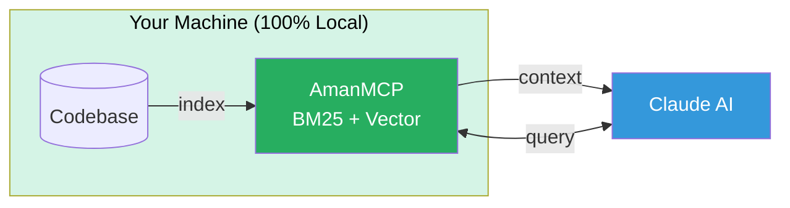

# AmanMCP

**Local RAG for your codebase. Zero config. Privacy-first.**

[](https://github.com/Aman-CERP/amanmcp/releases)
[](https://opensource.org/licenses/MIT)
[](https://golang.org/)

---

> **Alpha Software** - Use at your own risk. [Full disclaimer](#disclaimer)

---

## Quick Start

**Prerequisite:** [Ollama](https://ollama.com/) installed (`brew install ollama`)

```bash
# Install
brew tap Aman-CERP/tap && brew install amanmcp

# Initialize (auto-starts Ollama, pulls model, indexes)
cd your-project && amanmcp init

# Restart Claude Code. Done.
```

**Ask Claude:** "Search my codebase for authentication"

---

## What It Does



**Key features:** Hybrid search (BM25 + semantic) | AST-aware chunking | Multi-language | < 100ms queries

---

## Essential Commands

| Command | Description |
|---------|-------------|
| `amanmcp init` | Initialize project |
| `amanmcp search "query"` | Search codebase |
| `amanmcp doctor` | Troubleshoot issues |
| `amanmcp status` | Check index health |

[Full command reference →](docs/reference/commands.md)

---

## What Claude Can Do

When connected via MCP, Claude has these tools:

| Tool | Purpose |
|------|---------|
| `search` | Hybrid search across codebase |
| `search_code` | Find functions, classes, types |
| `search_docs` | Search documentation |

**Try:** "Find the function that handles database connections"

---

## Documentation

| I want to... | Go here |
|--------------|---------|
| Get started step-by-step | [Quick Start Guide](docs/guides/first-time-user-guide.md) |
| See all CLI commands | [Command Reference](docs/reference/commands.md) |
| Configure settings | [Configuration](docs/reference/configuration.md) |
| Use MLX (Apple Silicon) | [MLX Setup](docs/guides/mlx-setup.md) |
| Understand how search works | [Hybrid Search Guide](docs/guides/hybrid-search.md) |
| Contribute code | [Contributing](CONTRIBUTING.md) |

### Deep Dives

- [Architecture Overview](docs/reference/architecture/architecture.md)
- [Static Embeddings Explained](docs/articles/static-embeddings-explained.md)
- [Smaller Models, Better Search](docs/articles/smaller-models-better-search.md)

---

## Roadmap

| Status | Feature |
|--------|---------|
| **Now** | Production-ready local RAG for Mac/Linux |
| **Next** | Windows support, Rust/Java language support |
| **Later** | IDE plugins, remote team search, cloud sync |

**Contributions welcome** in [priority areas](CONTRIBUTING.md#contribution-areas).

---

## Privacy

- **100% Local** - No internet required after install
- **No Telemetry** - We don't collect any data
- **No Cloud** - Your code never leaves your machine

---

## Install Options

| Method | Command |
|--------|---------|
| **Homebrew** | `brew tap Aman-CERP/tap && brew install amanmcp` |
| **Script** | `curl -sSL https://raw.githubusercontent.com/Aman-CERP/amanmcp/main/scripts/install.sh \| sh` |
| **From source** | `git clone ... && make install-local` |
| **Offline** | `amanmcp init --offline` (BM25-only, no model needed) |

---

## Technology

| Component | Choice |
|-----------|--------|
| Language | Go 1.25.5+ |
| Protocol | [MCP 2025-11-25](https://modelcontextprotocol.io/) |
| Keyword Search | [Bleve](https://blevesearch.com/) BM25 |
| Vector Search | [coder/hnsw](https://github.com/coder/hnsw) |
| Code Parsing | [tree-sitter](https://tree-sitter.github.io/) |
| Embeddings | [Ollama](https://ollama.com/) (default) / MLX (Apple Silicon) |

---

## Contributing

See [CONTRIBUTING.md](CONTRIBUTING.md) for development setup and guidelines.

**Priority areas:** Language support, Windows support, performance.

---

## License

MIT License - see [LICENSE](LICENSE)

---

## Disclaimer

AmanMCP is experimental software in active development. By using this software, you acknowledge this is alpha/beta quality software, accept full responsibility for any issues, and understand the developers are not liable for data loss, system issues, or other problems.

---

## Acknowledgments

[Model Context Protocol](https://modelcontextprotocol.io/) by Anthropic |
[coder/hnsw](https://github.com/coder/hnsw) |
[Ollama](https://ollama.com/) |
[tree-sitter](https://tree-sitter.github.io/) |
[Qwen](https://huggingface.co/Alibaba-NLP)

---

**Made with care by the AmanERP Team** · *"It just works."*
