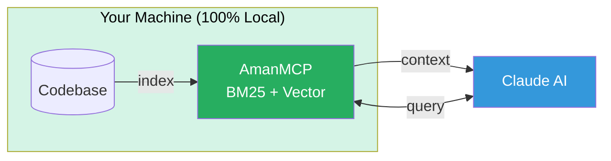

# AmanMCP

**Local RAG for your codebase. Zero config. Privacy-first.**

[](https://github.com/Aman-CERP/amanmcp/releases)
[](https://opensource.org/licenses/Apache-2.0)
[](https://golang.org/)

---

> **Alpha Software** - Use at your own risk. [Full disclaimer](#disclaimer)

---

## Quick Start

**Prerequisite:** [Ollama](https://ollama.com/) installed (`brew install ollama`)

```bash
# Install
brew tap Aman-CERP/tap && brew install amanmcp

# Initialize (auto-starts Ollama, pulls model, indexes)
cd your-project && amanmcp init

# Restart Claude Code. Done.
```

**Ask Claude:** "Search my codebase for authentication"

---

## What It Does



**Key features:** Hybrid search (BM25 + semantic) | AST-aware chunking | Multi-language | < 100ms queries

---

## Essential Commands

| Command | Description |
|---------|-------------|
| `amanmcp init` | Initialize project |
| `amanmcp search "query"` | Search codebase |
| `amanmcp doctor` | Troubleshoot issues |
| `amanmcp status` | Check index health |

[Full command reference →](docs/reference/commands.md)

---

## What Claude Can Do

When connected via MCP, Claude has these tools:

| Tool | Purpose |
|------|---------|
| `search` | Hybrid search across codebase |
| `search_code` | Find functions, classes, types |
| `search_docs` | Search documentation |

**Try:** "Find the function that handles database connections"

---

## Documentation

| I want to... | Go here |
|--------------|---------|
| Get started step-by-step | [Quick Start Guide](docs/guides/first-time-user-guide.md) |
| See all CLI commands | [Command Reference](docs/reference/commands.md) |
| Configure settings | [Configuration](docs/reference/configuration.md) |
| Use MLX (Apple Silicon) | [MLX Setup](docs/guides/mlx-setup.md) |
| Understand how search works | [Hybrid Search Guide](docs/guides/hybrid-search.md) |
| Contribute code | [Contributing](CONTRIBUTING.md) |

### Explore the Documentation

Browse our comprehensive documentation organized by topic. Each category highlights key documents to help you quickly find what you need.

---

#### [Articles](docs/articles/) - Deep Dives & Insights

| Document | Topic | Problem/Question | Key Insight |
|----------|-------|------------------|-------------|
| [AI Engineering Guide](docs/articles/ai-engineering-guide.md) | Learning Roadmap | How to learn AI/ML engineering efficiently? | 80/20 approach - focus on fundamentals that transfer across tools |
| [AI-Native Project Management](docs/articles/ai-native-pm.md) | Human-AI Collaboration | How to manage projects when AI does most coding? | Human Director / AI Executor model with context management and session workflows |
| [AI-Native Documentation Lessons](docs/articles/ai-native-documentation-lessons.md) | Documentation Strategy | How to prevent documentation sprawl? | Internal docs can accumulate faster than they're useful - consolidation strategies matter |
| [Black Box Architecture Case Study](docs/articles/black-box-architecture-case-study.md) | Modular Design | How to build systems that remain maintainable at scale? | Eskil Steenberg's principles - stable interfaces + hidden complexity = decades of durability |
| [Claude Code Search vs AmanMCP Benchmark](docs/articles/claude-code-search-vs-amanmcp-benchmark.md) | Tool Comparison | When to use built-in tools vs specialized search? | Tools are complementary, not competing - each has strengths |
| [Debugging MCP Protocol](docs/articles/debugging-mcp-protocol.md) | Protocol Debugging | Why does MCP integration fail mysteriously? | Stdout contamination breaks protocol - MCP uses stdio for communication |
| [Smaller Models, Better Search](docs/articles/smaller-models-better-search.md) | Model Selection | How to choose embedding models under resource constraints? | 0.6B models can outperform 8B for specific tasks through quality-focused tuning |
| [Static Embeddings Explained](docs/articles/static-embeddings-explained.md) | Fallback Patterns | When should you use static vs dynamic embeddings? | Zero-dependency embeddings enable instant startup and graceful degradation |
| [Zero Friction Lessons](docs/articles/zero-friction-lessons.md) | Developer UX | How to achieve "it just works" philosophy? | Every manual step is a leaky abstraction - auto-detection beats configuration |

[→ Articles documentation overview](docs/articles/README.md)

---

#### [Concepts](docs/concepts/) - Core Ideas & Theory

| Document | Topic | Problem/Question | Key Insight |
|----------|-------|------------------|-------------|
| [Hybrid Search](docs/concepts/hybrid-search.md) | Search Fundamentals | Why combine keyword and semantic search? | BM25 finds exact matches, vectors find meaning - fusion gets both strengths |
| [MCP Protocol](docs/concepts/mcp-protocol.md) | AI Integration | How does AmanMCP talk to Claude? | Model Context Protocol enables structured AI-tool communication via JSON-RPC |
| [Tree-sitter Guide](docs/concepts/tree-sitter-guide.md) | Code Parsing | How to parse code without language-specific parsers? | AST-aware chunking preserves semantic boundaries across 30+ languages |
| [Two-Stage Retrieval](docs/concepts/two-stage-retrieval.md) | Search Optimization | Why search twice instead of once? | Fast filter (candidates) then precise ranking balances speed and accuracy |
| [Vector Search Concepts](docs/concepts/vector-search-concepts.md) | Semantic Search | How does semantic search actually work? | Embeddings turn text into numbers that capture meaning geometrically |

[→ Concepts documentation overview](docs/concepts/README.md)

---

#### [Guides](docs/guides/) - Step-by-Step Instructions

| Document | Topic | Problem/Question | Key Insight |
|----------|-------|------------------|-------------|
| [First-Time User Guide](docs/guides/first-time-user-guide.md) | Getting Started | How do I set up AmanMCP from scratch? | Five steps: install Ollama, install AmanMCP, init project, restart Claude, query |
| [Homebrew Setup Guide](docs/guides/homebrew-setup-guide.md) | Installation | How to install via Homebrew on macOS? | Homebrew provides automatic updates and dependency management |
| [MLX Setup](docs/guides/mlx-setup.md) | Performance | How to get faster embeddings on Apple Silicon? | MLX can be 16x faster than Ollama for local embedding generation |
| [Backend Switching](docs/guides/backend-switching.md) | Configuration | How to switch between Ollama and MLX embeddings? | Simple config change enables comparing backends for your workload |
| [Auto-Reindexing](docs/guides/AUTO-REINDEXING.md) | Workflow | How to keep search index in sync with code changes? | File watching enables real-time incremental updates without manual reindexing |
| [Thermal Management](docs/guides/thermal-management.md) | Optimization | How to reduce CPU heat during indexing? | CPU temperature optimization through batch sizing and concurrency tuning |

[→ Guides documentation overview](docs/guides/README.md)

---

#### [Research](docs/research/) - Investigations & Decisions

| Document | Topic | Problem/Question | Key Insight |
|----------|-------|------------------|-------------|
| [Search Quality Improvement Series](docs/research/search-quality-improvement-series.md) | Synthesis | How to solve vocabulary mismatch comprehensively? | Contextual retrieval for vectors + query expansion for BM25 improved pass rate from 60% to 92% |
| [Contextual Retrieval Decision](docs/research/contextual-retrieval-decision.md) | Search Enhancement | How to bridge vocabulary mismatch between queries and code? | Prepend LLM-generated context to chunks before embedding with pattern fallback |
| [Contextual Retrieval Regression](docs/research/contextual-retrieval-regression.md) | Quality Analysis | How can enhancements cause regressions? | Small embedding models + contextual prefixes can cluster in embedding space |
| [Query Expansion Asymmetric](docs/research/query-expansion-asymmetric.md) | Query Processing | Should we expand queries for all search backends? | Expand for BM25 only - expansion helps keyword search but dilutes embeddings |
| [RRF Fusion Rationale](docs/research/rrf-fusion-rationale.md) | Search Fusion | How to combine BM25 and vector search results? | Reciprocal Rank Fusion (k=60) provides simple, effective combination without training |
| [Vocabulary Mismatch Analysis](docs/research/vocabulary-mismatch-analysis.md) | Search Quality | Why does semantic search fail for code? | Users say "search function", code says `func Search` - root cause of 40% of failures |
| [Dogfooding Methodology](docs/research/dogfooding-methodology.md) | Quality Validation | How to validate RAG search quality? | Tiered query system with 5 Whys root cause analysis catches semantic gaps |
| [Embedding Models](docs/research/embedding-models.md) | Model Selection | Which embedding model for code search? | qwen3-0.6b balances quality and resources; code-specialized models improve retrieval 7-8% |
| [Embedding Backend Evolution](docs/research/embedding-backend-evolution.md) | Backend Choice | Which embedding backend by default? | Ollama default (lower RAM), MLX opt-in (16x faster) - RAM matters more for development |
| [Embedding Optimization](docs/research/embedding-optimization.md) | Performance | How to optimize embedding performance? | MLX vs TEI benchmarking reveals batch size tuning and GPU utilization patterns |
| [Embedding Model Evolution](docs/research/embedding-model-evolution.md) | Evolution | How did our embedding choice evolve? | nomic → Hugot → Qwen3 - each transition taught lessons about tradeoffs |
| [SQLite vs Bleve](docs/research/sqlite-vs-bleve.md) | Storage Backend | Which BM25 backend for concurrent access? | SQLite FTS5 enables concurrent access (WAL mode) - pure Go, production-proven |
| [Vector Database Selection](docs/research/vector-database-selection.md) | Vector Storage | Which vector database for local-first? | USearch → coder/hnsw - pure Go, scales to 300K+ vectors |
| [Specialization vs Generalization](docs/research/specialization-vs-generalization.md) | Model Strategy | Should we use specialized or general models? | Specialized models excel in domain but general models provide better fallback |
| [Tree-sitter Chunking](docs/research/tree-sitter-chunking.md) | Code Parsing | How to chunk code intelligently? | AST-aware boundaries preserve semantic units - CGO required but worth it |
| [MLX Migration Case Study](docs/research/mlx-migration-case-study.md) | Performance Migration | How to plan and execute performance migrations? | Validate before implementing, always have fallback, prefer auto-detection |
| [Observability for RAG](docs/research/observability-for-rag.md) | Operations | How to observe RAG systems? | RAG vs agents distinction requires structured logging and search quality metrics |

[→ Research documentation overview](docs/research/README.md)

---

#### [Contributing](docs/contributing/) - Developer Resources

| Document | Topic | Problem/Question | Key Insight |
|----------|-------|------------------|-------------|
| [Code Conventions](docs/contributing/code-conventions.md) | Code Style | What standards should I follow when contributing? | Error wrapping, resource cleanup, and config-driven behavior are non-negotiable |
| [Testing Guide](docs/contributing/testing-guide.md) | Quality Assurance | How do I write tests for AmanMCP? | Table-driven tests with golden files for deterministic validation |
| [TDD Rationale](docs/contributing/tdd-rationale.md) | Development Process | Why does AmanMCP require test-first development? | Tests as specifications prevent rework and enable fearless refactoring |

[→ View all 3 contributing documents](docs/contributing/README.md)

---

#### [Reference](docs/reference/) - Technical Specifications

| Document | Topic | Problem/Question | Key Insight |
|----------|-------|------------------|-------------|
| [Commands](docs/reference/commands.md) | CLI Usage | What commands are available in AmanMCP? | Six core commands handle initialization, search, health checks, and maintenance |
| [Configuration](docs/reference/configuration.md) | Setup | How do I customize AmanMCP behavior? | YAML config controls paths, models, weights, and exclusions |
| [Architecture](docs/reference/architecture/architecture.md) | System Design | How is AmanMCP structured internally? | Clean separation: MCP layer, search engine, storage, embedding pipeline |
| [Glossary](docs/reference/glossary.md) | Terminology | What do technical terms like RRF and HNSW mean? | Quick reference for search, embedding, and MCP concepts |

---

## Roadmap

| Status | Feature |
|--------|---------|
| **Now** | Production-ready local RAG for Mac/Linux |
| **Next** | Windows support, Rust/Java language support |
| **Later** | IDE plugins, remote team search, cloud sync |

**Contributions welcome** in [priority areas](CONTRIBUTING.md#contribution-areas).

---

## Privacy

- **100% Local** - No internet required after install
- **No Telemetry** - We don't collect any data
- **No Cloud** - Your code never leaves your machine

---

## Install Options

| Method | Command |
|--------|---------|
| **Homebrew** | `brew tap Aman-CERP/tap && brew install amanmcp` |
| **Script** | `curl -sSL https://raw.githubusercontent.com/Aman-CERP/amanmcp/main/scripts/install.sh \| sh` |
| **From source** | `git clone ... && make install-local` |
| **Offline** | `amanmcp init --offline` (BM25-only, no model needed) |

---

## Technology

| Component | Choice |
|-----------|--------|
| Language | Go 1.25.5+ |
| Protocol | [MCP 2025-11-25](https://modelcontextprotocol.io/) |
| Keyword Search | SQLite FTS5 BM25 (pure Go) |
| Vector Search | [coder/hnsw](https://github.com/coder/hnsw) |
| Code Parsing | [tree-sitter](https://tree-sitter.github.io/) |
| Embeddings | [Ollama](https://ollama.com/) (default) / MLX (Apple Silicon) |

---

## Contributing

See [CONTRIBUTING.md](CONTRIBUTING.md) for development setup and guidelines.

**Priority areas:** Language support, Windows support, performance.

---

## License

Apache 2.0 License - see [LICENSE](LICENSE)

---

## Disclaimer

AmanMCP is experimental software in active development. By using this software, you acknowledge this is alpha/beta quality software, accept full responsibility for any issues, and understand the developers are not liable for data loss, system issues, or other problems.

---

## Acknowledgments

[Model Context Protocol](https://modelcontextprotocol.io/) by Anthropic |
[coder/hnsw](https://github.com/coder/hnsw) |
[Ollama](https://ollama.com/) |
[tree-sitter](https://tree-sitter.github.io/) |
[Qwen](https://huggingface.co/Alibaba-NLP)

---

**Made with care by the AmanERP Team** · *"It just works."*
