# AmanMCP Documentation

Local RAG for your codebase. Zero config. Privacy-first.

---

## I want to...

| Goal | Start Here |
|------|------------|
| **Get started in 5 minutes** | [Quick Start Guide](getting-started/) |
| **Understand how search works** | [Hybrid Search Explained](concepts/hybrid-search.md) |
| **Optimize for Apple Silicon** | [MLX Setup Guide](guides/mlx-setup.md) |
| **Configure exclusions** | [Configuration Guide](../reference/configuration.md) |
| **Troubleshoot issues** | Run `amanmcp doctor` |
| **Contribute code** | [Contributing Guide](contributing/) |
| **See what's new** | [Changelog](changelog.md) |

---

## Documentation by Role

### 👤 Users
**New to AmanMCP?**
1. [Getting Started](getting-started/) - Install and setup
2. [Guides](guides/) - Task-based how-tos
3. [Reference](reference/) - CLI commands and configuration

**Want to understand internals?**
- [Concepts](concepts/) - How hybrid search, vectors, and AST chunking work
- [Articles](articles/) - Deep dives and insights

### 👩‍💻 Developers
**Contributing?**
1. [Contributing Guide](contributing/) - Setup, conventions, testing
2. [Architecture](reference/architecture/) - System design
3. [Research](research/) - Technical decisions

**Building on AmanMCP?**
- [MCP Protocol](concepts/mcp-protocol.md) - Integration layer
- [Reference](reference/) - API and technical specs

### 🔬 Researchers
**Curious about decisions?**
- [Research](research/) - Why we chose these technologies
- [Articles](articles/) - Insights and experiments
- [Architecture](reference/architecture/) - Design principles

---

## Documentation Structure

```mermaid
graph TB
    START[AmanMCP Docs] --> ROLE{What's your role?}

    ROLE -->|User| USER[👤 User Path]
    ROLE -->|Developer| DEV[👩‍💻 Developer Path]
    ROLE -->|Researcher| RES[🔬 Researcher Path]

    USER --> U1[Getting Started]
    USER --> U2[Guides]
    USER --> U3[Reference]

    DEV --> D1[Contributing]
    DEV --> D2[Architecture]
    DEV --> D3[Research]

    RES --> R1[Research]
    RES --> R2[Articles]
    RES --> R3[Architecture]

    U1 --> U1A[Installation<br/>First Steps]
    U2 --> U2A[MLX Setup<br/>Configuration]
    U3 --> U3A[CLI Commands<br/>Config Reference]

    D1 --> D1A[Code Conventions<br/>Testing Guide]
    D2 --> D2A[System Design<br/>Components]
    D3 --> D3A[Technical Decisions<br/>Comparisons]

    R1 --> R1A[Model Selection<br/>Infrastructure]
    R2 --> R2A[Deep Dives<br/>Case Studies]
    R3 --> R3A[Design Principles<br/>ADRs]

    style START fill:#e1f5ff
    style USER fill:#c8e6c9
    style DEV fill:#c8e6c9
    style RES fill:#c8e6c9
    style U1 fill:#e1f5ff
    style U2 fill:#e1f5ff
    style D1 fill:#ffe0b2
    style D2 fill:#ffe0b2
    style R1 fill:#e1f5ff
    style R2 fill:#e1f5ff
```



| Section | Purpose | Example |
|---------|---------|---------|
| [Getting Started](getting-started/) | Installation and first steps | "How do I install AmanMCP?" |
| [Guides](guides/) | Task-based how-tos | "How do I switch to MLX embeddings?" |
| [Concepts](concepts/) | Understanding how it works | "How does hybrid search work?" |
| [Research](research/) | Technical decisions & analysis | "Why SQLite FTS5 instead of Bleve?" |
| [Articles](articles/) | Deep dives & thought leadership | "Why smaller models work better" |
| [Reference](reference/) | API, commands, configuration | "What are all CLI commands?" |
| [Contributing](contributing/) | Developer guides | "How do I run tests?" |

---

## Quick Reference

### Essential Commands
```bash
amanmcp init        # Initialize project
amanmcp search "..."# Search codebase
amanmcp doctor      # Troubleshoot
amanmcp status      # Check health
```

[Full command reference →](reference/commands.md)

### Key Files
```
.amanmcp/
├── bm25.db         # SQLite FTS5 BM25 index
├── vectors.hnsw    # HNSW vector index
├── metadata.db     # Chunk and file metadata
└── config.yaml     # Project-specific config
```

[Configuration reference →](reference/configuration.md)

---

## Latest Updates

See [Changelog](changelog.md) for all releases.

**Recent highlights:**
- Comprehensive documentation migration (23 documents)
- New [Research](research/) section with 17+ technical decision docs
- New [Articles](articles/) section with 9 deep-dive articles
- [Architecture Decisions Summary](reference/architecture-decisions-summary.md)
- SQLite FTS5 migration (concurrent access)

---

## Community & Support

- **Issues**: [GitHub Issues](https://github.com/Aman-CERP/amanmcp/issues)
- **Discussions**: [GitHub Discussions](https://github.com/Aman-CERP/amanmcp/discussions)
- **Contributing**: See [Contributing Guide](contributing/)

---

**Made with care by the AmanERP Team** · *"It just works."*
