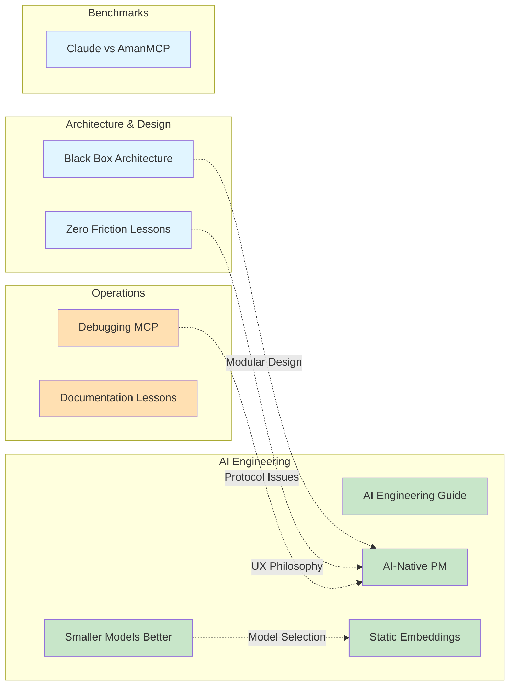

# Articles & Insights

Deep dives, case studies, and thought leadership on building AI-native developer tools. These articles share lessons learned from building AmanMCP that apply to anyone working with RAG, search, or AI-assisted development.

**Audience**: Engineers, architects, and anyone interested in practical AI engineering insights.

---

## Available Articles

### Architecture & Design

| Article | Topic | Key Insight |
|---------|-------|-------------|
| [Black Box Architecture Case Study](black-box-architecture-case-study.md) | Modular design | Eskil Steenberg's principles applied to search system extraction. Clean interfaces enable testing and swapping. |
| [Zero Friction Lessons](zero-friction-lessons.md) | Developer UX | "It Just Works" philosophy. Every manual step is a leaky abstraction. Auto-detection beats configuration. |

### AI Engineering

| Article | Topic | Key Insight |
|---------|-------|-------------|
| [AI Engineering Guide](ai-engineering-guide.md) | Learning roadmap | 80/20 approach to AI/ML engineering. Focus on fundamentals that transfer across tools. |
| [AI-Native Project Management](ai-native-pm.md) | Human-AI collaboration | The "Human Director / AI Executor" model. Context management, session workflows, memory systems. |
| [Smaller Models, Better Search](smaller-models-better-search.md) | Model selection | Why 0.6B models can outperform 8B for specific tasks. Quality vs resource trade-offs. |
| [Static Embeddings Explained](static-embeddings-explained.md) | Fallback patterns | Zero-dependency embeddings for graceful degradation. When "good enough" is the right choice. |

### Debugging & Operations

| Article | Topic | Key Insight |
|---------|-------|-------------|
| [Debugging MCP Protocol](debugging-mcp-protocol.md) | Protocol debugging | Stdout contamination case study. MCP uses stdio, so any stdout breaks the protocol. |
| [AI-Native Documentation Lessons](ai-native-documentation-lessons.md) | Documentation sprawl | How internal docs can accumulate faster than they're useful. Consolidation strategies. |

### Benchmarks & Comparisons

| Article | Topic | Key Insight |
|---------|-------|-------------|
| [Claude Code Search vs AmanMCP](claude-code-search-vs-amanmcp-benchmark.md) | Tool comparison | When to use built-in tools vs specialized search. Complementary, not competing. |

---

## How to Use These

- **Learning from experience**: See how real problems were solved
- **Architecture decisions**: Understand trade-offs in practice
- **AI engineering**: Patterns for working with LLMs and RAG systems
- **Debugging**: Techniques for tricky protocol and system issues

---

## What Makes Good Articles?

Our articles follow this pattern:

1. **Problem/Question** - What we were trying to solve
2. **Context** - Why it mattered, constraints we had
3. **Approach** - What we tried, what worked/didn't
4. **Lessons** - Generalizable insights for readers
5. **Applicability** - When you might use these patterns

---

## Related Documentation

- [Research](../research/) - Technical decisions with data and analysis
- [Concepts](../concepts/) - How systems work (explanatory)
- [Reference](../reference/) - API and technical specs

---

**Last Updated:** 2026-01-16
