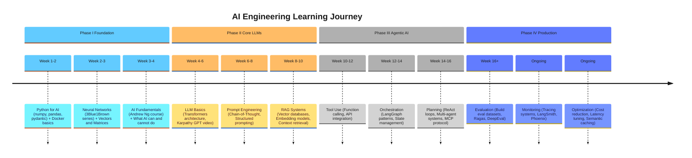
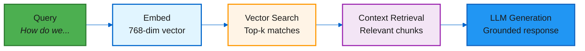
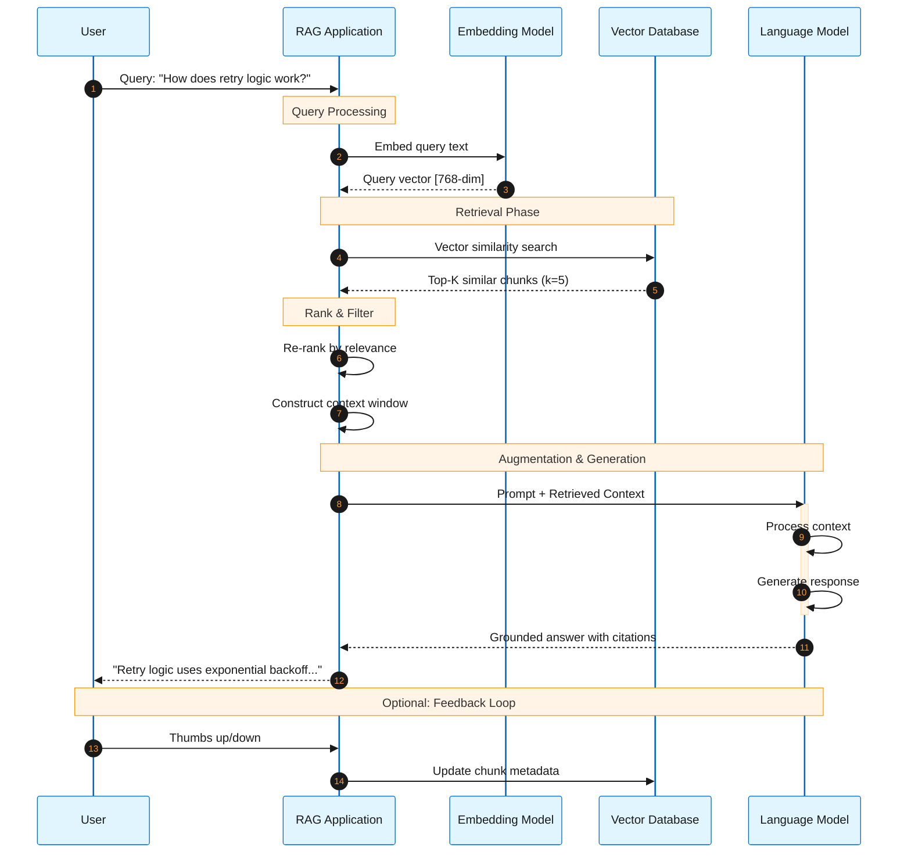
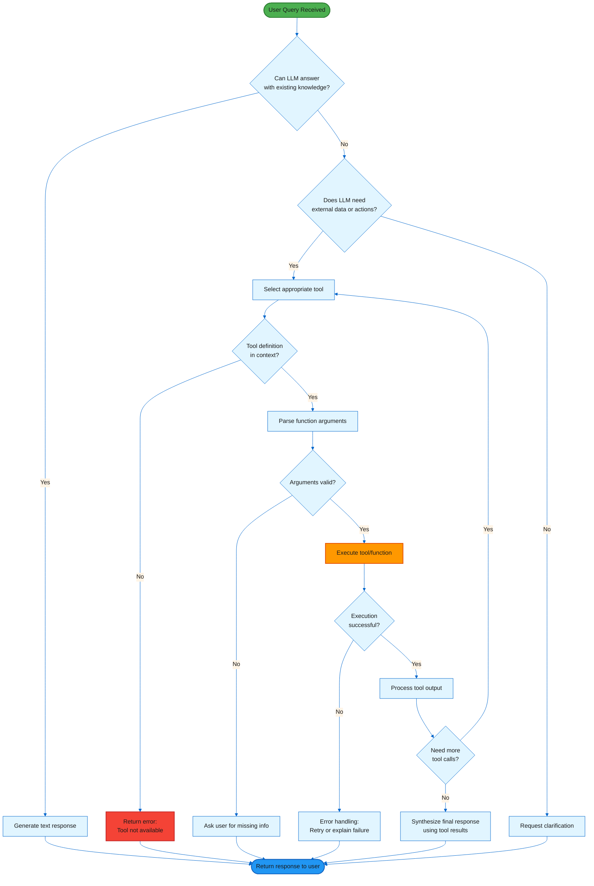
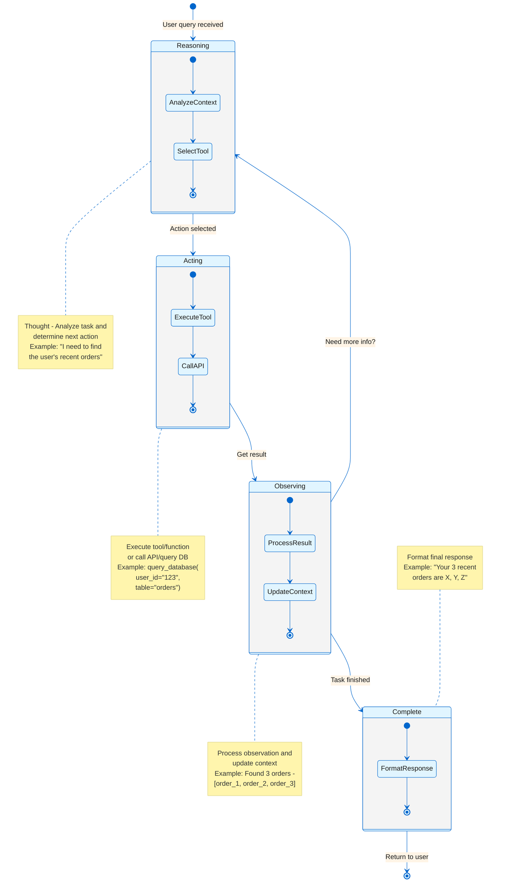
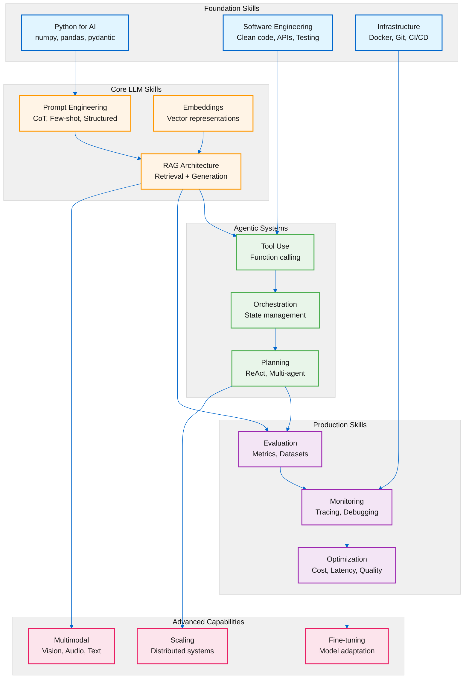
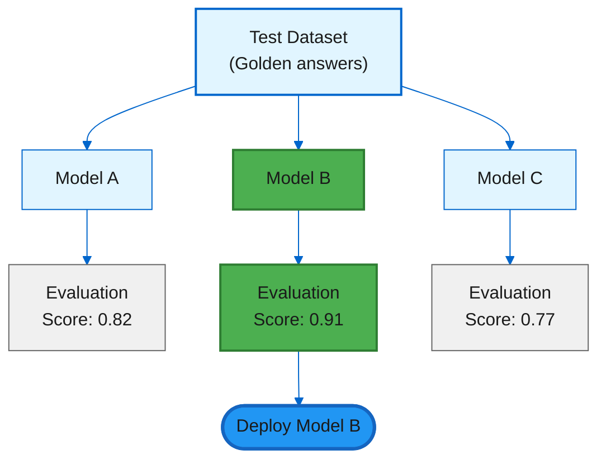
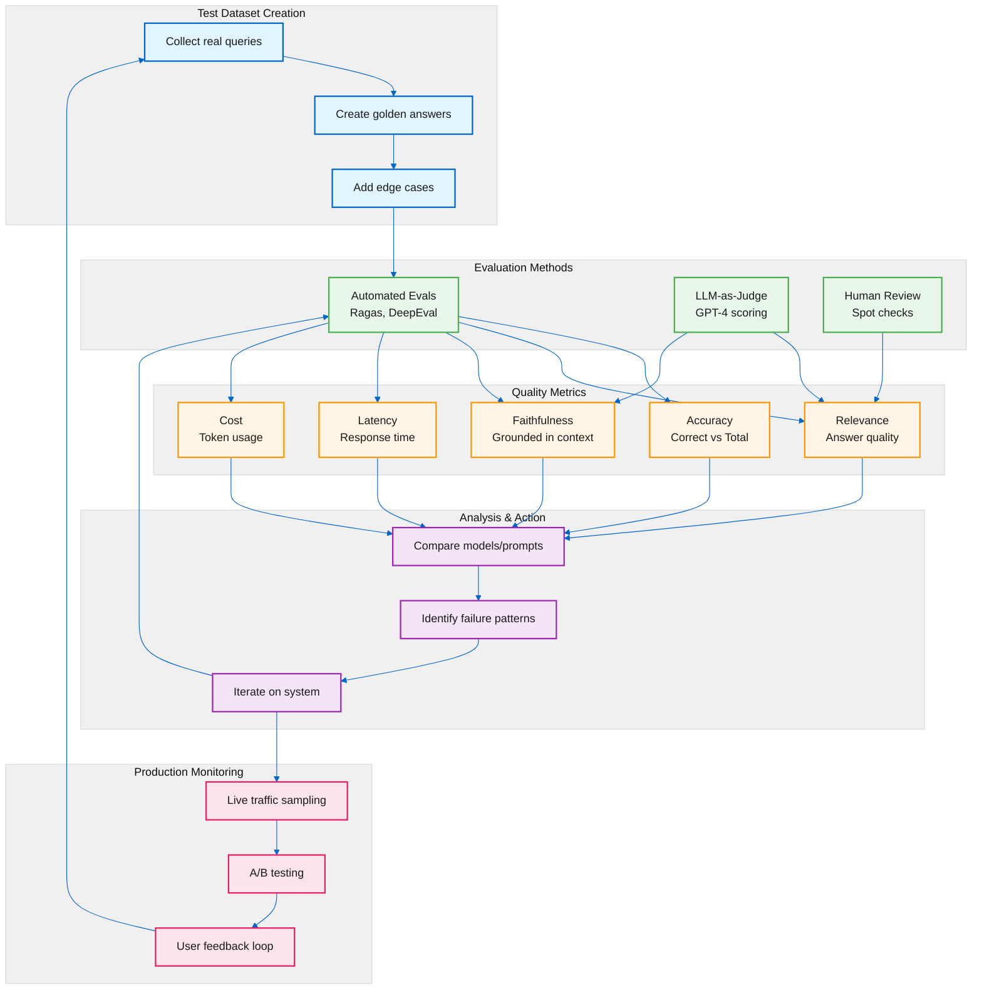
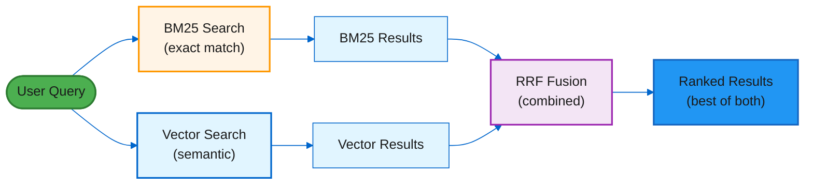
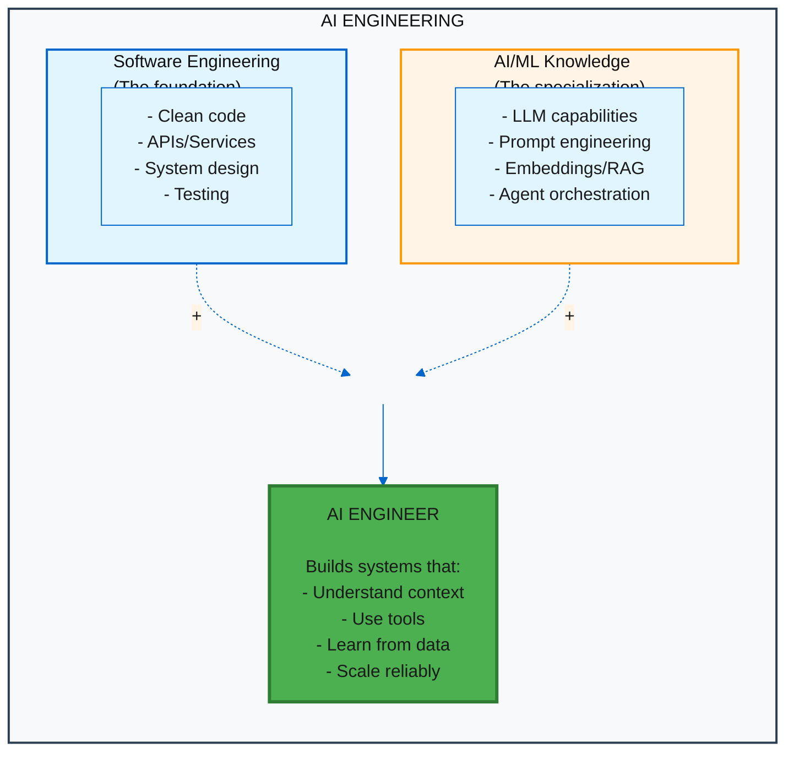

# The 80/20 AI Engineering Learning Guide

*Mastering AI Engineering through the Pareto Principle: 80% results with 20% effort*

---

> **Learning Objectives:**
>
> - Follow a practical path to AI engineering competency
> - Focus on the 20% that gives 80% of results
> - Build from foundations through production
>
> **Audience:** Software engineers transitioning to AI, students, self-learners

---

## TL;DR

You don't need a PhD in Math. Strong software engineering fundamentals combined with pragmatic understanding of how to *orchestrate* intelligence makes an AI Engineer. This guide distills the most high-impact resources available in 2025-2026, moving beyond generic "data science" roadmaps to focus specifically on building robust, scalable, and intelligent systems using modern AI models (LLMs/SLMs).

---

## The 80/20 Philosophy

> "To master AI Engineering, you don't need a PhD in Math. You need strong software engineering fundamentals combined with pragmatic understanding of how to *orchestrate* intelligence."

The Pareto Principle applies powerfully to AI engineering education. A small subset of concepts, tools, and resources will get you most of the way there. This guide identifies that critical 20%.

```
Phase I:   Foundation      → Speak the language of data and infrastructure
Phase II:  The Core        → Build applications that "think" using LLMs
Phase III: Agentic AI      → Build systems that DO things, not just talk
Phase IV:  Production      → Make it reliable, cheap, and safe
```

---

## The Roadmap Overview

| Phase | Focus Area | Key Concepts (The 20%) | Estimated Time |
|-------|------------|------------------------|----------------|
| **I** | **Foundation** | Python for AI, Git, Docker, Linear Algebra nuances | 2-4 Weeks |
| **II** | **The Core (LLMs)** | Prompt Engineering, RAG, Embeddings | 4-6 Weeks |
| **III** | **The System (Agents)** | Tool use, Planning, Multi-Agent Orchestration, MCP | 4-6 Weeks |
| **IV** | **Production (LLMOps)** | Evaluation (Evals), Fine-tuning, Deployment, Monitoring | Ongoing |

### Learning Path Timeline



---

## Phase I: Foundation (2-4 Weeks)

*Goal: Speak the language of data and infrastructure.*

Before diving into LLMs and agents, you need a solid foundation. This phase is about understanding the primitives that power modern AI systems.

### Must-Read/Watch

- **[Video] 3Blue1Brown - Neural Networks**
  - The most intuitive visual explanation of the math that matters
  - *Why:* You need to understand vectors and matrices to understand Embeddings
  - *Time:* 4 videos, ~1 hour total

- **[Course] DeepLearning.AI - AI for Everyone (Andrew Ng)**
  - Breaking through the hype with clear fundamentals
  - *Why:* Foundations of what AI can and cannot do
  - *Time:* 6 hours

### The 20% Skills

| Skill | What to Focus On | Why It Matters |
|-------|------------------|----------------|
| **Python for AI** | `numpy`, `pandas`, `pydantic` | Pydantic is crucial for structured outputs from LLMs |
| **Containerization** | Docker basics | Non-negotiable for reproducible environments |
| **Version Control** | Git workflows | Every AI project needs experiment tracking |

**Key Insight:** Many tutorials jump straight into LLMs. Resist the urge. A week spent on numpy broadcasting and pydantic models will save you weeks of debugging later.

---

## Phase II: The Core (4-6 Weeks)

*Goal: Build applications that "think" using LLMs.*

This is where you learn to harness the power of Large Language Models. The focus is on practical application, not theory.

### Essential Resources

- **[Book] "The LLM Engineering Handbook"** (Paul Iusztin)
  - Practical guide to building and deploying LLM applications
  - Covers the full lifecycle from prototype to production

- **[Book] "Build a Large Language Model (from Scratch)"** (Sebastian Raschka)
  - If you want to understand the "magic" of Transformers
  - Deep dive into the architecture

- **[Video] Andrej Karpathy - Let's build GPT**
  - The definitive "Zero to Hero" video
  - *Action:* Coding along with this video is worth 100 hours of passive reading
  - Builds intuition that serves you for years

- **[Course] DeepLearning.AI - Generative AI with LLMs**
  - Covers the lifecycle of GenAI projects
  - Industry-standard practices

### The 20% Skills

| Skill | Focus Areas | Why It Matters |
|-------|-------------|----------------|
| **Prompt Engineering** | Chain-of-Thought, ReAct, structured prompting | Not just "asking nicely" - this is a core engineering skill |
| **RAG** | Vector Databases, Embedding models | The bridge between frozen model knowledge and your dynamic data |
| **Frameworks** | LangChain **or** LlamaIndex | Pick one and master it; understand they're wrappers around API calls |

**Key Insight:** RAG (Retrieval Augmented Generation) is the most practical pattern for enterprise AI. It lets you add your data to any LLM without fine-tuning.

### RAG Deep Dive



#### RAG Architecture Sequence Diagram



Study:

- Vector Databases: Chroma, Weaviate, or pure Go solutions like HNSW
- Embedding Models: Understand the trade-offs (quality vs. speed)

---

## Phase III: Agentic AI (4-6 Weeks)

*Goal: Build systems that DO things, not just talk.*

**This is the frontier of 2025-2026.**

Agentic AI represents the shift from "AI as a chat interface" to "AI as an autonomous system that can take actions, use tools, and complete complex tasks."

### Essential Resources

- **[Specification] Model Context Protocol (MCP)**
  - The open standard for connecting AI models to data and tools
  - This is the future of AI connectivity
  - Study the protocol, build with it

- **[Video/Blog] Latent.Space - "The Rise of the AI Engineer"**
  - Understand the philosophy of this new role
  - Where the industry is heading

- **[Course] DeepLearning.AI - AI Agentic Design Patterns with AutoGen**
  - Multi-Agent patterns: Reflection, Tool Use
  - Practical implementation patterns

### The 20% Skills

| Skill | Focus Areas | Why It Matters |
|-------|-------------|----------------|
| **Tool Use (Function Calling)** | Teaching LLMs to execute code, call APIs | The core capability of agents |
| **Orchestration** | LangGraph or CrewAI | Managing state and loops in agent workflows |
| **Planning** | ReAct loops (Reason + Act) | How agents decide what to do next |

### Tool Use Pattern Flowchart



### The ReAct Pattern

```
Thought: I need to find the user's recent orders
Action:  query_database(user_id="123", table="orders")
Observation: [order_1, order_2, order_3]
Thought: Now I should format this for the user
Action:  format_response(orders=[...])
Result:  "Your 3 recent orders are..."
```

#### ReAct Pattern State Diagram



**Key Insight:** The shift from "prompt engineering" to "agent orchestration" is the defining transition of 2025-2026 AI engineering.

---

## Phase IV: Production (Ongoing)

*Goal: Make it reliable, cheap, and safe.*

Production AI is a different beast from prototypes. This phase never ends - it's about continuous improvement.

### Essential Resources

- **[Book] "AI Engineering" / "Designing Machine Learning Systems"** (Chip Huyen)
  - The bible of production ML/AI
  - System design trade-offs that matter at scale

- **[Blog] Eugene Yan's Blog**
  - High-quality posts on applied AI engineering patterns
  - Practical insights on Evals, RAG, and production systems

### The 20% Skills

| Skill | Focus Areas | Why It Matters |
|-------|-------------|----------------|
| **Evals** | Ragas, DeepEval | The TDD of AI: "If you don't measure it, you can't improve it" |
| **Tracing & Monitoring** | Arize Phoenix, LangSmith | See *why* your agent failed, not just *that* it failed |
| **Cost/Latency Optimization** | Semantic caching, SLMs for easy tasks | Production costs can spiral without optimization |

### AI Engineering Skill Tree



### The Eval Mindset



### Evaluation Framework Diagram



---

## The 6-Week Curriculum

If you have 10 hours a week, follow this progression:

| Week | Focus | Actions |
|------|-------|---------|
| **1** | Setup + Foundations | Watch Karpathy's "Intro to LLMs" and 3Blue1Brown's Neural Networks. Install Python/Cursor. |
| **2** | Build RAG | Build a simple RAG app. Index a PDF, query it. Use LlamaIndex. |
| **3** | Prompt Engineering | DeepLearning.AI Short Courses: "ChatGPT Prompt Engineering for Developers" and "Building Systems with the ChatGPT API" |
| **4** | Agentic AI | Build a tool-using agent (e.g., weather bot). Read the MCP specification. |
| **5** | Production | Add Tracing (LangSmith) to your agent. Create a dataset of 50 questions and run an Eval. |
| **6** | System Design | Read Chip Huyen's book. Understand the system design trade-offs. |

### Week-by-Week Milestones

```
Week 1: "I understand how LLMs work at a high level"
Week 2: "I can build a RAG app that answers questions about my data"
Week 3: "I can craft prompts that reliably produce structured outputs"
Week 4: "I can build agents that use tools to accomplish tasks"
Week 5: "I can measure and improve my AI system's performance"
Week 6: "I understand the trade-offs in production AI systems"
```

---

## How AmanMCP Applies This

AmanMCP is a real-world demonstration of these principles. Here's how the project maps to the phases:

### Phase II: RAG with Hybrid Search

AmanMCP implements production-grade RAG:

- **BM25** for keyword matching (the baseline that works)
- **Vector search** with HNSW for semantic understanding
- **RRF (Reciprocal Rank Fusion)** to combine both approaches



### Phase III: MCP Server as Tool

AmanMCP is itself an MCP server that AI assistants use as a tool:

- Implements the Model Context Protocol specification
- Exposes code search as a tool for Claude, Cursor, and other AI assistants
- Demonstrates the "AI using tools" pattern from Phase III

### Phase IV: Observability and Evaluation

Production patterns in AmanMCP:

- **Telemetry** for understanding usage patterns
- **Benchmarking** for measuring search quality
- **Configuration-driven behavior** for tuning without code changes

---

## Quick Reference Links

### Core Resources

| Resource | Type | URL |
|----------|------|-----|
| Latent.Space | Newsletter/Podcast | [latent.space](https://www.latent.space/) |
| Andrej Karpathy | YouTube | [youtube.com/@AndrejKarpathy](https://www.youtube.com/@AndrejKarpathy) |
| DeepLearning.AI | Courses | [deeplearning.ai](https://www.deeplearning.ai/) |
| Made With ML | MLOps Guide | [madewithml.com](https://madewithml.com/) |

### Books

| Book | Author | Focus |
|------|--------|-------|
| AI Engineering | Chip Huyen | Production systems |
| The LLM Engineering Handbook | Paul Iusztin | End-to-end LLM apps |
| Build a Large Language Model (from Scratch) | Sebastian Raschka | Deep understanding |

### Tools

| Tool | Purpose | When to Use |
|------|---------|-------------|
| LangChain / LlamaIndex | Framework | Building RAG and agents |
| LangSmith / Arize Phoenix | Tracing | Debugging agent behavior |
| Ragas / DeepEval | Evaluation | Measuring quality |

---

## The Mental Model



---

## Common Pitfalls

### What to Avoid

| Pitfall | Why It's Wrong | What to Do Instead |
|---------|----------------|-------------------|
| Starting with fine-tuning | Expensive, often unnecessary | Start with prompting, then RAG, then fine-tune |
| Ignoring evals | You can't improve what you don't measure | Build eval datasets from day 1 |
| Over-engineering | Complex agents fail in novel ways | Start simple, add complexity as needed |
| Skipping foundations | LLMs abstract away, but you still need to debug | Understand embeddings, tokenization, context windows |

### The Progression Fallacy

```
Wrong: "I'll learn everything about LLMs, then build"
Right: "I'll build, then learn what I need to fix problems"
```

---

## See Also

For deeper dives into specific topics covered in this guide:

- [Observability for RAG](../research/observability-for-rag.md) - Production monitoring patterns
- [Contextual Retrieval Decision](../research/contextual-retrieval-decision.md) - RAG architecture trade-offs
- [Static Embeddings Explained](./static-embeddings-explained.md) - Understanding embedding fundamentals
- [Smaller Models, Better Search](./smaller-models-better-search.md) - Model selection strategies

---

## Summary

The path to AI Engineering competency is not about consuming every tutorial or mastering every framework. It's about:

1. **Building on solid foundations** (Phase I) - Python, Docker, basic ML concepts
2. **Learning to orchestrate LLMs** (Phase II) - Prompting, RAG, embeddings
3. **Creating systems that act** (Phase III) - Tools, agents, MCP
4. **Making it production-ready** (Phase IV) - Evals, monitoring, optimization

The 80/20 rule applies: focus on the resources and skills listed here, build projects, and iterate. The AI engineering landscape moves fast, but the fundamentals in this guide remain stable.

**Start building. Measure everything. Iterate constantly.**

---

**Original Source:** `archive/gem_ai_engineering_guide.md`
**Last Updated:** 2026-01-16
