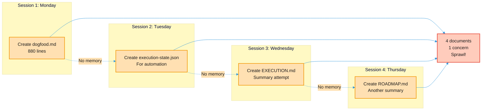
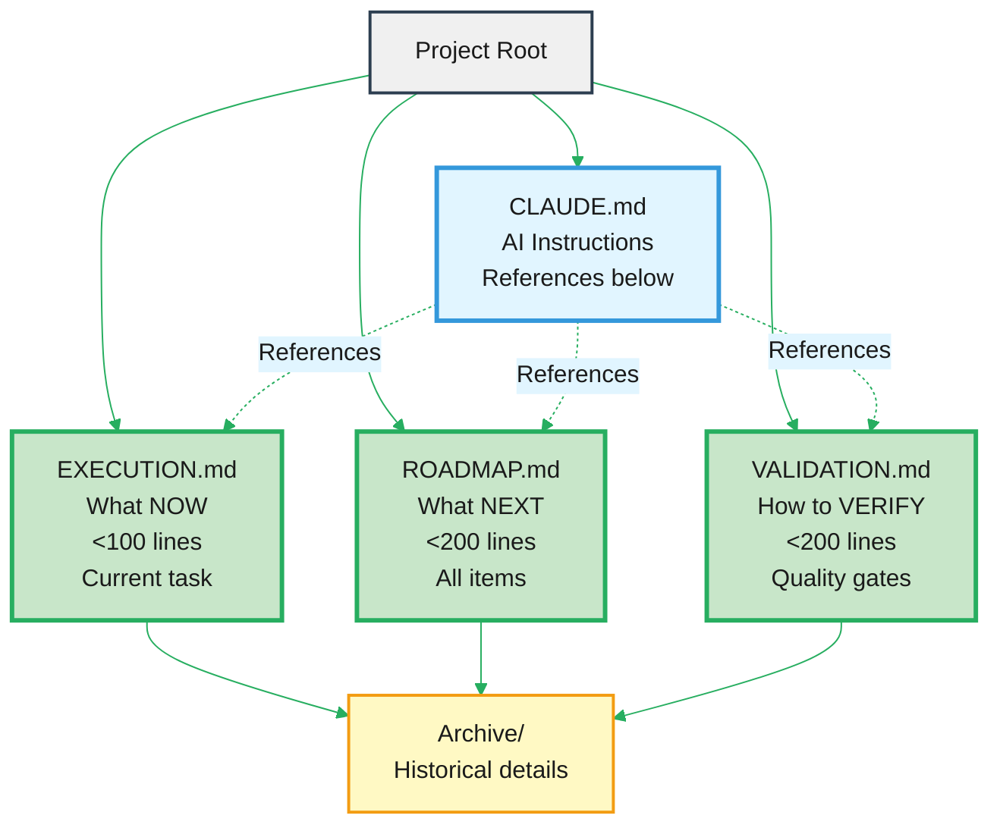
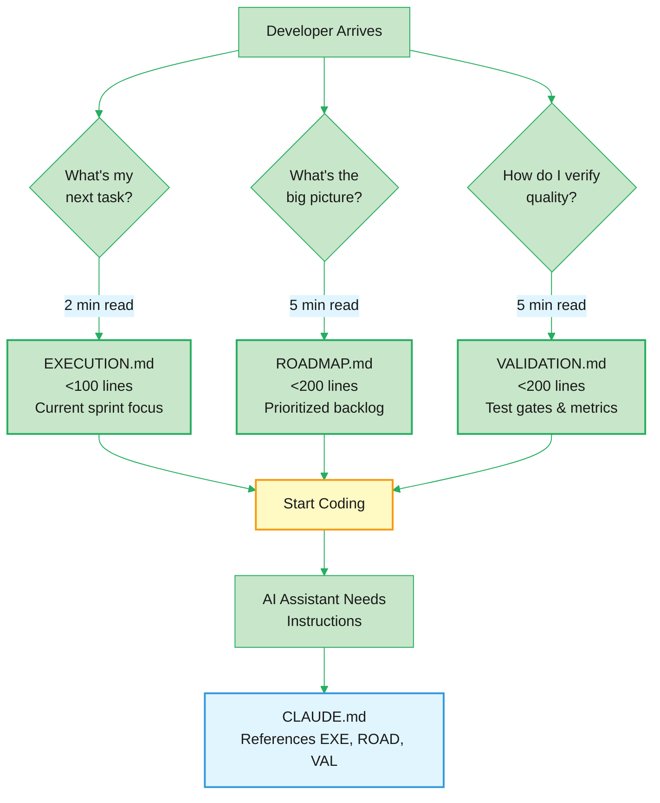
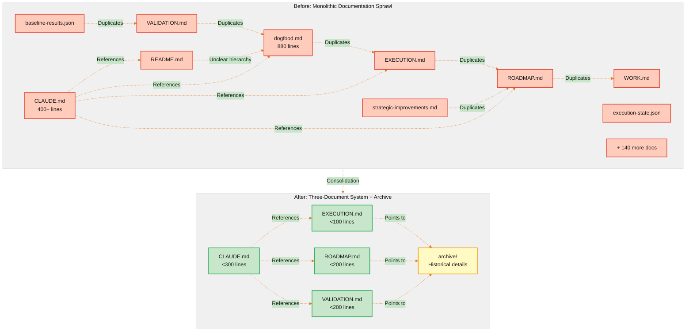
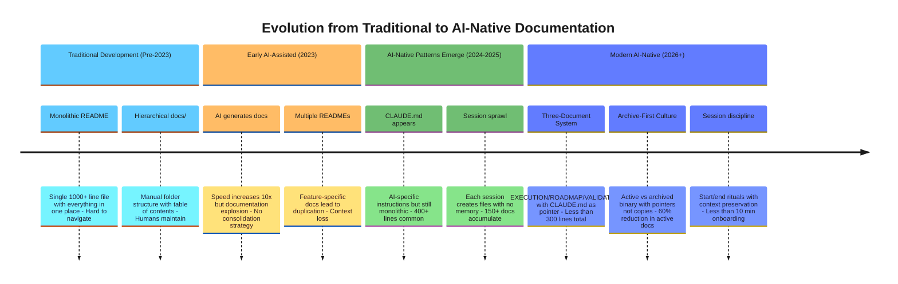

# Documentation Debt in AI-Native Development: A Case Study

> **Learning Objectives:**
> - Understand how AI sessions create documentation sprawl
> - Learn the "Three-Document System" for sustainable docs
> - Apply archive-aggressively patterns to your projects
>
> **Prerequisites:**
> - Experience with AI-assisted development (Claude Code, Cursor, etc.)
>
> **Audience:** Engineering leads, AI-native development teams, documentation managers

## TL;DR

AI-assisted development sessions create documentation sprawl because each session optimizes locally without global visibility. The solution is a "Three-Document System" (EXECUTION, ROADMAP, VALIDATION) combined with aggressive archiving. This reduced our active documentation by 60% and cut onboarding time from 30+ minutes to under 10.

## The Problem: Documentation Sprawl

When we audited our AI-native project, we discovered a documentation crisis:

| Metric | Before Cleanup | After Cleanup | Reduction |
|--------|----------------|---------------|-----------|
| Root markdown files | 10 | 6 | -40% |
| docs/ directories | 14 | 9 | -36% |
| Active files in docs/ | ~150 | ~60 | -60% |
| Checklists | 6 | 3 | -50% |
| Planning documents | 3+ | 1 | -67% |

**Time to understand project:** 30+ minutes (target: <10 minutes)

A new developer visiting the repository faced:
- 10 markdown files in the root directory
- 22 top-level items in docs/
- 150+ total documentation files
- Multiple overlapping sources for the same information
- No clear entry point or reading order

This wasn't laziness or poor planning. It was the natural result of AI-assisted development without documentation hygiene practices.

## Why This Happens in AI-Native Development

### AI Session Boundaries

Each AI session has limited context. New sessions often create new documents rather than consolidating existing ones because:

- **No memory between sessions:** The AI doesn't remember what it created yesterday
- **Path of least resistance:** Creating new files is faster than understanding existing structure
- **Local optimization:** Each session solves immediate problems without global awareness

A typical pattern looks like this:

```
Session 1: Create dogfood.md (880 lines)
Session 2: Create execution-state.json (for automation)
Session 3: Create EXECUTION.md (summary)
Session 4: Create ROADMAP.md (another summary)
...
Result: 4 documents for one concern
```



### Spec-Driven Development Overhead

[Spec-driven development](https://martinfowler.com/articles/exploring-gen-ai/sdd-3-tools.html) creates a spec to plan to task pipeline. Without discipline, each feature can generate:

- Spec documents (product requirements)
- Plan documents (implementation strategy)
- ADR documents (architectural decisions)
- Implementation documents (code comments)

That's 4+ documents per feature. Multiply by dozens of features and you have a documentation explosion.

### "Never Delete" Culture

Fear of losing information leads to archiving nothing:

- 59 resolved bugs kept in active documentation
- 16 resolved tech debt items still marked active
- 18 postmortems never archived
- Every changelog version maintained as individual files

The mental model is "we might need this someday." The reality is that stale documentation actively misleads.

### Summary-Plus-Detail Anti-Pattern

Creating summaries without archiving sources causes duplication:

- ROADMAP.md (summary) + strategic-improvements-2026.md (detail)
- VALIDATION.md (summary) + dogfood.md (detail)
- EXECUTION.md (summary) + WORK.md (detail)

When both remain "active," developers don't know which to read or trust.

### CLAUDE.md Instruction Bloat

[Research shows](https://www.humanlayer.dev/blog/writing-a-good-claude-md) that frontier LLMs can follow approximately 150-200 instructions with reasonable consistency. As CLAUDE.md grows to reference many documents, instruction count exceeds this threshold, reducing AI effectiveness.

## The Solution: Three-Document System

Adopt a clear hierarchy matching [AI documentation trends](https://document360.com/blog/ai-documentation-trends/):



**Why this works:**

1. **EXECUTION.md** answers "What am I working on right now?" Context recovery takes <2 minutes.

2. **ROADMAP.md** answers "What's the plan?" All future work items in priority order.

3. **VALIDATION.md** answers "How do I know it works?" Quality gates and verification steps.

4. **CLAUDE.md** provides AI-specific instructions without duplicating content.

Everything else moves to archive/ or the project management system.



## Best Practices for AI-Native Documentation

### 1. Single Source of Truth Per Concern

```markdown
# BAD: Multiple sources
dogfood.md + VALIDATION.md + baseline-results.json (3 sources)

# GOOD: Summary plus machine state
VALIDATION.md (summary) → baseline-results.json (machine state)
```

When you create a summary document, archive or clearly deprecate the source. Active vs archived is binary.

### 2. Use Pointers, Not Copies

[Best practice from HumanLayer](https://www.humanlayer.dev/blog/writing-a-good-claude-md): "Prefer pointers to copies. Don't include code snippets in these files if possible - they will become out-of-date quickly."

```markdown
# BAD - Will become stale
Current status: 75% Tier 1

# GOOD - Always current
See `docs/dogfooding/baseline-results.json` for current status
```

### 3. Archive Aggressively, Reference Explicitly

Resolved items should move to archive/ with clear references:

| Content Type | Action | Location |
|--------------|--------|----------|
| Resolved bugs | Archive | archive/bugs/resolved/ |
| Resolved tech debt | Archive | archive/debt/resolved/ |
| Feature specs (completed) | Archive | archive/specs/ |
| Detailed source docs | Archive | archive/roadmap/, archive/validation/ |
| Historical sessions | Archive | archive/sessions/ |

Always add a reference in the summary document:

```markdown
For historical context:
- `archive/roadmap/strategic-improvements-2026.md` - Original research
```

### 4. Limit CLAUDE.md to ~50 Active Instructions

While research suggests AI can follow 150-200 instructions, effectiveness degrades well before that limit. Keep CLAUDE.md focused on:

- Build commands
- Entry points (EXECUTION.md, ROADMAP.md, VALIDATION.md)
- Quality gates
- References to detailed docs (not inline content)

Think of CLAUDE.md as a constitution document from the [GitHub Spec Kit](https://github.com/github/spec-kit/blob/main/spec-driven.md): it establishes non-negotiable principles and should be stable, not frequently updated.

### 5. Regular Documentation Audits

Allocate time for documentation maintenance, similar to [technical debt management](https://vfunction.com/blog/how-to-manage-technical-debt/): "Allocate 20-30% of development time to managing technical debt."

Documentation debt compounds faster than code debt. Stale documentation actively misleads, while stale code just sits unused.

## Results

After implementing the three-document system:

| Metric | Before | After | Target |
|--------|--------|-------|--------|
| Root markdown files | 10 | 6 | 6 or less |
| docs/ directories | 14 | 9 | 10 or less |
| New developer onboarding | 30+ min | <10 min | <10 min |
| CLAUDE.md line count | 400+ | <300 | <300 |
| Session context recovery | 5+ min | <2 min | <2 min |

The key insight: **entry points matter more than comprehensiveness**. A new developer needs 3 clear documents, not 150 comprehensive ones.



## Lessons for Any AI-Native Project

### 1. Documentation debt compounds faster than code debt

Stale code sits unused. Stale documentation actively misleads developers and AI agents, causing them to build on wrong assumptions.

### 2. AI sessions create local optima

Each session solves immediate problems without global optimization. Schedule explicit consolidation sessions where the goal is documentation cleanup, not feature development.

### 3. "Occasionally referenced" is a trap

Documents are either actively maintained or archived. The middle ground of "occasionally referenced" guarantees staleness. Make the binary choice.



## Weekly Audit Checklist

Use this checklist every week to prevent documentation sprawl:

**Archive Review:**
- [ ] Move all resolved bugs to archive
- [ ] Move all resolved tech debt items to archive
- [ ] Archive completed feature specs
- [ ] Archive historical session notes

**Consolidation:**
- [ ] Identify duplicate documents covering same topics
- [ ] Merge or delete duplicates, keep one source of truth
- [ ] Update all pointers to archived content

**Health Check:**
- [ ] Verify CLAUDE.md references are valid (no broken links)
- [ ] Confirm entry points (EXECUTION, ROADMAP, VALIDATION) are <200 lines each
- [ ] Test: can a new developer understand the project in <10 minutes?
- [ ] Count active documentation files (target: <100)

**Prevention:**
- [ ] Review any new documents created since last audit
- [ ] Ensure new docs follow pointer-not-copy pattern
- [ ] Check that summaries archived their sources

```mermaid
%%{init: {'theme': 'base', 'themeVariables': { 'primaryColor': '#e1f5ff', 'primaryTextColor': '#1a1a1a', 'primaryBorderColor': '#3498db', 'lineColor': '#3498db', 'secondaryColor': '#c8e6c9', 'tertiaryColor': '#fff9c4'}}}%%
flowchart TD
    Start([Weekly Audit Day]) --> Archive[Archive Review]

    Archive --> A1{Resolved bugs<br/>still active?}
    A1 -->|Yes| A1Action[Move to archive/bugs/resolved/]
    A1 -->|No| A2{Resolved tech<br/>debt active?}
    A1Action --> A2

    A2 -->|Yes| A2Action[Move to archive/debt/resolved/]
    A2 -->|No| A3{Completed<br/>specs active?}
    A2Action --> A3

    A3 -->|Yes| A3Action[Move to archive/specs/]
    A3 -->|No| Consolidate[Consolidation Phase]
    A3Action --> Consolidate

    Consolidate --> C1{Find duplicates<br/>same topic}
    C1 -->|Found| C1Action[Merge/Delete<br/>Keep 1 SSOT]
    C1 -->|None| Health[Health Check]
    C1Action --> Health

    Health --> H1{CLAUDE.md<br/>broken links?}
    H1 -->|Yes| H1Fix[Fix references]
    H1 -->|No| H2{Entry points<br/>>200 lines?}
    H1Fix --> H2

    H2 -->|Yes| H2Fix[Consolidate content]
    H2 -->|No| H3{New dev<br/>understands<br/><10 min?}
    H2Fix --> H3

    H3 -->|No| H3Fix[Improve entry points]
    H3 -->|Yes| Prevent[Prevention Check]
    H3Fix --> Prevent

    Prevent --> P1{New docs follow<br/>pointer pattern?}
    P1 -->|No| P1Fix[Update to pointers]
    P1 -->|Yes| Done([Audit Complete])
    P1Fix --> Done

    style Start fill:#e1f5ff,stroke:#3498db,stroke-width:2px
    style Done fill:#c8e6c9,stroke:#27ae60,stroke-width:2px
    style Archive fill:#fff9c4,stroke:#f39c12,stroke-width:2px
    style Consolidate fill:#fff9c4,stroke:#f39c12,stroke-width:2px
    style Health fill:#fff9c4,stroke:#f39c12,stroke-width:2px
    style Prevent fill:#fff9c4,stroke:#f39c12,stroke-width:2px
```



## See Also

### Research Sources
- [Anthropic: Claude Code Best Practices](https://www.anthropic.com/engineering/claude-code-best-practices)
- [GitHub: Spec-Driven Development](https://github.blog/ai-and-ml/generative-ai/spec-driven-development-with-ai-get-started-with-a-new-open-source-toolkit/)
- [Martin Fowler: Understanding SDD](https://martinfowler.com/articles/exploring-gen-ai/sdd-3-tools.html)
- [Writing a Good CLAUDE.md](https://www.humanlayer.dev/blog/writing-a-good-claude-md)
- [Document360: AI Documentation Trends 2026](https://document360.com/blog/ai-documentation-trends/)
- [vFunction: Managing Technical Debt](https://vfunction.com/blog/how-to-manage-technical-debt/)
- [ACM: Documentation Technical Debt](https://dl.acm.org/doi/10.1145/3350768.3350773)

### Related Articles
- [Static Embeddings Explained](/docs/articles/static-embeddings-explained.md) - Understanding embedding models for search
- [Smaller Models, Better Search](/docs/articles/smaller-models-better-search.md) - Why local search outperforms cloud APIs

---

**Based on:** AmanMCP documentation cleanup, January 2026.  
**Original Analysis:** `.aman-pm/postmortems/RCA-012` (internal)  
**Last Updated:** 2026-01-16
