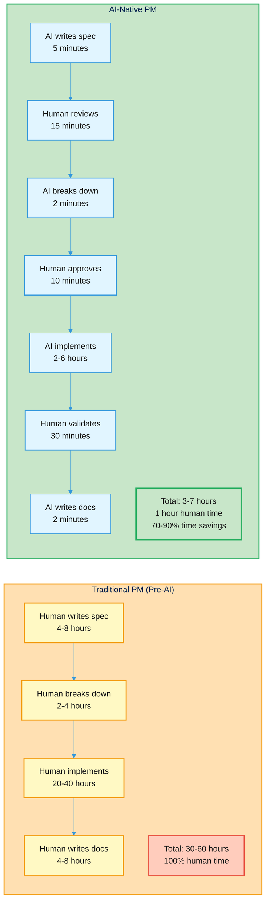
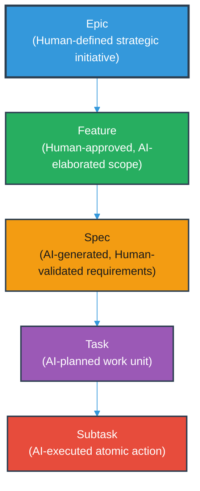
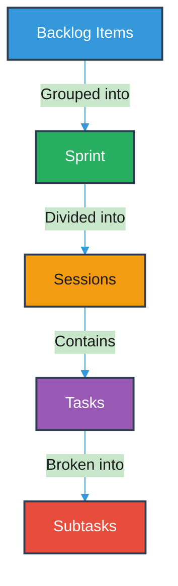
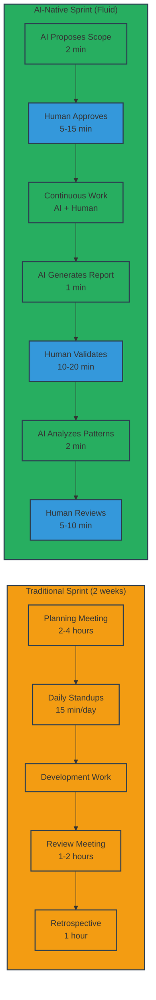
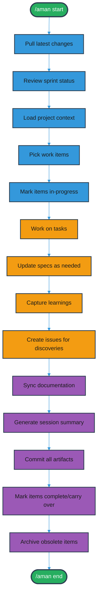
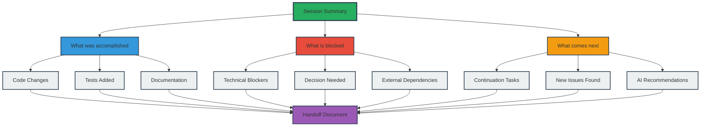
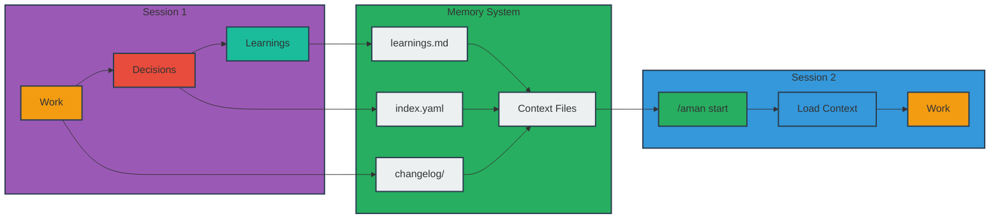
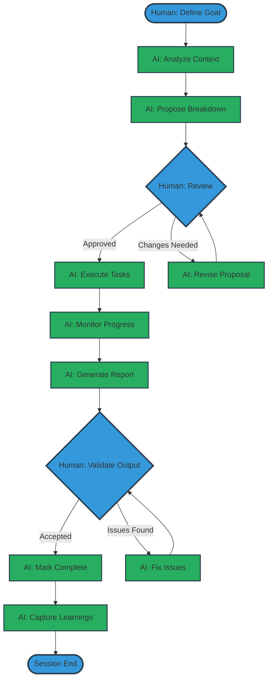
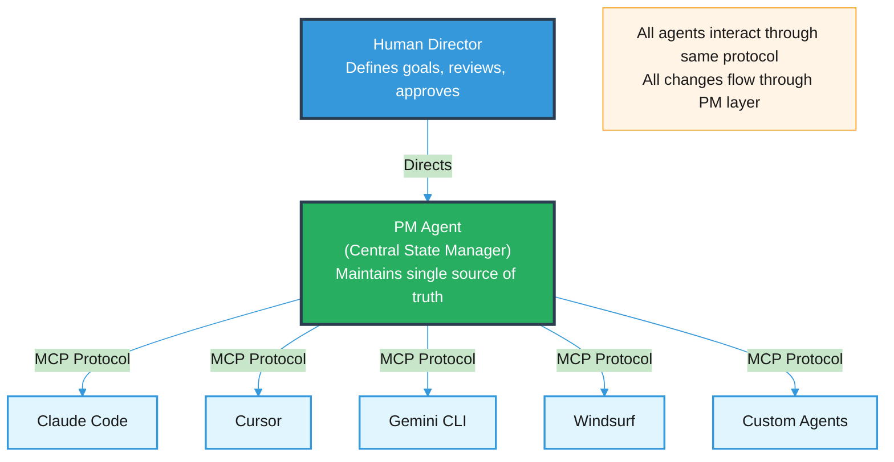

# AI-Native Project Management: Patterns for Human-AI Collaboration

> **Learning Objectives:**
> - Understand the "Human as Director, AI as Executor" model
> - Learn the adapted Agile framework for AI-assisted development
> - Apply session-based discipline to your AI development workflow
>
> **Audience:** Engineering leads, teams using AI assistants, project managers

## TL;DR

AI coding assistants create documentation, specifications, and code faster than humans can consolidate. Traditional project management practices cannot keep pace. New patterns are needed: humans define vision and approve work while AI agents plan and execute. Organizations adopting these patterns report 30-40% reduction in administrative overhead and 45% faster backlog grooming.

---

## The Problem: AI Creates New PM Challenges

Building software with AI coding assistants (Claude Code, Cursor, Copilot, Gemini) creates unprecedented project management challenges that traditional tools were not designed to handle.

### Documentation Drift

In traditional development, documentation becomes stale over months. With AI-assisted development, plans and specifications can become obsolete within days. An AI agent implements a feature faster than expected, discovers edge cases that change the design, or validates that a planned approach will not work. The documentation lags behind the reality.

**Example:** You plan a 2-week feature. The AI implements core functionality in day 1, discovers that the planned database schema will not scale in day 2, pivots to a new approach in day 3. Your original specification is now fiction.

### Artifact Explosion

AI agents generate artifacts at superhuman speed: code files, tests, documentation, changelogs, analysis reports, architecture diagrams. A project can accumulate 100,000+ artifacts. Naive approaches (flat file lists, everything in memory, manual organization) break down entirely.

**Example:** After 6 months of AI-assisted development, you have thousands of generated specs, hundreds of changelogs, dozens of architecture documents, and countless analysis reports. Finding anything relevant becomes a search problem.

### Context Loss

The "why" behind decisions evaporates between sessions. An AI agent makes a decision during implementation, documents it locally, but when a new session starts, that context is gone. Human developers experience this too, but AI's speed amplifies the problem.

**Example:** Three months ago, your AI agent decided against using a particular library because of a subtle compatibility issue. No one remembers why. A new session starts using that library. The same bug resurfaces.

### The Opportunity

Organizations that adapt their project management practices for AI-assisted development report significant improvements:

| Metric | Improvement |
|--------|-------------|
| Administrative overhead | 30-40% reduction |
| On-time delivery | 28% improvement |
| Sprint planning cycles | 25-50% faster |
| Backlog grooming time | 45% reduction |

The opportunity is not to fight against AI's speed but to redesign workflows around it.



---

## The AI-Native Agile Framework

### Core Philosophy: Human Director, AI Executor

The fundamental shift: humans move from creators to directors. Instead of writing specifications from scratch, humans review and approve AI-generated ones. Instead of breaking down tasks, humans validate AI's breakdown.

| Role | Human | AI Agent |
|------|-------|----------|
| **Vision** | Define product direction | Elaborate into detailed features |
| **Prioritization** | Approve priority rankings | Suggest based on patterns |
| **Planning** | Review and approve plans | Break down into tasks |
| **Execution** | Review outputs | Implement, test, document |
| **Quality** | Final validation | Continuous verification |
| **Learning** | Strategic decisions | Pattern recognition |

**Key insight:** This is not about replacing humans. It is about redirecting human effort from low-leverage creation work to high-leverage review and decision work.

### Adapted Work Hierarchy

Traditional Agile has epics, stories, tasks. AI-native development extends this with a clear creation-and-approval model:



**Key difference from traditional Agile:** AI agents generate the breakdown. Humans validate and approve rather than create from scratch. This is faster and often produces more comprehensive breakdowns because AI can analyze the entire codebase for dependencies.



**Visual explanation:** Work flows from the backlog through sprints, which are divided into focused sessions. Each session contains tasks that break down into atomic subtasks for execution.

### Human Approval Gates

The pattern that makes this work:

```
AI Proposes --> Human Reviews --> AI Executes --> Human Validates
```

**Example workflow:**

1. AI breaks down a feature into 10 tasks (2 minutes)
2. Human reviews the breakdown (5 minutes)
3. AI implements all 10 tasks (autonomous, hours)
4. Human validates the final result (20 minutes)

Total human time: 25 minutes for work that would have taken hours of planning plus hours of review.

---

## Sprint Lifecycle Adaptations

Each phase of the traditional sprint lifecycle needs adaptation for AI participation.



**Comparison:** Traditional sprints require 8-10 hours of meeting time. AI-native sprints reduce human time to 20-45 minutes through AI-generated proposals and reports.

### Phase 1: Backlog Grooming (Continuous)

**Traditional:** Humans meet weekly to review and prioritize backlog items.

**AI-Native:** AI continuously analyzes the backlog, detecting duplicates, clustering related items, flagging obsolete entries, and suggesting priority adjustments. Humans review AI suggestions asynchronously.

| AI Agent Responsibilities | Human Responsibilities |
|---------------------------|------------------------|
| Detect duplicate items | Review AI suggestions weekly |
| Cluster related tasks | Approve or reject changes |
| Flag dependency conflicts | Make strategic priority decisions |
| Suggest priority adjustments | Define business value |

### Phase 2: Sprint Planning (Session Start)

**Traditional:** Team meets for planning poker, breaks down stories, commits to sprint scope.

**AI-Native:** AI proposes sprint composition based on velocity trends, dependencies, and capacity. Humans approve scope and identify known blockers.

| AI Agent Responsibilities | Human Responsibilities |
|---------------------------|------------------------|
| Analyze capacity and velocity | Define sprint goals |
| Propose sprint composition | Approve sprint scope |
| Identify risks and dependencies | Allocate resources |
| Generate initial task breakdowns | Identify known blockers |

### Phase 3: Sprint Execution (Daily Work)

**Traditional:** Developers pick up tasks, implement, submit PRs for review.

**AI-Native:** AI generates detailed specs from approved features, implements tasks autonomously, updates documentation in sync with code, and flags blockers. Humans review outputs and unblock architectural decisions.

| AI Agent Responsibilities | Human Responsibilities |
|---------------------------|------------------------|
| Generate specs from features | Review pull requests |
| Implement tasks autonomously | Approve merges |
| Update docs with code changes | Unblock decisions |
| Create changelog entries | Provide clarification |
| Flag blockers and uncertainties | Validate acceptance criteria |

### Phase 4: Sprint Review (Session End)

**Traditional:** Team demos completed work, stakeholders provide feedback.

**AI-Native:** AI generates completion reports, identifies incomplete items with reasons, archives completed artifacts. Humans validate delivered features and decide on carry-over items.

| AI Agent Responsibilities | Human Responsibilities |
|---------------------------|------------------------|
| Generate completion report | Validate delivered features |
| Identify incomplete items | Accept or reject completions |
| Archive completed artifacts | Decide on carry-over items |
| Update project metrics | Provide stakeholder feedback |

### Phase 5: Retrospective (Learning)

**Traditional:** Team discusses what went well, what did not, and creates action items.

**AI-Native:** AI analyzes sprint patterns, identifies what caused blockers, suggests process improvements. Humans confirm or dispute observations and make process decisions.

| AI Agent Responsibilities | Human Responsibilities |
|---------------------------|------------------------|
| Analyze blocker patterns | Confirm or dispute observations |
| Identify velocity trends | Make process decisions |
| Suggest improvements | Update constraints |
| Update knowledge base | Define learning priorities |

---

## Session-Based Development

AI-assisted development works best with clear session boundaries. Each session is a bounded work period where an AI agent operates with full context.



**Session lifecycle:** Every session follows a three-phase pattern: setup (blue), active work (orange), and cleanup (purple). This structure ensures context is loaded at start and preserved at end.

### Session Start Ritual

Every session should begin with these steps:

1. **Pull latest changes** - Ensure AI works with current codebase state
2. **Review sprint status** - Load active sprint, see what is in progress
3. **Load project context** - Surface relevant decisions, blockers, learnings
4. **Pick up work items** - Select items for this session
5. **Mark items as in-progress** - Signal to other agents/humans that work is starting

**Why this matters:** Without explicit session start, AI agents lack context. They make decisions that conflict with previous sessions. They duplicate work already in progress.

### During Session

While working, maintain these practices:

- **Work on declared items** - Stay focused on selected work
- **Update specs as implementation reveals new information** - Do not let insights stay only in code
- **Create issues for discoveries** - Do not leave them as notes or comments
- **Capture the "why"** - When making decisions, document rationale

**Anti-pattern to avoid:** Working on undeclared items. This creates invisible work that does not sync with project state.

### Session End Ritual

Every session should end with these steps:

1. **Sync documentation** - Ensure docs reflect code changes
2. **Generate session summary** - What was accomplished, what is blocked, what comes next
3. **Commit all artifacts** - Code, specs, changelogs, PM artifacts together
4. **Mark items complete or carry over** - Update status with notes
5. **Archive obsolete items** - Clean up what is no longer relevant



**Handoff structure:** Session summaries combine what was accomplished (blue), blockers (red), and next steps (orange) into a comprehensive handoff document for continuity.

**Why this matters:** Without explicit session end, context is lost. The next session (yours or another agent's) starts from scratch. The "why" behind decisions evaporates.



**Memory flow:** Decisions and learnings from Session 1 flow into structured files (learnings.md, index.yaml, changelog). Session 2 loads this context via `/aman start`, ensuring continuity.

---

## File-Based Project Management

For AI agents to participate in project management, the PM system must be accessible to them. This means file-based, version-controlled, plain-text formats.

### Recommended Directory Structure

```
project-root/
|
+-- .aman-pm/                     # Project management artifacts
|   +-- index.yaml                # Quick-access summary
|   +-- config.yaml               # PM configuration
|   +-- backlog/                  # Active work items (YAML files)
|   +-- sprints/                  # Sprint definitions
|   |   +-- active/               # Current sprint
|   |   +-- completed/            # Past sprints
|   +-- archive/                  # Completed/obsolete items
|   +-- decisions/                # Architecture Decision Records
|   +-- knowledge/                # Learnings, patterns, gotchas
|   +-- changelog/                # Detailed change history
|
+-- specs/                        # Feature specifications
|   +-- features/                 # One file per feature
|   +-- templates/                # Spec templates
|
+-- docs/                         # Human-readable documentation
|   +-- README.md
|   +-- ARCHITECTURE.md
|   +-- changelog.md              # Public changelog (generated)
```

### Why File-Based?

| Benefit | Explanation |
|---------|-------------|
| Version controlled | Full history, branching, merging |
| AI accessible | Any agent can read/write without API integration |
| Offline capable | No SaaS dependency |
| Diff-friendly | Changes visible in pull requests |
| Portable | Move between tools without migration |

### Index Files for Performance

When projects grow large (thousands of backlog items), scanning all files becomes slow. Maintain lightweight index files:

**index.yaml contents:**
- Total item counts by status and priority
- Recent activity log (last N changes)
- Current sprint summary
- Active blockers and dependencies

**Index updates:**
- Regenerated on each modification
- Enables quick status queries without scanning all files

---

## Key Patterns

### Pattern 1: Preserve the "Why"

Every work item should capture intent, not just description.

**Weak (common in traditional PM):**
```yaml
title: "Add login button"
description: "Add a login button to the header"
```

**Strong (AI-native approach):**
```yaml
title: "Add login button"
context: |
  Users currently have no way to access their account from the main
  page. Analytics show 23% drop-off in the authentication funnel at
  this point.
decision: |
  Placing in header (not hero section) because it's consistent with
  competitor UX and accessible on all pages.
alternatives_considered:
  - "Hero section placement - rejected for visibility on scroll"
  - "Modal trigger - rejected for added complexity"
```

**Why this matters:** When an AI agent (or a human) revisits this item months later, they understand the rationale. They can make informed decisions about whether circumstances have changed.

### Pattern 2: Single Source of Truth with Sync

If you use multiple systems (local files AND GitHub Issues, for example), establish clear primacy:

1. **Designate one system as primary** - Recommend: local files
2. **Auto-sync to secondary** - For visibility to stakeholders who use GitHub
3. **Never edit secondary directly** - All changes flow through primary

**Anti-pattern:** Editing issues in GitHub that were created from local files. This creates drift and conflicts.

### Pattern 3: Human Approval Gates

Every significant AI action should have a human approval checkpoint:

```
AI Proposes --> Human Reviews --> AI Executes --> Human Validates
```

**Examples:**
- AI proposes sprint scope -> Human approves -> AI executes sprint
- AI generates spec -> Human validates -> AI implements spec
- AI detects duplicate issues -> Human confirms -> AI archives duplicate

**Why this matters:** AI agents make mistakes. They optimize for patterns they have seen, not for your specific business context. Human approval gates catch misalignments early.



**AI-native workflow:** Humans define goals and approve at decision points (blue). AI handles analysis, execution, and reporting (green). This division maximizes leverage for both.

### Pattern 4: Generate Documentation, Do Not Write It

```
Structured data (YAML/specs) --> Generator --> Human-readable docs
```

**Example:** Instead of manually updating CHANGELOG.md, maintain structured changelog entries:

```yaml
# .aman-pm/changelog/unreleased.md
- type: feature
  title: Add login button
  description: Users can now access their account from the header
  related: F001
```

Then generate the public changelog:

```markdown
# Changelog

## Unreleased

### Features
- Add login button: Users can now access their account from the header
```

**Why this matters:** Documentation never drifts from source data. Updates happen automatically. Consistency is guaranteed.

---

## Multi-Agent Access

Modern development involves multiple AI tools: Claude Code for complex tasks, Cursor for IDE integration, Copilot for suggestions, custom agents for specialized work. These agents need to share project state.

### The Problem

```
Session 1 (Claude Code): Marks item X as in-progress
Session 2 (Cursor): Does not know, starts working on item X
Result: Duplicate work, merge conflicts, wasted effort
```

### The Solution: Shared State via MCP

Model Context Protocol (MCP) provides a standard interface for AI agents to interact with external tools and data.



**Key benefit:** Any agent that speaks MCP can participate in project management. No custom integrations per tool.

---

## Tiered Storage for Scale

When projects grow to 100,000+ artifacts, organization becomes critical.

### Three-Tier Strategy

**Active Window (Always visible)**
- Current sprint items
- 2 previous sprints for context
- Estimated: less than 500 items
- Storage: `.aman-pm/backlog/` and `.aman-pm/sprints/active/`

**Warm Storage (Searchable, not in daily view)**
- Last quarter's completed items
- Reference specifications
- Estimated: 1,000-5,000 items
- Storage: `.aman-pm/archive/recent/`

**Cold Storage (Archived, rarely accessed)**
- Historical records
- Deprecated specifications
- Compressed for space
- Estimated: Unlimited
- Storage: `.aman-pm/archive/cold/` (or external)

### Archival Rules

Move items based on clear criteria:

| Condition | Action |
|-----------|--------|
| Item completed > 2 sprints ago | Move to warm storage |
| Item completed > 1 quarter ago | Move to cold storage |
| Item obsolete (feature cancelled) | Move to cold storage immediately |
| Item referenced by active work | Keep in active window regardless of age |

---

## Converting AI Analysis to Actionable Items

### The Problem

AI agents produce valuable analysis: code reviews that identify bugs, performance profiling that surfaces bottlenecks, architecture analysis that reveals coupling. But this analysis often remains as prose in chat sessions or markdown files. It never becomes tracked work.

### The Solution: Structured Output Format

When AI produces analysis, it should tag actionable items with structure:

```yaml
# Example: Output from code review analysis

findings:
  - severity: high
    type: bug
    location: src/auth/login.go:45
    description: "Null pointer dereference when user is not found"
    suggested_action: "Add nil check before accessing user fields"
    create_issue: true

  - severity: medium
    type: tech_debt
    location: src/api/handlers.go
    description: "Duplicated error handling across 12 handlers"
    suggested_action: "Extract common error handling middleware"
    create_issue: true

  - severity: low
    type: improvement
    location: src/db/queries.go:89
    description: "N+1 query pattern in user listing"
    suggested_action: "Use batch query or eager loading"
    create_issue: false  # Track in backlog, not urgent
```

A PM agent or skill can parse this output and automatically create corresponding backlog items, maintaining traceability from analysis to implementation.

---

## Applying to Your Project

### Start Simple

Do not architect the perfect system. Build minimum viable PM structure:

1. **Create one directory:** `.aman-pm/`
2. **Add one file:** `backlog.yaml` with your current work items
3. **Run one sprint:** Use this structure for 2 weeks
4. **Document pain points:** What is missing? What is awkward?
5. **Then expand:** Add only what you need

**First week goal:** Establish session start and session end rituals. That alone provides 50% of the value.

### Build Skill Before Tool

If you are tempted to build a full PM tool, resist. Build a lightweight skill or agent first:

| Approach | Timeline | Investment | Learning |
|----------|----------|------------|----------|
| Skill/Agent | Days | Low | High |
| Full Tool | Months | High | Delayed |

**The skill teaches you:**
- What operations you actually use
- What workflows need automation
- What the tool should do

Only build a full tool after 3+ months of skill usage validates the approach.

### Checklist for Adoption

**Week 1:**
- [ ] Create `.aman-pm/` directory structure
- [ ] Define session start ritual
- [ ] Define session end ritual
- [ ] Run 3 sessions using the rituals

**Week 2:**
- [ ] Add backlog tracking (simple YAML file)
- [ ] Add sprint definition
- [ ] Document 5 decisions in ADR format
- [ ] Capture 3 learnings

**Week 3:**
- [ ] Automate what is painful
- [ ] Add index file for quick status
- [ ] Establish archival rules
- [ ] Retrospective: What works? What does not?

**Week 4+:**
- [ ] Iterate based on learnings
- [ ] Share patterns with team
- [ ] Consider multi-agent coordination

---

## Common Pitfalls

### Pitfall 1: Over-Engineering Upfront

**Symptom:** Spending weeks designing the perfect PM structure before writing code.

**Solution:** Start with a single YAML file. Add structure as you encounter problems.

### Pitfall 2: Ignoring Session Boundaries

**Symptom:** AI sessions that start without context and end without summary. Each session feels like starting over.

**Solution:** Enforce session rituals. Make them non-negotiable.

### Pitfall 3: Manual Documentation Maintenance

**Symptom:** Spending time updating documentation that drifts from code within days.

**Solution:** Generate documentation from structured data. Never edit generated files directly.

### Pitfall 4: Treating AI as Human

**Symptom:** Expecting AI to remember context between sessions, to understand implicit requirements, to know when to ask for clarification.

**Solution:** Be explicit. Document everything. Create approval gates.

---

## See Also

- [AI-Native Documentation Lessons](./ai-native-documentation-lessons.md) - Patterns for sustainable documentation in AI-assisted development
- [Zero-Friction Lessons](./zero-friction-lessons.md) - Reducing friction in developer tools

---

**Based on:** Evolution of project management practices across AI-native development projects
**Original Analysis:** `archive/guides/ai_native_project_management.md`
**Last Updated:** 2026-01-16
