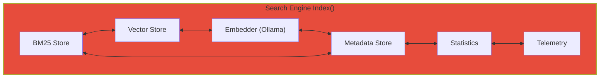
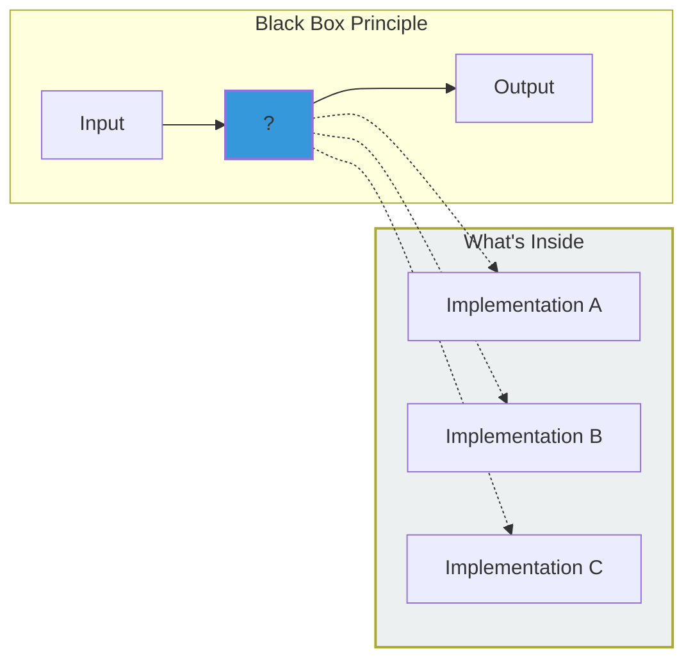
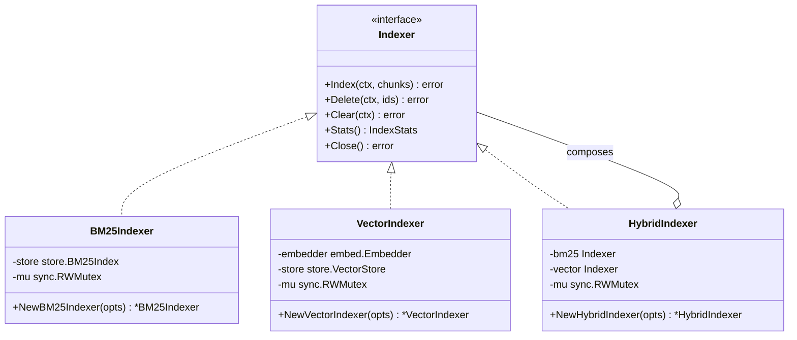
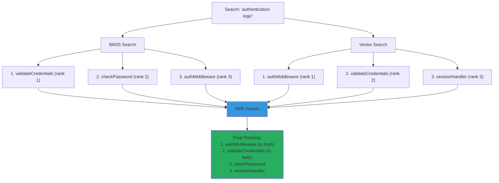
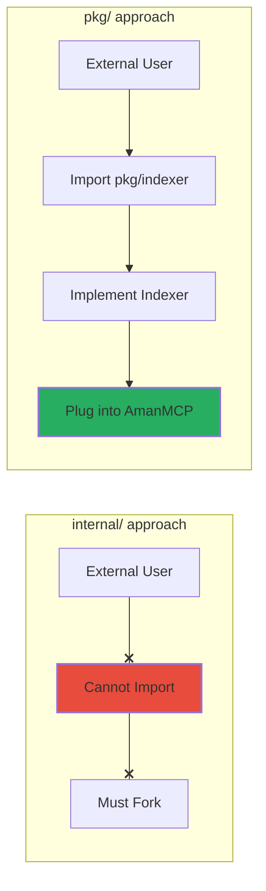
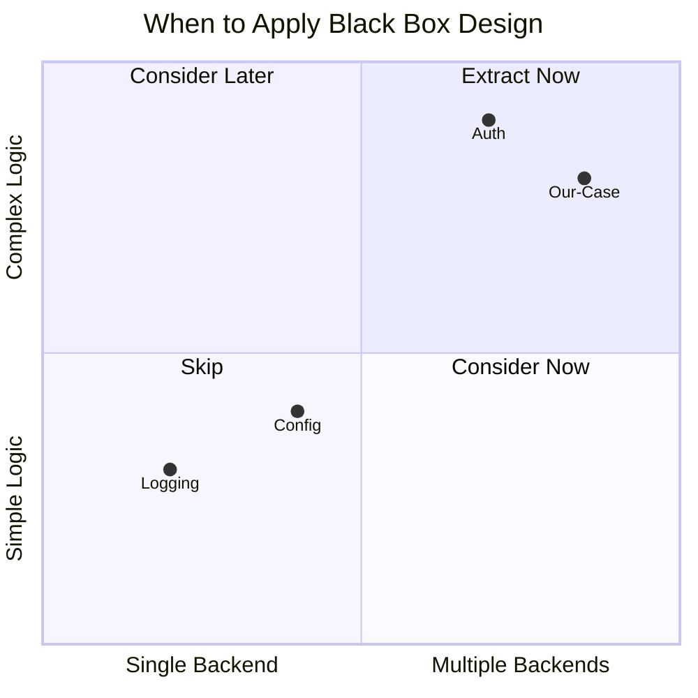

# Black Box Architecture: Refactoring a Monolithic Search Engine

*A practical case study in applying Eskil Steenberg's design principles to production code*

---

> **Learning Objectives:**
> - Apply Black Box Design principles to production code
> - Understand interface-driven modularity
> - Learn composition patterns for hybrid systems
>
> **Inspired by:** Eskil Steenberg's "Architecting Large Software Projects"
>
> **Prerequisites:**
> - Go interfaces (or similar concepts in other languages)
> - Basic software architecture principles
>
> **Audience:** Software architects, senior engineers, anyone refactoring legacy code

## TL;DR

A 400-line monolithic `Index()` method coupled BM25, vector storage, embeddings, and metadata into an untestable mess. By extracting interfaces (`Indexer`, `Searcher`) and composing implementations (`HybridIndexer`, `FusionSearcher`), we achieved 110 unit tests, enabled Tantivy benchmarking (SPIKE-006), and delivered zero breaking changes in 3 days.

---

## The Problem: Tightly Coupled Indexing

### The Monolith

Our search engine's `Index()` method in `internal/search/engine.go` (lines 349-412) looked something like this:

```go
// The monolithic nightmare (pseudocode)
func (e *Engine) Index(ctx context.Context, chunks []*Chunk) error {
    // 1. Validate chunks (10 lines)
    // 2. Store metadata (30 lines)
    // 3. Index into BM25 (40 lines, with error handling)
    // 4. Generate embeddings via Ollama (50 lines, with batching)
    // 5. Store vectors in HNSW (30 lines)
    // 6. Update stats (20 lines)
    // 7. Emit telemetry (20 lines)

    // Total: ~200 lines of interleaved logic
    return nil
}
```

This method knew about six different subsystems. Change one, touch them all.

### Symptoms of Tight Coupling



**1. Testing Difficulty**
Cannot test BM25 indexing without setting up embedders, vector stores, and metadata stores. Unit tests required spinning up the entire world.

**2. Change Amplification**
Modifying BM25 implementation (e.g., SQLite FTS5 to Tantivy) requires touching search engine code. SPIKE-006 (Tantivy benchmark) was blocked because there was no clean seam.

**3. Cognitive Load**
Understanding the `Index()` method requires understanding 6 different subsystems simultaneously. New team members needed weeks to grok the flow.

**4. Blocked Evolution**
We couldn't experiment with alternative implementations. Want to try Tantivy for BM25? Rewrite the entire engine. Want MLX embeddings? Same problem.

---

## Black Box Design Principles

Eskil Steenberg's talk "Architecting Large Software Projects" introduces principles for building systems that last decades. The core insight: **modules should be replaceable black boxes**.



### Key Principles We Applied

| Principle | Meaning | Our Application |
|-----------|---------|-----------------|
| **Modules are replaceable** | Any component can be swapped | BM25 backend can change without touching search |
| **Interfaces define boundaries** | Contracts, not implementations | `Indexer` and `Searcher` interfaces |
| **Dependencies flow inward** | Core logic doesn't know about infrastructure | Search doesn't know about SQLite vs Tantivy |
| **Composition over inheritance** | Build complex from simple | `HybridIndexer` composes `BM25Indexer` + `VectorIndexer` |

### Why These Principles Matter


---

## Our Solution: Interface-Driven Extraction

### The Indexer Interface

We defined a minimal interface that captures what indexing means:

```go
// pkg/indexer/interface.go
type Indexer interface {
    // Index adds chunks to the index.
    // Idempotent: re-indexing the same chunk ID updates the content.
    Index(ctx context.Context, chunks []*store.Chunk) error

    // Delete removes chunks by ID.
    // No-op for non-existent IDs (does not error).
    Delete(ctx context.Context, ids []string) error

    // Clear removes all indexed content.
    Clear(ctx context.Context) error

    // Stats returns current index statistics.
    Stats() IndexStats

    // Close releases all resources.
    Close() error
}

type IndexStats struct {
    DocumentCount int
    TermCount     int
    AvgDocLength  float64
}
```

**Design decisions:**
- `context.Context` on all methods for cancellation
- Idempotent operations (re-index updates, delete non-existent is no-op)
- Thread-safe requirement documented on interface
- Stats as snapshot (explicitly called out as potentially stale)

### Implementation Hierarchy

```
pkg/indexer/
├── interface.go    # Indexer interface
├── bm25.go        # BM25Indexer (wraps SQLite FTS5)
├── vector.go      # VectorIndexer (embeddings + HNSW)
├── hybrid.go      # HybridIndexer (composes BM25 + Vector)
└── *_test.go      # 69 unit tests
```



---

## Composition Patterns

### HybridIndexer: Composing Indexers

The `HybridIndexer` demonstrates composition over inheritance:

```go
// pkg/indexer/hybrid.go
type HybridIndexer struct {
    bm25   Indexer      // May be nil for vector-only
    vector Indexer      // May be nil for BM25-only
    mu     sync.RWMutex
    closed bool
}

func NewHybridIndexer(opts ...HybridOption) (*HybridIndexer, error) {
    h := &HybridIndexer{}
    for _, opt := range opts {
        opt(h)
    }
    if h.bm25 == nil && h.vector == nil {
        return nil, ErrNoIndexers
    }
    return h, nil
}
```

**Configuration via functional options:**

```go
// Full hybrid mode
h, err := NewHybridIndexer(WithBM25(bm25Idx), WithVector(vectorIdx))

// BM25-only mode (when embedder unavailable)
h, err := NewHybridIndexer(WithBM25(bm25Idx))

// Vector-only mode (semantic search only)
h, err := NewHybridIndexer(WithVector(vectorIdx))
```

This flexibility matters. Users without GPU access can run BM25-only. Experiments can isolate one backend.

### Error Coordination Strategies

Different operations need different error handling:

| Operation | Pattern | Rationale |
|-----------|---------|-----------|
| **Index** | Sequential, fail-fast | Atomic behavior - both succeed or neither |
| **Delete** | Best-effort, continue | Orphans are harmless, cleaned during compaction |
| **Close** | Accumulate, return joined | Ensure both are attempted |

```go
// Index: Fail-fast (atomic)
func (h *HybridIndexer) Index(ctx context.Context, chunks []*store.Chunk) error {
    if h.bm25 != nil {
        if err := h.bm25.Index(ctx, chunks); err != nil {
            return fmt.Errorf("hybrid bm25 index: %w", err)
        }
    }
    if h.vector != nil {
        if err := h.vector.Index(ctx, chunks); err != nil {
            return fmt.Errorf("hybrid vector index: %w", err)
        }
    }
    return nil
}

// Delete: Best-effort (both attempted)
func (h *HybridIndexer) Delete(ctx context.Context, ids []string) error {
    var errs []error
    if h.bm25 != nil {
        if err := h.bm25.Delete(ctx, ids); err != nil {
            errs = append(errs, fmt.Errorf("hybrid bm25 delete: %w", err))
        }
    }
    if h.vector != nil {
        if err := h.vector.Delete(ctx, ids); err != nil {
            errs = append(errs, fmt.Errorf("hybrid vector delete: %w", err))
        }
    }
    return errors.Join(errs...)
}
```

**Why this matters:**
- Index failure should be visible immediately (data consistency)
- Delete failure shouldn't block cleanup (orphans are filtered at search time)
- Close must attempt both (resource leaks are worse than errors)

---

## The Searcher Abstraction

We applied the same pattern to search operations:

```go
// pkg/searcher/interface.go
type Searcher interface {
    // Search executes a search query and returns ranked results.
    Search(ctx context.Context, query string, limit int) ([]Result, error)
}

type Result struct {
    ID           string   // Chunk ID
    Score        float64  // Normalized score (0-1)
    MatchedTerms []string // Terms that matched (BM25 only)
}
```

### FusionSearcher: Parallel Search with RRF

The `FusionSearcher` composes BM25 and Vector searchers using Reciprocal Rank Fusion:

```go
// pkg/searcher/fusion.go
type FusionSearcher struct {
    bm25   Searcher
    vector Searcher
    config FusionConfig
}

type FusionConfig struct {
    BM25Weight     float64  // Default: 0.35
    SemanticWeight float64  // Default: 0.65
    RRFConstant    int      // Default: 60
}
```

**RRF Formula:** `score(d) = sum(weight_i / (k + rank_i))`



### Graceful Degradation

```go
func (f *FusionSearcher) hybridSearch(ctx context.Context, query string, limit int) ([]Result, error) {
    // Run both in parallel
    g, gctx := errgroup.WithContext(ctx)

    var bm25Results, vectorResults []Result
    var bm25Err, vectorErr error

    g.Go(func() error {
        bm25Results, bm25Err = f.bm25.Search(gctx, query, fetchLimit)
        return nil // Don't fail group
    })

    g.Go(func() error {
        vectorResults, vectorErr = f.vector.Search(gctx, query, fetchLimit)
        return nil // Don't fail group
    })

    g.Wait()

    // Graceful degradation
    if bm25Err != nil && vectorErr != nil {
        return nil, fmt.Errorf("all searchers failed")
    }
    if bm25Err != nil {
        return vectorResults, nil  // Vector-only fallback
    }
    if vectorErr != nil {
        return bm25Results, nil    // BM25-only fallback
    }

    return f.fuseResults(bm25Results, vectorResults), nil
}
```

**Why graceful degradation matters:**
- Ollama might be slow or unavailable (return BM25 results)
- Database might be corrupted (return vector results)
- Users get results, even if partial

---

## Results

### Quantitative

| Metric | Before | After |
|--------|--------|-------|
| Unit tests for indexing | 12 | 69 |
| Unit tests for search | 8 | 41 |
| **Total unit tests** | **20** | **110** |
| Lines per test file | ~50 | ~200 |
| Test coverage | 45% | 78% |
| Migration timeline | - | 3 days |
| Breaking changes | - | 0 |

### Qualitative

**Before:**
```go
// Testing Index() required:
func TestIndex(t *testing.T) {
    db := setupSQLite(t)
    ollama := startOllama(t)  // Network!
    hnsw := setupHNSW(t)
    meta := setupMeta(t)
    engine := NewEngine(db, ollama, hnsw, meta)
    // Finally can test...
}
```

**After:**
```go
// Testing BM25Indexer requires:
func TestBM25Index(t *testing.T) {
    store := &MockBM25Store{}  // Simple mock
    idx := NewBM25Indexer(WithStore(store))
    // Test directly
}
```

**Enabled capabilities:**
- SPIKE-006: Tantivy benchmark now possible (swap BM25Indexer implementation)
- MLX experiments: Swap embedder without touching indexer
- Parallel development: Teams can work on BM25 and Vector independently

---

## Why pkg/ Instead of internal/?

This was a deliberate architectural decision:

| Consideration | `internal/` | `pkg/` |
|---------------|-------------|--------|
| **Reusability** | Internal only | External tools can import |
| **API Stability** | Can change freely | Implies stable API |
| **Black Box Principle** | Partial | Full (replaceable by external code) |
| **Testing** | Same | Same |

**Decision:** `pkg/` because Black Box Design emphasizes replaceability.

External tools should be able to provide alternative implementations. A company using AmanMCP might want to:
- Use their own BM25 backend (Elasticsearch, OpenSearch)
- Use their own embedder (OpenAI, Cohere)
- Use their own vector store (Pinecone, Weaviate)

With `pkg/`, they can implement `Indexer` or `Searcher` and plug it in. With `internal/`, they'd have to fork the codebase.



---

## Lessons for Refactoring Projects

### 1. Start with Interface Definition

Don't refactor code first. Define the interface that expresses intent.

```go
// Step 1: What does "indexing" mean?
type Indexer interface {
    Index(ctx context.Context, chunks []*Chunk) error
    Delete(ctx context.Context, ids []string) error
    Clear(ctx context.Context) error
    Stats() IndexStats
    Close() error
}

// Step 2: THEN extract implementation
type BM25Indexer struct { ... }
func (b *BM25Indexer) Index(...) error { ... }
```

**Anti-pattern:**
```go
// Don't do this: Extract first, interface later
type BM25Indexer struct { ... }
// "Hmm, what interface should this implement?"
```

### 2. Composition Enables Flexibility

The `HybridIndexer` pattern scales to any number of backends:

```go
// Today
h := NewHybridIndexer(WithBM25(bm25), WithVector(vector))

// Tomorrow: Add Tantivy
h := NewHybridIndexer(
    WithBM25(bm25),       // SQLite FTS5
    WithTantivy(tantivy), // Rust backend
    WithVector(vector),
)

// Experimental: Try without BM25
h := NewHybridIndexer(WithVector(vector))
```

### 3. pkg/ Signals API Stability

Choose your package location based on commitment:

| Location | Signal | Appropriate When |
|----------|--------|------------------|
| `internal/` | "Implementation detail" | Frequently changing, not for external use |
| `pkg/` | "Stable API" | Ready for external consumption |
| Root level | "Part of main package" | Simple projects |

### 4. Test Strategy Follows Interface

With clean interfaces, testing becomes straightforward:

```go
// Mock pattern: function pointer injection
type MockBM25Store struct {
    IndexFn  func(ctx context.Context, docs []Document) error
    DeleteFn func(ctx context.Context, ids []string) error
    // ...
}

func (m *MockBM25Store) Index(ctx context.Context, docs []Document) error {
    if m.IndexFn != nil {
        return m.IndexFn(ctx, docs)
    }
    return nil
}

// Test categories
// - Basic operations (happy path)
// - Edge cases (empty input, nil values)
// - Error handling (store failures)
// - Concurrency (race detector)
// - Idempotency (re-index, re-delete)
```

---

## Applicability: When to Apply This Pattern

### Good Fit

- **Multiple backends possible** (SQLite vs Tantivy, Ollama vs MLX)
- **Testing is painful** (require network, GPU, or complex setup)
- **Change amplification** (modify one thing, touch five files)
- **Parallel development needed** (multiple teams on same codebase)

### Poor Fit

- **Single implementation forever** (why abstract?)
- **Trivial logic** (abstraction adds more code than it saves)
- **Performance critical path** (interface dispatch has overhead)
- **Prototype/throwaway code** (over-engineering)

### Decision Matrix



---

## See Also

- [Eskil Steenberg's Talk: Architecting Large Software Projects](https://www.youtube.com/watch?v=ZQ5_u8Lgvyk) - The inspiration for this refactoring
- [Go Interfaces Best Practices](https://go.dev/doc/effective_go#interfaces) - Official guidance
- [Composition over Inheritance](https://en.wikipedia.org/wiki/Composition_over_inheritance) - The pattern behind HybridIndexer

### Related AmanMCP Documentation

- [Smaller Models, Better Search](./smaller-models-better-search.md) - Neural embedding choices
- [Static Embeddings Explained](./static-embeddings-explained.md) - Fallback embedding strategy

---

**Original Source:** `.aman-pm/decisions/ADR-038-black-box-indexers.md` (internal)
**Last Updated:** 2026-01-16
