# Claude Code Native Search vs amanmcp MCP Tools: A Benchmark

> When should you use Grep/Glob vs semantic search? This benchmark answers that question with data.


## Executive Summary

| Metric | Claude Code (Grep/Glob) | amanmcp MCP Tools |
|--------|------------------------|-------------------|
| **Speed** | ~8ms/search | ~34ms/search |
| **Query Type** | Keyword/pattern matching | Semantic/concept understanding |
| **Best For** | Finding WHERE words appear | Finding WHAT implements concepts |
| **Result Format** | Line matches | Full function implementations |

**Verdict**: Use both. MCP tools for exploration and understanding; Grep for exact matches and confirmation.


---

## The Benchmark

We ran identical queries through both systems on the amanmcp codebase (~3,800 chunks, ~150 Go files).

### Test Environment

- **Codebase**: amanmcp (Go, ~50K LOC)
- **Index**: qwen3-embedding:0.6b (1024 dimensions)
- **Hardware**: Apple Silicon M-series
- **Claude Code Version**: Latest
- **amanmcp Version**: 0.8.2


---

## How Each Search Works

Before diving into the queries, let's understand the fundamental difference in how each search operates:


---

## Query 1: "Retry Logic with Exponential Backoff"

### Claude Code Grep

```bash
grep -rn "retry.*exponential|backoff" --include="*.go"
```

**Results** (5 matches, ~8ms):
```
cmd/amanmcp/cmd/init.go:139: "error handling retry backoff"
internal/embed/ollama.go:388: // Calculate retry factor (exponential increase per retry)
internal/embed/ollama.go:468: // Exponential backoff: 100ms * 2^attempt
internal/embed/ollama.go:469: backoff := time.Duration(100<<attempt) * time.Millisecond
internal/embed/ollama.go:473: case <-time.After(backoff):
```

**Analysis**: Found lines containing the keywords. Useful for seeing where these terms appear, but doesn't show the actual retry implementation.

### amanmcp MCP search_code

```json
{"query": "retry logic with exponential backoff", "limit": 5}
```

**Results** (5 matches, ~34ms):
```go
// File: internal/errors/retry.go
// function 'Retry'; documented as: Retry executes a function with exponential back...

func Retry(ctx context.Context, cfg RetryConfig, fn func() error) error {
    delay := cfg.InitialDelay
    var lastErr error

    for attempt := 0; attempt <= cfg.MaxRetries; attempt++ {
        select {
        case <-ctx.Done():
            return ctx.Err()
        default:
        }

        if err := fn(); err != nil {
            lastErr = err
            if attempt >= cfg.MaxRetries {
                break
            }

            waitDelay := delay
            if cfg.Jitter {
                jitterFactor := 0.5 + rand.Float64()*0.5
                waitDelay = time.Duration(float64(delay) * jitterFactor)
            }

            select {
            case <-ctx.Done():
                return ctx.Err()
            case <-time.After(waitDelay):
            }

            delay = time.Duration(float64(delay) * cfg.Multiplier)
            if delay > cfg.MaxDelay {
                delay = cfg.MaxDelay
            }
            continue
        }
        return nil
    }
    return fmt.Errorf("failed after %d retries: %w", cfg.MaxRetries, lastErr)
}
```

**Analysis**: Found the actual `Retry()` function implementation with full context, jitter support, and exponential backoff logic. This is the answer you'd want when asking "how does retry work?"

### Winner: amanmcp MCP

The semantic search understood "retry logic with exponential backoff" as a concept and found the implementation, not just mentions of the words.


---

## Query 2: "Prevent Memory Leaks / Clean Up Resources"

### Claude Code Grep

```bash
grep -rn "memory leak|goroutine leak|resource cleanup"
```

**Results** (5 matches):
```
CONTRIBUTING.md:143: // IMPORTANT: Always close tree-sitter objects to prevent memory leaks
cmd/amanmcp/cmd/setup_test.go:38: assert.LessOrEqual(t, leaked, 2, "goroutine leak detected...")
cmd/amanmcp/cmd/doctor.go:71: // Set up context with signal handling (uses signal.NotifyContext to prevent goroutine leaks)
cmd/amanmcp/cmd/init_test.go:53: assert.LessOrEqual(t, leaked, 2, "goroutine leak detected...")
cmd/amanmcp/cmd/doctor_test.go:38: assert.LessOrEqual(t, leaked, 2, "goroutine leak detected...")
```

**Analysis**: Found documentation and test assertions mentioning leaks. Doesn't show actual cleanup code.

### amanmcp MCP search

```json
{"query": "prevent memory leaks clean up resources properly", "limit": 5}
```

**Results**:
```go
// File: internal/telemetry/query_metrics.go
// method 'Close'; documented as: Close flushes and releases resources.

func (m *QueryMetrics) Close() error {
    m.mu.Lock()
    if m.closed {
        m.mu.Unlock()
        return nil
    }
    m.closed = true
    m.mu.Unlock()

    // Stop auto-flush
    if m.flushTicker != nil {
        m.flushTicker.Stop()
        close(m.stopCh)
    }

    // Final flush
    if err := m.Flush(); err != nil {
        return err
    }
    return nil
}
```

Also found:
- `TestServer_Close_ReleasesResources` - test verifying cleanup
- `DeleteChunks`, `DeleteFile` methods - actual resource deletion

**Analysis**: Found `Close()` methods that actually DO resource cleanup, not just comments about it.

### Winner: amanmcp MCP

Semantic search understood "clean up resources" as a concept and found the code that implements it.


---

## Query 3: "RRF Fusion Combine BM25 Vector Scores"

### Claude Code Grep

```bash
grep -rn "func.*Fuse|RRF.*func"
```

**Results** (16 matches):
```
internal/search/fusion.go:60:func (f *RRFFusion) Fuse(
internal/search/fusion.go:119:func (f *RRFFusion) getOrCreate(...)
internal/search/fusion.go:138:func (f *RRFFusion) toSortedSlice(...)
internal/search/fusion.go:159:func (f *RRFFusion) compare(...)
internal/search/fusion.go:181:func (f *RRFFusion) normalize(...)
internal/search/multi_fusion.go:80:func (f *MultiRRFFusion) FuseMultiQuery(...)
```

**Analysis**: Found the exact function signatures. Great for finding the entry point.

### amanmcp MCP search_code

```json
{"query": "RRF reciprocal rank fusion combine BM25 vector scores", "limit": 5}
```

**Results**:
```go
// File: internal/search/fusion_test.go
// function 'TestRRFFusion_Basic'

func TestRRFFusion_Basic(t *testing.T) {
    // Given: BM25 results [A, B, C] and Vector results [C, A, D]
    bm25 := createBM25Results([]string{"A", "B", "C"}, []float64{2.5, 2.0, 1.5})
    vec := createVecResults([]string{"C", "A", "D"}, []float32{0.95, 0.90, 0.85})
    weights := DefaultWeights() // BM25: 0.35, Semantic: 0.65
    fusion := NewRRFFusion()

    // When: fusing results
    results := fusion.Fuse(bm25, vec, weights)

    // Then: results are ranked by RRF scores
    // A: BM25 rank 1, Vec rank 2 -> score calculation
    // ...
}
```

**Analysis**: Found test cases that demonstrate HOW the fusion works with concrete examples.

### Winner: Tie

Grep found the implementation signatures; MCP found usage examples. Both are useful for different purposes.


---

## Speed Benchmark

```bash
# 10 iterations each

# Grep
time (for i in {1..10}; do grep -rn "embedder" --include="*.go" . | head -1 > /dev/null; done)
# Result: 0.08s total = ~8ms/search

# amanmcp CLI
time (for i in {1..10}; do amanmcp search "embedder" --limit 1 > /dev/null; done)
# Result: 0.338s total = ~34ms/search
```

| Tool | 10 Searches | Per Search | Relative |
|------|-------------|------------|----------|
| Grep | 80ms | ~8ms | 1x (baseline) |
| amanmcp | 338ms | ~34ms | 4.2x slower |

**Analysis**: Grep is 4x faster, but both are well under the 100ms target for interactive use. The semantic quality gain justifies the latency increase.


Both tools operate well within the 100ms interactive threshold. The 4x speed difference is imperceptible to users but the quality difference is significant.

---

## When to Use Each

```mermaid
%%{init: {'theme': 'base', 'themeVariables': { 'primaryColor': '#e8f5e9'}}}%%
flowchart TD
    Start["What are you searching for?"]

    Start --> Q1{"Do you know the<br/>exact text/pattern?"}

    Q1 -->|Yes| Grep["Use Grep/Glob"]
    Q1 -->|No| Q2{"Are you trying to<br/>understand a concept?"}

    Q2 -->|Yes| MCP["Use amanmcp MCP"]
    Q2 -->|No| Q3{"Looking for<br/>file by name?"}

    Q3 -->|Yes| Glob["Use Glob"]
    Q3 -->|No| MCP

    Grep --> GrepEx["Examples:<br/>• func NewClient\(<br/>• TODO:<br/>• import \"package\""]

    MCP --> MCPEx["Examples:<br/>• How does auth work?<br/>• Find retry logic<br/>• Error handling patterns"]

    Glob --> GlobEx["Examples:<br/>• **/*_test.go<br/>• src/**/*.ts<br/>• *.config.json"]

    style Grep fill:#e3f2fd
    style MCP fill:#c8e6c9
    style Glob fill:#fff3e0
```



### Use amanmcp MCP Tools When:

1. **Exploring unfamiliar code** - "How does authentication work?"
2. **Finding implementations by concept** - "Find retry logic"
3. **Understanding architecture** - "What handles database connections?"
4. **Learning a codebase** - Returns full context, not fragments


MCP tools understand that concepts map to implementations, even when the words don't match exactly.

### Use Claude Code Grep/Glob When:

1. **Finding exact text** - `func NewClient\(`
2. **Counting occurrences** - How many times is X called?
3. **Confirming presence** - Does this file contain X?
4. **Fast iteration** - Quick confirmation during refactoring


Grep excels when you know exactly what text you're looking for - no interpretation needed.

---

## Key Insight: Different Questions, Different Tools


The fundamental difference visualized:


---

## Recommendations for Claude Code Users

### 1. Default to MCP for Exploration

When you're trying to understand code, use MCP tools first:

```
User: "How does the search engine combine results?"

# Good approach:
mcp__amanmcp__search_code("RRF fusion combine results")
→ Returns full Fuse() implementation with context

# Less effective:
Grep("Fuse")
→ Returns line numbers where "Fuse" appears
```

### 2. Use Grep for Precision

When you know exactly what you're looking for:

```
User: "Find all calls to NewClient"

# Good approach:
Grep("NewClient\\(")
→ Fast, exhaustive list of all call sites

# Less effective:
mcp__amanmcp__search("NewClient function calls")
→ May return related but not exact matches
```

### 3. Combine Both for Comprehensive Understanding

```mermaid
%%{init: {'theme': 'base'}}%%
sequenceDiagram
    participant U as User
    participant MCP as amanmcp MCP
    participant G as Grep

    U->>MCP: "How does retry work?"
    MCP-->>U: func Retry() in internal/errors/retry.go<br/>(full implementation)

    Note over U: Now I understand the concept

    U->>G: Find all calls to errors.Retry
    G-->>U: 5 call sites found:<br/>• ollama.go:142<br/>• client.go:89<br/>• daemon.go:201<br/>• ...

    Note over U: Now I know WHERE it's used

    rect rgb(200, 230, 201)
        Note over U,G: Complete Understanding:<br/>WHAT it does + WHERE it's used
    end
```



```
# Step 1: Find the concept with MCP
mcp__amanmcp__search_code("retry with backoff")
→ Found: internal/errors/retry.go

# Step 2: Find all usages with Grep
Grep("errors.Retry\\(")
→ Found: 5 call sites across codebase

# Result: Understand both WHAT and WHERE
```

---

## Conclusion

The benchmark clearly shows that Claude Code's native Grep/Glob and amanmcp's MCP tools serve different purposes:

| Aspect | Grep/Glob | MCP Tools |
|--------|-----------|-----------|
| **Speed** | Faster (4x) | Acceptable (~34ms) |
| **Understanding** | Surface level | Deep semantic |
| **Results** | Line fragments | Full implementations |
| **Best for** | Known targets | Exploration |


**The optimal strategy**: Use MCP tools for understanding and exploration, Grep for precision and confirmation. Having both available makes Claude Code significantly more effective at navigating codebases.

```mermaid
%%{init: {'theme': 'base'}}%%
graph TD
    subgraph Toolbox["Claude Code Search Toolbox"]
        MCP["amanmcp MCP<br/>🧠 Semantic Search"]
        Grep["Grep<br/>🔍 Pattern Match"]
        Glob["Glob<br/>📁 File Patterns"]
    end

    Task["Search Task"]
    Task --> Decision{"What type?"}

    Decision -->|Understand concept| MCP
    Decision -->|Find exact text| Grep
    Decision -->|Find files| Glob

    MCP --> Result["Comprehensive<br/>Codebase Navigation"]
    Grep --> Result
    Glob --> Result

    style Result fill:#c8e6c9
```



---

*Benchmark conducted: 2026-01-15 | amanmcp v0.8.2 | qwen3-embedding:0.6b*
