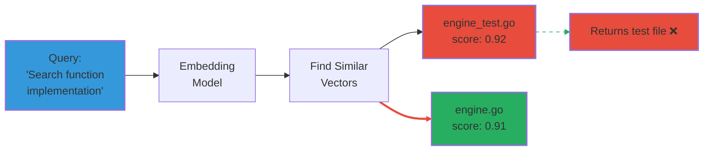
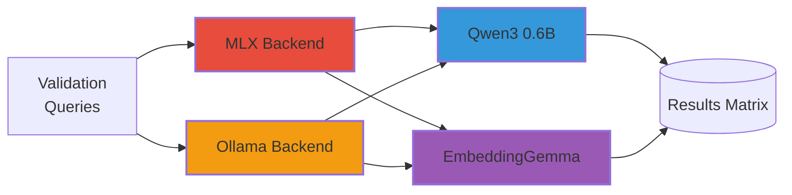
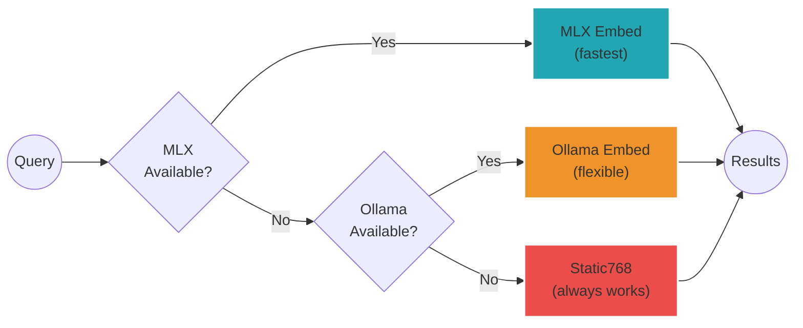
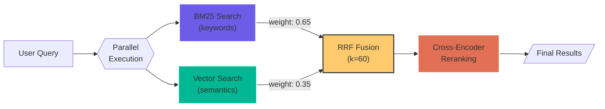
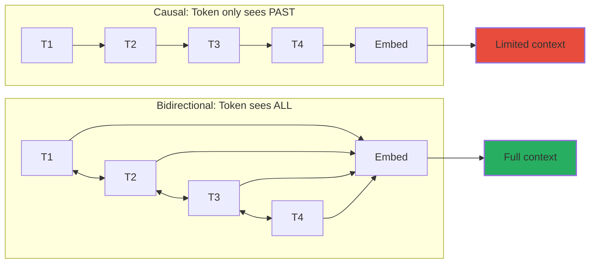
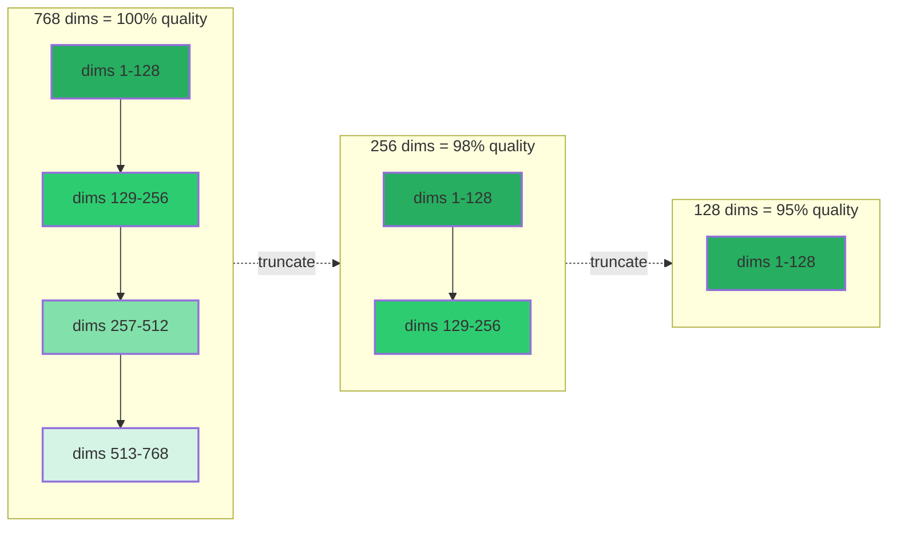

# When Smaller Might Be Better: Building a Multi-Model Testing Framework for Code Search

*How a hardware constraint led me to rethink embedding model selection*

---

## The Problem Nobody Wants to Admit

I had a problem. My semantic code search was stuck at 75% accuracy on validation queries. The obvious solution? **Use a bigger embedding model.**

There was just one problem: bigger models made my laptop unusable.

```text
User feedback: "System (OS) became useless, I did not have
any RAM left for work"
```

With 24GB RAM, the 8B parameter model I'd been using consumed so much memory that macOS became unresponsive. The 4B model wasn't much better. I was stuck with 0.6B parameters as my ceiling.

Most engineering teams would file this under "hardware limitations" and move on. I decided to do something different.

---

## The Insight That Changed Everything

While researching alternatives, I stumbled across something interesting: **Google's EmbeddingGemma** (released September 2025) achieves state-of-the-art results with just 308 million parameters.

That's *half* the size of my current model.

| Model          | Parameters | RAM Usage | MTEB Rank           |
| -------------- | ---------- | --------- | ------------------- |
| Qwen3 0.6B     | 600M       | ~1GB      | Good                |
| EmbeddingGemma | 308M       | <200MB    | Leader (under 500M) |

Wait. A model with half the parameters might give me *better* results?

This reframed the entire problem. I wasn't limited by my hardware. I was limited by my assumption that bigger = better.

---

## Why Benchmarks Lie (For Your Use Case)

Here's the thing about MTEB scores and embedding benchmarks: they're measured on generic datasets. Academic papers. Wikipedia. General web text.

Your codebase is not Wikipedia.

My failing queries looked like this:



```text
Query: "Search function implementation"
Expected: search/engine.go
Returned: search/engine_test.go ❌
```

The test file contains *identical keywords* as the implementation. A 0.6B model can't distinguish semantic intent. But here's the question I should have asked earlier:

**Can a 0.6B model trained differently distinguish them?**

EmbeddingGemma uses a different architecture (bidirectional attention vs causal). Maybe that architectural difference matters more than raw parameter count.

I wouldn't know until I tested it. On *my* codebase. With *my* queries.

---

## The Framework: Test Everything, Assume Nothing

I built what I now call a "multi-model testing framework." The concept is simple:

1. **Multiple backends**: MLX (fast, Apple-only) and Ollama (universal, more models)
2. **Multiple models**: Qwen3 0.6B, EmbeddingGemma, and future candidates
3. **Structured validation**: Same queries, measured results, documented findings
4. **Trivial switching**: One environment variable, one reindex



```bash
# Switch model in 30 seconds
export AMANMCP_EMBEDDER=ollama
export AMANMCP_OLLAMA_MODEL=embeddinggemma
amanmcp index --force .
```

The test matrix:

| Track | Backend | Model          | Purpose             |
| ----- | ------- | -------------- | ------------------- |
| 1     | Ollama  | Qwen3 0.6B     | Baseline comparison |
| 2     | Ollama  | EmbeddingGemma | New candidate       |
| 3     | MLX     | Qwen3 0.6B     | Current default     |
| 4     | MLX     | EmbeddingGemma | Potential winner    |

---

## What I Learned About Architecture

Building this framework taught me several things about software architecture:

### 1. Abstraction Pays Off

I had already built an `Embedder` interface:

```go
type Embedder interface {
    Embed(ctx context.Context, text string) ([]float64, error)
    EmbedBatch(ctx context.Context, texts []string) ([][]float64, error)
    Dimensions() int
    Close() error
}
```

Both MLX and Ollama implement this interface. Adding a new model means implementing zero new code - just configuration.

### 2. Dimension Auto-Detection is Essential

Different models produce different embedding dimensions:

- Qwen3 0.6B: 1024 dimensions
- EmbeddingGemma: 768 dimensions

My system auto-detects dimensions from the first embedding and validates on search. No manual configuration needed.

### 3. Graceful Degradation > Hard Failure

When dimensions don't match (user switched models without reindexing), the system doesn't crash:

```go
if indexDim != currentDim {
    slog.Warn("dimension mismatch, falling back to BM25-only")
    return bm25Results // Still useful!
}
```

The user gets results. Not optimal results, but results.

### 4. Fallback Chains Increase Reliability



If MLX server isn't running, fall back to Ollama. If Ollama isn't installed, use static hashing (always works, lower quality). The system never fails completely.

### 5. Hybrid Search is the Foundation

One thing I want to clarify: my system doesn't use BM25 as a "fallback." It uses **hybrid search** as the primary strategy:



```go
// RRF Fusion: BM25 + Semantic combined
DefaultWeights: Weights{
    BM25:     0.65,  // Keyword matching
    Semantic: 0.35,  // Vector similarity
}
```

Every query runs both BM25 (keyword) and semantic (vector) search in parallel. Results are fused using Reciprocal Rank Fusion (RRF). The "fallback to BM25-only" mentioned earlier only happens when there's a dimension mismatch - a rare edge case, not normal operation.

---

## The Counterintuitive Insight

Here's what I'm testing:

**A model with half the parameters might outperform my current model.**

This sounds wrong. More parameters = more capacity = better understanding. Right?

Not necessarily. Consider:

1. **Architecture matters**: EmbeddingGemma uses bidirectional attention (like BERT), not causal attention. This is better for embedding tasks.



1. **Training data matters**: A model trained specifically for embedding might beat a general-purpose model with more parameters.

1. **Efficiency matters**: A smaller model might produce embeddings faster, enabling more iterations on search quality.

1. **Fit matters**: A model that works well for text might not work well for code. And vice versa.

The only way to know is to test.

---

## The Bonus: Matryoshka Embeddings

While researching EmbeddingGemma, I discovered something that could multiply the benefits: **Matryoshka Representation Learning (MRL)**.

Here's how it works: EmbeddingGemma's embeddings are trained so that the first N dimensions contain the most important information. You can truncate 768 dimensions down to 256 - or even 128 - with minimal quality loss.



**Key insight**: The most important information is packed into the first dimensions. Truncating loses only fine details.

| Dimensions | Quality Retained | Index Size | Search Speed |
| ---------- | ---------------- | ---------- | ------------ |
| 768 (full) | 100%             | baseline   | baseline     |
| 256        | ~98%             | 33%        | ~3x faster   |
| 128        | ~95%             | 17%        | ~6x faster   |

Think about what this means:

- **3x smaller index** at 256 dimensions
- **3x faster search** with the same quality
- **Combined with EmbeddingGemma's smaller size**: potentially 6x memory reduction vs my current setup

If EmbeddingGemma wins the model comparison, I'll run a second experiment: can I use 256-dimensional embeddings without noticeable quality loss? If yes, I've solved not just the model size problem but the index size problem too.

This is the kind of optimization you only find when you're forced to look beyond the obvious "use more compute" solution.

---

## The Broader Lesson

This experience taught me something about engineering constraints:

**Constraints aren't just limitations. They're design parameters.**

My 24GB RAM constraint forced me to:

1. **Think harder** about model efficiency
2. **Test empirically** rather than assume
3. **Build infrastructure** for rapid experimentation
4. **Consider alternatives** I would have ignored

If I had 128GB of RAM, I probably would have thrown a bigger model at the problem and called it done. I would have missed the possibility that smaller, more efficient models might be *better* for my use case.

---

## What's Next

I'm running the full validation matrix. The results will tell me:

1. **Does EmbeddingGemma beat Qwen3 0.6B?** On code search, doc search, mixed queries?

2. **Do the backends matter?** MLX is 55x faster than Ollama. Does that affect quality?

3. **What's the optimal configuration?** Different models for different query types?

I'll publish the results when I have them. For now, the framework is built and the experiments are queued.

---

## Try It Yourself

If you're building semantic search with embedding models, consider:

1. **Don't assume bigger is better** - Test models on YOUR data
2. **Build for experimentation** - Make switching models trivial
3. **Keep your options open** - Multiple backends, multiple models
4. **Measure what matters** - Your validation queries, not generic benchmarks

The embedding landscape is evolving rapidly. New models are released monthly. The team that can test and adapt quickly wins.

---

## Resources

- [EmbeddingGemma Announcement](https://developers.googleblog.com/en/introducing-embeddinggemma/)
- [EmbeddingGemma on Hugging Face](https://huggingface.co/google/embeddinggemma-300m)
- [Matryoshka Representation Learning Guide](https://supermemory.ai/blog/matryoshka-representation-learning-the-ultimate-guide-how-we-use-it/)
- [Sourcegraph on BM25F](https://sourcegraph.com/blog/keeping-it-boring-and-relevant-with-bm25f)
- [ExCS: Accelerating Code Search](https://www.nature.com/articles/s41598-024-73907-6)
- [MTEB Leaderboard](https://huggingface.co/spaces/mteb/leaderboard)

---

*This article documents the architectural decision ADR-036 in the AmanMCP project. AmanMCP is a local-first RAG server for code search.*
