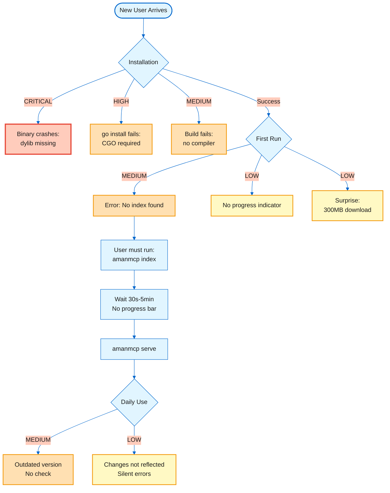
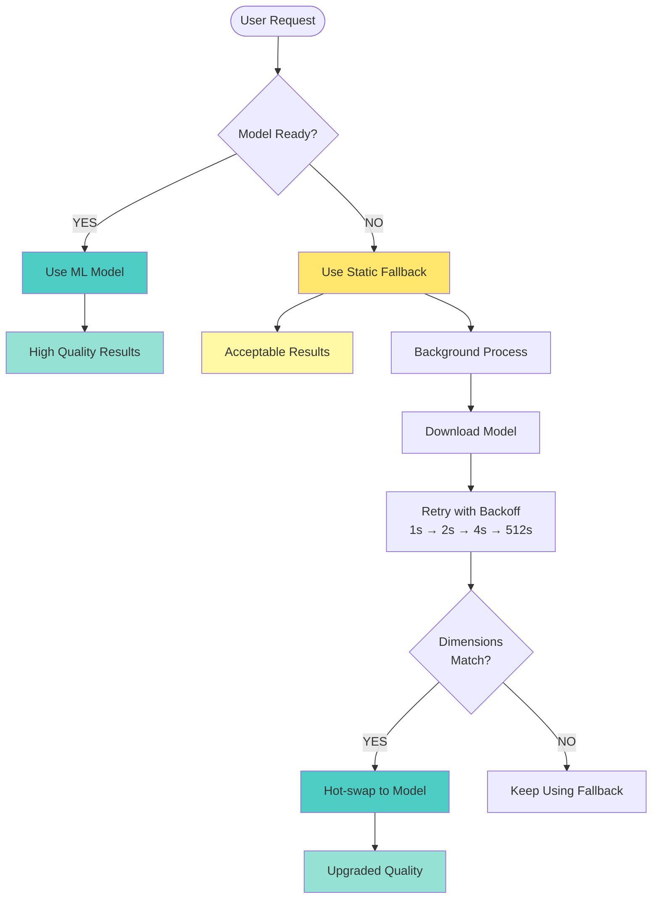
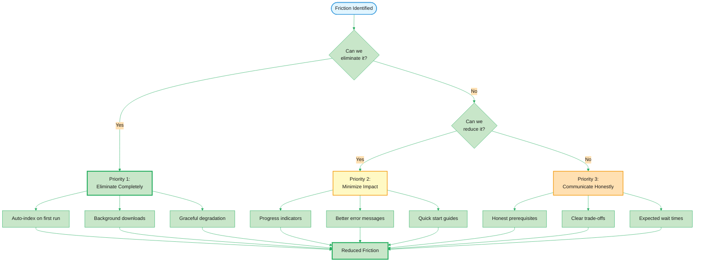
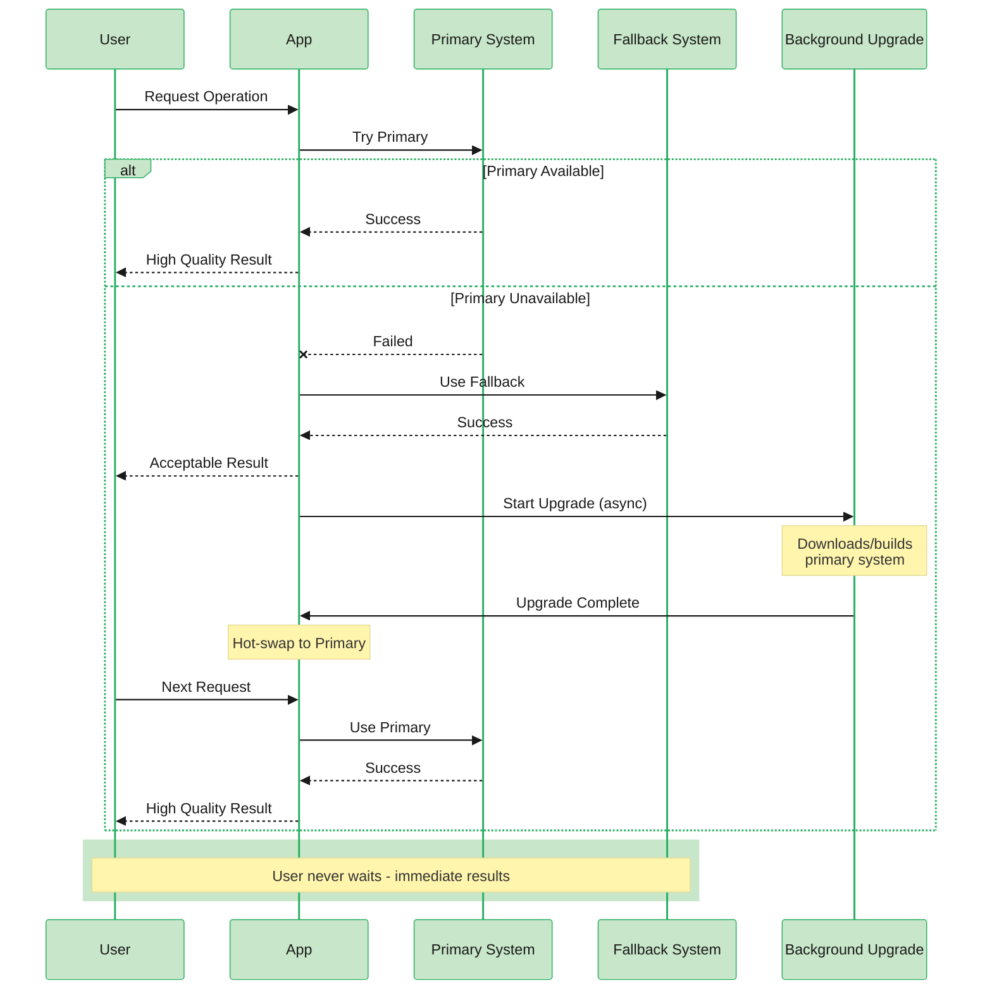
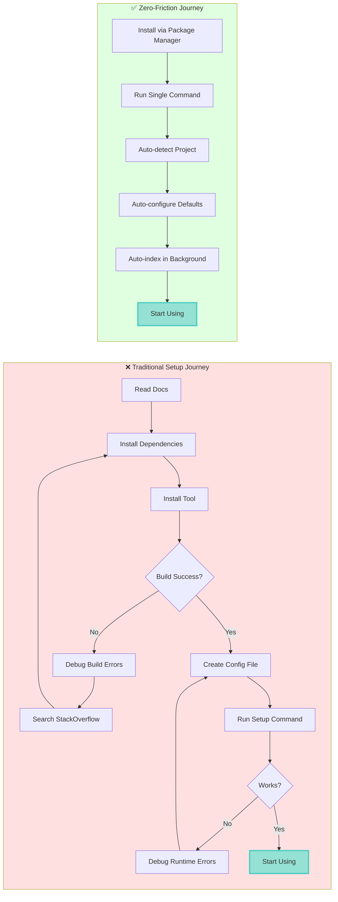

# Building Zero-Friction Developer Tools: Lessons from AmanMCP

*A brutally honest case study in bridging the gap between "It Just Works" promises and reality*

---

> **Learning Objectives:**
> - Understand the gap between "It Just Works" promises and reality
> - Learn how to conduct honest product friction analysis
> - Apply zero-friction design patterns to your tools
>
> **Audience:** Product managers, developer tool creators, engineering leads

---

## TL;DR

AmanMCP's runtime genuinely "just works" - zero-config project detection, intelligent defaults, graceful degradation. But the installation experience contradicts this promise: hidden CGO requirements, dynamic library dependencies, and a misleading "single binary" claim.

**The lesson:** Your product's friction often lives in places you've stopped looking - especially onboarding.

---

## The Philosophy: What "It Just Works" Means

"It Just Works" is more than a marketing tagline. It's a design philosophy with specific implications:

| Principle | Implementation |
|-----------|---------------|
| Zero configuration | Works out of the box with sensible defaults |
| No prerequisites | Doesn't require users to install dependencies first |
| Immediate value | Time-to-first-value measured in seconds, not minutes |
| Graceful degradation | Fails softly, never crashes on missing components |
| Invisible complexity | Users don't see the sophisticated machinery underneath |

Apple's products embody this philosophy. When you buy a Mac, you don't install drivers. When you open an iPhone, you don't configure networking. Things just work.

Developer tools rarely achieve this standard. AmanMCP tried - and partially succeeded.

---

## The Reality Check: Friction Matrix

A friction analysis maps every point where users encounter resistance. Here's what we found across AmanMCP's user journey.



### Installation Friction

| Friction Point | Severity | User Experience | Root Cause |
|----------------|----------|-----------------|------------|
| "Single binary" claim is false | CRITICAL | Binary crashes with dylib error | USearch requires dynamic library |
| CGO requirement hidden | HIGH | `go install` fails cryptically | Not documented in README |
| Xcode CLT required (macOS) | MEDIUM | Build fails with CC errors | CGO needs compiler toolchain |
| No Windows installer | MEDIUM | Windows users lost | Only Unix scripts provided |
| Model download surprise | LOW | 300MB download on first run | Not prominently warned |

**The "Single Binary" Reality:**

```bash
$ otool -L bin/amanmcp
bin/amanmcp:
    @rpath/libusearch_c.dylib (compatibility version 0.0.0)
    /usr/lib/libSystem.B.dylib
    /usr/lib/libc++.1.dylib
```

This isn't a single binary. It's a binary with a required dynamic library. Users who download GitHub releases get cryptic dylib errors. The `go install` path builds successfully but fails at runtime.

### First Run Friction

| Friction Point | Severity | User Experience | Root Cause |
|----------------|----------|-----------------|------------|
| No index = error exit | MEDIUM | "Run 'amanmcp index' first" | Not truly zero-config |
| No progress bar | LOW | "Is it frozen?" on large repos | Basic text output only |
| Blocking initial index | LOW | 30s-5min wait before server | No background indexing option |

**The First Run Reality:**

```bash
# What users expect:
$ amanmcp serve
# Server starts immediately

# What actually happens:
$ amanmcp serve
Error: no index found. Run 'amanmcp index .' first.

# User must run:
$ amanmcp index .
# (wait 30s-5min)
$ amanmcp serve
```

### Daily Use Friction

| Friction Point | Severity | User Experience | Root Cause |
|----------------|----------|-----------------|------------|
| No auto-update | MEDIUM | Miss bug fixes and features | Feature not implemented |
| No version check | LOW | Running outdated version | Feature not implemented |
| Watcher errors silent | LOW | Changes not reflected | Errors only in stderr logs |

---

## What's Working Excellently

It's easy to focus on problems. But understanding what works well is equally important for learning.

### Zero-Config Runtime (The Good News)

| Feature | Implementation | Verdict |
|---------|---------------|---------|
| Project auto-detection | Finds `.git`, detects Go/Node/Python | Excellent |
| Source discovery | Auto-finds `src/`, `lib/`, `pkg/`, etc. | Excellent |
| Sensible defaults | BM25:0.35, Semantic:0.65, 1500 tokens | Research-backed |
| Graceful degradation | Static embeddings if model fails | Invisible to user |
| Config file optional | `.amanmcp.yaml` only if customizing | True optional |
| IDE integration | Single `.mcp.json` (4 lines) | Minimal |
| Memory efficiency | F16 quantization, mmap, <300MB | Production-ready |
| Error recovery | Atomic saves, stateless server | Bulletproof |
| File watching | Auto-starts, loads .gitignore | Seamless |

**Once running, AmanMCP genuinely achieves "It Just Works."**

---

## The Adaptive Embedder: A Design Pattern Gold Mine

The `AdaptiveEmbedder` pattern in AmanMCP is brilliantly designed and worth studying. It demonstrates how to achieve zero-friction for complex operations.

### The Pattern



### The Five Properties

1. **Immediate start** - Static fallback embeddings, no waiting
2. **Background download** - Model downloads asynchronously
3. **Exponential backoff** - 1s to 512s retries, max 10 attempts
4. **Hot-swap** - Upgrades seamlessly when model ready
5. **Dimension-safe** - Only hot-swaps if embedding dimensions match

### Why This Works

```go
// Pseudocode of the pattern
func (a *AdaptiveEmbedder) Embed(text string) []float64 {
    if a.primaryReady {
        return a.primary.Embed(text)  // High quality
    }

    // Fallback is always available
    go a.tryUpgrade()  // Non-blocking upgrade attempt
    return a.fallback.Embed(text)  // Acceptable quality
}

func (a *AdaptiveEmbedder) tryUpgrade() {
    for attempt := 0; attempt < 10; attempt++ {
        if model := downloadModel(); model != nil {
            if model.Dimensions() == a.fallback.Dimensions() {
                a.primary = model
                a.primaryReady = true
                return
            }
        }
        time.Sleep(backoff(attempt))  // 1s, 2s, 4s, ... 512s
    }
}
```

**Key insight:** The user never waits. They get immediate results (possibly lower quality), and quality improves automatically when resources become available.

---

## Root Cause Analysis: Why Friction Exists

### The CGO Trade-off Chain

```
USearch (High-Performance Vector DB)
    |
    | requires
    v
CGO (C interop from Go)
    |
    | requires
    v
C Compiler (Xcode CLT / GCC)
    |
    | AND
    v
libusearch_c.dylib (Runtime dependency)
    |
    | results in
    v
NOT a "single binary" + complex build requirements
```

**The trade-off is valid.** USearch provides 10x performance over pure Go alternatives. Tree-sitter provides 100x better code parsing than regex.

**But the marketing doesn't reflect this reality.**

### Why First-Run Friction Exists

```
User runs: amanmcp serve
    |
    v
Server checks: does index exist?
    |
    v (NO)
Server exits: "Run 'amanmcp index' first"
    |
    v
User must: amanmcp index . && amanmcp serve
```

This is a design choice, not a technical limitation. The team prioritized explicit control over implicit magic. But it contradicts the "just works" promise.

---

## Strategic Recommendations



### Priority 0: Truth in Advertising

**Be honest about what your product requires.**

Change from:
```markdown
- **Single Binary** - One file, no dependencies, works offline
```

To:
```markdown
- **Simple Install** - One command install via Homebrew, self-contained with dependencies
```

**Add a prerequisites section prominently:**

```markdown
### Prerequisites

- **macOS**: Xcode Command Line Tools (`xcode-select --install`)
- **Linux**: GCC and build essentials (`apt install build-essential`)
- **Windows**: MinGW-w64 or MSVC (see Windows Guide)
```

**Add runtime validation:**

```go
func init() {
    if err := checkUSearchLibrary(); err != nil {
        fmt.Fprintf(os.Stderr, "Error: %v\n", err)
        fmt.Fprintf(os.Stderr, "Install via: brew install amanmcp\n")
        os.Exit(1)
    }
}
```

### Priority 1: First-Run Experience

**Auto-index when no index exists:**

```go
// Before: error if no index
// After: auto-index if missing
if !indexExists {
    logger.Info("No index found. Auto-indexing project...")
    if err := runAutoIndex(ctx, root, cfg); err != nil {
        return fmt.Errorf("auto-index failed: %w", err)
    }
}
```

**Add progress indication:**

```
$ amanmcp serve
No index found. Indexing project...
Scanning files:     [##########] 1,234 files
Chunking code:      [#######   ] 70%
Building index:     [####      ] 40%
Ready! Server listening on stdio
```

**Document the model download upfront:**

```markdown
> **First Run:** Downloads ~300MB embedding model for semantic search.
> Use `--offline` flag for environments without internet access.
```

### Priority 2: Distribution

**Invest in proper distribution channels:**

| Platform | Solution |
|----------|----------|
| macOS | Homebrew formula that bundles dylib |
| Linux | AppImage or deb/rpm packages |
| Windows | MSI installer with bundled dependencies |

**Create a version check and update mechanism:**

```bash
$ amanmcp version
amanmcp v0.4.0 (latest: v0.5.0)
Run 'amanmcp update' to upgrade
```

---

## Design Patterns for "It Just Works"

### Pattern 1: Adaptive Fallback



**Implementation:**
- Always have a fallback that works without external dependencies
- Use the fallback immediately, upgrade in background
- Hot-swap when better option becomes available

### Pattern 2: Progressive Enhancement

```
Level 0: Basic functionality (always works)
    |
    v
Level 1: Enhanced functionality (if dependency A available)
    |
    v
Level 2: Full functionality (if dependency A + B available)
```

**Implementation:**
- Start with the minimum viable experience
- Detect available capabilities at runtime
- Unlock features progressively based on environment

### Pattern 3: Silent Background Operations

```go
// Bad: Blocking initialization
func init() {
    model := downloadModel()  // User waits 30 seconds
    initialize(model)
}

// Good: Non-blocking initialization
func init() {
    go func() {
        model := downloadModel()  // Downloads in background
        upgrade(model)
    }()
    useFallback()  // Immediate start
}
```

**Implementation:**
- Never block startup on network operations
- Never block startup on optional features
- Provide immediate (possibly degraded) functionality

### Pattern 4: Graceful Degradation

```go
func search(query string) ([]Result, error) {
    // Try hybrid search (best quality)
    if vectorStore.Ready() {
        return hybridSearch(query)
    }

    // Fall back to keyword search (still useful)
    log.Warn("Vector store unavailable, using keyword search only")
    return keywordSearch(query)

    // Never return an error if we can provide value
}
```

**Implementation:**
- Every feature should have a fallback
- Fallbacks should be invisible to users when possible
- Log degradation for debugging, but don't alarm users

---

## Expert Opinion: Strengths and Weaknesses

### Strengths

1. **Architecture is sound** - The core design (adaptive embedder, hybrid search, memory-mapped vectors) is production-quality.

2. **Zero-config runtime is real** - Once installed, it genuinely "just works" with intelligent defaults.

3. **Graceful degradation is exemplary** - The fallback patterns are thoughtfully implemented.

4. **Error recovery is bulletproof** - Atomic saves, stateless server, automatic retries.

### Weaknesses

1. **Marketing does not equal reality** - "Single binary" is demonstrably false. This damages trust.

2. **Install experience is developer-hostile** - CGO complexity is hidden until users fail.

3. **First-run UX has gaps** - Manual index step contradicts "just works".

4. **No update story** - Users left to manually track releases.

### Strategic Recommendation

**Don't try to become a true single binary.** The USearch performance is worth the CGO complexity. Instead:

1. **Fix the messaging** - "Simple install" not "single binary"
2. **Invest in distribution** - Homebrew, apt, MSI installers that bundle everything
3. **Improve first-run UX** - Auto-index, progress bars, model download warning

---

## The 90/10 Rule

> "The product is 90% there. The last 10% is polish, not architecture."

This is a common pattern in developer tools. The core functionality is excellent, but the edges are rough. Users experience those edges first - during installation and first run.

**Apply this to your tools:**

| Phase | What Users Experience | Your Effort |
|-------|----------------------|-------------|
| Installation | First impression | Often neglected |
| First run | "Does this work?" | Often neglected |
| Daily use | Core value | Where you spend 90% of effort |
| Edge cases | "Is this production-ready?" | Often neglected |

The 10% that's neglected is often 90% of what users experience in their first hour.

### Developer Journey Comparison



**Time-to-Value:**
- Traditional: 15-60 minutes (with potential failures)
- Zero-Friction: 30-60 seconds (guaranteed success)

---

## Checklist: Zero-Friction Audit

Use this checklist to audit your own developer tools:

### Installation

- [ ] Does installation actually work as documented?
- [ ] Have you tested `go install` / `npm install` / `pip install` from scratch?
- [ ] Are all prerequisites documented prominently?
- [ ] Does the binary run without hidden dependencies?
- [ ] Is there an installer for non-technical users?

### First Run

- [ ] What happens on first run with zero configuration?
- [ ] What errors does a completely new user see?
- [ ] Is there a progress indicator for long operations?
- [ ] How long until time-to-first-value?
- [ ] Does the tool auto-detect and adapt to the environment?

### Marketing vs Reality

- [ ] Have you personally verified every claim in your README?
- [ ] Does "single binary" actually mean one file?
- [ ] Does "zero config" actually require zero configuration?
- [ ] Does "just works" actually just work?

### User Journey

- [ ] Walk through your entire setup process as a new user
- [ ] Document every moment of confusion or friction
- [ ] Prioritize fixes by severity (CRITICAL > HIGH > MEDIUM > LOW)

---

## Implementation Effort Estimates

| Fix | Complexity | Impact |
|-----|------------|--------|
| Fix README claims | Trivial | HIGH - Trust |
| Document prerequisites | Trivial | HIGH - Discoverability |
| Add runtime validation | Low | HIGH - Error clarity |
| Auto-index on serve | Low | MEDIUM - Onboarding |
| Add progress bar | Low | MEDIUM - UX |
| Document model download | Trivial | LOW - Expectations |

**Total effort for high-impact fixes:** 1-2 days of focused work.

---

## Conclusion

Zero-friction developer tools are possible, but they require:

1. **Honest assessment** - Know where friction actually exists
2. **User journey mapping** - Test the entire flow, not just daily use
3. **Pattern application** - Use adaptive fallbacks, progressive enhancement
4. **Marketing honesty** - Match claims to reality

AmanMCP's runtime is genuinely excellent. The path to get there is not. This is a common pattern - and a common opportunity for improvement.

**The takeaway:** Your product's friction often lives in places you've stopped looking. The installation you did once. The first run you haven't experienced in months. The error message you never see because your dev environment is configured.

Walk through your product as a new user. Document every moment of friction. Fix the critical ones first.

---

## See Also

- [Adaptive Fallback Pattern](/docs/articles/static-embeddings-explained.md) - Deep dive into fallback strategies
- [Hybrid Search Architecture](/docs/reference/decisions/) - Technical decisions behind the search engine
- [Zero-Friction Startup Spec](/docs/specs/features/F29-zero-friction-startup.md) - How AmanMCP is addressing these issues

---

**Based on:** AmanMCP UX friction audit, January 2026
**Original Analysis:** `archive/analysis/FRICTION-ANALYSIS-REPORT.md`
**Last Updated:** 2026-01-16

---

*This article documents lessons learned from building AmanMCP, a local-first RAG server for code search. The friction analysis methodology can be applied to any developer tool.*
