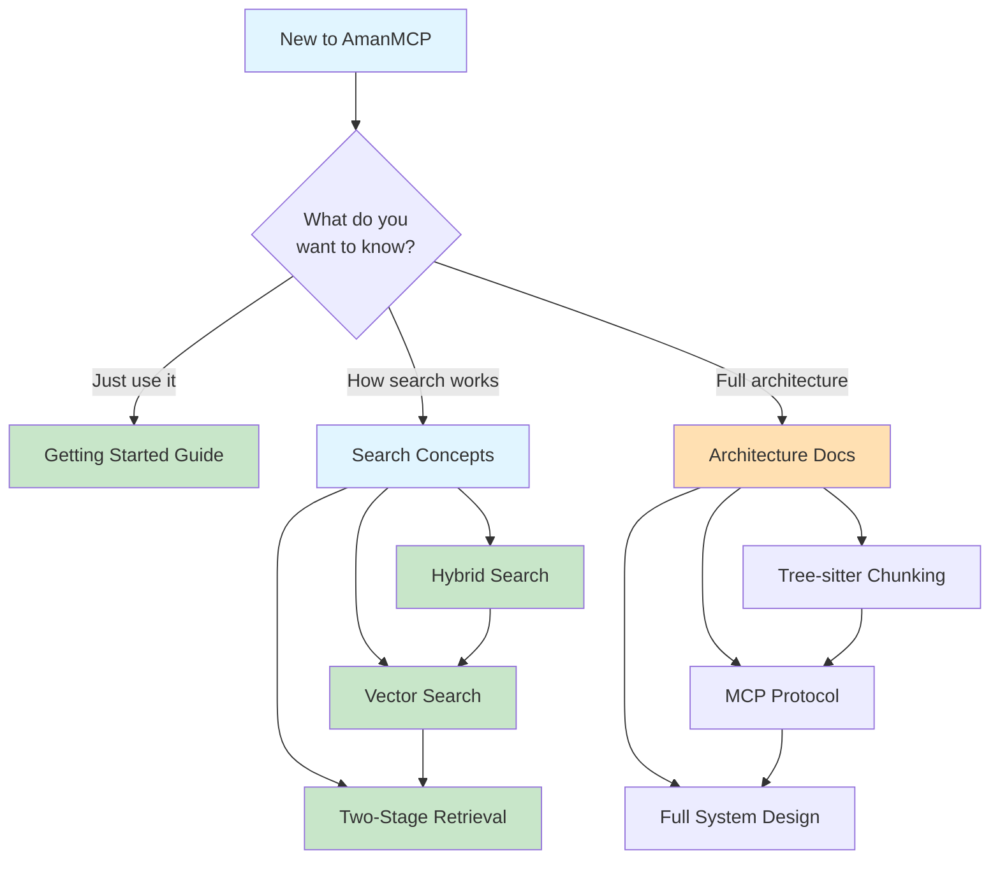
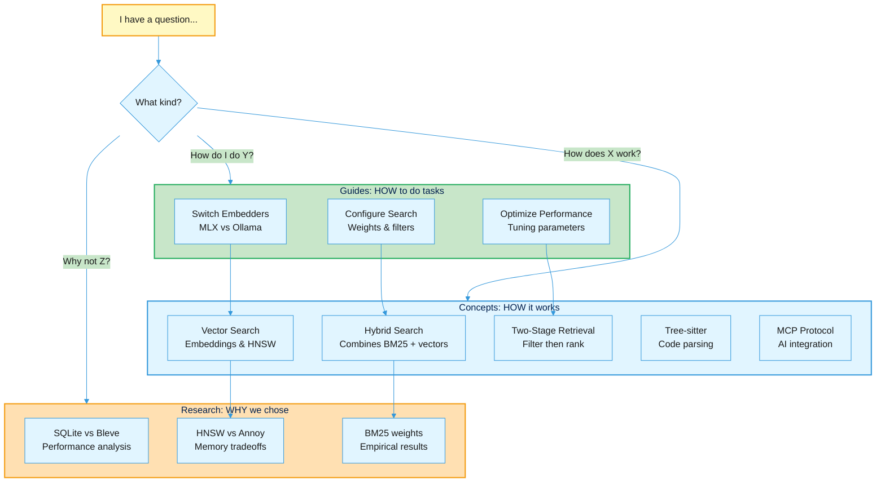

# Concepts: Understanding How AmanMCP Works

This section explains the core concepts and architecture behind AmanMCP. Read these to understand **how** the system works internally.

**Audience**: Users who want to understand the "why" and "how", developers, and anyone curious about the internals.

---

## Core Concepts

| Concept | What You'll Learn | Read This If... |
|---------|-------------------|-----------------|
| [Hybrid Search](hybrid-search.md) | How BM25 keyword search + semantic vector search work together | You want to understand why results are relevant |
| [Vector Search](vector-search-concepts.md) | Embeddings, HNSW index, semantic similarity | You're curious about "AI search" internals |
| [Two-Stage Retrieval](two-stage-retrieval.md) | Why we search twice (fast filter → precise ranking) | You want to optimize search performance |
| [Tree-sitter AST Chunking](tree-sitter-guide.md) | How we extract functions/classes from code | You're curious about code parsing |
| [MCP Protocol](mcp-protocol.md) | How AmanMCP talks to Claude | You want to understand the integration |

---

## Learning Path

### Beginner: "I just want to use it"
Start with [Getting Started](../getting-started/) - you don't need to understand concepts to use AmanMCP.

### Intermediate: "I want to understand how search works"
1. [Hybrid Search](hybrid-search.md) - The foundation
2. [Vector Search](vector-search-concepts.md) - How semantic search works
3. [Two-Stage Retrieval](two-stage-retrieval.md) - Why it's fast and accurate

### Advanced: "I want to understand the architecture"
1. [Tree-sitter AST Chunking](tree-sitter-guide.md) - Code parsing internals
2. [MCP Protocol](mcp-protocol.md) - Integration layer
3. [Architecture Overview](../reference/architecture/architecture.md) - Full system design

---

## Concepts vs Guides vs Research

| Section | Focus | Example |
|---------|-------|---------|
| **Concepts** (here) | How systems work | "How does hybrid search combine BM25 and vectors?" |
| [Guides](../guides/) | How to do tasks | "How do I switch to MLX embeddings?" |
| [Research](../research/) | Why we chose this | "Why SQLite FTS5 instead of Bleve?" |

---

## Visual Learning

Most concept docs include:
- 📊 **Mermaid diagrams** - Flowcharts and sequence diagrams
- 📈 **Performance charts** - Speed and quality comparisons
- 🎯 **Examples** - Real queries and results

---

## Contribute

Found a concept confusing? Want to add diagrams or examples?
1. File an issue with the concept name
2. Suggest improvements (PRs welcome!)
3. Ask questions - confusion indicates documentation gaps

---

## Related Documentation

- [Getting Started](../getting-started/) - Installation and first steps
- [Guides](../guides/) - Task-based how-tos
- [Architecture Reference](../reference/architecture/) - Technical specifications
- [Research](../research/) - Technical decisions and analysis
