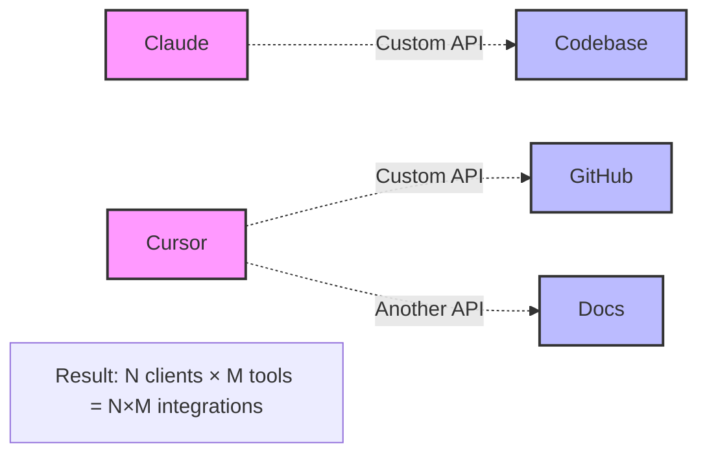
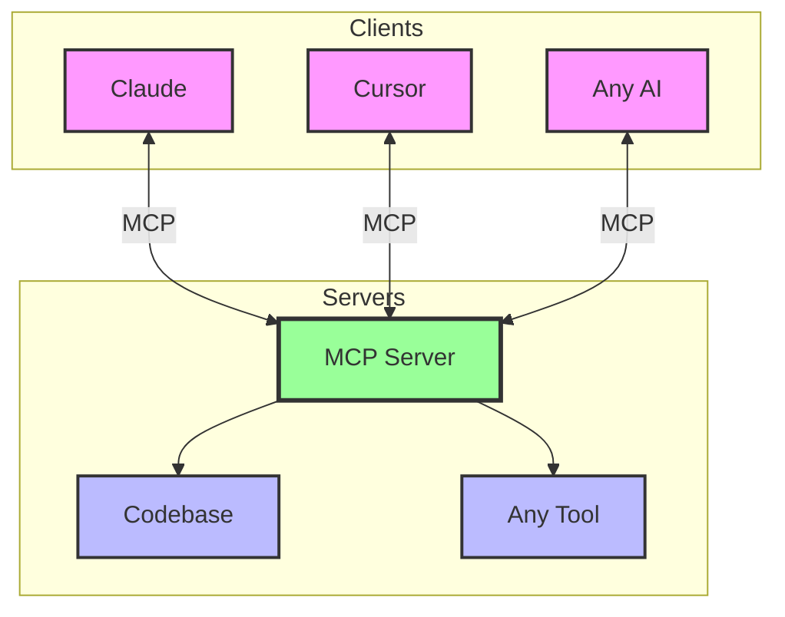
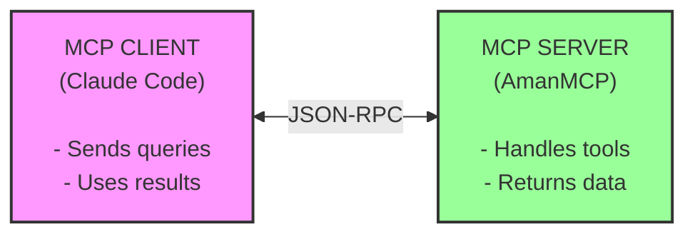
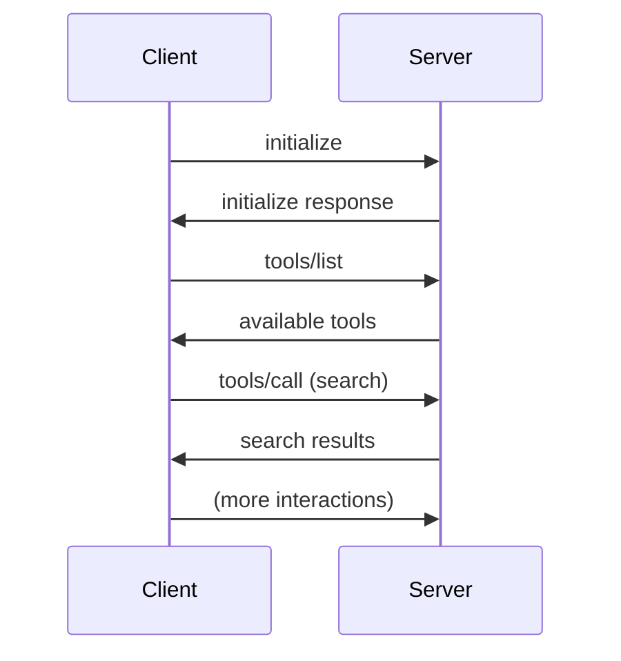
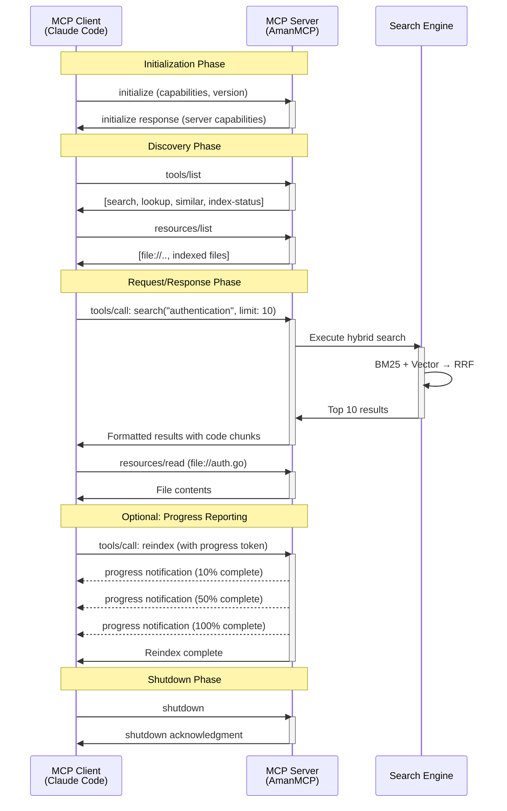
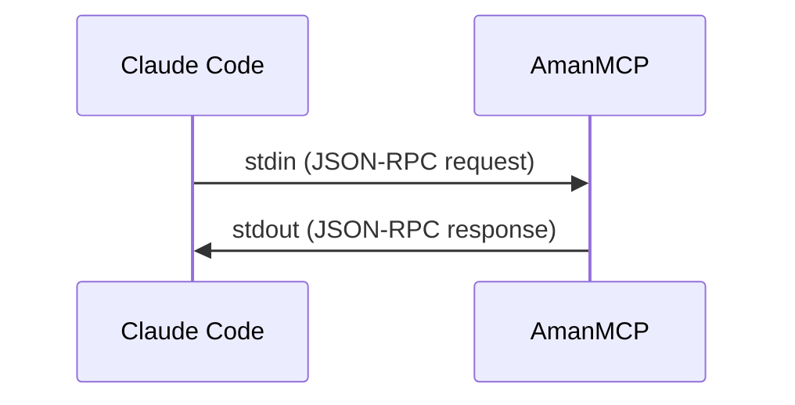
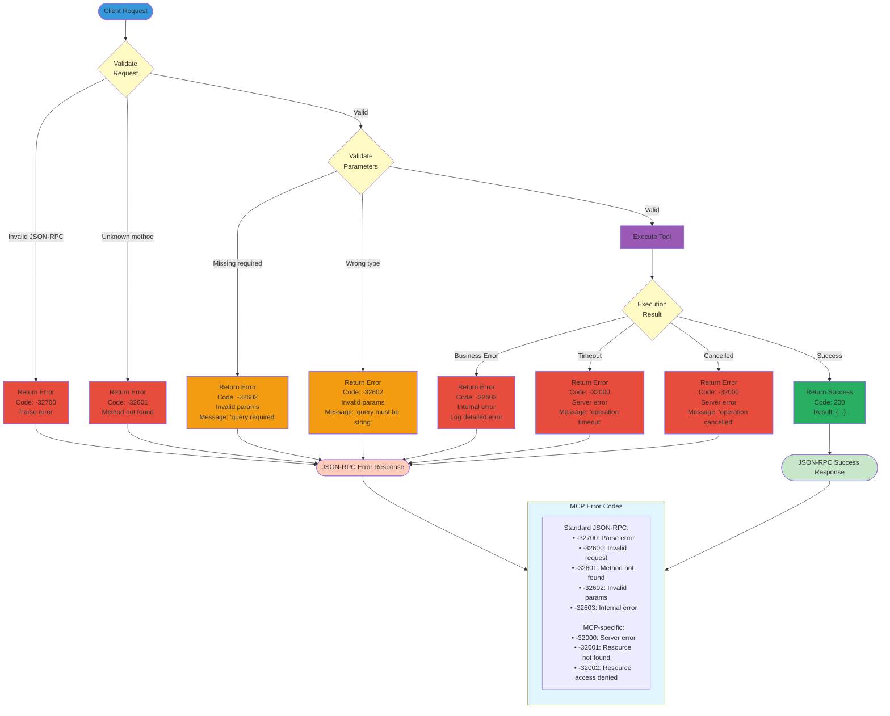
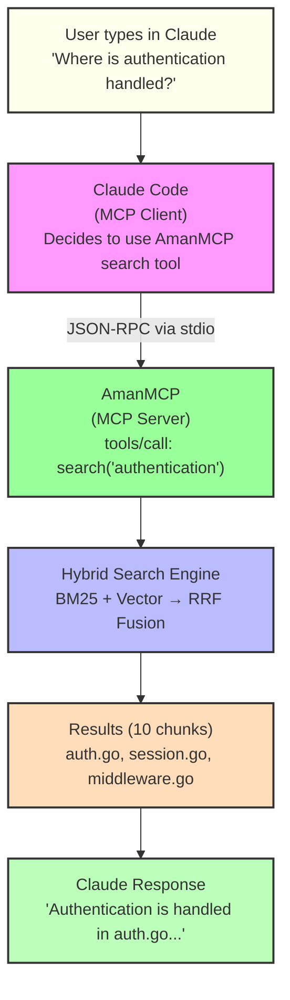
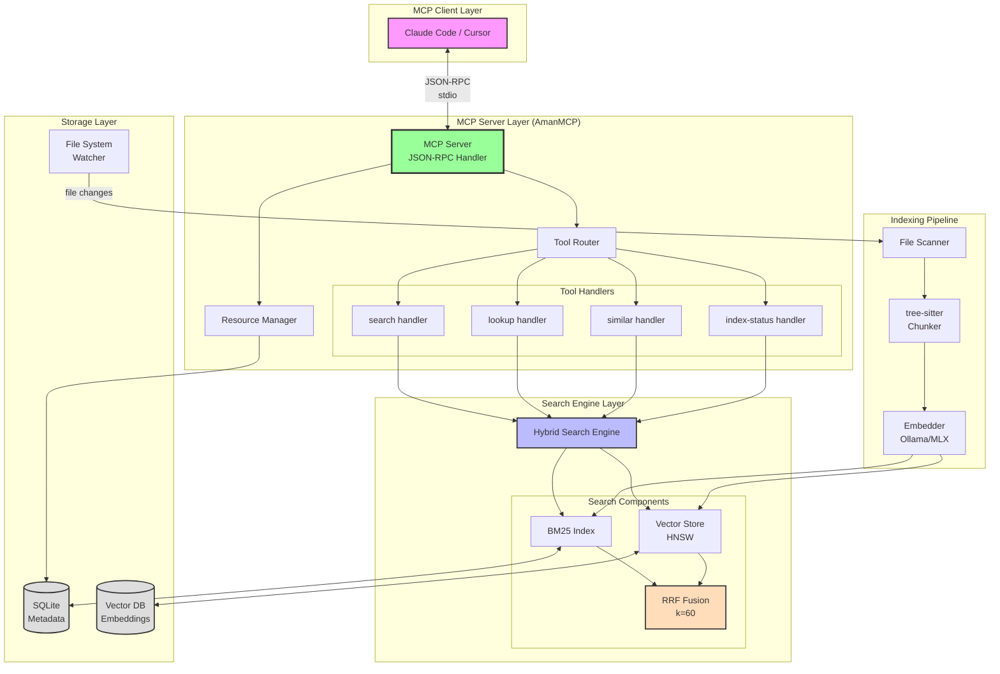

# MCP Protocol Basics

**Version:** 1.0.0
**Last Updated:** 2025-12-28

Learn how Model Context Protocol enables AI-tool integration in AmanMCP.

---

## Overview

MCP (Model Context Protocol) is an open protocol that standardizes how AI applications connect to external tools and data sources. It's like USB for AI - a universal interface.

**Why we use it**: AmanMCP is an MCP server. Claude Code, Cursor, and other AI assistants connect to it as clients to search codebases.

---

## The Problem MCP Solves

### Before MCP

Every AI app needed custom integrations:



**Result:** N clients × M tools = N×M integrations

### After MCP

One protocol, universal compatibility:



**Result:** N + M integrations (linear!)

---

## Core Concepts

### Client-Server Model



**Client**: AI application that uses tools (Claude Code, Cursor)  
**Server**: Tool provider that exposes functionality (AmanMCP)  
**Transport**: Communication layer (stdio, SSE, HTTP)

### The Three Primitives

MCP has three core concepts:

| Primitive | Purpose | Who Provides |
|-----------|---------|--------------|
| **Tools** | Actions the AI can take | Server |
| **Resources** | Data the AI can access | Server |
| **Prompts** | Reusable templates | Server |

### Tools

Functions the AI can call:

```json
{
  "name": "search",
  "description": "Search the codebase for relevant code",
  "inputSchema": {
    "type": "object",
    "properties": {
      "query": {
        "type": "string",
        "description": "Search query"
      },
      "limit": {
        "type": "number",
        "description": "Maximum results"
      }
    },
    "required": ["query"]
  }
}
```

### Resources

Data the AI can read:

```json
{
  "uri": "file:///src/main.go",
  "name": "Main Application",
  "mimeType": "text/x-go",
  "description": "Entry point for the application"
}
```

### Prompts

Pre-defined templates:

```json
{
  "name": "explain-function",
  "description": "Explain what a function does",
  "arguments": [
    {
      "name": "function_name",
      "required": true
    }
  ]
}
```

---

## Protocol Details

### JSON-RPC 2.0

MCP uses JSON-RPC for communication:

**Request**:

```json
{
  "jsonrpc": "2.0",
  "id": 1,
  "method": "tools/call",
  "params": {
    "name": "search",
    "arguments": {
      "query": "authentication",
      "limit": 10
    }
  }
}
```

**Response**:

```json
{
  "jsonrpc": "2.0",
  "id": 1,
  "result": {
    "content": [
      {
        "type": "text",
        "text": "Found 5 results for 'authentication'..."
      }
    ]
  }
}
```

### Message Types

| Method | Direction | Purpose |
|--------|-----------|---------|
| `initialize` | Client→Server | Start session |
| `tools/list` | Client→Server | Get available tools |
| `tools/call` | Client→Server | Execute a tool |
| `resources/list` | Client→Server | Get available resources |
| `resources/read` | Client→Server | Read a resource |
| `prompts/list` | Client→Server | Get available prompts |
| `prompts/get` | Client→Server | Get a prompt template |

### Lifecycle



### Complete MCP Lifecycle

A comprehensive view of the full MCP lifecycle from initialization to shutdown:



---

## AmanMCP as MCP Server

### Tools We Expose

```go
var amanMCPTools = []mcp.Tool{
    {
        Name:        "search",
        Description: "Hybrid search over codebase (BM25 + semantic)",
        InputSchema: searchInputSchema,
    },
    {
        Name:        "lookup",
        Description: "Get specific code by file path and symbol",
        InputSchema: lookupInputSchema,
    },
    {
        Name:        "similar",
        Description: "Find code similar to a reference",
        InputSchema: similarInputSchema,
    },
    {
        Name:        "index-status",
        Description: "Check indexing status and statistics",
        InputSchema: nil,
    },
}
```

### Resources We Expose

```go
func (s *Server) ListResources() []mcp.Resource {
    var resources []mcp.Resource

    // Expose indexed files as resources
    for _, file := range s.index.Files() {
        resources = append(resources, mcp.Resource{
            URI:      "file://" + file.Path,
            Name:     filepath.Base(file.Path),
            MimeType: mimeTypeFor(file.Path),
        })
    }

    return resources
}
```

### Transport: stdio

AmanMCP uses stdio transport (simplest):



Configuration in Claude Code:

```json
{
  "mcpServers": {
    "amanmcp": {
      "command": "amanmcp",
      "args": ["serve"]
    }
  }
}
```

---

## Implementing MCP in Go

### Using the Official SDK

AmanMCP uses the official MCP Go SDK from Anthropic:

```go
import (
    "github.com/modelcontextprotocol/go-sdk/mcp"
    "github.com/modelcontextprotocol/go-sdk/server"
)

func main() {
    s := server.NewMCPServer(
        "AmanMCP",
        "0.1.0",
        server.WithToolCapabilities(true),
        server.WithResourceCapabilities(true, false),
    )

    // Register tools
    s.AddTool(mcp.NewTool("search",
        mcp.WithDescription("Search the codebase"),
        mcp.WithString("query", mcp.Required()),
        mcp.WithNumber("limit"),
    ), handleSearch)

    // Start server (stdio transport)
    server.ServeStdio(s)
}

func handleSearch(ctx context.Context, req mcp.CallToolRequest) (*mcp.CallToolResult, error) {
    query := req.Params.Arguments["query"].(string)
    limit := 10
    if l, ok := req.Params.Arguments["limit"]; ok {
        limit = int(l.(float64))
    }

    results, err := searchEngine.Search(query, limit)
    if err != nil {
        return nil, err
    }

    return mcp.NewToolResultText(formatResults(results)), nil
}
```

### Tool Handler Pattern

```go
type ToolHandler func(ctx context.Context, args map[string]any) (*mcp.CallToolResult, error)

func (s *Server) registerTools() {
    tools := map[string]ToolHandler{
        "search":       s.handleSearch,
        "lookup":       s.handleLookup,
        "similar":      s.handleSimilar,
        "index-status": s.handleStatus,
    }

    for name, handler := range tools {
        s.mcp.AddTool(s.toolDef(name), handler)
    }
}
```

### Error Handling

```go
func handleSearch(ctx context.Context, req mcp.CallToolRequest) (*mcp.CallToolResult, error) {
    query, ok := req.Params.Arguments["query"].(string)
    if !ok || query == "" {
        return nil, &mcp.Error{
            Code:    mcp.InvalidParams,
            Message: "query parameter is required",
        }
    }

    results, err := engine.Search(query)
    if err != nil {
        // Internal error - logged, generic message to client
        log.Printf("search error: %v", err)
        return nil, &mcp.Error{
            Code:    mcp.InternalError,
            Message: "search failed",
        }
    }

    return mcp.NewToolResultText(format(results)), nil
}
```

### MCP Error Handling Flow

How errors are handled and propagated in the MCP protocol:



**Error Response Format:**

```json
{
  "jsonrpc": "2.0",
  "id": 1,
  "error": {
    "code": -32602,
    "message": "Invalid params",
    "data": {
      "parameter": "query",
      "issue": "required parameter missing"
    }
  }
}
```

**Best Practices:**
1. **Validate early**: Check parameters before expensive operations
2. **Use appropriate codes**: Standard codes for protocol errors, custom for business logic
3. **Log internally**: Detailed errors in logs, generic messages to clients
4. **Include context**: Use `data` field for debugging information

---

## AmanMCP Integration Flow

### Full Request Flow



### Integration Architecture

How MCP integrates with AmanMCP's search engine components:



This diagram shows:

- **MCP Client Layer**: AI assistants (Claude Code, Cursor) connect via JSON-RPC over stdio
- **MCP Server Layer**: Handles protocol, routes to tool handlers
- **Tool Handlers**: Implement search, lookup, similar, and status operations
- **Search Engine Layer**: Hybrid search with BM25 + Vector → RRF fusion
- **Storage Layer**: SQLite for metadata, Vector DB for embeddings
- **Indexing Pipeline**: File scanning → chunking → embedding → storage

### Tool Responses

What Claude sees from our tools:

```json
{
  "content": [
    {
      "type": "text",
      "text": "## Search Results for \"authentication\"\n\n### 1. internal/auth/handler.go (0.95)\n```go\nfunc AuthMiddleware(next http.Handler) http.Handler {\n    return http.HandlerFunc(func(w http.ResponseWriter, r *http.Request) {\n        token := r.Header.Get(\"Authorization\")\n        // ...\n    })\n}\n```\n\n### 2. internal/auth/jwt.go (0.87)\n..."
    }
  ]
}
```

---

## MCP Specification

### Current Version

AmanMCP implements MCP spec version **2025-11-25**.

Key features:

- JSON-RPC 2.0 transport
- Tool calling with schema validation
- Resource access with URI scheme
- Prompt templates
- Progress notifications
- Cancellation support

### Capabilities

Servers declare what they support:

```go
server.NewMCPServer(
    "AmanMCP",
    "0.1.0",
    server.WithToolCapabilities(true),
    server.WithResourceCapabilities(
        true,  // subscribe supported
        true,  // listChanged supported
    ),
    server.WithPromptCapabilities(true),
)
```

---

## Configuration

### Claude Code Config

Create `.mcp.json` in your project root:

```json
{
  "mcpServers": {
    "amanmcp": {
      "command": "amanmcp",
      "args": ["serve"],
      "cwd": "/path/to/your/project",
      "env": {
        "AMANMCP_LOG_LEVEL": "info"
      }
    }
  }
}
```

> **Important:** The `cwd` parameter is required because Claude Code doesn't automatically set the working directory when spawning MCP servers.

### Cursor Config

Create `.cursor/mcp.json` in your project root:

```json
{
  "mcpServers": {
    "amanmcp": {
      "command": "amanmcp",
      "args": ["serve"],
      "cwd": "/path/to/your/project"
    }
  }
}
```

---

## Common Patterns

### Progress Reporting

For long operations:

```go
func (s *Server) handleReindex(ctx context.Context, req mcp.CallToolRequest) (*mcp.CallToolResult, error) {
    total := len(files)

    for i, file := range files {
        // Send progress notification
        s.mcp.SendProgress(mcp.Progress{
            Token:   req.ProgressToken,
            Current: float64(i),
            Total:   float64(total),
            Message: fmt.Sprintf("Indexing %s", file.Name),
        })

        if err := s.index(file); err != nil {
            return nil, err
        }
    }

    return mcp.NewToolResultText("Indexed " + strconv.Itoa(total) + " files"), nil
}
```

### Pagination

For large result sets:

```go
type SearchArgs struct {
    Query  string `json:"query"`
    Limit  int    `json:"limit"`
    Offset int    `json:"offset"`
}

func handleSearch(args SearchArgs) *mcp.CallToolResult {
    results := engine.Search(args.Query, args.Limit+1, args.Offset)

    hasMore := len(results) > args.Limit
    if hasMore {
        results = results[:args.Limit]
    }

    return formatWithPagination(results, args.Offset, hasMore)
}
```

---

## Testing MCP Servers

### Manual Testing with mcp-cli

```bash
# Install MCP inspector
npm install -g @modelcontextprotocol/inspector

# Test your server
mcp-inspector amanmcp serve
```

### Unit Testing Tools

```go
func TestSearchTool(t *testing.T) {
    server := NewTestServer(t)

    result, err := server.CallTool(context.Background(), mcp.CallToolRequest{
        Params: mcp.CallToolParams{
            Name: "search",
            Arguments: map[string]any{
                "query": "authentication",
                "limit": 5,
            },
        },
    })

    require.NoError(t, err)
    assert.NotEmpty(t, result.Content)

    // Verify result format
    text := result.Content[0].(mcp.TextContent).Text
    assert.Contains(t, text, "Search Results")
}
```

---

## Common Mistakes

### 1. Not Validating Input

```go
// BAD: Trusts all input
query := args["query"].(string)  // Might panic

// GOOD: Validate
query, ok := args["query"].(string)
if !ok || query == "" {
    return nil, &mcp.Error{Code: mcp.InvalidParams, Message: "query required"}
}
```

### 2. Blocking stdio

```go
// BAD: Blocks the event loop
time.Sleep(10 * time.Second)  // Blocks all MCP traffic

// GOOD: Use goroutines for long work
go func() {
    doLongWork()
    s.SendNotification(mcp.Notification{...})
}()
```

### 3. Not Handling Cancellation

```go
// BAD: Ignores context
for _, file := range files {
    index(file)  // Continues even if cancelled
}

// GOOD: Check context
for _, file := range files {
    select {
    case <-ctx.Done():
        return nil, ctx.Err()
    default:
        index(file)
    }
}
```

---

## Further Reading

- [MCP Specification](https://modelcontextprotocol.io/specification/2025-11-25)
- [Official MCP Go SDK](https://github.com/modelcontextprotocol/go-sdk)
- [MCP Servers Directory](https://github.com/modelcontextprotocol/servers)
- [Claude Code MCP Docs](https://docs.anthropic.com/claude/docs/claude-code)

---

*MCP connects AI to tools. Build the bridge, let AI cross it.*
