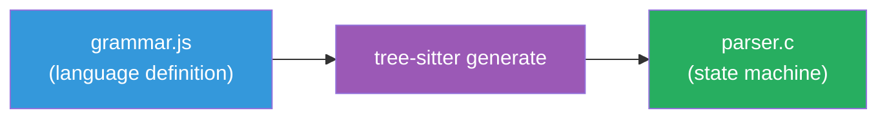

# Tree-sitter Basics

**Version:** 1.0.0
**Last Updated:** 2025-12-28

Learn how tree-sitter enables intelligent code parsing in AmanMCP.

---

## Overview

Tree-sitter is a parser generator tool and incremental parsing library. It builds concrete syntax trees for source files and efficiently updates them as the file is edited.

**Why we use it**: To understand code structure, extract meaningful chunks, and identify semantic boundaries (functions, classes, methods) rather than just splitting on line counts.

---

## Core Concepts

### Abstract Syntax Tree (AST)

Code is structured data. Tree-sitter converts text into a tree:


### Why Not Regex?

Regex fails for nested structures:

```go
// How do you match the closing brace of this function?
func outer() {
    if true {
        go func() {
            // nested
        }()
    }
}  // <- This one, not earlier ones
```

Tree-sitter handles nesting correctly because it understands grammar.

### Incremental Parsing

When code changes, tree-sitter doesn't re-parse everything:


For AmanMCP, this means fast re-indexing on file changes.

---

## How Tree-sitter Works

### 1. Grammar Definition

Each language has a grammar (JavaScript DSL):

```javascript
// Simplified Go grammar excerpt
module.exports = grammar({
  name: 'go',

  rules: {
    source_file: $ => repeat($._definition),

    _definition: $ => choice(
      $.function_declaration,
      $.type_declaration,
      $.var_declaration,
    ),

    function_declaration: $ => seq(
      'func',
      field('name', $.identifier),
      field('parameters', $.parameter_list),
      optional(field('result', $._type)),
      field('body', $.block)
    ),
    // ...
  }
});
```

### 2. Parser Generation

Grammar compiles to a state machine (C code):



### 3. Runtime Parsing

Parser consumes source code byte-by-byte:

```
Input: "func main() {}"
       ^
       State: 0 → see 'f' → shift

       "func main() {}"
            ^
       State: 5 → see 'm' → identifier → shift

       ... continues until tree is complete
```

---

## Language Support

### Built-in Languages

Tree-sitter has parsers for 100+ languages. Key ones for AmanMCP:

| Language | Package | Quality |
|----------|---------|---------|
| Go | tree-sitter-go | Excellent |
| TypeScript/JavaScript | tree-sitter-typescript | Excellent |
| Python | tree-sitter-python | Excellent |
| Rust | tree-sitter-rust | Excellent |
| Java | tree-sitter-java | Good |
| C/C++ | tree-sitter-cpp | Good |
| Ruby | tree-sitter-ruby | Good |
| Markdown | tree-sitter-markdown | Good |

### Language Detection

AmanMCP detects language by:

1. File extension (`.go`, `.py`, `.ts`)
2. Shebang (`#!/usr/bin/env python`)
3. Content heuristics (fallback)

---

## In AmanMCP

### Go Bindings

We use the official Go bindings:

```go
import (
    sitter "github.com/tree-sitter/go-tree-sitter"
    golang "github.com/tree-sitter/tree-sitter-go/bindings/go"
)

func parseGoFile(content []byte) (*sitter.Tree, error) {
    parser := sitter.NewParser()
    defer parser.Close()  // IMPORTANT: Must close

    parser.SetLanguage(sitter.NewLanguage(golang.Language()))

    tree := parser.Parse(content, nil)
    // Note: tree.Close() when done

    return tree, nil
}
```

### Node Types for Chunking

We extract these node types as chunks:

```go
var goChunkNodes = []string{
    "function_declaration",     // func foo() {}
    "method_declaration",       // func (r Recv) Method() {}
    "type_declaration",         // type Foo struct {}
    "const_declaration",        // const X = 1
    "var_declaration",          // var x int
}
```

### Walking the Tree

```go
func extractChunks(tree *sitter.Tree, source []byte) []Chunk {
    var chunks []Chunk

    cursor := sitter.NewTreeCursor(tree.RootNode())
    defer cursor.Close()

    var walk func()
    walk = func() {
        node := cursor.Node()

        if isChunkNode(node.Kind()) {
            chunks = append(chunks, Chunk{
                Type:    node.Kind(),
                Content: string(source[node.StartByte():node.EndByte()]),
                Start:   node.StartPoint(),
                End:     node.EndPoint(),
            })
        }

        if cursor.GoToFirstChild() {
            for {
                walk()
                if !cursor.GoToNextSibling() {
                    break
                }
            }
            cursor.GoToParent()
        }
    }

    walk()
    return chunks
}
```

### Chunk Context

For each chunk, we extract context:

```go
type ChunkContext struct {
    // The chunk itself
    Content string

    // Where it lives
    FilePath   string
    Package    string  // Go package name
    ParentType string  // For methods: the receiver type

    // Navigation
    StartLine int
    EndLine   int

    // For search ranking
    Signature string  // func name(params) returns
    DocString string  // Comment above
}
```

---

## Common Operations

### Get Function Name

```go
func getFunctionName(node *sitter.Node, source []byte) string {
    nameNode := node.ChildByFieldName("name")
    if nameNode != nil {
        return string(source[nameNode.StartByte():nameNode.EndByte()])
    }
    return ""
}
```

### Get Method Receiver

```go
func getReceiver(node *sitter.Node, source []byte) string {
    receiver := node.ChildByFieldName("receiver")
    if receiver == nil {
        return ""
    }

    // Walk to find type identifier
    for i := 0; i < int(receiver.ChildCount()); i++ {
        child := receiver.Child(uint(i))
        if child.Kind() == "type_identifier" {
            return string(source[child.StartByte():child.EndByte()])
        }
    }
    return ""
}
```

### Extract Doc Comment

```go
func getDocComment(node *sitter.Node, source []byte) string {
    // Look at previous sibling
    prev := node.PrevSibling()
    if prev != nil && prev.Kind() == "comment" {
        return string(source[prev.StartByte():prev.EndByte()])
    }
    return ""
}
```

---

## Memory Management

### CRITICAL: Close Resources

```mermaid
flowchart TB
    subgraph Good["Good: Resources Closed"]
        G1["parser := NewParser()"]
        G2["defer parser.Close()"]
        G3["tree := parser.Parse()"]
        G4["defer tree.Close()"]
        G5["Process tree..."]
        G6["Resources freed"]

        G1 --> G2 --> G3 --> G4 --> G5 --> G6
    end

    subgraph Bad["Bad: Memory Leak"]
        B1["parser := NewParser()"]
        B2["tree := parser.Parse()"]
        B3["Process tree..."]
        B4["Memory leaked!"]

        B1 --> B2 --> B3 --> B4
    end

    style Good fill:#27ae60,color:#fff
    style Bad fill:#e74c3c,color:#fff
    style G6 fill:#27ae60,color:#fff
    style B4 fill:#e74c3c,color:#fff
```



Tree-sitter uses CGO. You MUST close resources:

```go
// ALWAYS use defer
parser := sitter.NewParser()
defer parser.Close()

tree := parser.Parse(content, nil)
defer tree.Close()

cursor := sitter.NewTreeCursor(tree.RootNode())
defer cursor.Close()
```

### Reuse Parsers

For batch processing, reuse the parser:

```go
func (c *Chunker) ProcessFiles(files []File) []Chunk {
    parser := sitter.NewParser()
    defer parser.Close()

    var allChunks []Chunk
    for _, file := range files {
        parser.SetLanguage(c.languageFor(file.Ext))
        tree := parser.Parse(file.Content, nil)

        chunks := c.extractChunks(tree, file.Content)
        allChunks = append(allChunks, chunks...)

        tree.Close()  // Close each tree after use
    }
    return allChunks
}
```

---

## Error Handling

### Parse Errors

Tree-sitter is error-tolerant. Invalid syntax still produces a tree:

```go
// Input with error
source := `func broken( {`

tree := parser.Parse([]byte(source), nil)
root := tree.RootNode()

// Tree still exists, has ERROR nodes
if root.HasError() {
    // Handle gracefully
}
```

### Finding Error Nodes

```go
func hasErrors(node *sitter.Node) bool {
    if node.IsError() || node.IsMissing() {
        return true
    }
    for i := 0; i < int(node.ChildCount()); i++ {
        if hasErrors(node.Child(uint(i))) {
            return true
        }
    }
    return false
}
```

---

## Performance

### Benchmarks

| Operation | Time | Notes |
|-----------|------|-------|
| Parse 1KB file | ~0.2ms | Very fast |
| Parse 100KB file | ~5ms | Still fast |
| Incremental reparse | ~0.1ms | For small edits |
| Tree traversal | ~1ms/1000 nodes | Depends on depth |

### Optimization Tips

1. **Reuse parsers** - Creating parser has overhead
2. **Parse incrementally** - Use old tree for re-parses
3. **Early exit** - Stop walking when you found what you need
4. **Batch by language** - Switch languages less often

---

## Debugging

### Print Tree Structure

```go
func printTree(node *sitter.Node, source []byte, indent int) {
    prefix := strings.Repeat("  ", indent)
    content := ""
    if node.ChildCount() == 0 {
        content = fmt.Sprintf(" = %q", source[node.StartByte():node.EndByte()])
    }
    fmt.Printf("%s%s%s\n", prefix, node.Kind(), content)

    for i := 0; i < int(node.ChildCount()); i++ {
        printTree(node.Child(uint(i)), source, indent+1)
    }
}
```

### CLI Tool

Use `tree-sitter` CLI for exploration:

```bash
# Install
npm install -g tree-sitter-cli

# Parse a file
tree-sitter parse example.go

# Highlight (shows node types)
tree-sitter highlight example.go
```

---

## Common Mistakes

### 1. Forgetting to Close

```go
// BAD: Memory leak
tree := parser.Parse(content, nil)
// forgot tree.Close()

// GOOD: Always defer
tree := parser.Parse(content, nil)
defer tree.Close()
```

### 2. Wrong Language

```go
// BAD: Using Go parser for Python
parser.SetLanguage(goLanguage)
tree := parser.Parse(pythonCode, nil)  // Garbage tree

// GOOD: Match language to content
parser.SetLanguage(languageForExtension(filepath.Ext(path)))
```

### 3. Index Out of Bounds

```go
// BAD: Assuming child exists
name := node.Child(0).Child(1)  // Might panic

// GOOD: Check bounds
if node.ChildCount() > 0 {
    child := node.Child(0)
    if child.ChildCount() > 1 {
        name := child.Child(1)
    }
}
```

---

## Further Reading

- [Tree-sitter Documentation](https://tree-sitter.github.io/tree-sitter/)
- [Go Bindings](https://github.com/tree-sitter/go-tree-sitter)
- [Creating Parsers](https://tree-sitter.github.io/tree-sitter/creating-parsers)
- [Playground](https://tree-sitter.github.io/tree-sitter/playground) - Try queries interactively

---

*Tree-sitter turns code into data. Use it to understand, not just split.*
