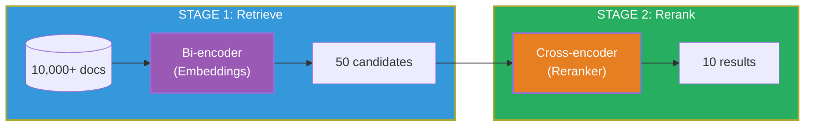
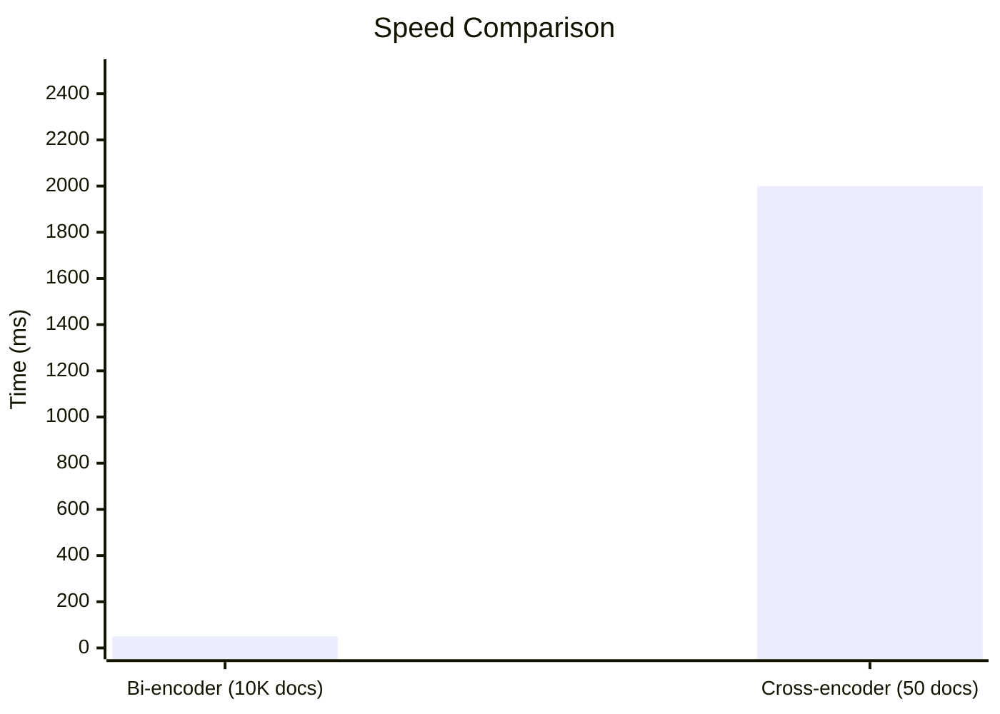
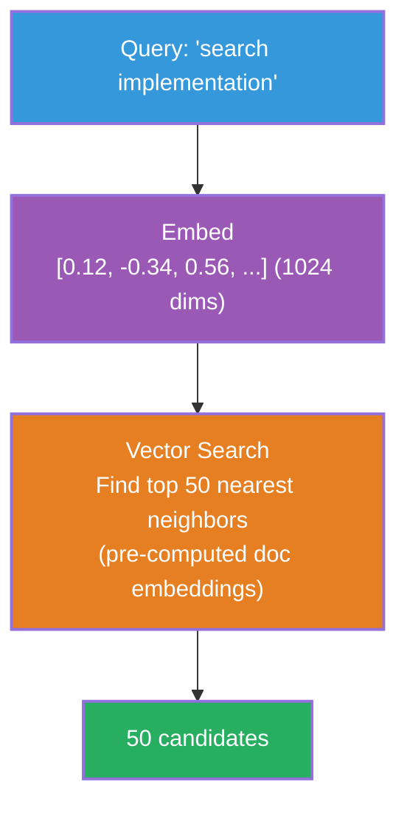
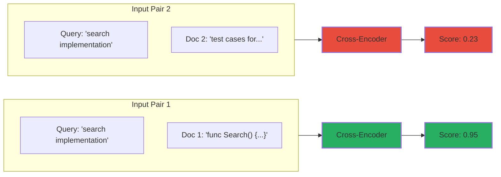
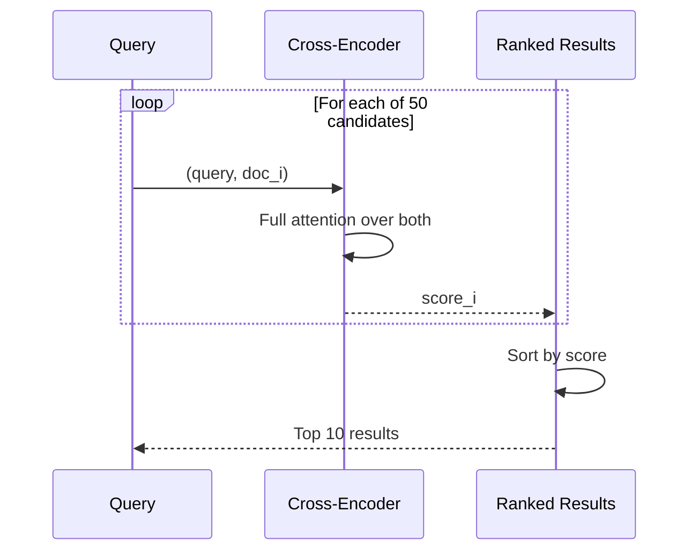
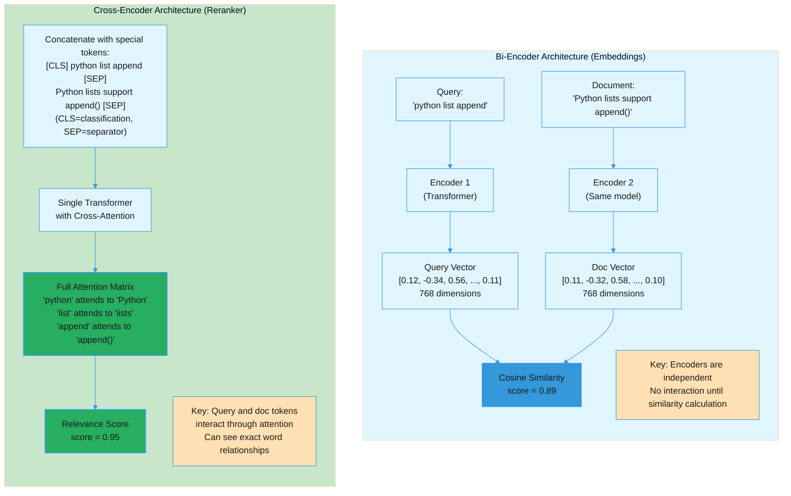

# Two-Stage Retrieval: Embeddings vs Cross-Encoders

> Why we need both bi-encoders (embeddings) and cross-encoders (rerankers) in modern search systems.

---

## The Core Insight

**You can't use cross-encoders for retrieval at scale.**

| Approach | 10,000 documents | 100,000 documents |
|----------|------------------|-------------------|
| Cross-encoder only | 10,000 × 40ms = **6.7 minutes** | 100,000 × 40ms = **67 minutes** |
| Bi-encoder (embeddings) | ~50ms | ~100ms |

Cross-encoders are **O(n)** - they must process every query-document pair. Embeddings are **O(1)** per query because document embeddings are pre-computed.

---

## Two-Stage Pipeline





---

## Bi-Encoder (Embeddings)

**How it works:**
- Encode query and documents **separately** into dense vectors
- Pre-compute all document embeddings at index time
- At query time: embed query, find nearest neighbors via cosine similarity

**Characteristics:**
- Fast: O(1) per query (vector search is logarithmic with HNSW)
- Scalable: Can search millions of documents
- Quality: Good, but not perfect

**Our implementation:**
- Model: Qwen3-Embedding-0.6B (1024 dimensions)
- Store: HNSW index (`internal/store/hnsw.go`)
- Embedder: `internal/embed/ollama.go` or MLX



---

## Cross-Encoder (Reranker)

**How it works:**
- Take query AND document **together** as input
- Model sees full context of both
- Output: relevance score

**Characteristics:**
- Slow: O(n) - must process each query-document pair
- Not scalable: Can only handle tens of documents
- Quality: Best possible (sees full context)

**Our implementation:**
- Model: Qwen3-Reranker-0.6B
- Client: `internal/search/mlx_reranker.go`
- Latency: ~40ms per document





---

## Why Cross-Encoder is Higher Quality

| Aspect | Bi-Encoder | Cross-Encoder |
|--------|------------|---------------|
| Input | Query OR Document (separate) | Query AND Document (together) |
| Attention | Self-attention only | Cross-attention between Q and D |
| Context | Limited to single input | Full context of both |
| Word matching | Approximate (embedding space) | Exact (token-level) |

**Example:**

Query: "python list append"

| Document | Bi-Encoder | Cross-Encoder |
|----------|------------|---------------|
| "Python lists support append()" | High (semantic match) | Very High |
| "Java ArrayList add method" | Medium (similar concept) | Low (wrong language) |

The cross-encoder can see that "python" in the query doesn't match "Java" in the document. The bi-encoder might miss this because both are about "adding to lists."

### Model Architecture Comparison

Understanding the fundamental architectural difference:



**Why Cross-Encoder is Higher Quality:**

**Bi-Encoder Processing:**
- `'python'` → vector A
- `'Python'` → vector B
- Similarity calculated via embedding space (approximate matching)
- Encoders process query and document independently
- No direct interaction between tokens

**Cross-Encoder Processing:**
- Input format: `[CLS] query [SEP] document [SEP]`
  - `[CLS]` = Classification token (used for final score)
  - `[SEP]` = Separator token (marks boundaries)
- Attention: `'python'` directly attends to `'Python'`
- Can recognize they're the same word (case-insensitive)
- Direct token-level comparison (exact matching)
- Full cross-attention between all query and document tokens
- Sees complete context of both inputs together

**The Trade-off:**

| Aspect | Bi-Encoder | Cross-Encoder |
|--------|------------|---------------|
| Speed | Fast (pre-compute doc vectors) | Slow (process query+doc together) |
| Scalability | Millions of docs | Tens of docs |
| Quality | Good (approximate) | Best (exact) |
| Use case | Retrieval (Stage 1) | Reranking (Stage 2) |

**Solution:** Use both in a two-stage pipeline - bi-encoder for fast retrieval, cross-encoder for quality refinement.

---

## AmanMCP Pipeline

```go
// internal/search/engine.go

func (e *Engine) Search(ctx context.Context, query string, opts SearchOptions) ([]SearchResult, error) {
    // STAGE 1: Parallel retrieval
    bm25Results, vectorResults := parallel(
        e.bm25.Search(query),      // Keyword matching
        e.vector.Search(query),    // Semantic (embeddings)
    )

    // Combine with RRF
    candidates := e.fuseResults(bm25Results, vectorResults)  // Top 50

    // STAGE 2: Rerank (if available)
    if e.reranker != nil {
        candidates = e.rerankResults(ctx, query, candidates)  // Refine top 50
    }

    return candidates[:opts.Limit], nil  // Return top 10
}
```

---

## Quality vs Speed Tradeoff

| Component | Speed | Quality | Role |
|-----------|-------|---------|------|
| **BM25** | Very fast | Good for exact matches | Retrieval |
| **Embeddings** | Fast | Good for semantic | Retrieval |
| **Cross-encoder** | Slow | Best | Reranking |

---

## Analogy: Hiring Process

| Stage | Analogy | Tool | Volume |
|-------|---------|------|--------|
| Resume screening | Quick filter | Embeddings + BM25 | 1000 → 50 |
| Phone screen | Medium filter | (optional) | 50 → 20 |
| On-site interview | Deep evaluation | Cross-encoder | 20 → 5 |

You can't interview 1000 people (too slow), but you also can't hire based on resume alone (too shallow). You need both stages.

---

## Common Questions

1. **Why not just use cross-encoder for everything?**
   - O(n) complexity makes it impossible at scale
   - 100K docs × 40ms = 67 minutes per query

2. **Why not just use embeddings?**
   - Good but not perfect quality
   - Misses nuances that cross-attention captures
   - Cross-encoder as refinement layer improves top results

3. **What's the optimal pool size for reranking?**
   - Trade-off: More candidates = better recall, slower
   - Typical: 20-100 candidates
   - AmanMCP default: 50

4. **Can you train a better bi-encoder to avoid reranking?**
   - Yes, but cross-encoder quality is architecturally superior
   - Bi-encoders are fundamentally limited by separate encoding
   - Best practice: Use both

---

## References

- [SBERT: Sentence-BERT](https://www.sbert.net/) - Bi-encoder training
- [Cross-Encoders](https://www.sbert.net/examples/applications/cross-encoder/README.html) - Reranking
- [ColBERT](https://github.com/stanford-futuredata/ColBERT) - Late interaction (hybrid approach)
- AmanMCP Implementation: `internal/search/engine.go`, `internal/search/mlx_reranker.go`

---

*Created: 2026-01-12 | Session: 2026-01-12-006*
