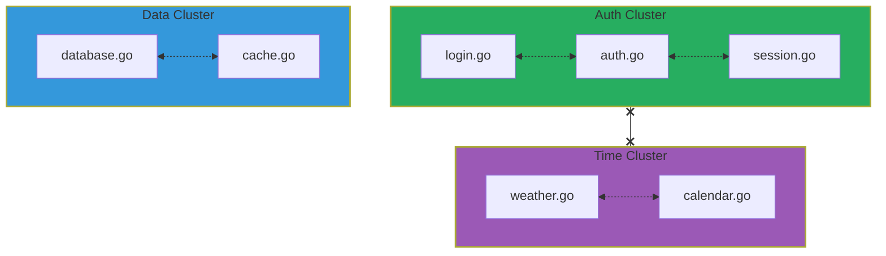
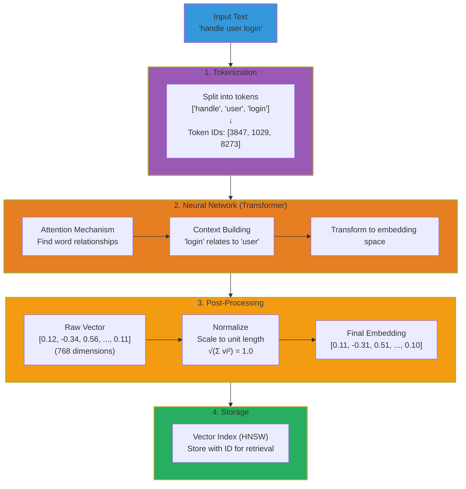
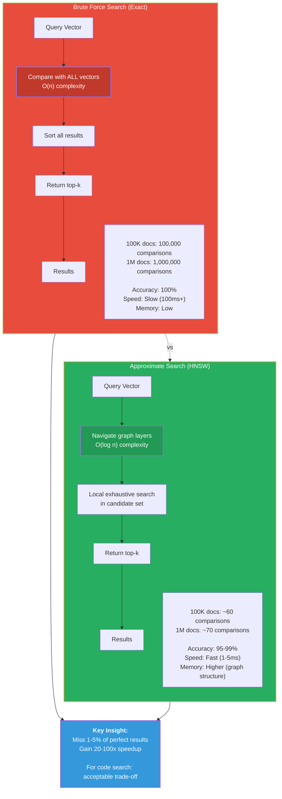
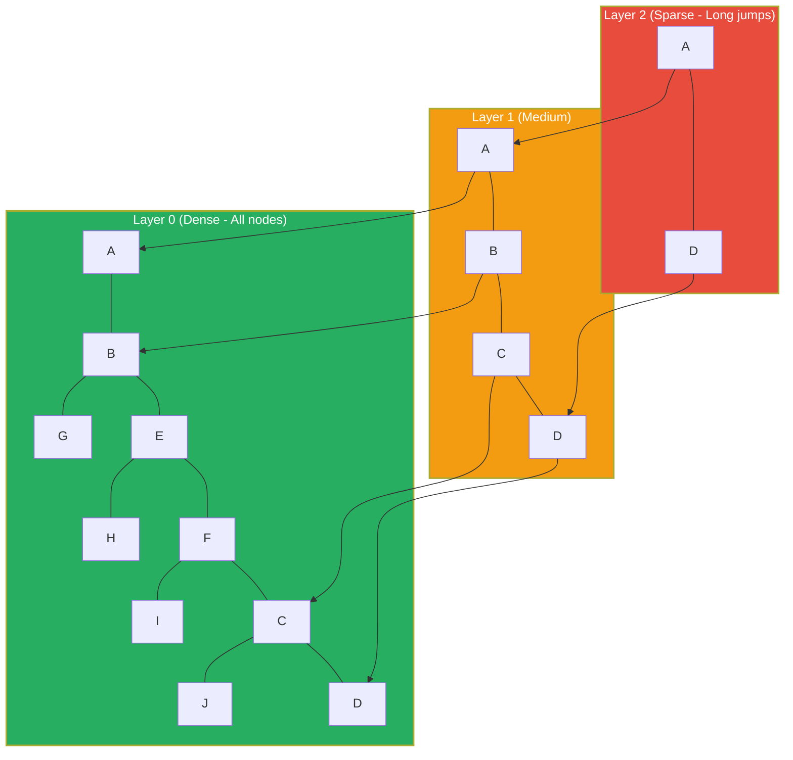
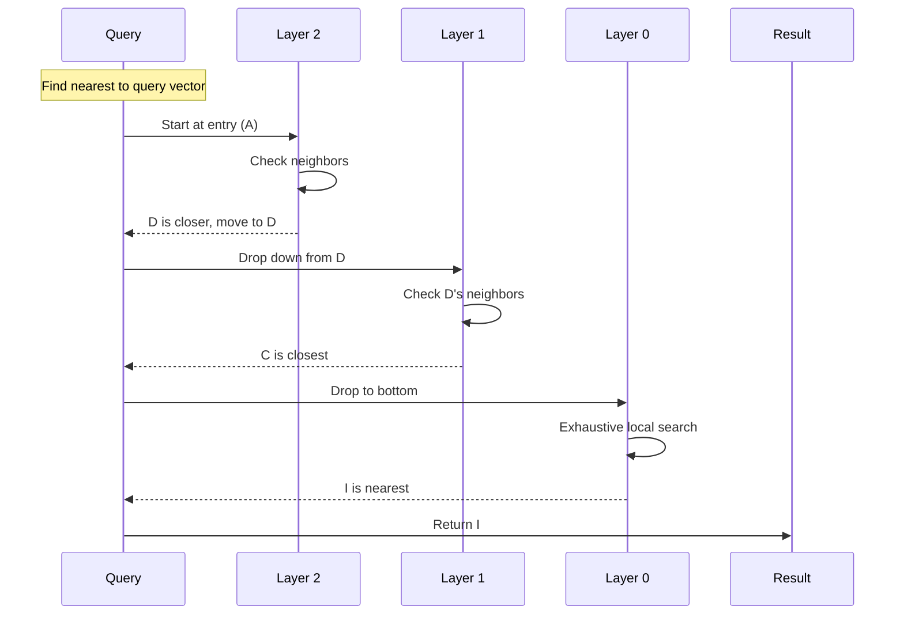
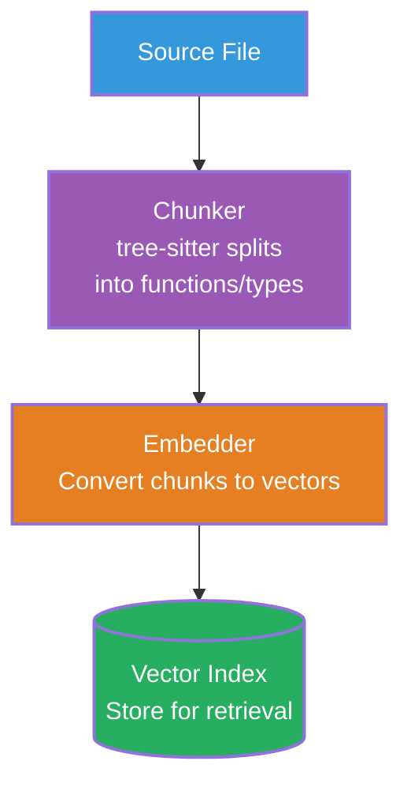
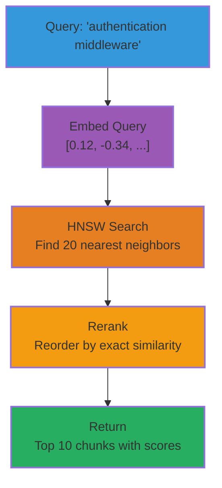

# Vector Search Concepts

Learn how vector search enables semantic understanding in AmanMCP.

---

## Overview

Vector search finds documents by meaning, not just keywords. It converts text into high-dimensional vectors (embeddings) and finds similar vectors using mathematical distance.

**Why we use it**: A user searching for "authentication" should find code about "login", "auth", "credentials" even if those exact words aren't in the query.

---

## Core Concepts

### What is an Embedding?

An embedding is a list of numbers (vector) that captures the meaning of text:

```
"authentication" → [0.12, -0.34, 0.56, 0.02, ..., 0.11]  (768 numbers)
"login system"   → [0.11, -0.32, 0.58, 0.03, ..., 0.10]  (similar!)
"weather report" → [0.89, 0.12, -0.45, 0.78, ..., -0.22] (different)
```

Similar meanings → Similar vectors → Close in vector space

### Dimensionality

Modern embeddings use 384-1536 dimensions:

| Model | Dimensions | Quality | Speed |
|-------|------------|---------|-------|
| EmbeddingGemma-300M | 768 | Very Good (code) | Fast |
| all-MiniLM-L6-v2 | 384 | Good | Very Fast |
| Static (hash-based) | 256 | Basic | Instant |

More dimensions = more nuance, but more memory and slower search.

### Vector Space

Imagine a 3D space where each point is a document:



Similar documents cluster together.

---

## How Embeddings Work

### Embedding Pipeline

The complete flow from text to stored vector:



### Neural Network Magic

Text → Tokenize → Neural Network → Vector

```
Input: "handle user login"

Tokenization:
["handle", "user", "login"] → [3847, 1029, 8273]

Neural Network (Transformer):
- Attention mechanisms find relationships
- "login" relates to "user"
- Context builds meaning

Output: [0.12, -0.34, 0.56, ...]
```

### The Training Process

Embedding models learn from vast text:

```
Training data:
- "The cat sat on the mat"
- "A dog rested on the rug"
- ... billions of examples

Model learns:
- "cat" and "dog" are similar (both pets)
- "sat" and "rested" are similar (both verbs of position)
- "mat" and "rug" are similar (both floor coverings)
```

### Why 768 Dimensions?

Each dimension captures a different aspect:

- Dimension 1: formality (casual ↔ formal)
- Dimension 2: domain (technical ↔ everyday)
- Dimension 3: sentiment (negative ↔ positive)
- ... (768 such aspects, learned automatically)

---

## Similarity Measures

### Cosine Similarity

Measures the angle between vectors (most common):

```
           A (query)
          ╱│
         ╱ │
        ╱  │
       ╱ θ │
      ╱────┘
     B (document)

similarity = cos(θ)

θ = 0°   → cos = 1.0  (identical)
θ = 90°  → cos = 0.0  (unrelated)
θ = 180° → cos = -1.0 (opposite)
```

Formula:

```
cosine_similarity(A, B) = (A · B) / (|A| × |B|)
```

### Euclidean Distance

Measures straight-line distance:

```
distance = √(Σ(ai - bi)²)
```

Smaller distance = more similar.

### When to Use Which

| Metric | Best For | Notes |
|--------|----------|-------|
| Cosine | Text embeddings | Ignores magnitude |
| Euclidean | When magnitude matters | Sensitive to length |
| Dot Product | Normalized vectors | Fastest |

AmanMCP uses **cosine similarity** (standard for text).

---

## The Search Problem

### Brute Force is Slow

To find nearest neighbors naively:

```
For query Q, find top-10 similar from 100K documents:

1. Compute similarity(Q, doc1)   # 768 multiplications
2. Compute similarity(Q, doc2)   # 768 multiplications
3. ...
4. Compute similarity(Q, doc100000)
5. Sort all 100K scores
6. Return top 10

Total: 76.8 million multiplications + sort
Time: ~100ms per query (too slow)
```

### Brute Force vs Approximate Search

The fundamental trade-off in vector search:



### We Need Approximate Search

Trade accuracy for speed:

- Instead of checking all docs, check a smart subset
- Miss some good results, but much faster
- For 99% of queries, the "best" we find is good enough

---

## HNSW: How AmanMCP Searches

### Hierarchical Navigable Small Worlds

HNSW builds a multi-layer graph for O(log n) search:



### Search Algorithm



### Detailed HNSW Search Navigation

Step-by-step visualization of how HNSW navigates layers to find nearest neighbors:

```mermaid
---
config:
  layout: elk
---
flowchart TB
    Start([Query Vector Q]) --> EntryPoint["Layer 2 (Top)<br/>Entry point: Node A"]

    EntryPoint --> L2Check["Check A's neighbors in Layer 2<br/>Neighbors: [D]<br/>Distance(Q,A)=0.8<br/>Distance(Q,D)=0.3"]

    L2Check --> L2Better{Found<br/>closer node?}
    L2Better -->|Yes: D is closer| L2Move["Move to D<br/>New best: D (0.3)"]
    L2Move --> L2Recheck["Check D's neighbors<br/>No closer nodes found"]

    L2Recheck --> L2Done["Layer 2 complete<br/>Best node: D"]

    L2Done --> DropL1["Drop to Layer 1<br/>Start from D"]

    DropL1 --> L1Check["Check D's neighbors in Layer 1<br/>Neighbors: [A, B, C]<br/>Distance(Q,A)=0.8<br/>Distance(Q,B)=0.5<br/>Distance(Q,C)=0.2"]

    L1Check --> L1Better{Found<br/>closer node?}
    L1Better -->|Yes: C is closer| L1Move["Move to C<br/>New best: C (0.2)"]
    L1Move --> L1Recheck["Check C's neighbors<br/>No closer nodes found"]

    L1Recheck --> L1Done["Layer 1 complete<br/>Best node: C"]

    L1Done --> DropL0["Drop to Layer 0<br/>Start from C"]

    DropL0 --> L0Search["Exhaustive local search in Layer 0<br/>Check C's neighbors: [B, D, F, J]<br/>Distance(Q,B)=0.5<br/>Distance(Q,D)=0.3<br/>Distance(Q,F)=0.15<br/>Distance(Q,J)=0.4"]

    L0Search --> L0Better{Found<br/>closer node?}
    L0Better -->|Yes: F is closer| L0Move["Move to F<br/>New best: F (0.15)"]

    L0Move --> L0Expand["Check F's neighbors: [C, E, I]<br/>Distance(Q,C)=0.2<br/>Distance(Q,E)=0.25<br/>Distance(Q,I)=0.08"]

    L0Expand --> L0Best{Found<br/>closer node?}
    L0Best -->|Yes: I is closer| L0Final["Move to I<br/>New best: I (0.08)"]

    L0Final --> L0Check["Check I's neighbors<br/>No closer nodes found"]

    L0Check --> Complete["Search complete<br/>Nearest neighbor: I<br/>Distance: 0.08"]

    Complete --> Stats["
    Performance:
    • Layer 2: 2 comparisons
    • Layer 1: 4 comparisons
    • Layer 0: 8 comparisons
    • Total: 14 comparisons
    • vs Brute force: 10,000 comparisons
    • Speedup: 714x
    "]

    style Start fill:#3498db,stroke-width:2px
    style EntryPoint fill:#e74c3c,stroke-width:2px
    style L2Done fill:#f39c12,stroke-width:2px
    style L1Done fill:#f39c12,stroke-width:2px
    style L0Final fill:#27ae60,stroke-width:2px
    style Complete fill:#27ae60,stroke-width:2px
    style Stats fill:#e1f5ff
    style L2Move fill:#ffe0b2
    style L1Move fill:#ffe0b2
    style L0Move fill:#c8e6c9
    style L2Better fill:#fff9c4
    style L1Better fill:#fff9c4
    style L0Better fill:#fff9c4
    style L0Best fill:#fff9c4
```



**Key Algorithm Steps:**

1. **Start at top layer** (Layer 2): Fewest nodes, longest jumps
2. **Greedy search**: Move to closer neighbors until stuck
3. **Drop down**: Descend to next layer at current best node
4. **Repeat**: Greedy search at each layer
5. **Bottom layer**: Exhaustive local search for precision
6. **Result**: Near-optimal with logarithmic comparisons

### Why It's Fast

| Documents | Brute Force | HNSW |
|-----------|-------------|------|
| 10K | 10,000 checks | ~50 checks |
| 100K | 100,000 checks | ~60 checks |
| 1M | 1,000,000 checks | ~70 checks |

Logarithmic scaling!

---

## coder/hnsw: Our Vector Database

> **Note:** AmanMCP originally used USearch (CGO). Replaced with coder/hnsw in v0.1.38 for simpler distribution (pure Go, no CGO dependency for vectors).

### Why coder/hnsw?

| Feature | coder/hnsw | Alternatives |
|---------|------------|--------------|
| Pure Go | Yes - no CGO | USearch requires CGO |
| Portability | True single binary | Library dependencies |
| Scale | 300K+ vectors | Similar |
| Memory | Efficient | Similar |

### Key Features

1. **Pure Go**: No CGO dependency, simple distribution
2. **HNSW Algorithm**: Same fast approximate nearest neighbor search
3. **Persistence**: Save/load from disk
4. **Incremental**: Add/remove vectors without full rebuild

### In AmanMCP

```go
import "github.com/coder/hnsw"

// Create index
g := hnsw.NewGraph[uint64]()

// Add vectors
g.Add(hnsw.MakeNode(key, embedding))

// Search
neighbors := g.Search(queryEmbedding, 10)
```

---

## Quantization

### The Memory Problem

```
768 dimensions × 4 bytes (float32) = 3,072 bytes per vector
100,000 documents = 307 MB just for vectors
```

### Solution: Use Less Precision

| Type | Bytes/dim | Memory (100K) | Quality |
|------|-----------|---------------|---------|
| F32 | 4 | 307 MB | 100% |
| F16 | 2 | 154 MB | ~99% |
| I8 | 1 | 77 MB | ~95% |

AmanMCP uses **F16** (half precision):

- Half the memory
- Negligible quality loss for code search

---

## Embeddings in AmanMCP

### Hugot Provider (Default)

AmanMCP uses Hugot with EmbeddingGemma for local embeddings:

```go
type HugotEmbedder struct {
    session  *hugot.Session
    pipeline *pipelines.FeatureExtractionPipeline
}

func (h *HugotEmbedder) Embed(ctx context.Context, text string) ([]float32, error) {
    result, err := h.pipeline.Run([]string{text})
    if err != nil {
        return nil, fmt.Errorf("embedding failed: %w", err)
    }
    return normalizeVector(result.Embeddings[0]), nil
}
```

### Model Choice: EmbeddingGemma

Why this model:

| Feature | EmbeddingGemma | OpenAI ada-002 |
|---------|----------------|----------------|
| Privacy | 100% local | API call |
| Cost | Free | $0.0001/1K tokens |
| Speed | ~50ms | ~200ms (+ network) |
| Quality | 68% MTEB code | Slightly better |
| Offline | Yes (after download) | No |
| Context | 2048 tokens | 8191 tokens |
| Dimensions | 768 | 1536 |

### Static Fallback

When Hugot model download fails, we use a simple fallback:

```go
func StaticEmbed(text string) []float32 {
    // Simple bag-of-words hashing
    // Not great, but functional
    vec := make([]float32, 768)
    words := tokenize(text)
    for i, word := range words {
        h := hash(word)
        idx := h % 768
        vec[idx] += float32(1.0 / float64(i+1))
    }
    normalize(vec)
    return vec
}
```

---

## Indexing Pipeline

### Document → Vector



### Batching for Speed

```go
func (i *Indexer) IndexFiles(files []File) error {
    // Chunk all files
    var allChunks []Chunk
    for _, f := range files {
        allChunks = append(allChunks, i.chunker.Chunk(f)...)
    }

    // Batch embed (much faster than one-by-one)
    texts := make([]string, len(allChunks))
    for i, c := range allChunks {
        texts[i] = c.Content
    }
    embeddings := i.embedder.EmbedBatch(texts)

    // Add to index
    for i, emb := range embeddings {
        i.vectorIndex.Add(allChunks[i].ID, emb)
    }

    return nil
}
```

---

## Search Flow

### Query → Results



### Code Example

```go
func (e *VectorEngine) Search(query string, limit int) ([]Result, error) {
    // 1. Embed query
    queryVec, err := e.embedder.Embed(query)
    if err != nil {
        return nil, fmt.Errorf("embed query: %w", err)
    }

    // 2. Search index
    keys, distances, err := e.index.Search(queryVec, limit*2)
    if err != nil {
        return nil, fmt.Errorf("search index: %w", err)
    }

    // 3. Convert to results
    results := make([]Result, len(keys))
    for i, key := range keys {
        chunk := e.getChunk(key)
        results[i] = Result{
            Chunk: chunk,
            Score: 1 - distances[i],  // Convert distance to similarity
        }
    }

    return results[:limit], nil
}
```

---

## Common Mistakes

### 1. Not Normalizing Vectors

```go
// BAD: Raw vectors
index.Add(key, embedding)

// GOOD: Normalize for cosine similarity
normalize(embedding)
index.Add(key, embedding)
```

### 2. Wrong Chunk Size

```
Too small (10 tokens):
  "func main" → Not enough context

Too large (5000 tokens):
  Entire file → Too diluted, hard to match

Just right (200-500 tokens):
  Complete function → Good semantic unit
```

### 3. Ignoring Empty Results

```go
// BAD: Assume results exist
results, _ := engine.Search(query, 10)
fmt.Println(results[0])  // Panic if empty

// GOOD: Check length
if len(results) == 0 {
    return nil, ErrNoResults
}
```

---

## Performance Tips

### 1. Pre-compute and Cache

```go
// Cache frequently used embeddings
type EmbedCache struct {
    cache map[string][]float32
    mu    sync.RWMutex
}

func (c *EmbedCache) Get(text string) ([]float32, bool) {
    c.mu.RLock()
    defer c.mu.RUnlock()
    v, ok := c.cache[text]
    return v, ok
}
```

### 2. Batch Embedding

```go
// BAD: One at a time (slow)
for _, text := range texts {
    emb := embedder.Embed(text)  // HTTP call each time
}

// GOOD: Batch (fast)
embeddings := embedder.EmbedBatch(texts)  // One HTTP call
```

### 3. Use Appropriate Precision

```go
// coder/hnsw uses float32 vectors
// For memory optimization, consider dimensionality reduction
// or using smaller embedding models

// AmanMCP uses float32 with 768-dimensional vectors
type Vector = []float32
```

---

## Further Reading

- [Sentence Transformers](https://www.sbert.net/) - Embedding models
- [HNSW Paper](https://arxiv.org/abs/1603.09320) - Original algorithm
- [coder/hnsw](https://github.com/coder/hnsw) - Pure Go HNSW implementation
- [What are Word Embeddings?](https://jalammar.github.io/illustrated-word2vec/)

---

*Vector search finds meaning, not just words. Use it to understand intent.*
