# Contributing to AmanMCP

Welcome! We're excited that you want to contribute. This section contains detailed guides for developers.

**Start here**: [CONTRIBUTING.md](../../CONTRIBUTING.md) - Main contribution guide

---

## Developer Documentation

| Guide | What You'll Learn | Read This If... |
|-------|-------------------|-----------------|
| [Code Conventions](code-conventions.md) | Go patterns, naming, structure | You're writing Go code for AmanMCP |
| [TDD Rationale](tdd-rationale.md) | Why test-first, the TDD cycle | You want to understand our testing philosophy |
| [Testing Guide](testing-guide.md) | How to run tests, validation framework | You're adding features or fixing bugs |

---

## Quick Links for Contributors

### Getting Started

1. **Fork & Clone** - [CONTRIBUTING.md](../../CONTRIBUTING.md#setup)
2. **Development Setup** - Install dependencies, build locally
3. **Run Tests** - `make test` and `make ci-check`
4. **Code Conventions** - [code-conventions.md](code-conventions.md)

### Making Changes

1. **Create Branch** - `git checkout -b feature/your-feature`
2. **Write Tests First** - TDD approach (see [testing-guide.md](testing-guide.md))
3. **Follow Conventions** - [code-conventions.md](code-conventions.md)
4. **Run CI Locally** - `make ci-check` (must pass)
5. **Add Changelog Entry** - `.aman-pm/changelog/unreleased.md`

### Submitting

1. **Commit Messages** - Use [Conventional Commits](https://www.conventionalcommits.org/)
2. **Push & PR** - See [CONTRIBUTING.md](../../CONTRIBUTING.md#pull-requests)
3. **CI Must Pass** - Tests, linting, coverage all green

### Contribution Workflow

```mermaid
flowchart TD
    Start([Want to Contribute]) --> Fork[Fork Repository<br/>github.com/Aman-CERP/amanmcp]
    style Start fill:#e1f5ff,stroke:#3498db,stroke-width:2px

    Fork --> Clone[Clone Your Fork<br/>git clone https://github.com/YOU/amanmcp]
    Clone --> Setup[Development Setup<br/>go mod download<br/>make build]
    style Setup fill:#ffe0b2,stroke:#f39c12,stroke-width:2px

    Setup --> Branch[Create Feature Branch<br/>git checkout -b feature/my-feature]
    style Branch fill:#e1f5ff,stroke:#3498db,stroke-width:2px

    Branch --> TDD{Follow TDD?}
    TDD -->|Yes| Test[Write Failing Test<br/>RED phase]
    TDD -->|No| Warning[⚠️ TDD Required<br/>See testing-guide.md]
    Warning --> Test
    style Warning fill:#ffe0b2,stroke:#f39c12,stroke-width:2px

    Test --> Impl[Implement Feature<br/>GREEN phase]
    Impl --> Refactor[Refactor Code<br/>REFACTOR phase]
    Refactor --> Lint[Run make lint<br/>Fix warnings]
    Lint --> CI[Run make ci-check<br/>Must exit 0]
    style CI fill:#ffe0b2,stroke:#f39c12,stroke-width:2px

    CI -->|Fails| Fix[Fix Issues]
    Fix --> Lint

    CI -->|Passes| Changelog[Add Changelog Entry]
    Changelog --> Commit[Commit Changes<br/>Conventional Commits format]
    style Commit fill:#e1f5ff,stroke:#3498db,stroke-width:2px

    Commit --> Push[Push to Your Fork<br/>git push origin feature/my-feature]
    Push --> PR[Create Pull Request<br/>Link related issues]
    style PR fill:#e1f5ff,stroke:#3498db,stroke-width:2px

    PR --> Review{Code Review}
    Review -->|Changes Requested| RequestChanges[Update Code]
    RequestChanges --> Lint
    style RequestChanges fill:#ffe0b2,stroke:#f39c12,stroke-width:2px

    Review -->|CI Fails| CIFail[Fix CI Issues]
    CIFail --> Lint
    style CIFail fill:#ffccbc,stroke:#e74c3c,stroke-width:2px

    Review -->|Approved + CI Green| Merge[Merged to Main<br/>🎉 Contribution Complete!]
    style Merge fill:#c8e6c9,stroke:#27ae60,stroke-width:3px

    Merge --> Thanks[Thank You!<br/>Listed in CONTRIBUTORS.md<br/>Mentioned in release notes]
    style Thanks fill:#c8e6c9,stroke:#27ae60,stroke-width:2px
```



---

## Contributor Journey

Your path from first contribution to maintainer:


**Key Milestones:**

| Stage | What You're Doing | Recognition |
|-------|-------------------|-------------|
| **First Timer** | Bug fixes, docs, small features | PR merged, listed in contributors |
| **Regular** | Multiple features, reviews | Mentioned in release notes |
| **Core** | Subsystem ownership, mentoring | Reviewer permissions |
| **Maintainer** | Project direction, releases | Full commit access |

**Growth Tips:**

- Start with issues labeled `good-first-issue`
- Ask questions in PR discussions
- Review others' PRs to learn patterns
- Own a feature from design to maintenance

---

## Contribution Areas

Looking for where to help? Check:

- [Open Issues](https://github.com/Aman-CERP/amanmcp/issues) - Bug fixes and features
- [CONTRIBUTING.md](../../CONTRIBUTING.md#priority-areas) - High-priority areas
- [Research](../research/) - Technical decisions (challenge or improve them!)

---

## Development Commands

```bash
# Build
make build

# Run tests
make test

# Run tests with race detector
make test-race

# Run linter
make lint

# Full CI check (run before PR)
make ci-check

# Install locally
make install-local
```

---

## Code Quality Standards

✅ **All tests pass** - `make test`
✅ **No race conditions** - `make test-race`
✅ **Linter clean** - `make lint`
✅ **Coverage ≥ 25%** - `make coverage`
✅ **CI passes** - `make ci-check`
✅ **Changelog entry** - `.aman-pm/changelog/unreleased.md`

---

## Questions?

- **General**: File an issue or ask in discussions
- **Code Review**: Tag maintainers in your PR
- **Architecture**: See [Architecture](../reference/architecture/architecture.md) or [Research](../research/)

---

## Related Documentation

- [CONTRIBUTING.md](../../CONTRIBUTING.md) - Main contribution guide
- [Architecture](../reference/architecture/architecture.md) - System design
- [Research](../research/) - Technical decisions
- [Concepts](../concepts/) - How systems work

---

## Documentation Structure

Navigate the documentation effectively:


**Quick Navigation:**

| I Want To... | Start Here |
|--------------|------------|
| **Contribute code** | [code-conventions.md](code-conventions.md) |
| **Understand TDD** | [tdd-rationale.md](tdd-rationale.md) |
| **Run tests** | [testing-guide.md](testing-guide.md) |
| **Learn architecture** | [Architecture](../reference/architecture/architecture.md) |
| **See design rationale** | [ADRs](../reference/decisions/) |
| **Understand search** | [Hybrid Search](../concepts/hybrid-search.md) |
