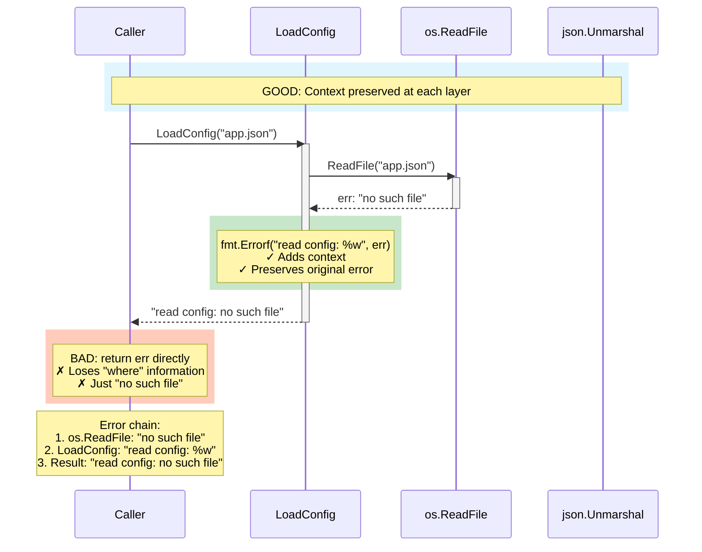
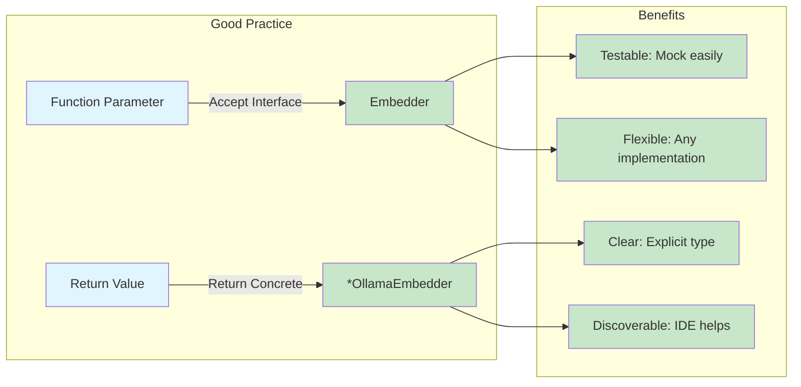
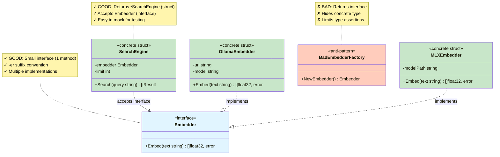
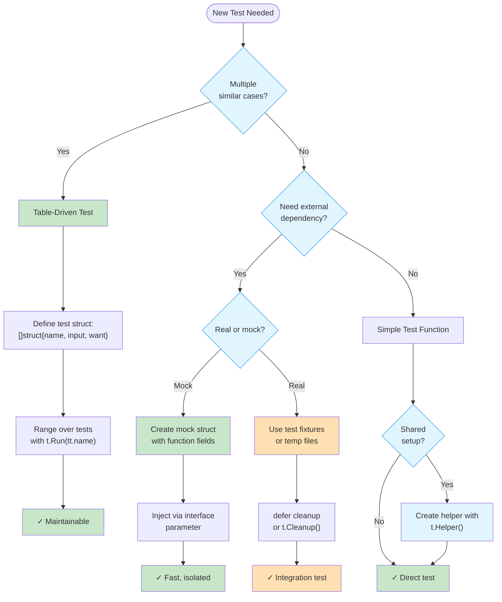
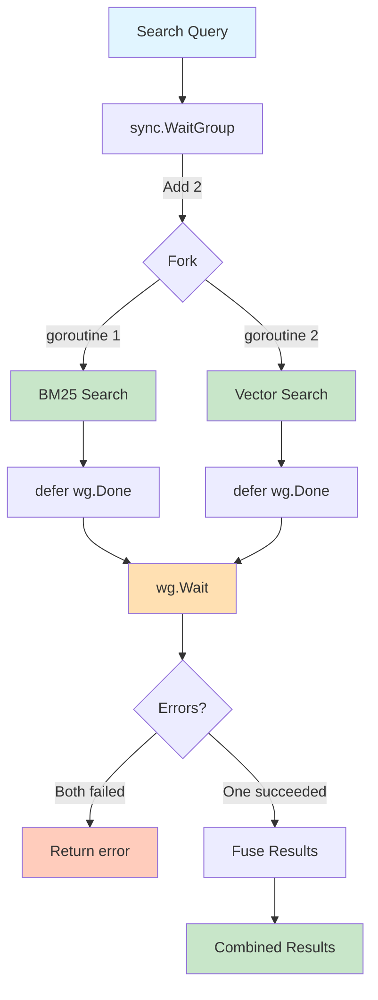
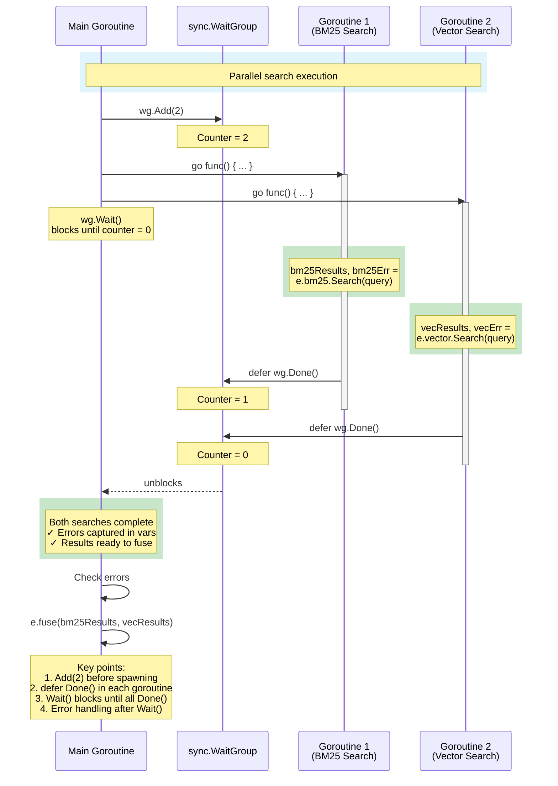
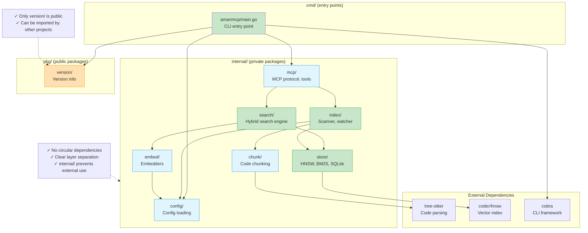

# Go Patterns for AmanMCP

Essential Go patterns and idioms used in AmanMCP.

---

## Error Handling

### Always Wrap Errors with Context

```go
// BAD: Lost context
if err != nil {
    return err
}

// GOOD: Wrap with context
if err != nil {
    return fmt.Errorf("failed to open config file: %w", err)
}
```

### The Error Chain

```go
// Errors wrap all the way up
func LoadConfig(path string) (*Config, error) {
    data, err := os.ReadFile(path)
    if err != nil {
        return nil, fmt.Errorf("read config: %w", err)
    }

    var cfg Config
    if err := json.Unmarshal(data, &cfg); err != nil {
        return nil, fmt.Errorf("parse config: %w", err)
    }

    return &cfg, nil
}

// Result: "parse config: invalid character..."
```

### Error Wrapping Flow



### Sentinel Errors

```go
// Define package-level error values
var (
    ErrNotFound     = errors.New("not found")
    ErrInvalidInput = errors.New("invalid input")
)

// Check with errors.Is
if errors.Is(err, ErrNotFound) {
    // Handle not found
}
```

---

## Interface Design



### Accept Interfaces, Return Structs

```go
// GOOD: Accept interface
func NewSearchEngine(embedder Embedder) *SearchEngine {
    return &SearchEngine{embedder: embedder}
}

// GOOD: Return concrete type
func NewOllamaEmbedder(url string) *OllamaEmbedder {
    return &OllamaEmbedder{url: url}
}

// BAD: Return interface
func NewEmbedder() Embedder {  // Don't do this
    return &OllamaEmbedder{}
}
```

### Keep Interfaces Small

```go
// GOOD: Small, focused interface
type Embedder interface {
    Embed(text string) ([]float32, error)
}

type BatchEmbedder interface {
    EmbedBatch(texts []string) ([][]float32, error)
}

// BAD: Kitchen sink interface
type Embedder interface {
    Embed(text string) ([]float32, error)
    EmbedBatch(texts []string) ([][]float32, error)
    ModelName() string
    Dimensions() int
    MaxTokens() int
    // ... too many methods
}
```

### Interface Design Principles



---

## Functional Options

For configurable constructors:

```go
// Option type
type Option func(*SearchEngine)

// Option functions
func WithLimit(n int) Option {
    return func(e *SearchEngine) {
        e.limit = n
    }
}

func WithEmbedder(emb Embedder) Option {
    return func(e *SearchEngine) {
        e.embedder = emb
    }
}

// Constructor with options
func NewSearchEngine(opts ...Option) *SearchEngine {
    e := &SearchEngine{
        limit:    10,  // default
        embedder: nil, // default
    }
    for _, opt := range opts {
        opt(e)
    }
    return e
}

// Usage
engine := NewSearchEngine(
    WithLimit(20),
    WithEmbedder(ollama),
)
```

---

## Testing Patterns

### Table-Driven Tests

```go
func TestBM25_Score(t *testing.T) {
    tests := []struct {
        name     string
        query    string
        doc      string
        wantHigh bool
    }{
        {
            name:     "exact match scores high",
            query:    "authentication",
            doc:      "authentication middleware",
            wantHigh: true,
        },
        {
            name:     "no match scores low",
            query:    "database",
            doc:      "authentication middleware",
            wantHigh: false,
        },
    }

    for _, tt := range tests {
        t.Run(tt.name, func(t *testing.T) {
            score := bm25.Score(tt.query, tt.doc)
            if tt.wantHigh {
                assert.Greater(t, score, 0.5)
            } else {
                assert.Less(t, score, 0.1)
            }
        })
    }
}
```

### Interface Mocking

```go
// Define mock
type MockEmbedder struct {
    EmbedFn func(text string) ([]float32, error)
}

func (m *MockEmbedder) Embed(text string) ([]float32, error) {
    if m.EmbedFn != nil {
        return m.EmbedFn(text)
    }
    return make([]float32, 768), nil
}

// Use in test
func TestSearch_WithMockEmbedder(t *testing.T) {
    mock := &MockEmbedder{
        EmbedFn: func(text string) ([]float32, error) {
            return []float32{0.1, 0.2, 0.3}, nil
        },
    }

    engine := NewSearchEngine(WithEmbedder(mock))
    results, err := engine.Search("test")

    assert.NoError(t, err)
    assert.NotEmpty(t, results)
}
```

### Test Helpers

```go
// Helper marks function as test helper
func setupTestIndex(t *testing.T) *Index {
    t.Helper()  // This line is important

    idx := NewIndex()
    if err := idx.Add(testDocuments...); err != nil {
        t.Fatalf("setup failed: %v", err)
    }
    return idx
}
```

### Testing Pattern Decision Flow



---

## Concurrency Patterns



### WaitGroup for Parallel Work

```go
func (e *Engine) Search(query string) ([]Result, error) {
    var wg sync.WaitGroup
    var bm25Results, vecResults []Result
    var bm25Err, vecErr error

    wg.Add(2)

    go func() {
        defer wg.Done()
        bm25Results, bm25Err = e.bm25.Search(query)
    }()

    go func() {
        defer wg.Done()
        vecResults, vecErr = e.vector.Search(query)
    }()

    wg.Wait()

    // Handle errors
    if bm25Err != nil && vecErr != nil {
        return nil, fmt.Errorf("search failed: bm25: %w, vec: %v", bm25Err, vecErr)
    }

    return e.fuse(bm25Results, vecResults), nil
}
```

### WaitGroup Coordination Pattern



### Mutex for Shared State

```go
type Index struct {
    mu        sync.RWMutex
    documents map[string]Document
}

func (i *Index) Add(doc Document) {
    i.mu.Lock()
    defer i.mu.Unlock()
    i.documents[doc.ID] = doc
}

func (i *Index) Get(id string) (Document, bool) {
    i.mu.RLock()
    defer i.mu.RUnlock()
    doc, ok := i.documents[id]
    return doc, ok
}
```

### Context for Cancellation

```go
func (e *Engine) Search(ctx context.Context, query string) ([]Result, error) {
    // Check context before expensive operation
    select {
    case <-ctx.Done():
        return nil, ctx.Err()
    default:
    }

    // Pass context to downstream calls
    results, err := e.bm25.Search(ctx, query)
    if err != nil {
        return nil, err
    }

    return results, nil
}
```

---

## Resource Management

### Defer for Cleanup

```go
func processFile(path string) error {
    file, err := os.Open(path)
    if err != nil {
        return err
    }
    defer file.Close()  // Always closes, even on error

    // Process file...
    return nil
}
```

### tree-sitter Cleanup

```go
func parseFile(content []byte) (*Node, error) {
    parser := sitter.NewParser()
    defer parser.Close()  // Must close parser

    parser.SetLanguage(goLanguage)

    tree := parser.Parse(content)
    defer tree.Close()  // Must close tree

    return tree.RootNode(), nil
}
```

---

## Package Organization

### Internal vs Pkg

```
amanmcp/
├── internal/        # Private packages
│   ├── search/      # Can only be imported by amanmcp
│   ├── index/
│   └── chunk/
├── pkg/             # Public packages
│   └── version/     # Can be imported by others
└── cmd/
    └── amanmcp/     # Main entry point
```

### Package Dependency Graph



### Naming Conventions

```go
// Package names: lowercase, single word
package search  // Good
package searchEngine  // Bad

// File names: lowercase, underscore separated
bm25_index.go      // Good
BM25Index.go       // Bad

// Exported names: CamelCase
type SearchEngine struct{}     // Public
type searchResult struct{}     // Private

// Interfaces: -er suffix for single method
type Embedder interface{}      // Good
type EmbeddingProvider interface{}  // OK for larger interfaces
```

---

## Common Mistakes

### 1. Nil Map Panic

```go
// BAD: Nil map panics on write
var scores map[string]float64
scores["doc1"] = 0.5  // PANIC!

// GOOD: Initialize first
scores := make(map[string]float64)
scores["doc1"] = 0.5
```

### 2. Shadowing

```go
// BAD: Shadowing err
err := doSomething()
if val, err := doOther(); err != nil {  // New err!
    return err  // Returns inner err
}
return err  // Returns outer err (might be nil)

// GOOD: Reuse or use different name
err := doSomething()
val, err := doOther()  // Reuse err
if err != nil {
    return err
}
```

### 3. Range Variable Capture

```go
// BAD: All goroutines see last value
for _, item := range items {
    go func() {
        process(item)  // Bug: always last item
    }()
}

// GOOD: Pass as parameter
for _, item := range items {
    go func(it Item) {
        process(it)
    }(item)
}
```

---

## Code Review Checklist

Use this checklist when reviewing Go code for AmanMCP:

```mermaid
---
config:
  layout: elk
---
flowchart LR
    subgraph Errors["Error Handling"]
        E1["✓ Wrapped with context<br/>fmt.Errorf('op: %w', err)"]
        E2["✓ Sentinel errors defined<br/>var ErrNotFound = ..."]
        E3["✓ errors.Is for checks"]
    end

    subgraph Resources["Resource Management"]
        R1["✓ defer for cleanup<br/>defer file.Close()"]
        R2["✓ tree-sitter closed<br/>defer parser.Close()"]
        R3["✓ No leaked goroutines"]
    end

    subgraph Concurrency["Concurrency"]
        C1["✓ WaitGroup used correctly<br/>Add before spawn"]
        C2["✓ Mutex for shared state<br/>Lock/Unlock paired"]
        C3["✓ Context passed through<br/>ctx.Context parameter"]
        C4["✓ No race conditions<br/>go test -race passes"]
    end

    subgraph Interfaces["Interfaces"]
        I1["✓ Accept interfaces<br/>func New(e Embedder)"]
        I2["✓ Return structs<br/>func New() *Engine"]
        I3["✓ Small interfaces<br/>1-3 methods ideal"]
    end

    subgraph Testing["Testing"]
        T1["✓ Table-driven tests<br/>for multiple cases"]
        T2["✓ Mocks for interfaces<br/>avoid real dependencies"]
        T3["✓ t.Helper() in helpers"]
        T4["✓ Coverage ≥ 25%"]
    end

    subgraph Naming["Naming & Style"]
        N1["✓ Package: lowercase<br/>single word"]
        N2["✓ Files: snake_case.go"]
        N3["✓ Exported: CamelCase"]
        N4["✓ Interfaces: -er suffix"]
    end

    subgraph Common["Common Pitfalls"]
        P1["✗ Nil map writes"]
        P2["✗ Variable shadowing"]
        P3["✗ Range var in closure"]
    end

    Start([Code Review]) --> Errors
    Errors --> Resources
    Resources --> Concurrency
    Concurrency --> Interfaces
    Interfaces --> Testing
    Testing --> Naming
    Naming --> Common
    Common --> Done([Approved ✓])

    style E1 fill:#c8e6c9
    style E2 fill:#c8e6c9
    style E3 fill:#c8e6c9
    style R1 fill:#c8e6c9
    style R2 fill:#c8e6c9
    style R3 fill:#c8e6c9
    style C1 fill:#c8e6c9
    style C2 fill:#c8e6c9
    style C3 fill:#c8e6c9
    style C4 fill:#c8e6c9
    style I1 fill:#c8e6c9
    style I2 fill:#c8e6c9
    style I3 fill:#c8e6c9
    style T1 fill:#c8e6c9
    style T2 fill:#c8e6c9
    style T3 fill:#c8e6c9
    style T4 fill:#c8e6c9
    style N1 fill:#e1f5ff
    style N2 fill:#e1f5ff
    style N3 fill:#e1f5ff
    style N4 fill:#e1f5ff
    style P1 fill:#ffccbc
    style P2 fill:#ffccbc
    style P3 fill:#ffccbc
    style Done fill:#c8e6c9

    style Errors fill:#e1f5ff,stroke:#3498db
    style Resources fill:#e1f5ff,stroke:#3498db
    style Concurrency fill:#e1f5ff,stroke:#3498db
    style Interfaces fill:#e1f5ff,stroke:#3498db
    style Testing fill:#e1f5ff,stroke:#3498db
    style Naming fill:#e1f5ff,stroke:#3498db
    style Common fill:#ffe0b2,stroke:#f39c12
```



**Priority Order:**

1. **HIGH**: Error handling, resource cleanup, concurrency correctness
2. **MEDIUM**: Interface design, test coverage
3. **LOW**: Naming style (but still important)

**Fail Fast On:**

- Race conditions (`go test -race` fails)
- Resource leaks (missing `defer Close()`)
- Unhandled errors (naked `return err`)

---

## Further Reading

- [Effective Go](https://golang.org/doc/effective_go)
- [Go Code Review Comments](https://github.com/golang/go/wiki/CodeReviewComments)
- [Standard Go Project Layout](https://github.com/golang-standards/project-layout)
- [Go Proverbs](https://go-proverbs.github.io/)

---

*Write Go idiomatically. The language rewards simplicity.*
