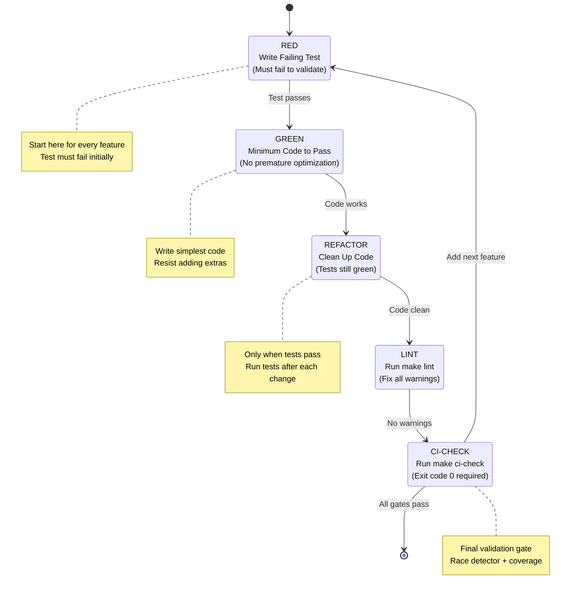
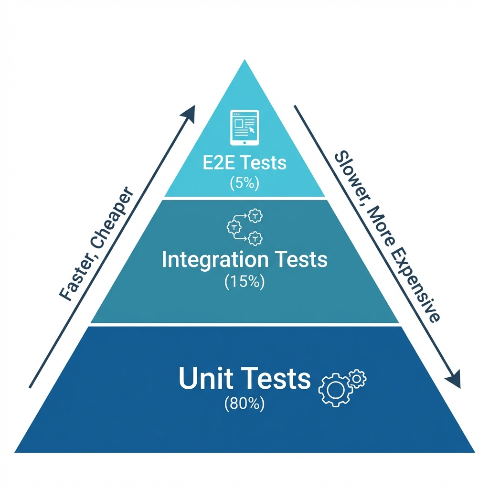
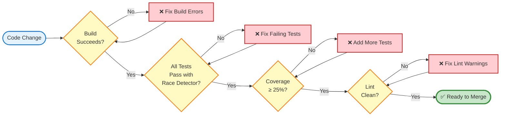

# TDD as Mandatory Practice: Why Test-First in AI Development

> **Learning Objectives:**
>
> - Understand why TDD is especially important for AI-assisted development
> - Learn the RED-GREEN-REFACTOR-LINT-CI cycle
> - Apply the testing pyramid for effective test coverage
>
> **Prerequisites:**
>
> - Basic familiarity with unit testing
> - Understanding of Go testing (`go test`)
>
> **Audience:** Contributors, AI-assisted developers, anyone using Claude Code

---

## TL;DR

AI tends to focus on implementation and skip tests unless explicitly constrained. TDD forces structure, guarantees coverage, enables safe refactoring, and produces better API design. In AmanMCP, **every feature must follow the TDD cycle**.

---

## Why TDD for AI Development?

### The Problem Without TDD

When working with AI-assisted development, common pitfalls emerge:

1. **AI focuses on implementation** - Given a task, AI naturally gravitates toward writing the solution, not the tests
2. **"It compiles" becomes the quality bar** - Without test requirements, working code is mistaken for correct code
3. **Tests are forgotten** - In the rush to show results, test coverage becomes an afterthought
4. **Refactoring becomes dangerous** - Without tests, any change might break existing functionality silently

### How TDD Helps

TDD inverts the workflow to address these problems:

| Benefit | How TDD Delivers It |
|---------|---------------------|
| **Safe refactoring** | Tests catch regressions immediately |
| **Better API design** | Writing tests first reveals awkward interfaces |
| **Documentation** | Tests document expected behavior |
| **AI constraint** | Forces structured approach, prevents "just make it work" |

---

## The TDD Cycle

AmanMCP uses an extended TDD cycle that includes quality gates:

```
RED --> GREEN --> REFACTOR --> LINT --> CI-CHECK
```



### Step by Step

#### 1. RED: Write a Failing Test First

Before writing any implementation code, write a test that describes the expected behavior:

```go
func TestVectorStore_Add(t *testing.T) {
    store := NewVectorStore(128)

    err := store.Add("doc1", []float32{0.1, 0.2, ...})

    assert.NoError(t, err)
    assert.Equal(t, 1, store.Size())
}
```

**Key:** The test must fail. If it passes, either the feature already exists or the test is wrong.

#### 2. GREEN: Write Minimum Code to Pass

Write the simplest code that makes the test pass. Resist the urge to add features:

```go
func (s *VectorStore) Add(id string, vector []float32) error {
    s.vectors[id] = vector
    return nil
}

func (s *VectorStore) Size() int {
    return len(s.vectors)
}
```

**Key:** Minimum viable implementation. No premature optimization.

#### 3. REFACTOR: Clean Up While Green

Now that tests pass, improve the code structure without changing behavior:

- Extract methods for clarity
- Remove duplication
- Improve naming
- Add error handling

**Key:** Run tests after each refactor to ensure nothing breaks.

#### 4. LINT: Run the Linter

```bash
make lint
```

Fix any warnings. Lint issues are treated as failures in CI.

#### 5. CI-CHECK: Validate Everything

```bash
make ci-check
```

This must exit with code 0. It validates:

- All tests pass with race detector
- Coverage meets threshold (25%+)
- No lint warnings
- Build succeeds

---

## The Testing Pyramid

Not all tests are equal. Follow this distribution:

| Level | Percentage | Purpose | Speed |
|-------|------------|---------|-------|
| **Unit Tests** | 80% | Fast, isolated, high coverage | Milliseconds |
| **Integration Tests** | 15% | Real dependencies, slower | Seconds |
| **E2E Tests** | 5% | Full system validation | Minutes |



**Key Insight:** The wider the base, the faster feedback. Unit tests give you instant confidence.

### Why This Ratio?

- **Unit tests** are fast - run them constantly
- **Integration tests** catch interface issues - run before commits
- **E2E tests** validate the whole system - run in CI

---

## Quality Gates

A feature is NOT complete until all gates pass:

```bash
# The single command that validates everything
make ci-check  # Must exit 0
```



**Critical:** Each gate must pass before proceeding. `make ci-check` validates all gates with a single command.

### What ci-check Validates

| Check | Requirement |
|-------|-------------|
| Build | Compiles without errors |
| Tests | All pass with race detector |
| Coverage | Meets 25% threshold |
| Linting | No warnings |

---

## The 13-Step TDD Loop

For complex features, follow this detailed loop:

1. **Read feature spec** - Understand requirements fully
2. **Identify acceptance criteria** - List what "done" means
3. **Write first failing test** (RED)
4. **Run test, verify it fails** - Confirms test is valid
5. **Write minimum code to pass** (GREEN)
6. **Run test, verify it passes**
7. **Refactor if needed** (REFACTOR)
8. **Run tests, verify still green**
9. **Repeat** for next acceptance criterion
10. **Run `make lint`** - Fix any warnings
11. **Run `make ci-check`** - Must exit 0
12. **Create validation guide** - Document how to verify manually
13. **Report completion** - Feature is done

---

## Why Not "Test After"?

| Approach | Pros | Cons |
|----------|------|------|
| **Test after** | Faster initial coding | Tests often skipped, poor coverage |
| **TDD** | Guaranteed coverage | Slower initial velocity |
| No tests | Maximum speed | Quality varies wildly |
| Integration only | Tests real behavior | Slow, hard to pinpoint failures |

### The Hidden Cost of "Test After"

When you write tests after implementation:

- Tests are shaped to match the code (not requirements)
- Edge cases are forgotten
- Coverage is often incomplete
- Tests become a chore, not a design tool

With TDD:

- Tests reflect requirements
- Edge cases emerge naturally
- Coverage is built-in
- Tests improve your design

---

## Quote to Remember

> "Tests don't slow down development. Manually checking if your code works definitely does."

---

## Common Mistakes

### Mistake 1: Writing Test and Implementation Together

**Wrong:**

```
Write test -> Write implementation -> Commit
```

**Right:**

```
Write test -> Run test (must fail) -> Write implementation -> Run test (must pass)
```

The "must fail" step validates your test is actually testing something.

### Mistake 2: Testing Implementation Instead of Behavior

**Wrong:**

```go
// Testing internal structure
assert.Equal(t, 10, store.cache.capacity)
```

**Right:**

```go
// Testing behavior
for i := 0; i < 15; i++ {
    store.Add(fmt.Sprintf("doc%d", i), vec)
}
assert.Equal(t, 10, store.Size()) // Oldest evicted
```

### Mistake 3: Skipping CI-CHECK

**Wrong:**

```
Tests pass locally -> Done!
```

**Right:**

```
Tests pass locally -> make ci-check passes -> Done!
```

CI-CHECK includes race detection and coverage that local runs might skip.

---

## See Also

- [Testing Guide](./testing-guide.md) - Validation test framework
- [Code Conventions](./code-conventions.md) - Go patterns and style

---

**Original Source:** `.aman-pm/decisions/ADR-021` (internal)
**Last Updated:** 2026-01-16
