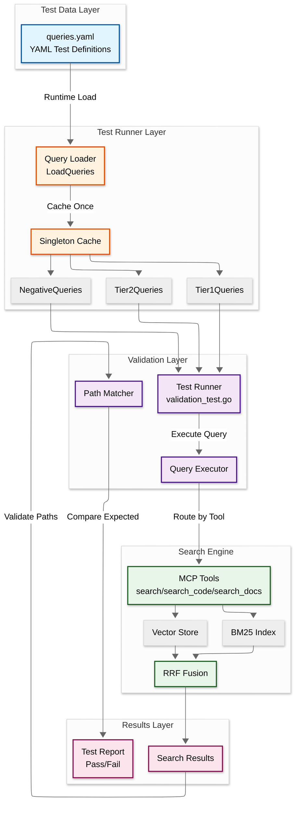
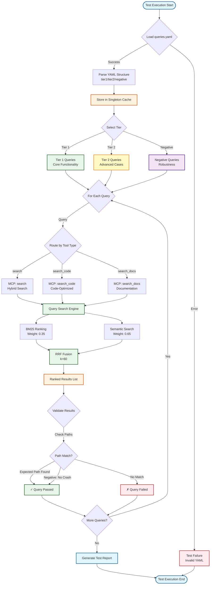

# Validation Testing Guide

This guide explains how to work with AmanMCP's validation test system - a data-driven approach for testing search quality.

---

## Overview

Validation tests verify that search returns relevant results for common queries. They're used for:

- **Dogfooding** - Testing AmanMCP against its own codebase
- **Regression detection** - Catching search quality degradation
- **Embedder comparison** - Benchmarking different embedding models

---

## Architecture: Data-Driven Design

Validation queries are **data, not code**. Following the Unix Philosophy principle of "data-driven behavior", queries are stored in a YAML file and loaded at runtime.

```
internal/validation/
├── validation.go           # Test runner, loads queries from YAML
├── validation_test.go      # Go test integration
└── testdata/
    └── queries.yaml        # ← All queries defined here
```

**Benefits:**

- Edit queries without rebuilding the application
- Self-documenting with notes for each query
- Clear separation of test logic and test data

### Validation System Architecture



### Data Flow Diagram



---

## Query File Format

Queries are defined in `internal/validation/testdata/queries.yaml`:

```yaml
tier1:
  - id: T1-Q1                              # Unique identifier
    name: Vector store creation            # Human-readable name
    query: "Where is the vector store created"  # Search query
    tool: search                           # MCP tool: search, search_code, search_docs
    expected:                              # File paths/prefixes that should match
      - internal/store/
    notes: "Tests semantic understanding"  # Optional explanation

tier2:
  - id: T2-Q1
    name: Configuration options
    query: "What configuration options exist"
    tool: search_docs
    expected:
      - README.md
      - docs/guides/configuration-reference.md

negative:
  - id: N-Q1
    name: Non-existent symbol
    query: "xyznonexistent123"
    tool: search
    expected: []                           # Empty = should not crash
```

### Query Lifecycle

How a validation query flows from YAML to test result:

```mermaid
---
config:
  layout: elk
  theme: neutral
  look: neo
---
flowchart LR
 subgraph Data["Data Layer"]
        YAML["queries.yaml<br>Test Definitions"]
  end
 subgraph Load["Load & Cache"]
        Parse["Parse YAML"]
        Cache["Singleton Cache"]
  end
 subgraph Test["Test Execution"]
        Select{"Select Tier"}
        T1["Tier 1<br>Core Tests"]
        T2["Tier 2<br>Advanced"]
        TN["Negative<br>Robustness"]
  end
 subgraph Search["Search Engine"]
        Route{"Route by<br>Tool Type"}
        MCPSearch["search"]
        MCPCode["search_code"]
        MCPDocs["search_docs"]
        Engine["Hybrid Search<br>BM25 + Semantic"]
  end
 subgraph Validate["Validation"]
        Results["Search Results"]
        Match{"Path<br>Matches?"}
        Pass["✓ Test Passes"]
        Fail["✗ Test Fails"]
  end
    Parse --> Cache
    Select --> T1 & T2 & TN
    Route --> MCPSearch & MCPCode & MCPDocs
    MCPSearch --> Engine
    MCPCode --> Engine
    MCPDocs --> Engine
    Results --> Match
    Match -- Yes --> Pass
    Match -- No --> Fail
    YAML --> Parse
    Cache --> Select
    T1 --> Route
    T2 --> Route
    TN --> Route
    Engine --> Results

    classDef success fill:#c8e6c9,stroke:#27ae60
    classDef info fill:#e1f5ff,stroke:#3498db
    classDef warning fill:#ffe0b2,stroke:#f39c12
    style YAML fill:#e1f5ff,stroke:#3498db,stroke-width:2px
    style Parse fill:#fff9c4,stroke:#f57f17,stroke-width:2px
    style Cache fill:#fff9c4,stroke:#f57f17,stroke-width:2px
    style T1 fill:#c8e6c9,stroke:#27ae60,stroke-width:2px
    style T2 fill:#ffe0b2,stroke:#f39c12,stroke-width:2px
    style TN fill:#f3e5f5,stroke:#9b59b6,stroke-width:2px
    style Engine fill:#c8e6c9,stroke:#27ae60,stroke-width:2px
    style Pass fill:#c8e6c9,stroke:#27ae60,stroke-width:3px
    style Fail fill:#ffccbc,stroke:#e74c3c,stroke-width:3px
```



**Lifecycle Stages:**

1. **Data**: Queries defined in YAML (edit without rebuild)
2. **Load**: Parse once, cache for all tests (performance)
3. **Test**: Select tier, execute queries in parallel
4. **Search**: Route to appropriate MCP tool, run hybrid search
5. **Validate**: Check if expected paths appear in results

---

## Query Tiers

| Tier | Purpose | Pass Criteria |
|------|---------|---------------|
| **Tier 1** | Core functionality | Must pass for release |
| **Tier 2** | Advanced/edge cases | Should pass, failures investigated |
| **Negative** | Robustness | Must not crash |

---

## Adding New Queries

1. **Edit the YAML file** (no rebuild needed):

   ```bash
   vi internal/validation/testdata/queries.yaml
   ```

2. **Add your query** under the appropriate tier:

   ```yaml
   tier1:
     # ... existing queries ...

     - id: T1-Q13
       name: My new test
       query: "How does X work"
       tool: search
       expected:
         - internal/x/
       notes: "Tests understanding of X component"
   ```

3. **Run validation tests**:

   ```bash
   go test -v ./internal/validation/... -run TestTier1
   ```

---

## Expected Path Matching

The `expected` field supports flexible matching:

| Pattern | Matches |
|---------|---------|
| `internal/search/` | Any file starting with `internal/search/` |
| `fusion.go` | Any file containing `fusion.go` |
| `internal/search/fusion.go` | Exact path match |

Multiple expected paths use **OR** logic - any match = pass.

---

## Available Tools

| Tool | Description | Best For |
|------|-------------|----------|
| `search` | Hybrid search (BM25 + semantic) | General code location |
| `search_code` | Code-optimized search | Finding functions, types, symbols |
| `search_docs` | Documentation search | README, guides, markdown |

---

## Running Tests

```bash
# Run all validation tiers
go test -v ./internal/validation/...

# Run specific tier
go test -v ./internal/validation/... -run TestTier1
go test -v ./internal/validation/... -run TestTier2
go test -v ./internal/validation/... -run TestNegative

# Run with timeout (for large codebases)
go test -v ./internal/validation/... -timeout 5m
```

---

## Troubleshooting

### Query returns wrong files

1. **Check expected paths** - Use directory prefixes for flexibility:

   ```yaml
   # Too specific (brittle)
   expected: [internal/search/engine.go]

   # Better (flexible)
   expected: [internal/search/]
   ```

2. **Test manually** with CLI:

   ```bash
   amanmcp search "your query" --limit 10
   ```

3. **Check indexing exclusions** in `.amanmcp.yaml`

### Self-referential pollution

If validation files rank highly for their own queries, they're being indexed. Fix:

```yaml
# .amanmcp.yaml
paths:
  exclude:
    - "internal/validation/**"
```

### LoadQueries() error

If queries fail to load:

1. Check YAML syntax: `python -c "import yaml; yaml.safe_load(open('queries.yaml'))"`
2. Verify file path: `ls internal/validation/testdata/queries.yaml`

---

## Design Decisions

### Why YAML over JSON?

- **Comments** - Explain why each query exists
- **Readability** - Less syntactic noise
- **Consistency** - Matches `.amanmcp.yaml` config

### Why runtime loading?

- **No rebuild** - Edit queries, re-run tests immediately
- **Singleton caching** - File read once, reused across tests
- **Graceful degradation** - Missing file returns empty queries, not crash

### Why exclude validation from indexing?

The validation file contains query strings like "Where is the vector store created". If indexed, it ranks #1 for its own queries - polluting results.

---

## API Reference

```go
// Load queries from testdata/queries.yaml (cached)
cfg, err := validation.LoadQueries()

// Get queries by tier
tier1 := validation.Tier1Queries()
tier2 := validation.Tier2Queries()
negative := validation.NegativeQueries()

// Reset cache (for testing)
validation.ResetQueries()
```

---

## See Also

- [Hybrid Search Guide](./hybrid-search.md) - How search ranking works
- [Configuration Reference](../reference/configuration.md) - `.amanmcp.yaml` options
- ADR-038: Black Box Architecture - Module design principles
