# System Requirements

Quick reference for AmanMCP system requirements.

## Quick Check

Run diagnostics to verify your system:

```bash
amanmcp doctor
```

---

## Hardware Requirements

| Component | Minimum | Recommended | Notes |
|-----------|---------|-------------|-------|
| **RAM** | 16 GB | 24 GB+ | See memory sizing guide below |
| **Disk Space** | 100 MB free | 1 GB+ | Index size depends on codebase |
| **File Descriptors** | 1024 | 10240+ | `ulimit -n` on Unix |

---

## Software Requirements

| Software | Version | Required | Notes |
|----------|---------|----------|-------|
| **Go** | 1.25.5+ | Build only | Not needed at runtime |
| **CGO Toolchain** | Any | Build only | For tree-sitter only |

**Note:** AmanMCP uses Ollama for embeddings by default. Static embeddings are available for offline use.

---

## Platform Support

| Platform | Status | Notes |
|----------|--------|-------|
| **macOS 12+** | Full | Primary development platform |
| **Linux (Ubuntu 20.04+)** | Full | AMD64 and ARM64 |
| **Windows 10/11** | Community | See Windows notes below |

### Platform Compatibility Matrix

```mermaid
---
config:
  layout: elk
  theme: neo
  look: neo
---
graph TB
    subgraph Legend["Feature Support Legend"]
        L1["✓ Full Support"]
        L2["⚠ Partial Support"]
        L3["✗ Not Supported"]
    end

    subgraph macOS["macOS 12+ (Ventura/Sonoma/Sequoia)"]
        direction TB
        M1["Architecture:<br/>✓ Apple Silicon M1/M2/M3/M4<br/>✓ Intel x86_64"]
        M2["Features:<br/>✓ MLX Server (Apple Silicon)<br/>✓ Ollama<br/>✓ File watching (fsnotify)<br/>✓ Static embeddings"]
        M3["Status: Production Ready"]
        M1 --> M2 --> M3
    end

    subgraph Linux["Linux (Ubuntu 20.04+, Debian, Fedora)"]
        direction TB
        L4["Architecture:<br/>✓ AMD64 (x86_64)<br/>✓ ARM64 (aarch64)"]
        L5["Features:<br/>✗ MLX Server<br/>✓ Ollama<br/>✓ File watching (fsnotify)<br/>✓ Static embeddings"]
        L6["Status: Production Ready"]
        L4 --> L5 --> L6
    end

    subgraph Windows["Windows 10/11"]
        direction TB
        W1["Architecture:<br/>✓ AMD64 (x86_64)<br/>⚠ ARM64 (limited testing)"]
        W2["Features:<br/>✗ MLX Server<br/>✓ Ollama<br/>⚠ File watching (polling mode)<br/>✓ Static embeddings"]
        W3["Status: Community Support"]
        W4["Requirements:<br/>⚠ CGO toolchain (MinGW/MSVC)<br/>⚠ Forward slashes in config"]
        W1 --> W2 --> W3 --> W4
    end

    subgraph Docker["Docker/Containers"]
        D1["File Watching:<br/>⚠ Polling mode only<br/>(fsnotify unreliable)"]
        D2["Recommendation:<br/>Use polling_interval: 5s"]
    end

    subgraph NFS["NFS/Network Drives"]
        N1["File Watching:<br/>⚠ Polling mode only<br/>(fsnotify events delayed)"]
        N2["Recommendation:<br/>Use local storage for index"]
    end

    style macOS fill:#c8e6c9,stroke:#2e7d32,stroke-width:3px
    style Linux fill:#c8e6c9,stroke:#2e7d32,stroke-width:3px
    style Windows fill:#fff9c4,stroke:#f57f17,stroke-width:2px
    style Docker fill:#ffe0b2,stroke:#e65100,stroke-width:2px
    style NFS fill:#ffe0b2,stroke:#e65100,stroke-width:2px
    style Legend fill:#f5f5f5,stroke:#9e9e9e,stroke-width:1px
    style M3 fill:#c8e6c9
    style L6 fill:#c8e6c9
    style W3 fill:#fff9c4
    style L1 fill:#c8e6c9
    style L2 fill:#fff9c4
    style L3 fill:#ffccbc
```



---

## Memory Sizing Guide

Choose vector quantization based on your codebase size:

| Codebase Size | RAM Used (F16) | RAM Used (I8) | Recommended RAM |
|---------------|----------------|---------------|-----------------|
| < 10K files | ~50 MB | ~25 MB | 16 GB |
| 10K-50K files | ~100 MB | ~50 MB | 16 GB |
| 50K-100K files | ~200 MB | ~100 MB | 24 GB |
| 100K-300K files | ~400 MB | ~200 MB | 32 GB |

### Memory Sizing Decision Tree

```mermaid
flowchart TD
    Start([Determine RAM Requirements]) --> Size{How many files<br/>in your codebase?}

    Size -->|< 10K files| Small[Small Codebase]
    Size -->|10K-50K files| Medium[Medium Codebase]
    Size -->|50K-100K files| Large[Large Codebase]
    Size -->|100K-300K files| XLarge[Very Large Codebase]

    Small --> SmallRAM{Your Available RAM?}
    SmallRAM -->|16GB+| SmallF16["✓ Use F16 quantization<br/>RAM: ~50MB<br/>Quality: Excellent"]
    SmallRAM -->|8GB| SmallI8["✓ Use I8 quantization<br/>RAM: ~25MB<br/>Quality: Good"]

    Medium --> MediumRAM{Your Available RAM?}
    MediumRAM -->|16GB+| MediumF16["✓ Use F16 quantization<br/>RAM: ~100MB<br/>Quality: Excellent"]
    MediumRAM -->|8GB| MediumI8["⚠ Use I8 quantization<br/>RAM: ~50MB<br/>Quality: Good"]

    Large --> LargeRAM{Your Available RAM?}
    LargeRAM -->|24GB+| LargeF16["✓ Use F16 quantization<br/>RAM: ~200MB<br/>Quality: Excellent"]
    LargeRAM -->|16GB| LargeI8["✓ Use I8 quantization<br/>RAM: ~100MB<br/>Quality: Good"]
    LargeRAM -->|8GB| LargeWarn["⚠ Insufficient RAM<br/>Use I8 + reduce scope<br/>Add exclusions"]

    XLarge --> XLargeRAM{Your Available RAM?}
    XLargeRAM -->|32GB+| XLargeF16["✓ Use F16 quantization<br/>RAM: ~400MB<br/>Quality: Excellent"]
    XLargeRAM -->|24GB| XLargeI8["✓ Use I8 quantization<br/>RAM: ~200MB<br/>Quality: Good"]
    XLargeRAM -->|< 24GB| XLargeWarn["⚠ Insufficient RAM<br/>Reduce scope or<br/>upgrade RAM"]

    SmallF16 --> Config[Apply Configuration]
    SmallI8 --> Config
    MediumF16 --> Config
    MediumI8 --> Config
    LargeF16 --> Config
    LargeI8 --> Config
    LargeWarn --> Config
    XLargeF16 --> Config
    XLargeI8 --> Config
    XLargeWarn --> Config

    Config --> Done([Ready to Index])

    style Start fill:#e1f5ff
    style Done fill:#c8e6c9
    style SmallF16 fill:#c8e6c9
    style MediumF16 fill:#c8e6c9
    style LargeF16 fill:#c8e6c9
    style XLargeF16 fill:#c8e6c9
    style SmallI8 fill:#c8e6c9
    style MediumI8 fill:#fff9c4
    style LargeI8 fill:#c8e6c9
    style XLargeI8 fill:#c8e6c9
    style LargeWarn fill:#ffe0b2
    style XLargeWarn fill:#ffccbc
```



**Configuration:**
```yaml
# .amanmcp.yaml
vector_store:
  quantization: F16  # Default: good quality/size balance
  # quantization: I8  # Half memory, slight quality loss
  # quantization: F32 # Best quality, 2x memory
```

---

## Disk Space Guide

| Component | Size | Notes |
|-----------|------|-------|
| Binary | ~60 MB | Standalone executable |
| Index (per 10K files) | ~20 MB | BM25 + vectors + metadata |
| Embedding model | ~138 MB | nomic-embed-text-v1.5 (auto-download) |

**Index location:** `.amanmcp/` in your project root

---

## Pre-Flight Checks

AmanMCP validates your system on first run:

| Check | Threshold | Required |
|-------|-----------|----------|
| Disk space | 100 MB free | Yes |
| Memory | 1 GB available | Yes |
| Write permissions | Can create files | Yes |
| File descriptors | 1024 limit | Yes |

**Run diagnostics:** `amanmcp doctor`

### Pre-Flight Validation Flow

```mermaid
flowchart TD
    Start([amanmcp doctor]) --> Check1{Disk Space<br/>100MB+ free?}

    Check1 -->|No| Fail1["✗ FAIL: Insufficient disk space<br/>Action: Free up space"]
    Check1 -->|Yes| Pass1["✓ PASS: Disk space OK"]

    Pass1 --> Check2{Memory<br/>1GB+ available?}
    Check2 -->|No| Fail2["✗ FAIL: Insufficient memory<br/>Action: Close applications"]
    Check2 -->|Yes| Pass2["✓ PASS: Memory OK"]

    Pass2 --> Check3{Write Permissions<br/>Can create .amanmcp/?}
    Check3 -->|No| Fail3["✗ FAIL: No write permissions<br/>Action: Fix directory permissions"]
    Check3 -->|Yes| Pass3["✓ PASS: Write permissions OK"]

    Pass3 --> Check4{File Descriptors<br/>ulimit -n >= 1024?}
    Check4 -->|No| Fail4["✗ FAIL: File descriptor limit too low<br/>Action: ulimit -n 10240"]
    Check4 -->|Yes| Pass4["✓ PASS: File descriptors OK"]

    Pass4 --> Check5{Embedding Backend<br/>Available?}
    Check5 -->|No| Warn1["⚠ WARN: No backend detected<br/>MLX/Ollama not running<br/>Static embeddings available"]
    Check5 -->|Yes| Pass5["✓ PASS: Ollama/MLX ready"]

    Warn1 --> Check6{CGO Toolchain<br/>Available?}
    Pass5 --> Check6
    Check6 -->|No| Warn2["⚠ WARN: CGO not available<br/>Cannot build from source<br/>Use prebuilt binary"]
    Check6 -->|Yes| Pass6["✓ PASS: CGO toolchain OK"]

    Warn2 --> Summary
    Pass6 --> Summary

    Fail1 --> Summary["Show Summary Report"]
    Fail2 --> Summary
    Fail3 --> Summary
    Fail4 --> Summary

    Summary --> Result{All Critical<br/>Checks Pass?}
    Result -->|No| Exit["Exit Code: 1<br/>Cannot proceed"]
    Result -->|Yes| Success["✓ System Ready<br/>Exit Code: 0"]

    style Start fill:#e1f5ff
    style Success fill:#c8e6c9
    style Exit fill:#ffccbc
    style Pass1 fill:#c8e6c9
    style Pass2 fill:#c8e6c9
    style Pass3 fill:#c8e6c9
    style Pass4 fill:#c8e6c9
    style Pass5 fill:#c8e6c9
    style Pass6 fill:#c8e6c9
    style Warn1 fill:#fff9c4
    style Warn2 fill:#fff9c4
    style Fail1 fill:#ffccbc
    style Fail2 fill:#ffccbc
    style Fail3 fill:#ffccbc
    style Fail4 fill:#ffccbc
```



---

## Troubleshooting

### Troubleshooting Decision Flow


### "Disk space insufficient"

Ensure at least 100 MB free where your project lives:

```bash
df -h .
```

### "File descriptor limit too low"

Increase the limit (Unix):

```bash
# Temporary (current session)
ulimit -n 10240

# Permanent (add to ~/.bashrc or ~/.zshrc)
ulimit -n 10240
```

### "Embedding model not available"

The embedding model downloads automatically on first use:

```bash
# Force re-download/setup
amanmcp setup

# Use offline mode (static embeddings)
amanmcp init --offline
```

### "Write permission denied"

Check directory permissions:

```bash
ls -la .
# Ensure you own the directory or have write access
```

---

## Resource Monitoring

### Resource Monitoring Dashboard

Monitor AmanMCP resource usage during indexing and search operations:

```mermaid
%%{init: {'theme':'base', 'themeVariables': { 'fontSize':'14px'}}}%%
graph TB
    subgraph Dashboard["AmanMCP Resource Monitoring Dashboard"]
        direction TB

        subgraph CPU["CPU Usage"]
            C1["Indexing Phase:<br/>50-80% (parallel chunking)<br/>Duration: 1-15 minutes"]
            C2["Search Phase:<br/>5-15% (query processing)<br/>Duration: <100ms"]
            C3["Idle:<br/>0-1% (file watcher only)"]
        end

        subgraph Memory["Memory Usage"]
            M1["Base:<br/>~50-100MB (server + indexes)"]
            M2["Indexing:<br/>+200-500MB (buffers + embeddings)"]
            M3["Peak:<br/>300-1000MB depending on:<br/>• Codebase size<br/>• Quantization (F16/I8/F32)<br/>• Batch size"]
        end

        subgraph Disk["Disk I/O"]
            D1["Read:<br/>Sequential file scanning<br/>~100-500 MB/s"]
            D2["Write:<br/>Index updates (BM25 + HNSW)<br/>~50-200 MB/s"]
            D3["Total Space:<br/>.amanmcp/ directory<br/>~20MB per 10K files"]
        end

        subgraph Network["Network"]
            N1["Localhost Only:<br/>• Ollama: :11434<br/>• MLX: :9659"]
            N2["External:<br/>Only during initial<br/>model download"]
        end

        subgraph Tools["Monitoring Tools"]
            T1["macOS:<br/>• Activity Monitor (GUI)<br/>• htop (CPU/RAM)<br/>• asitop (GPU/ANE)"]
            T2["Linux:<br/>• htop (CPU/RAM)<br/>• iotop (Disk I/O)<br/>• nethogs (Network)"]
            T3["Windows:<br/>• Task Manager<br/>• Resource Monitor"]
        end

        subgraph Alerts["Watch For"]
            A1["🟢 Normal:<br/>• CPU spikes during indexing<br/>• Memory stable <1GB<br/>• Disk I/O bursts"]
            A2["🟡 Caution:<br/>• Memory >1.5GB sustained<br/>• CPU 100% for >5 min<br/>• Disk space <100MB"]
            A3["🔴 Critical:<br/>• OOM (Out of Memory)<br/>• Disk full<br/>• Thermal throttling"]
        end
    end

    CPU -.-> Tools
    Memory -.-> Tools
    Disk -.-> Tools
    Network -.-> Tools

    Tools -.-> Alerts

    style Dashboard fill:#f5f5f5,stroke:#757575,stroke-width:2px
    style CPU fill:#e1f5ff,stroke:#01579b,stroke-width:2px
    style Memory fill:#e1f5ff,stroke:#01579b,stroke-width:2px
    style Disk fill:#e1f5ff,stroke:#01579b,stroke-width:2px
    style Network fill:#e1f5ff,stroke:#01579b,stroke-width:2px
    style Tools fill:#fff9c4,stroke:#f57f17,stroke-width:2px
    style Alerts fill:#e8f5e9,stroke:#2e7d32,stroke-width:2px
    style A1 fill:#c8e6c9
    style A2 fill:#fff9c4
    style A3 fill:#ffccbc
```



### Monitoring Commands

**macOS:**
```bash
# CPU and RAM
htop

# GPU and Neural Engine (Apple Silicon)
sudo asitop

# Disk usage
df -h .
du -sh .amanmcp/
```

**Linux:**
```bash
# CPU and RAM
htop

# Disk I/O
sudo iotop

# Disk usage
df -h .
du -sh .amanmcp/
```

**Windows:**
```powershell
# Task Manager (GUI)
taskmgr

# Disk usage
Get-PSDrive C
```

---

## Windows Notes

Windows support is community-contributed. Known considerations:

1. **CGO required** - Install MinGW or MSVC toolchain
2. **Path handling** - Use forward slashes in config
3. **File watching** - Uses polling (no fsnotify on Windows)
4. **Ollama** - Download from https://ollama.com/download/windows

---

## Network Requirements

AmanMCP runs entirely locally. Network is only needed for:

| Feature | Network Required |
|---------|-----------------|
| Indexing | No |
| Search | No |
| Ollama embeddings | Localhost only (port 11434) |
| Model download | Yes (one-time during setup) |

**Airgapped environments:** Use `--offline` mode with static embeddings.

### Network Architecture Diagram


**Privacy guarantee:** Your code never leaves your machine. All search and indexing happens locally.

---

## See Also

- [README.md](README.md) - Getting started
- [Architecture](docs/architecture/architecture.md) - System design
- [Requirements](docs/requirements.md) - Full requirements document
