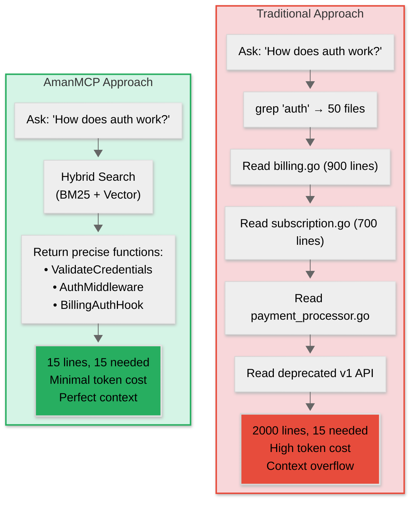
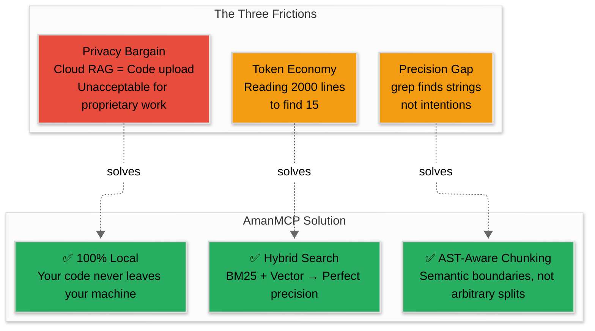
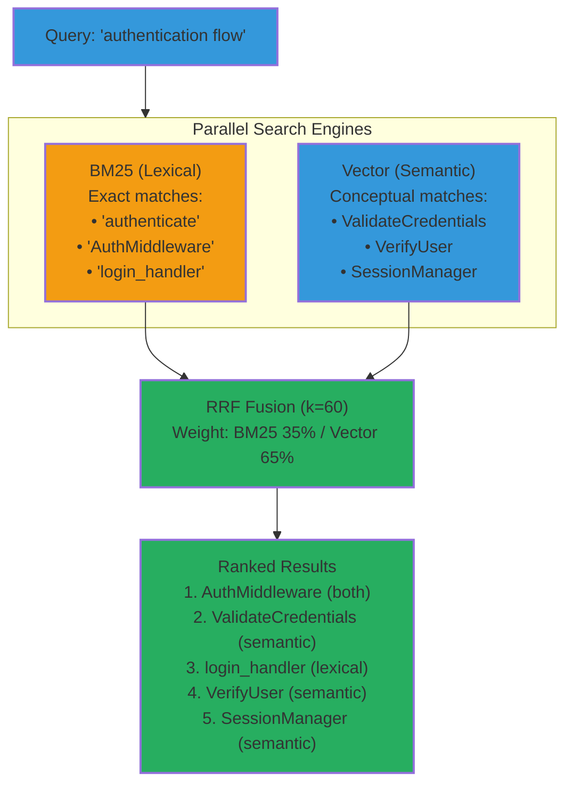
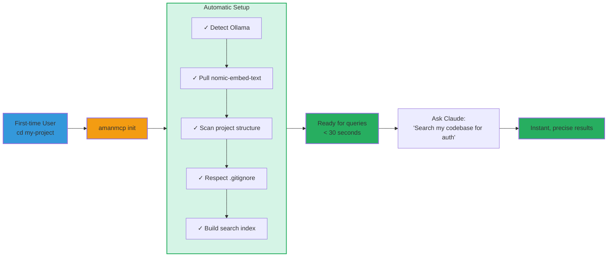

# The Architecture of Flow: Giving AI the Memory It Deserves

**By the AmanMCP Team**

---

## The Break in the Flow

You know the feeling. You're deep in the zone, wrestling with a complex architectural decision. You turn to your AI assistant and ask how the authentication middleware interacts with the new billing service.

And then, the flow breaks.

The AI doesn't say "I can't." It says **"Searching..."**

It `grep`s for "auth". It finds 50 files. It reads `billing.go`—all 900 lines. Then `subscription.go`—700 more. Then `payment_processor.go`. It reads your mock data. It reads your deprecated v1 API.

**Two thousand lines processed. Fifteen lines needed.**

Suddenly, you're not an architect anymore; you're a chaperone. You're watching a spinner, calculating token costs, wondering if you should just `grep` it yourself because the "smart" tool is blindly reading the dictionary to find a single definition.

The magic dissipates. The friction returns.

We believe there's a better way. We believe that in the age of intelligence, your tools should not just be smart—they should be *aware*.

This is why we're building **AmanMCP**.

---

### Traditional vs. AmanMCP: The Flow Difference

---

## The Three Frictions

The problem isn't intelligence. Modern models are brilliant. The problem is **retrieval**. Current solutions force you to choose between three frictions:

### Friction One: The Token Economy

Every line the AI reads costs tokens. Tokens cost money, or time, or both. When your assistant reads an entire file to find a single function, you're paying for exploration overhead. Multiply this across a day of development, across a team. The waste compounds.

### Friction Two: The Precision Gap

Developers think in concepts: "Authentication flow." "Error handling pattern." "The thing that processes webhooks." But traditional search is literal. `grep` finds exact strings, not intentions. You end up translating your thoughts into searchable keywords—one more context switch, one more interruption to flow.

### Friction Three: The Privacy Bargain

Most RAG solutions—the technology that gives AI "memory"—run in the cloud. Your code goes up. Embeddings come down. For personal projects, perhaps acceptable. For proprietary code, for client work, for anything you wouldn't post publicly—it's a bargain you shouldn't have to make.

We refused to accept these compromises. We asked a simple, radical question:

*What if the AI lived on your machine, respected your privacy, and knew your code as well as you do?*

---

## AmanMCP: Local, Private, Instant

**AmanMCP** is an open-source, local-first MCP server designed to give your AI assistant long-term memory of your entire codebase.

Your code is your craft, your intellectual property, sometimes your secret sauce. It should never leave your machine unless you explicitly send it. AmanMCP runs 100% locally. No cloud sync, no telemetry, no external API calls. The search index lives on your disk, not ours.

---

## The Hybrid Mind

Pure keyword search is a librarian who only reads titles. Ask for "authentication" and you'll find files with that exact word—but miss the `ValidateCredentials` function that's conceptually the same thing.

Pure semantic search is a librarian who understands meaning but loses precision. It grasps concepts but might rank a comment about authentication above the actual implementation.

The human mind uses both. You recall by keyword when you know the exact term. You recall by meaning when you're thinking conceptually. The best retrieval should work the same way.

AmanMCP runs two searches in parallel:

- **BM25** for lexical precision—finding exact identifiers, error codes, function names
- **Vector search** for semantic understanding—finding conceptually related code even when keywords don't match

Then it fuses the results using **Reciprocal Rank Fusion (RRF)**, a technique proven at scale by OpenSearch, Elasticsearch, and MongoDB. The result: code that matches what you typed *and* code that matches what you meant.

**The hybrid approach delivers precision AND recall.** You get exact matches when you know the term, conceptual matches when you're exploring.

---

## Code is Not Text

There's a subtle mistake embedded in most search systems: treating code as if it were prose.

A generic text chunker sees 500 characters and splits. It doesn't know that those 500 characters are the first half of a function, meaningless without the second half. It doesn't understand that `ProcessPayment` is a complete thought, that `UserService` is a coherent unit.

We use **tree-sitter**—the same parser that powers syntax highlighting in Neovim, Helix, and Zed—to understand the *structure* of your code. When we create chunks, we respect semantic boundaries. Functions stay whole. Classes stay together. The imports travel with the code that needs them.

This is AST-aware chunking. Your search results are complete thoughts, not arbitrary fragments.

---

## The Technology Stack

Every component was chosen after evaluating alternatives. Every tradeoff was deliberate. We didn't want clever—we wanted correct.

See [README.md](../../README.md) for the complete technology stack and [Architecture](../reference/architecture/architecture.md) for detailed design decisions.

---

## The "It Just Works" Philosophy

We took inspiration from tools that defined their categories. `git` installs once and works everywhere. Homebrew handles dependencies invisibly. The best tools configure themselves.

When you run `amanmcp` in your project directory:

- It detects your project type from `go.mod`, `package.json`, `pyproject.toml`
- It discovers source directories intelligently
- It respects your `.gitignore` patterns
- It builds an index ready for queries

No configuration file required. No environment variables needed. No documentation necessary for the default case.

**Zero friction from install to first search.** The 90% of developers who just want it to work—it should just work. The 10% who want customization—the options are there, when you need them.

---

## Where We Are

Let us be precise about the state of things.

AmanMCP is in active development. The core is functional—you can index a project, perform hybrid search, integrate with MCP-compatible assistants. The technology choices are validated against current industry research. The architecture is sound.

But we're not finished. There are edge cases to smooth, performance to optimize, patterns to polish. The "It Just Works" promise demands a level of refinement that takes time to achieve.

What we have is a foundation—solid, tested, usable today.

What we're building toward is a vision: AI-assisted development where context is complete, retrieval is instant, and privacy is unconditional.

---

## The Invitation

We're building AmanMCP because we want to use it.

We want to code in flow state, where the context we need appears without friction. We want privacy that isn't a premium feature or an afterthought. We want tools that compound our thinking, not interrupt it.

We see a future where "onboarding" an AI to your project takes seconds, not hours. A future where you can drop into a legacy codebase you've never seen, and your AI assistant guides you through it like a senior engineer who's been there for years.

This is open source. The code is yours. The memory is local.

If you've felt the friction we're describing—if you've watched tokens accumulate as your AI explores your codebase—try indexing a project. Ask your assistant a question. See if the results match your expectations.

And if they don't, help us make them better.

**The context is yours. Keep it that way.**

---

*AmanMCP: Local-first RAG for AI-assisted development*

*Zero configuration. Privacy-first. It just works.*

[github.com/Aman-CERP/amanmcp](https://github.com/Aman-CERP/amanmcp)
