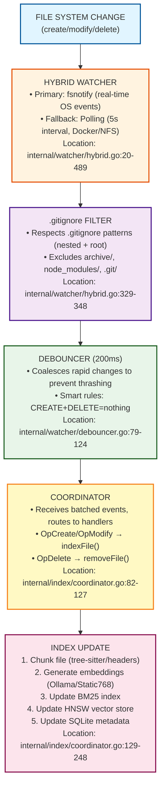
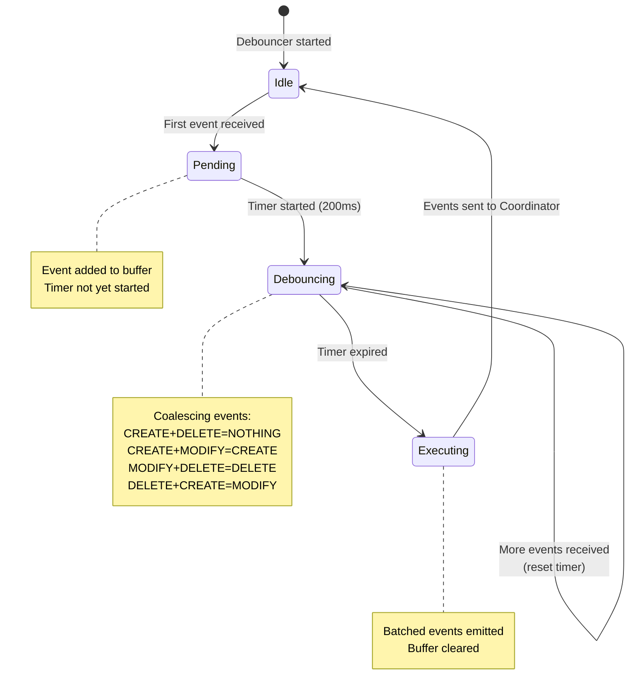
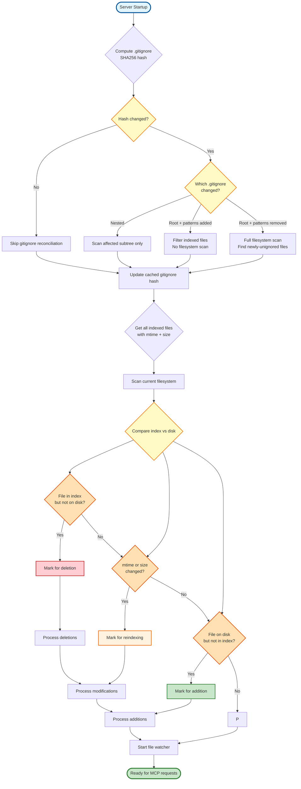
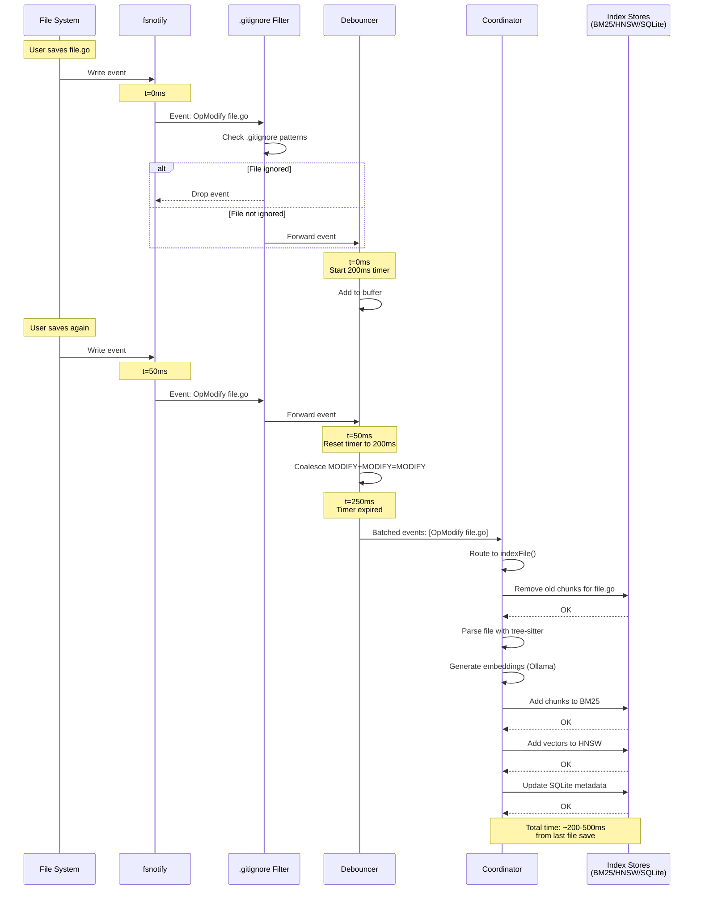
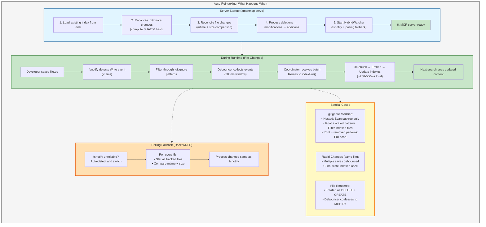

# Auto-Reindexing in AmanMCP - Deep Dive

## Summary

AmanMCP uses a **real-time file watcher** combined with **startup reconciliation** to keep the index in sync with your codebase. Changes you make are detected and indexed automatically within ~200ms.

---

## How It Works: The Complete Flow



---

## Key Components

### 1. HybridWatcher (`internal/watcher/hybrid.go`)

**What it does:** Monitors your codebase for file changes in real-time.

**How it works:**
- **Primary method**: Uses `fsnotify` (lines 71-74) for OS-level file events
- **Fallback method**: Polling every 5 seconds (lines 101) for environments where fsnotify doesn't work (Docker, NFS, network drives)
- **Automatic detection**: Tries fsnotify first, falls back if it fails (line 76-78)

**Events detected:**
| Event | Code | Description |
|-------|------|-------------|
| `OpCreate` | 0 | New file created |
| `OpModify` | 1 | Existing file modified |
| `OpDelete` | 2 | File deleted |
| `OpRename` | 3 | File renamed (becomes MODIFY via debouncer) |
| `OpGitignoreChange` | 4 | .gitignore file changed |
| `OpConfigChange` | 5 | .amanmcp.yaml changed |

### 2. Debouncer (`internal/watcher/debouncer.go`)

**What it does:** Prevents index thrashing from rapid file changes (like saving multiple times quickly).

**How it works:**
- Collects events for 200ms (configurable)
- Coalesces related events using smart rules (lines 79-124):
  ```
  CREATE + MODIFY = CREATE (file still new)
  CREATE + DELETE = NOTHING (file never existed)
  MODIFY + DELETE = DELETE (file gone)
  DELETE + CREATE = MODIFY (file replaced)
  ```
- Emits batched events to the Coordinator

**State Machine:**



### 3. Coordinator (`internal/index/coordinator.go`)

**What it does:** The brain of the indexing system. Routes events to appropriate handlers.

**Key methods:**
- `HandleEvents()` (lines 82-98): Entry point for batched events
- `indexFile()` (lines 129-248): Indexes new or modified files
- `removeFile()` (lines 251-291): Removes deleted files from index
- `handleGitignoreChange()` (lines 313-369): Smart .gitignore reconciliation

**indexFile() flow:**
1. Stat file, check size < 100MB
2. Skip symlinks and binary files
3. Detect language (Go, TypeScript, etc.)
4. Remove old chunks (for re-indexing modified files)
5. Parse with tree-sitter (code) or header-based (markdown)
6. Generate embeddings via Ollama/Static768
7. Add to BM25 + HNSW + SQLite

### 4. Server Integration (`cmd/amanmcp/cmd/serve.go`)

**Key point:** Watcher runs in **background goroutine** (line 285), doesn't block MCP handshake.

```go
// Line 309-319: Watcher configuration
opts := watcher.Options{
    DebounceWindow:  200 * time.Millisecond,
    PollInterval:    5 * time.Second,
    EventBufferSize: 1000,
}
```

---

## Startup Reconciliation

When the MCP server starts, it detects changes made while it was stopped:

### Phase 1: Gitignore Reconciliation (line 346)
**Location:** `coordinator.go:665-709`

- Computes SHA256 hash of all .gitignore files
- Compares against cached hash in SQLite
- If changed, runs smart reconciliation:
  - **Nested .gitignore**: Only scans affected subtree
  - **Root .gitignore + patterns added**: No filesystem scan, just filters indexed files
  - **Patterns removed**: Full scan to find newly-unignored files

### Phase 2: File Reconciliation (line 352)
**Location:** `coordinator.go:830-893`

- Gets all indexed files with their mtime + size
- Scans current filesystem
- Detects:
  - **Deleted**: In index but not on disk
  - **Modified**: mtime or size changed
  - **Added**: On disk but not in index
- Processes changes deterministically: deletions → modifications → additions

### Decision Tree: Startup Reconciliation



---

## Tracking Methods

| Method | What it tracks | When used |
|--------|----------------|-----------|
| **mtime + size** | Quick change detection | Real-time watcher, startup reconciliation |
| **Content hash (SHA256)** | Exact content verification | Stored in metadata for validation |
| **Gitignore hash** | .gitignore file changes | Cached in SQLite, checked on startup |

---

## Key File Locations

| Component | File | Key Lines |
|-----------|------|-----------|
| Watcher Interface | `internal/watcher/watcher.go` | 8-138 |
| Hybrid Watcher | `internal/watcher/hybrid.go` | 20-489 |
| Polling Fallback | `internal/watcher/polling.go` | 15-185 |
| Debouncer | `internal/watcher/debouncer.go` | 9-184 |
| Coordinator | `internal/index/coordinator.go` | 60-1025 |
| Server Integration | `cmd/amanmcp/cmd/serve.go` | 305-439 |
| Metadata Store | `internal/store/metadata.go` | 114-645 |
| Search Engine | `internal/search/engine.go` | 156-203 |

---

## Why Are My Changes Being Reindexed?

Based on the architecture:

1. **The MCP server is running** with a background file watcher
2. **When you edit a file**, fsnotify detects the `Write` event
3. **After 200ms debounce**, the event is batched and sent to the Coordinator
4. **Coordinator calls `indexFile()`**, which:
   - Removes old chunks for that file
   - Re-chunks the file
   - Generates new embeddings
   - Updates BM25 + HNSW + SQLite
5. **Next search query** sees the updated content

**If the server was restarted** since the initial indexing:
- Startup reconciliation detects your file changes via mtime/size comparison
- Processes them before the watcher starts listening

### Sequence Diagram: File System Change Flow



---

## Verification

To confirm auto-reindexing is working:

```bash
# Check index status (CLI)
amanmcp status

# Or via MCP tool (when server is running)
# Use index_status tool to see file counts, last indexed time
```

Changes should be reflected in search results within ~200-500ms of saving a file.

The "Last indexed" timestamp in `amanmcp status` is updated after every incremental update when the MCP server is running.

---

## Auto-Reindexing Operational Guide


