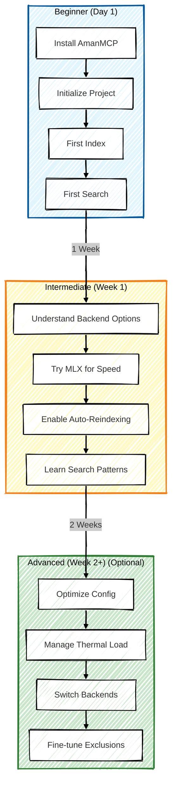

# Guides: How-To Documentation

Task-based guides for getting things done with AmanMCP. Each guide solves a specific problem or shows you how to accomplish a task.

---

## Guide Navigation Map

---

## Getting Started

| Guide | What You'll Learn | When to Use |
|-------|-------------------|-------------|
| [First-Time User Guide](first-time-user-guide.md) | Complete walkthrough from install to first search | You're new to AmanMCP |
| [Homebrew Setup](homebrew-setup-guide.md) | Installing via Homebrew on macOS | You prefer Homebrew package manager |

---

## Configuration & Optimization

| Guide | What You'll Learn | When to Use |
|-------|-------------------|-------------|
| [MLX Setup](mlx-setup.md) | Using MLX embeddings on Apple Silicon | You have a Mac and want faster embeddings |
| [Backend Switching](backend-switching.md) | Switching between Ollama and MLX | You want to try different embedding backends |
| [Auto-Reindexing](AUTO-REINDEXING.md) | Automatic index updates on file changes | You want seamless background updates |
| [Thermal Management](thermal-management.md) | CPU temperature optimization | Your laptop runs hot during indexing |

---

## By Use Case

### "I want to optimize performance"
1. [MLX Setup](mlx-setup.md) - ~1.7x faster on Apple Silicon
2. [Thermal Management](thermal-management.md) - Reduce CPU heat
3. [Backend Switching](backend-switching.md) - Compare backends

### "I'm setting up for the first time"
1. [First-Time User Guide](first-time-user-guide.md) - Complete walkthrough
2. [Homebrew Setup](homebrew-setup-guide.md) - If using Homebrew

### "I want automatic updates"
1. [Auto-Reindexing](AUTO-REINDEXING.md) - File watcher setup

---

## User Journey Map

---

## Related Documentation

- [Concepts](../concepts/) - Understand how systems work
- [Reference](../reference/) - Command and config reference
- [Getting Started](../getting-started/) - Quick start installation

---

## Contributing Guides

Found a task that needs a guide? Want to improve existing guides?
1. Check [open issues](https://github.com/Aman-CERP/amanmcp/issues?q=is%3Aissue+is%3Aopen+label%3Adocumentation)
2. File a new issue describing the guide needed
3. Submit a PR with your guide

Good guides:
- ✅ Solve a specific task or problem
- ✅ Include step-by-step instructions
- ✅ Show expected output
- ✅ Link to related concepts for deeper learning
