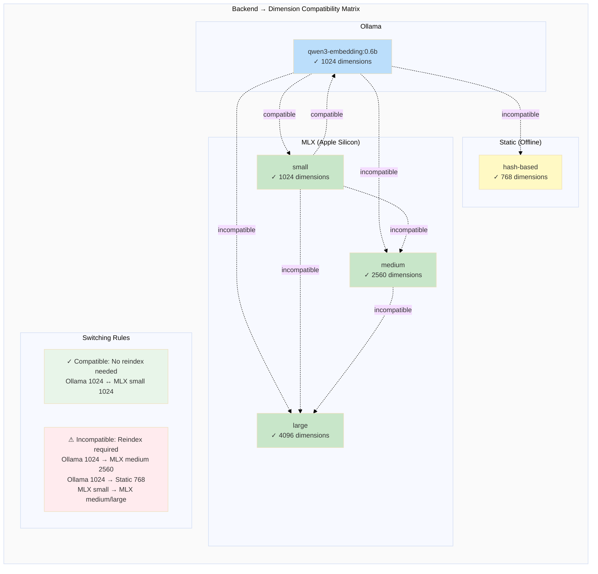
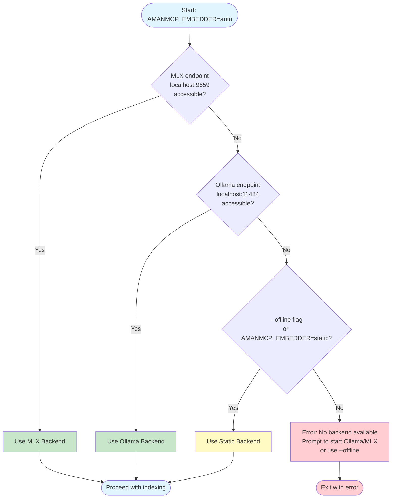
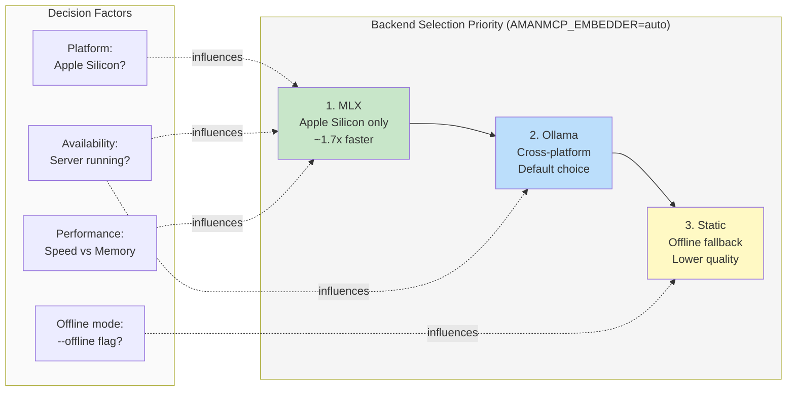

# Backend Switching Guide

AmanMCP supports multiple embedding backends. This guide covers how to switch between them and when to use each.

---

## Available Backends

| Backend | Platform | Speed | Memory | Best For |
|---------|----------|-------|--------|----------|
| **Ollama** | Cross-platform | Good | ~3-6GB | Default, easy setup |
| **MLX** | Apple Silicon | ~1.7x faster | ~3GB | M1/M2/M3/M4 Macs |
| **Static** | Any | Instant | <100MB | Offline, CI/CD |

---

## Quick Commands

```bash
# Check current backend status
./scripts/switch-backend.sh status

# Switch to MLX (Apple Silicon)
make switch-backend-mlx
amanmcp index --force .

# Switch to Ollama
make switch-backend-ollama
amanmcp index --force .

# Use static (offline mode)
amanmcp index --backend=static .
```

**Important:** When switching backends with different dimensions, you must reindex with `--force`.

---

## Ollama (Default)

Ollama is the default backend on all platforms. It provides good performance with minimal setup.

### Setup

```bash
# Install and start Ollama
make install-ollama
make start-ollama

# Or manually
brew install ollama
ollama serve
ollama pull qwen3-embedding:0.6b
```

### Usage

```bash
# Index with Ollama (default)
amanmcp index .

# Explicitly use Ollama
amanmcp index --backend=ollama .
```

### Configuration

| Variable | Default | Description |
|----------|---------|-------------|
| `AMANMCP_OLLAMA_HOST` | `http://localhost:11434` | Ollama endpoint |
| `AMANMCP_OLLAMA_MODEL` | `qwen3-embedding:0.6b` | Embedding model |
| `AMANMCP_OLLAMA_TIMEOUT` | `5m` | Request timeout |

---

## MLX (Apple Silicon)

MLX provides ~1.7x faster embeddings on Apple Silicon. Requires Python and more RAM.

### Setup

```bash
make install-mlx
make start-mlx
```

### Usage

```bash
# Index with MLX
amanmcp index --backend=mlx .

# Or set environment variable
export AMANMCP_EMBEDDER=mlx
amanmcp index .
```

### Configuration

| Variable | Default | Description |
|----------|---------|-------------|
| `AMANMCP_MLX_ENDPOINT` | `http://localhost:9659` | MLX server endpoint |
| `AMANMCP_MLX_MODEL` | `small` | Model: `small`, `medium`, `large` |

For detailed MLX setup, see [MLX Setup Guide](mlx-setup.md).

---

## Static (Offline)

Static embeddings use hash-based vectors. No external dependencies, but lower search quality (~35% of neural).

### When to Use

- CI/CD pipelines without GPU
- Air-gapped environments
- Testing and development
- BM25-only search is sufficient

### Usage

```bash
# Initialize in offline mode
amanmcp init --offline

# Index with static backend
amanmcp index --backend=static .
```

**Note:** Static mode provides BM25 keyword search. Semantic search quality is significantly reduced.

---

## Switching Backends

### Check Current Status

```bash
# Show which backend is active
./scripts/switch-backend.sh status

# Or use amanmcp
amanmcp index info
```

### Switch Process

1. **Stop current backend** (if running)
2. **Start new backend**
3. **Reindex** (required if dimensions differ)

```bash
# Example: Ollama → MLX
make stop-ollama
make start-mlx
amanmcp index --force .
```

### Dimension Compatibility

Different backends may produce different embedding dimensions:

| Backend | Model | Dimensions |
|---------|-------|------------|
| Ollama | qwen3-embedding:0.6b | 1024 |
| MLX | small | 1024 |
| MLX | medium | 2560 |
| MLX | large | 4096 |
| Static | - | 768 |

**When dimensions change, you must reindex.** AmanMCP will warn you if there's a mismatch.

#### Dimension Compatibility Matrix



---

## Auto-Detection

By default (`AMANMCP_EMBEDDER=auto`), AmanMCP tries backends in order:

1. **MLX** - If server is running on localhost:9659
2. **Ollama** - If server is running on localhost:11434
3. **Error** - Prompts user to start a backend or use `--offline`

### Auto-Detection Decision Flow



### Backend Selection Priority



To force a specific backend:

```bash
# Force Ollama even if MLX is available
AMANMCP_EMBEDDER=ollama amanmcp index .

# Force MLX
AMANMCP_EMBEDDER=mlx amanmcp index .

# Force static
AMANMCP_EMBEDDER=static amanmcp index .
```

---

## Makefile Targets

| Target | Description |
|--------|-------------|
| `make install-ollama` | Install Ollama + pull model |
| `make start-ollama` | Start Ollama server |
| `make stop-ollama` | Stop Ollama server |
| `make install-mlx` | Install MLX server |
| `make start-mlx` | Start MLX server |
| `make switch-backend-mlx` | Switch to MLX |
| `make switch-backend-ollama` | Switch to Ollama |
| `make verify-install` | Verify installation |

---

## Troubleshooting

### "Dimension mismatch" Error

```bash
# Reindex with current backend
amanmcp index --force .
```

### Backend Not Detected

```bash
# Check what's running
./scripts/switch-backend.sh status

# Check endpoints
curl http://localhost:11434/api/tags  # Ollama
curl http://localhost:9659/health      # MLX
```

### Fallback Behavior

If the configured backend fails, AmanMCP will:

1. Log a warning
2. Fall back to BM25-only search (keywords still work)
3. **Not** silently switch to another neural backend

To explicitly allow fallback:

```bash
amanmcp init --offline  # Allows static fallback
```

---

## See Also

- [MLX Setup Guide](mlx-setup.md) - Detailed MLX configuration
- [Command Reference](../reference/commands.md) - All CLI commands
- [Configuration Reference](../reference/configuration.md) - All config options
