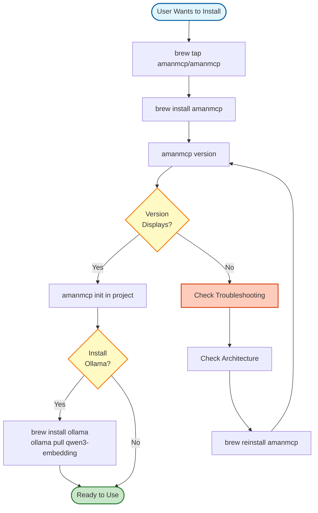
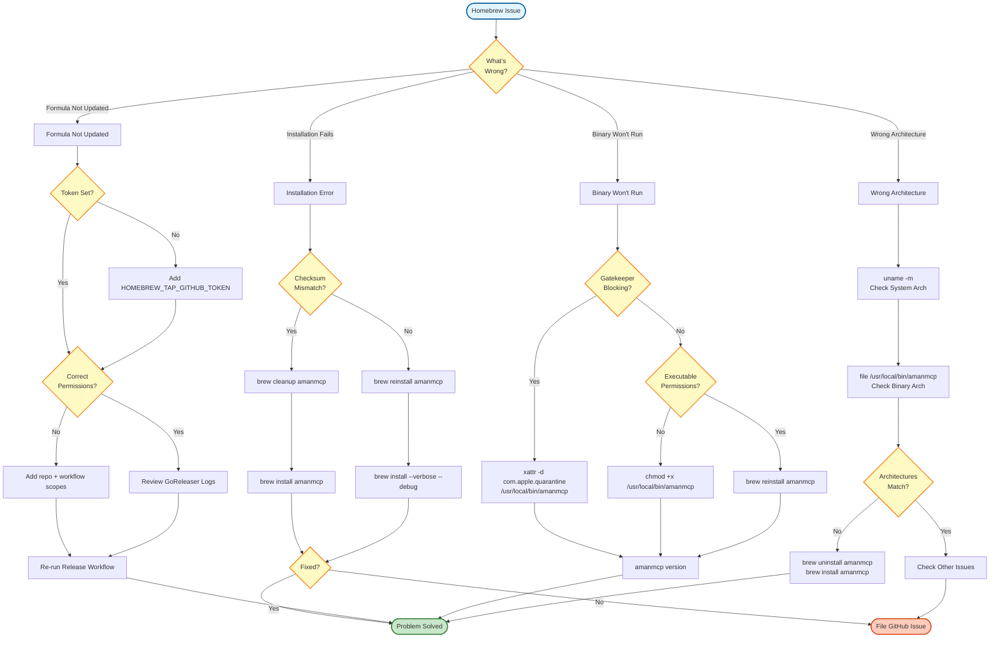

# Homebrew Setup Guide

**For Maintainers:** Step-by-step guide to set up and maintain the AmanMCP Homebrew tap.

---

## Overview

AmanMCP is distributed via Homebrew using a custom tap. This guide covers:

1. Creating the tap repository (one-time setup)
2. Configuring GitHub secrets
3. How automated releases work
4. Manual release process
5. Testing formulas locally
6. Troubleshooting

### Installation Workflow



---

## Part 1: One-Time Setup (Create Tap Repository)

### Step 1: Create the Repository

Create a new GitHub repository:

- **Name:** `homebrew-amanmcp` (must start with `homebrew-`)
- **Visibility:** Public
- **Initialize:** with README

```bash
# Clone the new repository
git clone https://github.com/YOUR_ORG/homebrew-amanmcp.git
cd homebrew-amanmcp
```

### Step 2: Create Directory Structure

```bash
mkdir -p Formula
```

### Step 3: Create Initial Formula

Create `Formula/amanmcp.rb` with a placeholder:

```ruby
# Formula/amanmcp.rb
# This file is auto-updated by GoReleaser on each release.
# Manual edits will be overwritten.

class Amanmcp < Formula
  desc "Local-first RAG MCP server for AI coding assistants"
  homepage "https://github.com/Aman-CERP/amanmcp"
  version "0.0.0"
  license "Apache-2.0"

  # Placeholder - GoReleaser will update this
  on_macos do
    on_arm do
      url "https://example.com/placeholder.tar.gz"
      sha256 "0000000000000000000000000000000000000000000000000000000000000000"
    end
    on_intel do
      url "https://example.com/placeholder.tar.gz"
      sha256 "0000000000000000000000000000000000000000000000000000000000000000"
    end
  end

  def install
    bin.install "amanmcp"
  end

  def caveats
    <<~EOS
      To get started:
        cd your-project
        amanmcp init

      For best search quality, install Ollama:
        brew install ollama && ollama serve
        ollama pull qwen3-embedding:0.6b
    EOS
  end

  test do
    system "#{bin}/amanmcp", "version"
  end
end
```

### Step 4: Push to GitHub

```bash
git add .
git commit -m "Initial tap setup"
git push origin main
```

---

## Part 2: Configure GitHub Secrets

For automated formula updates, you need a Personal Access Token (PAT).

### Step 1: Generate PAT

1. Go to GitHub → Settings → Developer settings → Personal access tokens → Tokens (classic)
2. Click "Generate new token (classic)"
3. Set expiration (recommend: 1 year)
4. Select scopes:
   - `repo` (full control of private repositories)
   - `workflow` (update GitHub Action workflows)
5. Generate and copy the token

### Step 2: Add Secret to Main Repository

1. Go to `amanmcp` repository (main project, not the tap)
2. Settings → Secrets and variables → Actions
3. Click "New repository secret"
4. Name: `HOMEBREW_TAP_GITHUB_TOKEN`
5. Value: paste your PAT
6. Click "Add secret"

---

## Part 3: How Automated Releases Work

When you push a version tag, everything happens automatically:

```
┌──────────────────────────────────────────────────────────────┐
│ Push tag: git push origin v1.0.0                              │
│                         │                                     │
│                         ▼                                     │
│ ┌─────────────────────────────────────────────────────────┐  │
│ │ GitHub Actions: .github/workflows/release.yml           │  │
│ │                                                          │  │
│ │ 1. Checkout code                                         │  │
│ │ 2. Setup Go + dependencies                               │  │
│ │ 3. Run tests                                             │  │
│ │ 4. Run GoReleaser                                        │  │
│ └─────────────────────────────────────────────────────────┘  │
│                         │                                     │
│         ┌───────────────┼───────────────┐                    │
│         ▼               ▼               ▼                    │
│   Build binaries   Create release   Update formula           │
│   (arm64, amd64)   (GitHub)         (homebrew-amanmcp)       │
│                                                               │
└──────────────────────────────────────────────────────────────┘
```

### What GoReleaser Does

1. Builds `darwin/arm64` and `darwin/amd64` binaries
2. Generates SHA256 checksums
3. Creates GitHub release with assets
4. Auto-updates formula in `homebrew-amanmcp` tap

### What Users See

After release, users can:

```bash
# First install
brew tap amanmcp/amanmcp
brew install amanmcp

# Upgrade existing
brew upgrade amanmcp
```

---

## Part 4: Manual Release Process

### Using the Release Script

```bash
# Navigate to project root
cd /path/to/amanmcp

# Run release script with version
./scripts/release.sh v1.0.0
```

### What the Script Does

1. **Validates version format** - Must be `vX.Y.Z` or `vX.Y.Z-suffix`
2. **Checks for uncommitted changes** - Fails if working tree is dirty
3. **Warns if not on main branch** - Prompts for confirmation
4. **Checks if tag exists** - Fails if tag already exists
5. **Updates VERSION file** - Writes version without `v` prefix
6. **Runs CI checks** - `make ci-check` must pass
7. **Commits VERSION change** - With conventional commit message
8. **Creates annotated tag** - With release notes
9. **Pushes to origin** - Triggers GitHub Actions

### Version Format Examples

| Version | Type | Description |
|---------|------|-------------|
| `v1.0.0` | Stable | First stable release |
| `v1.0.1` | Patch | Bug fix release |
| `v1.1.0` | Minor | New features, backwards compatible |
| `v2.0.0` | Major | Breaking changes |
| `v1.0.0-alpha.1` | Pre-release | Alpha testing |
| `v1.0.0-beta.1` | Pre-release | Beta testing |
| `v1.0.0-rc.1` | Pre-release | Release candidate |

---

## Part 5: Testing Formula Locally

### Test Before Release

```bash
# Build binary locally
make build

# Test version command works
./bin/amanmcp version

# Test with custom ldflags (simulating release build)
go build -ldflags "-X github.com/Aman-CERP/amanmcp/pkg/version.Version=1.0.0-test" \
    -o bin/amanmcp ./cmd/amanmcp
./bin/amanmcp version
```

### Test Formula Locally

```bash
# Create a local formula file for testing
cat > /tmp/amanmcp.rb << 'EOF'
class Amanmcp < Formula
  desc "Local-first RAG MCP server"
  homepage "https://github.com/Aman-CERP/amanmcp"
  version "test"

  # Point to local binary
  url "file:///path/to/your/amanmcp_test.tar.gz"
  sha256 "YOUR_SHA256"

  def install
    bin.install "amanmcp"
  end

  test do
    system "#{bin}/amanmcp", "version"
  end
end
EOF

# Install from local formula
brew install --build-from-source /tmp/amanmcp.rb

# Test it works
amanmcp version
```

### Test Published Tap

```bash
# Tap the repository
brew tap amanmcp/amanmcp

# Check formula
brew info amanmcp

# Install
brew install amanmcp

# Verify
amanmcp version
which amanmcp
```

---

## Part 6: Troubleshooting

### Troubleshooting Decision Tree



### Formula Update Failed

**Symptom:** Release workflow succeeds but formula not updated.

**Check:**
1. Is `HOMEBREW_TAP_GITHUB_TOKEN` set?
   ```bash
   # In GitHub: repo → Settings → Secrets → Actions
   ```
2. Does PAT have correct permissions? (repo + workflow scopes)
3. Check GoReleaser logs in GitHub Actions

### Checksum Mismatch

**Symptom:** `Error: SHA256 mismatch`

**Cause:** Formula points to old binary but checksum was updated, or download corrupted.

**Solution:**
```bash
# Clear cache and retry
brew cleanup amanmcp
brew install amanmcp
```

### Binary Not Signed

**Symptom:** macOS Gatekeeper blocks execution.

**Solution for users:**
```bash
# Allow the binary
xattr -d com.apple.quarantine /usr/local/bin/amanmcp
```

### Wrong Architecture

**Symptom:** Binary doesn't run (wrong arch for your Mac).

**Check:**
```bash
# Check your architecture
uname -m
# arm64 = Apple Silicon
# x86_64 = Intel

# Check binary architecture
file /usr/local/bin/amanmcp
```

**Solution:** Reinstall - Homebrew auto-selects correct architecture.

---

## Quick Reference

| Task | Command |
|------|---------|
| Release new version | `./scripts/release.sh v1.0.0` |
| Check release status | Visit GitHub Actions tab |
| Test formula locally | `brew install --build-from-source ./Formula/amanmcp.rb` |
| Update tap | `brew tap --force-auto-update amanmcp/amanmcp` |
| Reinstall | `brew reinstall amanmcp` |
| Check logs | `brew install amanmcp --verbose --debug` |

---

## Related Files

| File | Purpose |
|------|---------|
| `.goreleaser.yaml` | GoReleaser configuration |
| `.github/workflows/release.yml` | Release workflow |
| `scripts/release.sh` | Release helper script |
| `pkg/version/version.go` | Version embedding |

---

*Last updated: 2026-01-05*
