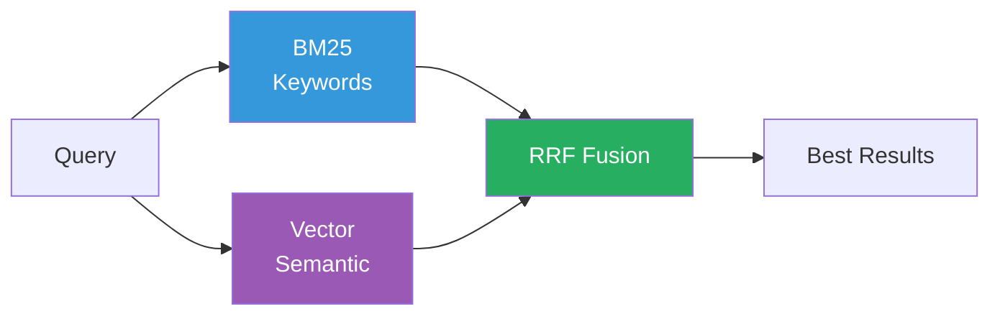
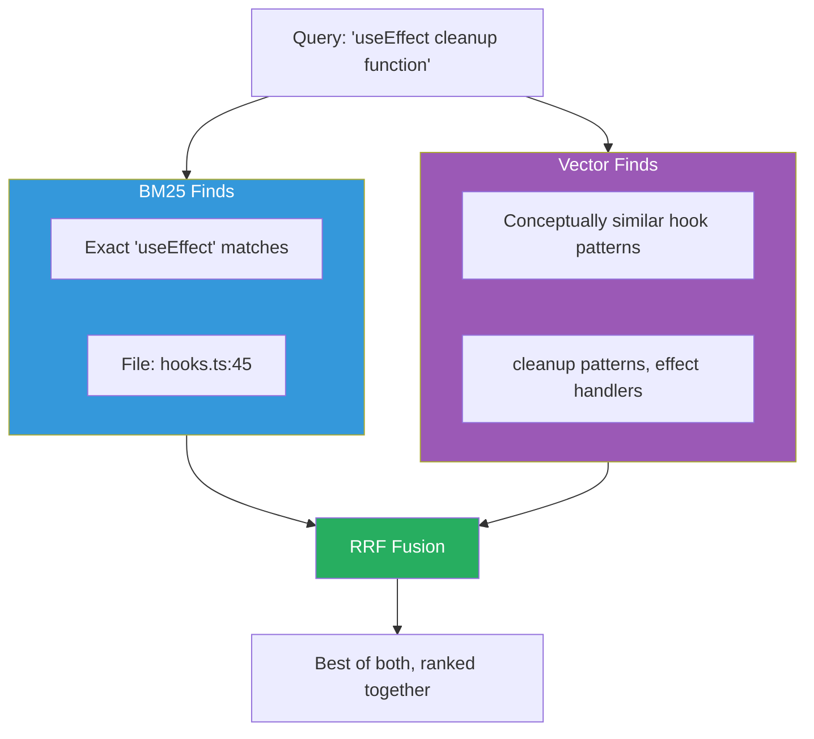
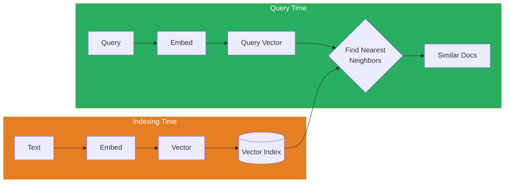
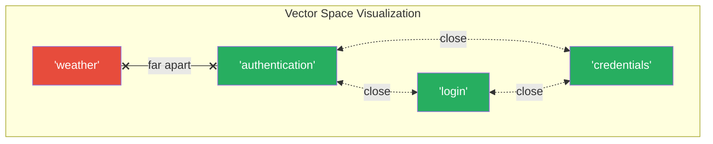
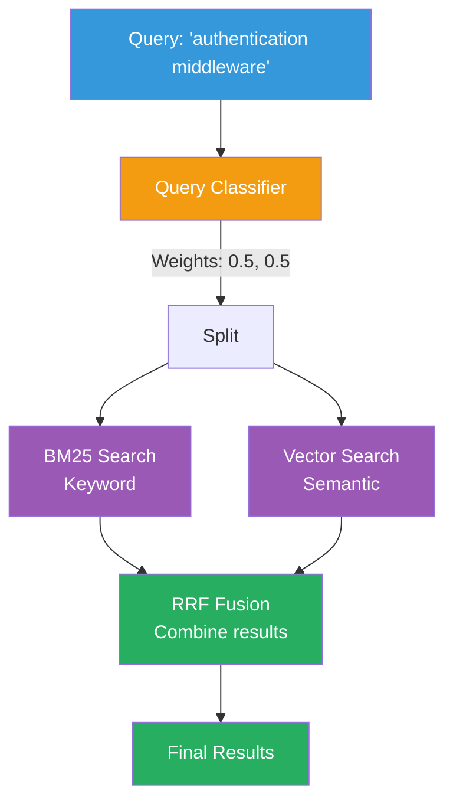
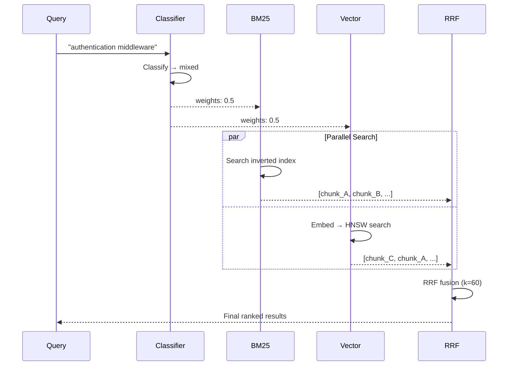

# Hybrid Search Concepts

**Version:** 1.0.0
**Last Updated:** 2025-12-28

Learn how AmanMCP combines keyword and semantic search for best results.

---

## Overview

Hybrid search combines two complementary approaches:

- **BM25 (Keyword)**: Finds exact term matches
- **Vector (Semantic)**: Finds meaning-based matches

Neither alone is sufficient. Together, they're powerful.



---

## Why Hybrid?

### The Keyword Search Problem

BM25 is great for:

- Error codes: `ERR_CONNECTION_REFUSED`
- Function names: `handleUserLogin`
- Exact phrases: `"authentication middleware"`

But fails for:

- Synonyms: "auth" vs "authentication"
- Concepts: "how to validate user input"
- Typos: "autentication"

### The Semantic Search Problem

Vector search is great for:

- Natural language: "how does user login work"
- Concepts: "security best practices"
- Similar meaning: finds "authentication" when searching "login"

But fails for:

- Exact identifiers: `ERR_001` might not match
- Rare terms: domain-specific vocabulary
- Code: variable names don't have "meaning"

### The Solution: Hybrid

Combine both and get best of each:



---

## How BM25 Works

BM25 (Best Match 25) is a ranking function based on term frequency.

### Core Idea

```
Score = Σ IDF(term) × TF(term, doc) × normalization

Where:
- IDF = Inverse Document Frequency (rare terms score higher)
- TF = Term Frequency (more occurrences = higher score)
- normalization = adjusts for document length
```

### Example

```
Documents:
1. "authentication middleware for API"
2. "auth helper functions"
3. "user profile page"

Query: "authentication"

Scores:
1. High (exact match, technical doc)
2. Medium (partial match "auth")
3. Zero (no match)
```

### In AmanMCP

```go
type BM25Index struct {
    documents map[string][]string  // docID -> tokens
    idf       map[string]float64   // term -> IDF score
    avgLen    float64              // average doc length
}

func (b *BM25Index) Search(query string) []ScoredResult {
    tokens := tokenize(query)
    scores := make(map[string]float64)

    for _, token := range tokens {
        for docID, docTokens := range b.documents {
            tf := countOccurrences(token, docTokens)
            idf := b.idf[token]
            scores[docID] += b.score(tf, idf, len(docTokens))
        }
    }

    return rankByScore(scores)
}
```

---

## How Vector Search Works

Vector search finds semantically similar documents using embeddings.

### Core Idea



### Embeddings

An embedding is a dense vector (e.g., 768 dimensions) that captures meaning:

```
"authentication" → [0.12, -0.34, 0.56, ...]  (768 numbers)
"login"          → [0.11, -0.32, 0.58, ...]  (similar vector)
"weather"        → [0.89, 0.12, -0.45, ...]  (different vector)
```

Similar meanings → Similar vectors → Close in vector space



### HNSW (Hierarchical Navigable Small Worlds)

Finding nearest neighbors in 768 dimensions could be slow. HNSW solves this:

```
Brute force: O(n) - check every document
HNSW:        O(log n) - navigate graph structure
```

For 100K documents:

- Brute force: 100,000 comparisons
- HNSW: ~17 comparisons

### In AmanMCP

```go
type VectorIndex struct {
    graph    *hnsw.Graph[uint64]
    embedder Embedder
}

func (v *VectorIndex) Search(query string) []ScoredResult {
    // Convert query to vector
    embedding, _ := v.embedder.Embed(query)

    // Find nearest neighbors using HNSW
    neighbors := v.graph.Search(embedding, 20)

    // Convert to results
    return toResults(neighbors)
}
```

---

## Reciprocal Rank Fusion (RRF)

RRF combines results from multiple sources.

### The Problem

BM25 gives: [A, B, C, D]
Vector gives: [C, A, D, B]

How to combine? Can't just average scores (different scales).

### The Solution: RRF

Score based on rank, not absolute score:

```
RRF(doc) = Σ weight_i / (k + rank_i)

Where:
- k = 60 (smoothing constant)
- rank_i = position in source list
- weight_i = source weight
```

### Example

```
BM25 results:      Vector results:
1. chunk_A         1. chunk_C
2. chunk_B         2. chunk_A
3. chunk_C         3. chunk_D
4. chunk_D         4. chunk_B

Weights: BM25 = 0.35, Vector = 0.65

chunk_A:
  BM25: 0.35 / (60 + 1) = 0.00574
  Vec:  0.65 / (60 + 2) = 0.01048
  Total: 0.01622

chunk_C:
  BM25: 0.35 / (60 + 3) = 0.00556
  Vec:  0.65 / (60 + 1) = 0.01066
  Total: 0.01622

Final ranking: A ≈ C > B > D
```

### Why k=60?

The constant k prevents extreme values:

- Low k: Top ranks dominate too much
- High k: Rankings matter less
- k=60: Good balance, empirically validated

---

## Query Classification

Different queries need different weights:

```
Query Type          BM25    Vector
─────────────────────────────────
Error codes         0.8     0.2     (need exact match)
Identifiers         0.7     0.3     (technical terms)
Mixed               0.5     0.5     (balanced)
Natural language    0.25    0.75    (need meaning)
```

### Classification Patterns

```go
func classifyQuery(query string) (bm25Weight, vecWeight float64) {
    // Error code pattern
    if isErrorCode(query) {
        return 0.8, 0.2
    }

    // Technical identifier
    if isCamelCase(query) || isSnakeCase(query) {
        return 0.7, 0.3
    }

    // Quoted exact phrase
    if strings.HasPrefix(query, "\"") {
        return 0.9, 0.1
    }

    // Natural language
    if isNaturalLanguage(query) {
        return 0.25, 0.75
    }

    // Default: balanced
    return 0.5, 0.5
}
```

---

## In AmanMCP

### Full Search Flow





### Code Structure

```
internal/search/
├── engine.go      # Coordinates hybrid search
├── bm25.go        # BM25 implementation
├── vector.go      # Vector search wrapper
├── fusion.go      # RRF implementation
└── classifier.go  # Query classification
```

---

## Common Mistakes

### 1. Using Only One Method

```go
// BAD: BM25 only
results := bm25.Search(query)

// BAD: Vector only
results := vector.Search(query)

// GOOD: Hybrid
results := engine.HybridSearch(query)
```

### 2. Equal Weights for All Queries

```go
// BAD: Always 50/50
return bm25.Search(query, 0.5), vector.Search(query, 0.5)

// GOOD: Query-dependent weights
weights := classifier.Classify(query)
return fusion.Combine(bm25, vector, weights)
```

### 3. Sequential Execution

```go
// BAD: Sequential (slow)
bm25Results := bm25.Search(query)
vecResults := vector.Search(query)

// GOOD: Parallel (fast)
var wg sync.WaitGroup
wg.Add(2)
go func() { bm25Results = bm25.Search(query); wg.Done() }()
go func() { vecResults = vector.Search(query); wg.Done() }()
wg.Wait()
```

---

## Performance

### Latency Targets

| Component | Target |
|-----------|--------|
| Query classification | < 2ms |
| BM25 search | < 5ms |
| Vector search | < 10ms |
| RRF fusion | < 1ms |
| **Total** | **< 20ms** |

### Scaling

| Documents | BM25 | Vector (HNSW) |
|-----------|------|---------------|
| 10K | < 2ms | < 1ms |
| 100K | < 10ms | < 5ms |
| 300K | < 20ms | < 10ms |

---

## Further Reading

- [BM25 Wikipedia](https://en.wikipedia.org/wiki/Okapi_BM25)
- [HNSW Paper](https://arxiv.org/abs/1603.09320)
- [RRF Paper](https://plg.uwaterloo.ca/~gvcormac/cormacksigir09-rrf.pdf)
- [EmbeddingGemma](https://huggingface.co/onnx-community/embeddinggemma-300m-ONNX)

---

*Hybrid search gives you precision AND recall. Use both.*
