# MLX Server Setup (Apple Silicon)

The bundled MLX embedding server provides **~1.7x faster** embedding throughput than Ollama on Apple Silicon Macs.

---

## Quick Start

```bash
# One-command setup: venv + dependencies + model download
make install-mlx

# Start the server
make start-mlx

# Index with MLX
amanmcp index --backend=mlx .
```

### Setup Workflow


---

## When to Use MLX

| Use MLX When | Use Ollama When |
|--------------|-----------------|
| You have Apple Silicon (M1/M2/M3/M4) | Cross-platform needed |
| Speed is priority | Simpler setup preferred |
| You have 8GB+ RAM available | Lower RAM usage needed |

**Performance comparison:**

| Backend | Speed | Memory | Setup |
|---------|-------|--------|-------|
| MLX | ~1.7x faster | ~3GB | Requires Python |
| Ollama | Baseline | ~3-6GB | One binary |

### Decision Matrix: Should You Use MLX?


---

## Installation

### Prerequisites

- Apple Silicon Mac (M1/M2/M3/M4)
- Python 3.9+
- 8GB+ RAM available

### Automated Setup

```bash
# From project root
make install-mlx
```

This command:

1. Creates Python virtual environment in `mlx-server/.venv`
2. Installs dependencies (mlx, mlx-lm, fastapi)
3. Downloads the default embedding model (~400MB)

### Manual Setup

```bash
cd mlx-server

# Create virtual environment
python3 -m venv .venv
source .venv/bin/activate

# Install dependencies
pip install -r requirements.txt

# Start server (downloads model on first run)
python server.py
```

---

## Running the Server

### Start/Stop

```bash
# Start (foreground)
make start-mlx

# Or run directly
cd mlx-server && source .venv/bin/activate && python server.py

# Check if running
curl http://localhost:9659/health
```

### Auto-Start on Login (Optional)

Create `~/Library/LaunchAgents/com.amanmcp.mlx-server.plist`:

```xml
<?xml version="1.0" encoding="UTF-8"?>
<!DOCTYPE plist PUBLIC "-//Apple//DTD PLIST 1.0//EN" "http://www.apple.com/DTDs/PropertyList-1.0.dtd">
<plist version="1.0">
<dict>
    <key>Label</key>
    <string>com.amanmcp.mlx-server</string>
    <key>ProgramArguments</key>
    <array>
        <string>/path/to/amanmcp/mlx-server/.venv/bin/python</string>
        <string>/path/to/amanmcp/mlx-server/server.py</string>
    </array>
    <key>WorkingDirectory</key>
    <string>/path/to/amanmcp/mlx-server</string>
    <key>RunAtLoad</key>
    <true/>
    <key>KeepAlive</key>
    <true/>
</dict>
</plist>
```

Enable with:

```bash
launchctl load ~/Library/LaunchAgents/com.amanmcp.mlx-server.plist
```

---

## Model Selection

MLX supports three model sizes:

| Model | Dimensions | Memory | Speed | Quality |
|-------|------------|--------|-------|---------|
| `small` | 1024 | ~900MB | Fastest | Good |
| `medium` | 2560 | ~2.5GB | Medium | Better |
| `large` | 4096 | ~4.5GB | Slower | Best |

### Model Comparison

```mermaid
graph TD
    classDef native fill:#e8f0fe,stroke:#4285f4,stroke-width:2px,color:#1967d2;
    classDef legacy fill:#f1f3f4,stroke:#5f6368,stroke-width:2px,color:#3c4043;
    classDef highlight fill:#e6fffa,stroke:#00b894,stroke-width:2px,color:#004d40;

    subgraph MLX [MLX Native Models]
        direction LR
        Small["⚡ <b>Small</b><br/>Fastest • 900MB RAM"]:::highlight
        Medium["⚖️ <b>Medium</b><br/>Balanced • 2.5GB RAM"]:::native
        Large["🧠 <b>Large</b><br/>Best Quality • 4.5GB RAM"]:::native
    end

    Ollama["🐢 <b>Ollama</b><br/>External • 3-6GB RAM"]:::legacy

    Small -->|"1.7x Faster"| Ollama
    Medium -->|"Similar Speed"| Ollama
    Large -->|"Higher Quality"| Ollama
```



**Recommendations:**

- **8GB RAM Mac**: Use `small` (leaves 7GB for other apps)
- **16GB RAM Mac**: Use `medium` (best quality/speed balance)
- **32GB+ RAM Mac**: Use `large` (maximum quality)
- **Codebase >100K files**: Use `small` (lower memory pressure)

### Changing Models

```bash
# Set model via environment variable
MODEL_NAME=small python server.py

# Or in AmanMCP
AMANMCP_MLX_MODEL=small amanmcp index .
```

**Note:** Changing model size requires reindexing (`amanmcp index --force .`).

---

## Configuration

### Environment Variables

| Variable | Default | Description |
|----------|---------|-------------|
| `PORT` | `9659` | Server port |
| `MODEL_NAME` | `small` | Model: `small`, `medium`, `large` |
| `LOG_LEVEL` | `INFO` | Logging level |
| `AMANMCP_MLX_MODELS_DIR` | `~/.amanmcp/models/mlx` | Model cache directory |

### AmanMCP Integration

```bash
# Force MLX backend for indexing
amanmcp index --backend=mlx .

# Or set environment variable
export AMANMCP_EMBEDDER=mlx
amanmcp index .
```

---

## Troubleshooting

### Troubleshooting Decision Tree


### Server Won't Start

```bash
# Check Python version (need 3.9+)
python3 --version

# Check port availability
lsof -i :9659

# Check logs
amanmcp-logs --source mlx -f
```

### Model Download Fails

```bash
# Check disk space (need ~500MB for small, ~5GB for large)
df -h ~

# Clear cache and retry
rm -rf ~/.amanmcp/models/mlx/hub
python server.py
```

### MLX Not Detected

```bash
# Verify MLX server is running
curl http://localhost:9659/health

# Check AmanMCP sees it
amanmcp setup --check
```

### Falls Back to Ollama

If AmanMCP falls back to Ollama when you want MLX:

```bash
# Explicitly force MLX
AMANMCP_EMBEDDER=mlx amanmcp index .

# Or use --backend flag
amanmcp index --backend=mlx .
```

---

## Monitoring

### View Logs

```bash
# Real-time MLX logs
amanmcp-logs --source mlx -f

# All logs (Go + MLX) merged
amanmcp-logs --source all -f
```

### Performance Monitoring

```bash
# Terminal 1: MLX server with logging
cd mlx-server && python server.py

# Terminal 2: Watch GPU/ANE usage
sudo asitop
```

---

## Uninstalling

```bash
# Remove MLX server
rm -rf mlx-server/.venv

# Remove cached models
rm -rf ~/.amanmcp/models/mlx

# Remove LaunchAgent (if configured)
launchctl unload ~/Library/LaunchAgents/com.amanmcp.mlx-server.plist
rm ~/Library/LaunchAgents/com.amanmcp.mlx-server.plist
```

---

## See Also

- [Backend Switching Guide](backend-switching.md) - Managing multiple backends
- [Command Reference](../reference/commands.md) - All CLI commands
- [Configuration Reference](../reference/configuration.md) - All config options
- [MLX Server README](../../mlx-server/README.md) - Detailed MLX documentation
