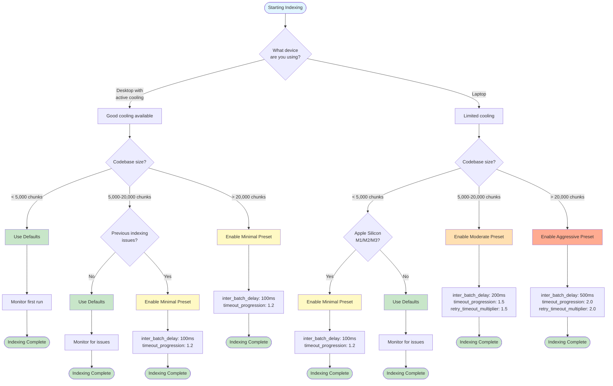
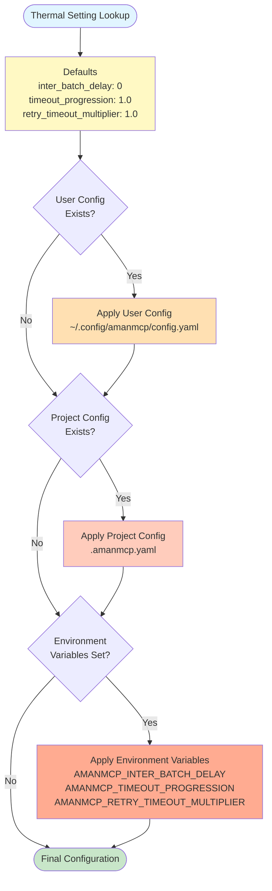
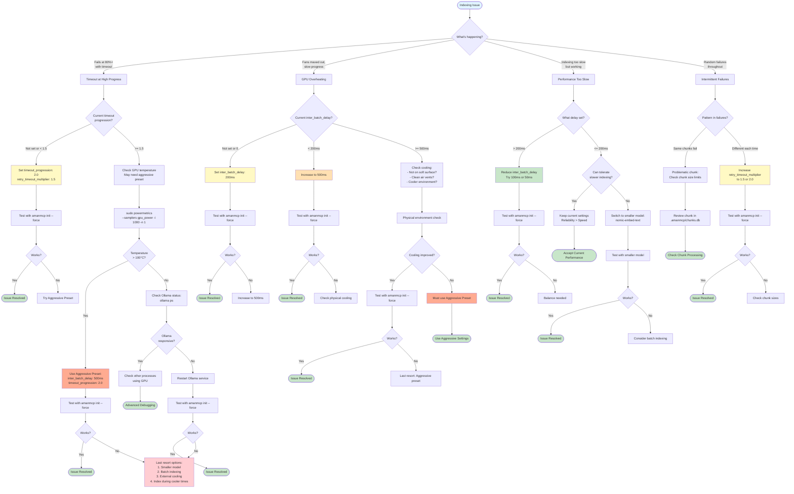

# Thermal Management Guide

This guide explains how to configure amanmcp for sustained GPU workloads, particularly on Apple Silicon machines that may experience thermal throttling during long indexing operations.

---

## Overview

When indexing large codebases, GPUs can heat up significantly. This can cause:

1. **Thermal Throttling**: GPU reduces performance to prevent overheating
2. **Timeout Failures**: Embedding requests that normally take 2s might take 10s+
3. **99% Completion Failure**: Indexing fails near the end when GPU is hottest

amanmcp includes thermal-aware indexing features that help prevent these issues.

---

## Default Behavior

**Most users don't need to configure anything.** The defaults work well for:

- Desktop machines with good cooling
- Short indexing operations (< 5000 chunks)
- Moderate ambient temperatures

The defaults are:

| Setting | Default | Effect |
|---------|---------|--------|
| Inter-batch delay | 0 (disabled) | No pause between batches |
| Timeout progression | 1.0 (disabled) | Fixed timeout throughout |
| Retry timeout multiplier | 1.0 (disabled) | No timeout increase on retry |

---

## When to Configure

Consider enabling thermal management if you experience:

1. **Indexing fails at high percentages** (80%+) with "context deadline exceeded"
2. **Laptop fans running at maximum** during indexing
3. **Apple Silicon Mac** (M1/M2/M3) running for extended periods
4. **Large codebase** (10,000+ chunks)

### Should I Enable Thermal Management?



---

## Configuration Options

### Via User Config (Recommended)

Thermal settings are machine-specific and should go in your **user configuration** (applies to all projects on this machine):

```bash
# Create user config if it doesn't exist
amanmcp config init
```

Then edit `~/.config/amanmcp/config.yaml`:

```yaml
version: 1

embeddings:
  provider: ollama
  model: qwen3-embedding:8b
  ollama_host: http://localhost:11434

  # Thermal management settings (Apple Silicon / GPU throttling)
  inter_batch_delay: 200ms       # Pause between embedding batches
  timeout_progression: 1.5       # 50% timeout increase over indexing
  retry_timeout_multiplier: 1.5  # 50% timeout increase per retry
```

### Via Project Config (Per-Project Override)

If you need different thermal settings for a specific project, add to `.amanmcp.yaml`:

```yaml
embeddings:
  # Thermal management settings (overrides user config)
  inter_batch_delay: 500ms       # More aggressive for large project
```

### Via Environment Variables

Override settings temporarily without modifying config:

```bash
# For Apple Silicon with thermal throttling
AMANMCP_INTER_BATCH_DELAY=200ms \
AMANMCP_TIMEOUT_PROGRESSION=1.5 \
AMANMCP_RETRY_TIMEOUT_MULTIPLIER=1.5 \
amanmcp init --force
```

### Configuration Precedence

Settings are applied in order (later overrides earlier):

1. **Defaults** (hardcoded in binary)
2. **User config** (`~/.config/amanmcp/config.yaml`)
3. **Project config** (`.amanmcp.yaml` in project root)
4. **Environment variables** (`AMANMCP_*`)



---

## Setting Descriptions

### Inter-Batch Delay

**What it does**: Pauses between embedding batches to let GPU cool.

**Format**: Duration string (e.g., "100ms", "500ms", "1s")

**Range**: 0 (disabled) to 5s (maximum)

**Recommendation**:

- Start with `200ms` if experiencing issues
- Increase to `500ms` for severe throttling
- Trade-off: Longer delay = slower indexing, but more reliable

```yaml
embeddings:
  inter_batch_delay: 200ms
```

### Timeout Progression

**What it does**: Gradually increases timeout as indexing progresses.

**Formula**: `effective_timeout = base_timeout * (1 + progress * (progression - 1))`

**Range**: 1.0 (disabled) to 3.0 (maximum)

**Example with progression=1.5**:

- At 0%: 60s timeout (base)
- At 50%: 75s timeout (1.25x)
- At 100%: 90s timeout (1.5x)

**Recommendation**:

- Start with `1.5` for moderate issues
- Use `2.0` for severe throttling
- Maximum is `3.0` (3x base timeout at end)

```yaml
embeddings:
  timeout_progression: 1.5
```

### Retry Timeout Multiplier

**What it does**: Increases timeout on each retry attempt.

**Formula**: `retry_timeout = base_timeout * (multiplier ^ attempt)`

**Range**: 1.0 (disabled) to 2.0 (maximum)

**Example with multiplier=1.5 and 3 retries**:

- Attempt 1: 60s
- Attempt 2: 90s (1.5x)
- Attempt 3: 135s (2.25x, capped at 2.0x)

**Recommendation**:

- Start with `1.5`
- Helps when occasional batch failures occur due to temporary throttling

```yaml
embeddings:
  retry_timeout_multiplier: 1.5
```

---

## Recommended Presets

### Minimal (Light throttling)

```yaml
embeddings:
  inter_batch_delay: 100ms
  timeout_progression: 1.2
  retry_timeout_multiplier: 1.2
```

### Moderate (Typical Apple Silicon laptop)

```yaml
embeddings:
  inter_batch_delay: 200ms
  timeout_progression: 1.5
  retry_timeout_multiplier: 1.5
```

### Aggressive (Severe throttling, hot environment)

```yaml
embeddings:
  inter_batch_delay: 500ms
  timeout_progression: 2.0
  retry_timeout_multiplier: 2.0
```

---

## Monitoring

### Check GPU Temperature (macOS)

```bash
# Install powermetrics if needed
sudo powermetrics --samplers gpu_power -i 1000 -n 1
```

### Watch Indexing Progress

```bash
# Monitor for timeout warnings
amanmcp init --force 2>&1 | grep -i timeout
```

### Check Ollama Model Status

```bash
# See if model is still loaded
ollama ps

# Check API status
curl http://localhost:11434/api/ps | jq
```

---

## Troubleshooting

### Diagnostic Flowchart



### "context deadline exceeded" at 99%

**Problem**: GPU severely throttled at end of long indexing.

**Solution**:

```yaml
embeddings:
  timeout_progression: 2.0
  retry_timeout_multiplier: 1.5
```

### Indexing is too slow

**Problem**: Thermal settings make indexing much slower.

**Solution**: Reduce inter-batch delay:

```yaml
embeddings:
  inter_batch_delay: 50ms  # Minimal cooling pause
```

### Still failing with thermal settings

**Problem**: Even maximum settings don't help.

**Solutions**:

1. Use a smaller embedding model: `model: nomic-embed-text`
2. Index in smaller batches with `--resume`
3. Ensure adequate laptop cooling (not on soft surface)
4. Consider indexing during cooler times of day

---

## Background

### Why GPUs Throttle

Modern GPUs protect themselves by reducing performance when temperature exceeds safe limits (typically 100-107°C for Apple Silicon). This is normal and expected behavior.

### Research

This feature was informed by:

- [Apple M4 Thermal Throttling Analysis](https://hostbor.com/m4-macbook-air-review/)
- [Dynamic Shifting Prevents Thermal Throttling (arXiv)](https://arxiv.org/abs/2206.10849)
- [Ollama Performance Tuning Guide](https://collabnix.com/ollama-performance-tuning-gpu-optimization-techniques-for-production/)
- [llama.cpp Performance Degradation Issue](https://github.com/ggml-org/llama.cpp/issues/832)
