# Architecture Decisions Summary

> **Learning Objectives:**
>
> - Understand the major technical decisions in AmanMCP
> - See how decisions build on each other
> - Learn the decision-making process used
>
> **Prerequisites:**
>
> - [Architecture Overview](./architecture/architecture.md)
>
> **Audience:** Contributors, architects, anyone wanting to understand the system

---

## TL;DR

This document summarizes the major architecture decisions that shaped AmanMCP. Decisions are grouped by domain: Search, Indexing, Embedding, Storage, and Infrastructure. Each decision links to detailed research documentation where available. The system follows an "It Just Works" philosophy---zero configuration, privacy-first, local-only.

---

## Decision Overview

| Domain | Key Decision | Why | Status |
|--------|--------------|-----|--------|
| Search | Hybrid BM25 + Vector | Neither alone is sufficient | Active |
| Search | RRF Fusion (k=60) | Simple, effective, no training needed | Active |
| Search | Query Expansion (BM25 only) | Bridges vocabulary gap without hurting embeddings | Active |
| Indexing | Tree-sitter Chunking | AST-aware = better semantic boundaries | Active |
| Indexing | Contextual Retrieval | Bridges vocabulary gap between queries and code | Active |
| Embedding | Ollama Default | Lower RAM, cross-platform, simpler setup | Active |
| Embedding | MLX Opt-in | Speed for Apple Silicon when RAM permits | Active |
| Storage | SQLite FTS5 for BM25 | Concurrent access via WAL mode | Active |
| Storage | coder/hnsw for Vectors | Pure Go, scales to 300K+, no CGO | Active |
| Architecture | Black Box Modules | Testable, swappable, composable | Active |
| Architecture | Process Isolation | Clean separation, no context pollution | Active |
| Protocol | MCP 2025-11-25 | Official SDK, async tasks, long-term support | Active |

### ADR Status Dashboard

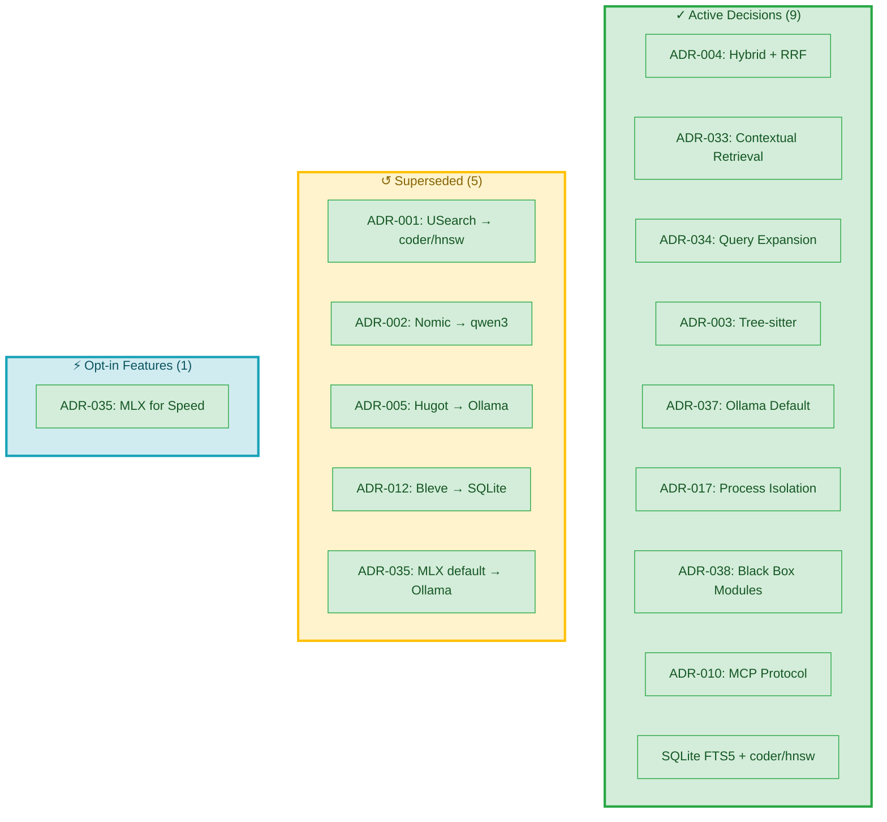

---

## Search Decisions

### ADR-004: Hybrid Search with RRF

**Status:** Implemented | **Date:** 2025-12-28

**Decision:** Use both BM25 and semantic search, fused with Reciprocal Rank Fusion.

**Why:** BM25 excels at exact matches (function names, error codes), semantic excels at conceptual queries. RRF combines rankings without requiring training or score calibration.

**Configuration:**

- RRF constant: k=60 (empirically validated)
- Default weights: BM25: 0.35, Semantic: 0.65
- Tie-breaking: InBothLists > BM25Score > ChunkID (deterministic)

**Key Insight:** Ranks are universal---first is first regardless of raw score. This makes RRF robust to score distribution differences.

**See:**

- [RRF Fusion Rationale](../research/rrf-fusion-rationale.md)
- [ADR-004 Full Decision](./.aman-pm/decisions/ADR-004-hybrid-search-rrf.md) (internal)

### Hybrid Search Architecture

```mermaid
%%{init: {'theme':'base', 'themeVariables': { 'primaryColor':'#e3f2fd', 'primaryTextColor':'#0d47a1', 'primaryBorderColor':'#1976d2', 'lineColor':'#6c757d', 'secondaryColor':'#e8f5e9', 'tertiaryColor':'#fff3e0'}}}%%
flowchart LR
    Query[User Query] --> QE{Query<br/>Expansion}
    QE -->|Original + Synonyms| BM25[BM25 Search<br/>SQLite FTS5]
    QE -->|Original Only| Vector[Vector Search<br/>coder/hnsw]

    BM25 --> BM25Results["BM25 Results<br/>(ranked by score)"]
    Vector --> VectorResults["Vector Results<br/>(ranked by similarity)"]

    BM25Results --> RRF{RRF Fusion<br/>k=60}
    VectorResults --> RRF

    RRF --> Weights["Weighted Merge<br/>BM25: 0.35<br/>Semantic: 0.65"]
    Weights --> TieBreak["Tie Breaking<br/>1. InBothLists<br/>2. BM25Score<br/>3. ChunkID"]
    TieBreak --> Final[Final Ranked Results]

    style Query fill:#e3f2fd,stroke:#1976d2,stroke-width:3px,color:#0d47a1
    style QE fill:#fff3e0,stroke:#ff9800,stroke-width:3px,color:#e65100
    style BM25 fill:#e8f5e9,stroke:#4caf50,stroke-width:3px,color:#1b5e20
    style Vector fill:#e8f5e9,stroke:#4caf50,stroke-width:3px,color:#1b5e20
    style RRF fill:#fce4ec,stroke:#e91e63,stroke-width:3px,color:#880e4f
    style Final fill:#f3e5f5,stroke:#9c27b0,stroke-width:3px,color:#4a148c
```

---

### ADR-033: Contextual Retrieval

**Status:** Implemented | **Date:** 2026-01-08

**Decision:** Prepend LLM-generated context to chunks before embedding.

**Why:** Bridges vocabulary mismatch between natural language queries and code identifiers. Based on Anthropic's research showing 49-67% reduction in retrieval failures.

**Architecture:**

```
Before:  Scan -> Chunk -> Embed -> Index
After:   Scan -> Chunk -> [Context Generation] -> Embed -> Index
```

**Key Design Choices:**

- Index-time generation (no query latency impact)
- Prepend context (preserves original for BM25)
- Pattern-based fallback (works without Ollama)
- Small/fast LLM (qwen3:0.6b for speed)

**See:**

- [Contextual Retrieval Decision](../research/contextual-retrieval-decision.md)
- [Vocabulary Mismatch Analysis](../research/vocabulary-mismatch-analysis.md)

### Before/After: Contextual Retrieval Pipeline

```mermaid
%%{init: {'theme':'base', 'themeVariables': { 'primaryColor':'#ffebee', 'primaryTextColor':'#c62828', 'primaryBorderColor':'#e53935', 'lineColor':'#6c757d', 'secondaryColor':'#e8f5e9', 'tertiaryColor':'#e3f2fd'}}}%%
flowchart TB
    subgraph Before["Before: Basic Chunking"]
        B1[Scan Files] --> B2[Chunk Code]
        B2 --> B3[Embed Chunks]
        B3 --> B4[Index]
        B4 --> BProblem["❌ Problem:<br/>Query: 'authentication'<br/>Chunk: 'func validateToken()'<br/>No keyword match!"]
    end

    subgraph After["After: Contextual Retrieval"]
        A1[Scan Files] --> A2[Chunk Code]
        A2 --> A3{Generate Context<br/>qwen3:0.6b}
        A3 -->|Success| A4["Prepend Context<br/>'Authentication token validation...'"]
        A3 -->|Fallback| A5["Pattern-based Context<br/>'Function from auth/jwt.go'"]
        A4 --> A6[Embed Enhanced Chunks]
        A5 --> A6
        A6 --> A7[Index]
        A7 --> ASolution["✓ Solution:<br/>Query: 'authentication'<br/>Context: 'Authentication token validation'<br/>Original: 'func validateToken()'<br/>Match found!"]
    end

    style Before fill:#ffebee,stroke:#e53935,stroke-width:3px,color:#c62828
    style After fill:#e8f5e9,stroke:#4caf50,stroke-width:3px,color:#1b5e20
    style BProblem fill:#ffcdd2,stroke:#e53935,stroke-width:2px,color:#b71c1c
    style ASolution fill:#c8e6c9,stroke:#4caf50,stroke-width:2px,color:#1b5e20
    style A3 fill:#fff3e0,stroke:#ff9800,stroke-width:3px,color:#e65100
```

---

### ADR-034: Query Expansion (BM25 Only)

**Status:** Implemented | **Date:** 2026-01-08

**Decision:** Expand queries with synonyms for BM25 search only, not for vector search.

**Why:** BM25 needs exact term matches---expansion helps bridge vocabulary gaps. Vector embeddings already capture semantic similarity; expansion dilutes the embedding and reduces quality.

**Evidence:**

| Configuration | Tier 1 Pass Rate |
|---------------|------------------|
| No expansion | 75% |
| BM25 + Vector expansion | 50% (regression!) |
| BM25-only expansion | 75%+ (improvement) |

**Key Insight:** Query expansion is an asymmetric strategy. What helps BM25 hurts vectors.

**See:**

- [Query Expansion Asymmetry](../research/query-expansion-asymmetric.md)

### Query Expansion Impact Analysis

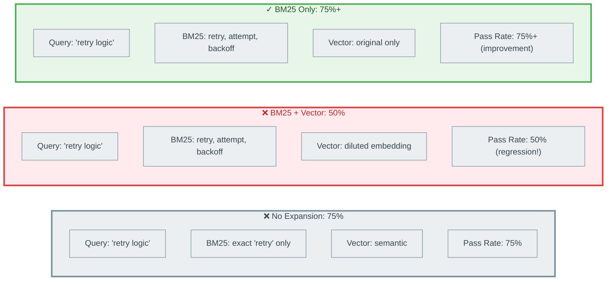

---

## Indexing Decisions

### ADR-003: Tree-sitter for Code Chunking

**Status:** Implemented | **Date:** 2025-12-28

**Decision:** Use tree-sitter with official Go bindings for AST-aware code chunking.

**Why:** AST boundaries produce semantically meaningful chunks. Regex-based chunking breaks in the middle of functions, creating poor retrieval quality.

**Benefits:**

- Universal API for 40+ languages
- Error-tolerant (produces partial AST on syntax errors)
- Fast (~5ms for 1000 LOC)
- Battle-tested (GitHub, Neovim, Helix, Zed)

**Trade-offs:**

- CGO requirement (needs C compiler)
- Must call Close() on Parser, Tree, TreeCursor (memory management)

**See:**

- [Tree-sitter Chunking Research](../research/tree-sitter-chunking.md)

---

## Embedding Decisions

### ADR-037: Ollama as Default Embedder

**Status:** Implemented | **Date:** 2026-01-14 | **Supersedes:** ADR-035

**Decision:** Make Ollama the default embedder on ALL platforms (including Apple Silicon).

**Why:** MLX delivered 16x faster indexing but consumed substantially more RAM. During development sessions, combined memory pressure caused system sluggishness. For typical workflows, search latency matters more than indexing speed.

**Usage Pattern Analysis:**

| Use Case | Frequency | MLX Benefit |
|----------|-----------|-------------|
| Initial indexing | Once per project | Significant |
| Incremental reindex | Rare | Minimal |
| Search queries | Very frequent | None |
| Development sessions | Hours/day | RAM overhead is net negative |

**Recommendation:**

- Day-to-day development: Ollama (default)
- Large initial indexing (>10k files): MLX, then switch back
- RAM-constrained (<16GB): Always Ollama

**See:**

- [Embedding Backend Evolution](../research/embedding-backend-evolution.md)
- [Embedding Model Evolution](../research/embedding-model-evolution.md)

### Technology Comparison: Ollama vs MLX

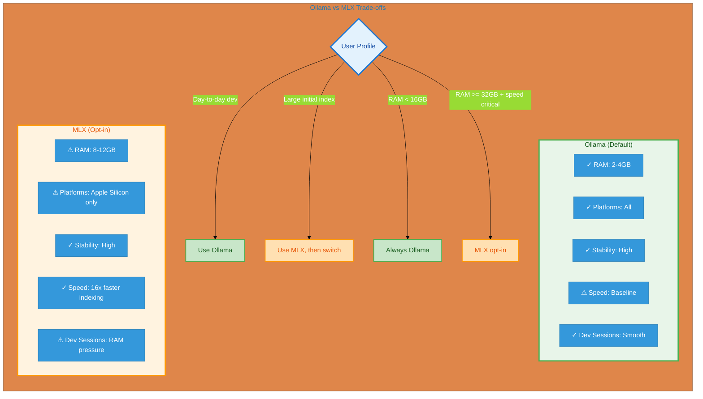

---

### ADR-035: MLX as Performance Option (Superseded for Default)

**Status:** Available as opt-in | **Date:** 2026-01-08

**Decision:** MLX available via `AMANMCP_EMBEDDER=mlx` for users who prioritize speed over RAM.

**When to Use:**

- Large batch indexing operations
- Apple Silicon with ample RAM (32GB+)
- Speed-critical workflows

**Note:** ADR-037 changed the default from MLX to Ollama on Apple Silicon.

**See:**

- [MLX Migration Case Study](../research/mlx-migration-case-study.md)

---

## Storage Decisions

### SQLite FTS5 for BM25 Index

**Status:** Implemented | **Date:** 2026-01-14

**Decision:** Use SQLite FTS5 instead of Bleve for BM25 indexing.

**Why:** Bleve used BoltDB with exclusive file locking. When MCP server is running, CLI searches were blocked. SQLite's WAL mode enables concurrent readers and non-blocking writes.

**Problem Solved:**

| Issue | Before (Bleve) | After (SQLite) |
|-------|----------------|----------------|
| CLI search while MCP runs | Blocked | Works |
| Validation tests concurrent | Skip silently | Run normally |
| Multiple readers | 0 | Unlimited |

**Trade-offs Accepted:**

- ~25% slower than CGO SQLite (acceptable for <100ms target)
- Single writer (sufficient---only indexer writes)

**See:**

- [SQLite vs Bleve Research](../research/sqlite-vs-bleve.md)

### Before/After: BM25 Backend Migration

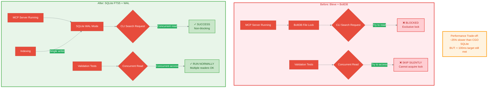

---

### coder/hnsw for Vector Storage

**Status:** Implemented | **Date:** 2026-01-03 (via ADR-022)

**Decision:** Use coder/hnsw (pure Go HNSW) instead of USearch (CGO).

**Why:** USearch CGO caused distribution problems---CLI binary hung when installed to `~/.local/bin/` due to dynamic library resolution failures (BUG-018).

**Benefits:**

- Pure Go---no CGO, portable binary
- Same HNSW algorithm as USearch
- Production-tested by Coder
- Scales logarithmically to 300K+ documents

**Performance:**

| Documents | Query Time |
|-----------|------------|
| 10,000 | < 1ms |
| 100,000 | ~2-5ms |
| 300,000 (target) | ~5-10ms |

**See:**

- [Vector Database Selection](../research/vector-database-selection.md)

---

## Architecture Decisions

### ADR-038: Black Box Module Extraction

**Status:** Implemented | **Date:** 2026-01-14

**Decision:** Extract indexing and search logic into standalone modules with clean interfaces.

**Problem:** Monolithic 400-line `Index()` method coupled BM25, vector storage, embeddings, and metadata. Cannot test BM25 without setting up entire system.

**Solution:**

```
pkg/indexer/                      pkg/searcher/
|-- interface.go    # Indexer     |-- interface.go    # Searcher
|-- bm25.go        # BM25         |-- bm25.go        # BM25
|-- vector.go      # Vector       |-- vector.go      # Vector
|-- hybrid.go      # Hybrid       |-- fusion.go      # RRF Fusion
```

**Results:**

| Metric | Before | After |
|--------|--------|-------|
| Unit tests | 20 | 110 |
| Test coverage | 45% | 78% |
| Breaking changes | - | 0 |

**Key Pattern:** `pkg/` instead of `internal/` because Black Box Design emphasizes replaceability---external tools can implement alternative backends.

**See:**

- [Black Box Architecture Case Study](../articles/black-box-architecture-case-study.md)

### Black Box Module Extraction Impact

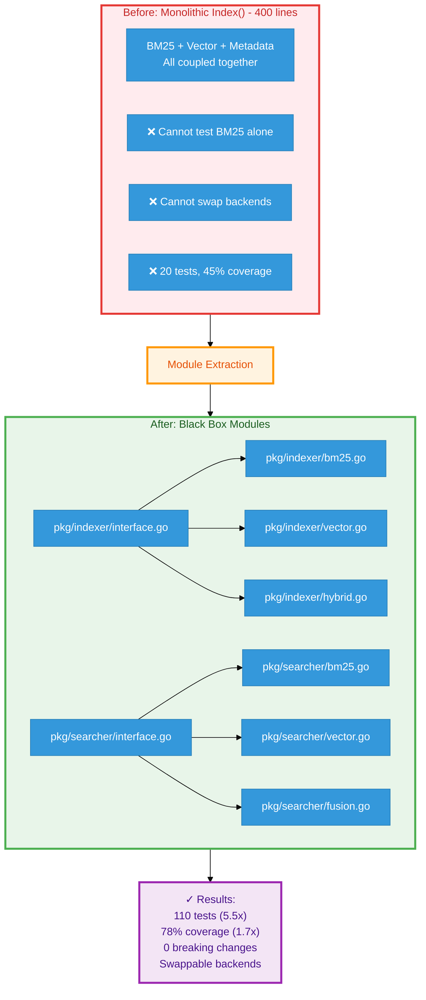

---

### ADR-017: Process Isolation for Multi-Project

**Status:** Accepted | **Date:** 2025-12-31

**Decision:** Keep single-project-per-server architecture. Do NOT build multi-project server.

**Why:**

1. **Security:** OS-level process isolation ensures no memory sharing between projects
2. **RAG Quality:** Mixing contexts degrades search quality (industry research confirms)
3. **Simplicity:** Avoids namespace prefixing, cross-project routing complexity
4. **User Workflow:** Claude Code already runs multiple MCP servers concurrently

**Industry Validation:**

- Pinecone: "Never mix tenant data in a shared vector space"
- Sourcegraph Zoekt: "Each repository indexed and searched separately"

**Mitigations:**

- F26: Git submodule support brings related repos into single index
- F27: Session management reduces switching friction
- F28: Scope filtering for monorepo search

---

### ADR-022: CGO-Minimal Standalone Architecture

**Status:** Implemented | **Date:** 2026-01-03

**Decision:** Replace CGO-heavy dependencies with pure Go or purego alternatives.

**Problem:** Binary worked from build directory but hung when installed to `~/.local/bin/`. Root cause: macOS dyld couldn't resolve CGO library paths after binary was moved.

**Changes:**

| Component | Before (CGO) | After (Pure Go/purego) |
|-----------|--------------|------------------------|
| Vector Store | USearch | coder/hnsw |
| Embeddings | Hugot (ONNX) | Ollama HTTP API |
| Chunking | tree-sitter | tree-sitter (kept, static link) |
| BM25 | Bleve | SQLite FTS5 |

**Results:**

- Standalone binary works everywhere
- Simpler distribution (single binary)
- Faster startup (no ONNX runtime init)
- Cross-platform consistency

---

### ADR-010: MCP Protocol 2025-11-25

**Status:** Implemented | **Date:** 2025-12-28

**Decision:** Implement MCP Specification version 2025-11-25 using Official Go SDK.

**Why:**

- Anniversary release with major additions (async tasks, CIMD auth)
- Official SDK maintained by Anthropic/Google
- Go-native implementation (no FFI/wrappers)
- Long-term support expected

**Features Implemented:**

- Tools: search, index, status
- Resources: file:// for indexed content
- Prompts: context-aware search prompts

---

## Decision Evolution Timeline

| Date | ADR | Decision | Context |
|------|-----|----------|---------|
| 2025-12-28 | ADR-001 | USearch for vectors | Initial vector storage |
| 2025-12-28 | ADR-002 | Nomic for embeddings | Initial embedding model |
| 2025-12-28 | ADR-003 | Tree-sitter chunking | AST-aware code parsing |
| 2025-12-28 | ADR-004 | Hybrid + RRF fusion | Search architecture |
| 2025-12-28 | ADR-010 | MCP 2025-11-25 | Protocol version |
| 2025-12-28 | ADR-012 | Bleve for BM25 | Initial BM25 backend |
| 2025-12-31 | ADR-017 | Process isolation | Multi-project strategy |
| 2026-01-03 | ADR-022 | CGO-minimal | Replaced USearch, Hugot |
| 2026-01-08 | ADR-033 | Contextual retrieval | Vocabulary mismatch solution |
| 2026-01-08 | ADR-034 | Query expansion (BM25) | Asymmetric expansion |
| 2026-01-08 | ADR-035 | MLX default | Apple Silicon optimization |
| 2026-01-14 | ADR-037 | Ollama default | Superseded MLX default (RAM) |
| 2026-01-14 | ADR-038 | Black box modules | Interface extraction |
| 2026-01-14 | - | SQLite FTS5 | Replaced Bleve (concurrency) |

### Architecture Evolution Timeline

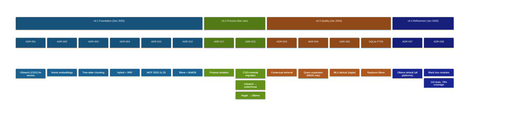

---

## Superseded Decisions

These decisions were made and later replaced as requirements evolved:

| ADR | Original Decision | Superseded By | Reason |
|-----|-------------------|---------------|--------|
| ADR-001 | USearch for vectors | ADR-022 (coder/hnsw) | CGO distribution issues |
| ADR-002 | Nomic for embeddings | ADR-016, ADR-023 | Model evolution |
| ADR-005 | Hugot embedder | ADR-022 (Ollama) | CGO issues, RAM usage |
| ADR-012 | Bleve for BM25 | SQLite FTS5 | Concurrent access needed |
| ADR-035 | MLX as default | ADR-037 (Ollama) | RAM pressure during dev |

**Key Lesson:** Decisions are permanent records, but they can be superseded. The ADR chain shows evolution and rationale.

### ADR Dependency Graph

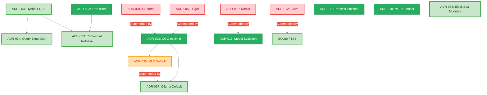

---

## How We Make Decisions

### Decision Template

Every ADR follows this structure:

1. **Context:** What problem are we solving? What constraints exist?
2. **Options:** What alternatives did we evaluate?
3. **Analysis:** Trade-offs of each option with evidence
4. **Decision:** What we chose and why
5. **Consequences:** What we gain, what we lose, mitigations

### Guiding Principles

| Principle | Meaning | Example |
|-----------|---------|---------|
| **Reversibility** | Prefer decisions that can be changed | Interfaces allow swapping implementations |
| **Data-driven** | Measure, don't assume | Query expansion tested against pass rate |
| **Simplicity** | Minimal viable solution first | RRF over learning-to-rank |
| **Zero-config** | "It Just Works" as default | Ollama > MLX for broader compatibility |
| **Local-first** | Privacy by design | No cloud dependencies |

### Decision Drivers Visualization

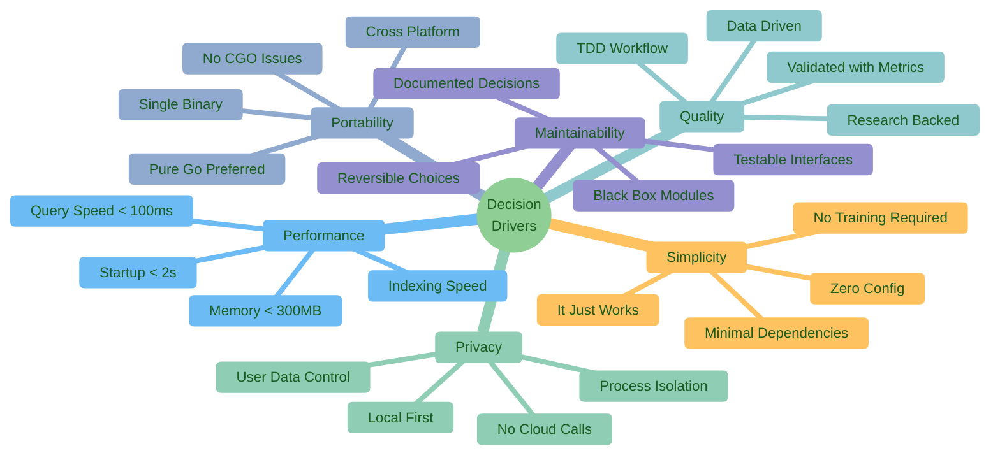

### Decision Quality Checklist

Before accepting a decision:

- [ ] Problem clearly stated
- [ ] At least 3 alternatives evaluated
- [ ] Evidence supports choice (benchmarks, research, user feedback)
- [ ] Consequences documented (positive, negative, neutral)
- [ ] Mitigations for negative consequences identified
- [ ] Decision is reversible OR has overwhelming evidence

---

## ADR Categories

| Range | Category | Examples |
|-------|----------|----------|
| 001-009 | Core Architecture | Vector store, embedding model, chunking |
| 010-019 | Infrastructure & Tooling | MCP protocol, version pinning, CGO setup |
| 020-029 | Process & Documentation | Documentation architecture, TDD workflow |
| 030-039 | Performance & Optimization | Contextual retrieval, query expansion, MLX |
| 040-049 | Security | (Future) |

### ADR Distribution by Category

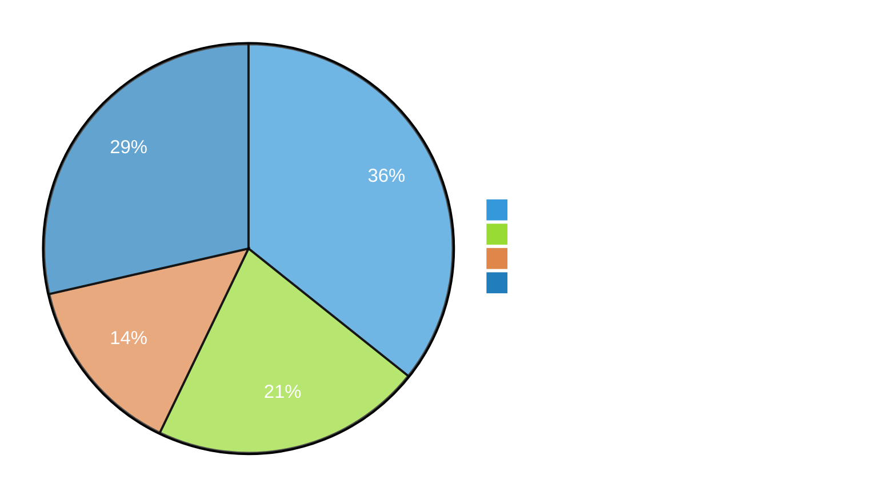

---

## Research Foundation

Major decisions are backed by research documents that explore alternatives in depth:

| Research | Question Answered | Key Finding |
|----------|-------------------|-------------|
| [RRF Fusion Rationale](../research/rrf-fusion-rationale.md) | How to combine BM25 + vector scores? | Ranks > scores; k=60 is robust default |
| [Query Expansion Asymmetric](../research/query-expansion-asymmetric.md) | Expand for all backends? | BM25 only; vectors already semantic |
| [Contextual Retrieval](../research/contextual-retrieval-decision.md) | How to bridge vocabulary gap? | Prepend LLM context; 49-67% error reduction |
| [SQLite vs Bleve](../research/sqlite-vs-bleve.md) | Which BM25 backend? | SQLite FTS5 for concurrent access |
| [Vector Database Selection](../research/vector-database-selection.md) | Which vector store? | Pure Go HNSW for portability |
| [Embedding Model Evolution](../research/embedding-model-evolution.md) | Which embedding model? | qwen3:0.6b via Ollama |
| [MLX Migration Case Study](../research/mlx-migration-case-study.md) | How to migrate backends? | Validate before implementing; always have fallback |

---

## See Also

- [Architecture Overview](./architecture/architecture.md) - System design with diagrams
- [Technology Validation 2026](./architecture/technology-validation-2026.md) - Component validation
- [Research Index](../research/README.md) - All research documents
- [Articles Index](../articles/) - Thought leadership and case studies

---

## Contributing Decisions

Want to propose a new decision or challenge an existing one?

1. **Check existing research** - Has this been evaluated before?
2. **File an issue** - Describe the problem and proposed alternatives
3. **Provide evidence** - Benchmarks, user feedback, industry research
4. **Follow the template** - Context, Options, Analysis, Decision, Consequences
5. **Link to research** - Add supporting documentation

We welcome contributions that:

- Challenge assumptions with new data
- Propose better alternatives
- Validate or invalidate existing decisions
- Consider new use cases or constraints

---

**Last Updated:** 2026-01-16
