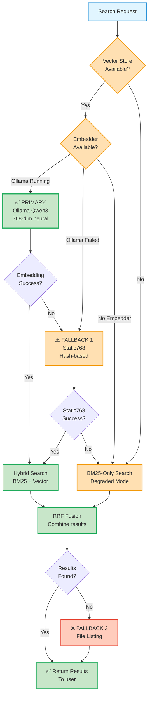
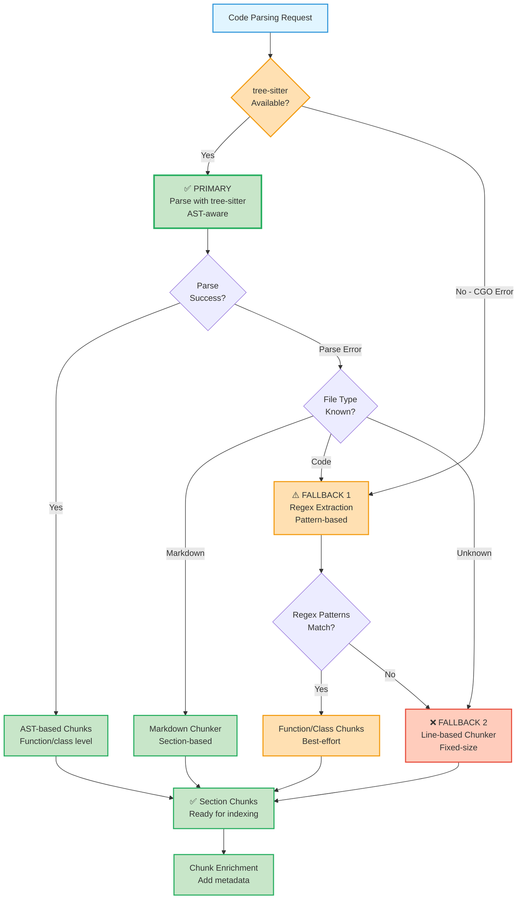
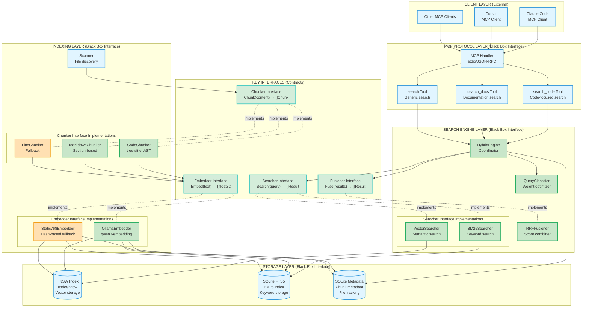
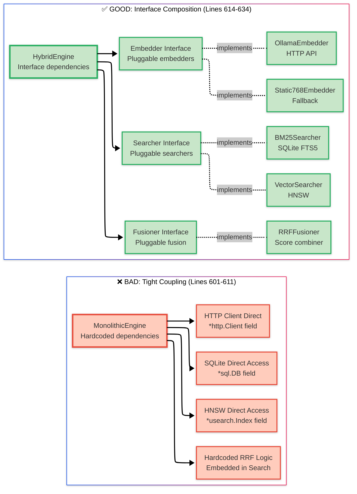
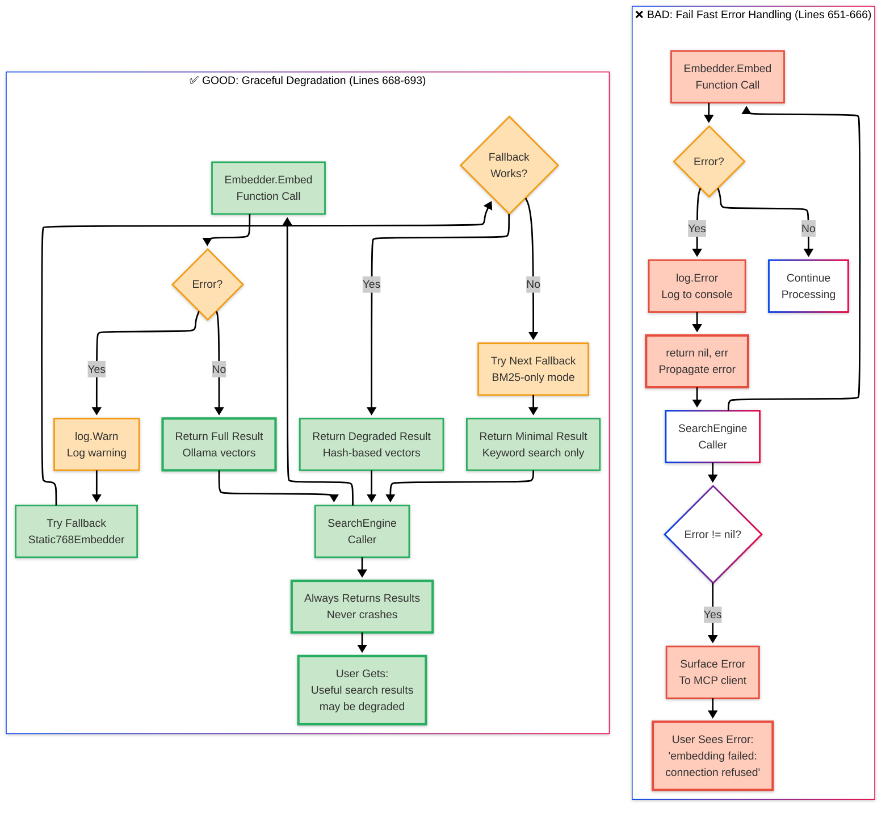

# Architecture Patterns Reference

> **Learning Objectives:**
>
> - Understand the high-level architecture of hybrid search systems
> - Learn key design patterns for RAG applications
> - Know module boundaries and interface designs
>
> **Prerequisites:**
>
> - [Hybrid Search Concepts](../concepts/hybrid-search.md)
>
> **Audience:** Contributors, architects, developers building similar systems

---

## TL;DR

AmanMCP uses a modular architecture with clear interface boundaries. The core pattern is: Client -> MCP Handler -> Search Engine -> (BM25 + Vector parallel) -> RRF Fusion -> Results. Each component is swappable via interfaces, enabling testing, experimentation, and graceful degradation.

---

## Data Flow

```
Client -> MCP Handler -> Search Engine -> (BM25 + Vector parallel) -> RRF Fusion -> Results
```

### Stage-by-Stage Breakdown

| Stage | Component | Responsibility |
|-------|-----------|----------------|
| 1. **Client** | Claude Code, Cursor | Send MCP tool calls (`search_code`, `search_docs`) |
| 2. **MCP Handler** | `internal/mcp/` | Parse MCP protocol, route to appropriate tool handler |
| 3. **Search Engine** | `internal/search/engine.go` | Coordinate hybrid search, classify queries |
| 4. **BM25 Search** | `internal/search/bm25.go` | Keyword-based retrieval (SQLite FTS5) |
| 5. **Vector Search** | `internal/search/vector.go` | Semantic retrieval (HNSW) |
| 6. **RRF Fusion** | `internal/search/fusion.go` | Combine ranked results |
| 7. **Results** | `internal/models/result.go` | Formatted search results |

---

## Key Design Decisions

### ADR-001: Hybrid Search (BM25 + Semantic)

**Decision:** Use both BM25 and semantic search, fused with RRF.

**Why neither alone is sufficient:**

| Query Type | BM25 Strength | Vector Strength |
|------------|---------------|-----------------|
| `ERR_CONNECTION_REFUSED` | Exact match | May miss exact identifiers |
| "how does auth work" | Too literal | Finds conceptual matches |
| `handleUserLogin` | Exact identifier | Understands intent |
| "security best practices" | Needs exact terms | Conceptual understanding |

**Weights:** BM25 0.35, Semantic 0.65 (tuned empirically for code search)

**See Also:** [RRF Fusion Rationale](../research/rrf-fusion-rationale.md)

---

### ADR-002: Chunk as Primitive

**Decision:** `Chunk` is the core data type flowing through the system.

**Why:** A single primitive enables composition. All indexers, searchers, and embedders operate on Chunks, making the system pluggable at every layer.

```go
type Chunk struct {
    ID       string      // Unique identifier (hash of content + path)
    FilePath string      // Absolute path to source file
    Content  string      // The actual code/documentation content
    Type     ChunkType   // Code, Documentation, Comment
    Language string      // go, typescript, python, markdown
    Lines    LineRange   // Start and end line numbers
    Symbols  []string    // Function names, class names, etc.
}
```

**Benefits:** Testability, composability, cacheability, debuggability.

**Pipeline:**

```
Source File -> TreeSitter -> []Chunk -> Embedder -> HNSW Index
                                     -> BM25 Index
                                     -> SQLite Metadata
```

#### Complete Chunk Pipeline Data Flow (ADR-002)

This comprehensive diagram shows all stages from file discovery to indexed storage:

```mermaid
flowchart TB
    subgraph Discovery["Stage 1: File Discovery"]
        FS[File System Walk<br/>Recursive scan]
        Gitignore[.gitignore Filter<br/>Exclusion patterns]
        AmanConfig[.amanmcp.yaml<br/>Custom exclusions]
        FileList[Filtered File List<br/>Source files only]
    end

    subgraph Parsing["Stage 2: Parsing & Chunking"]
        Classifier{Language<br/>Classifier}
        TSParser[tree-sitter Parser<br/>AST extraction]
        MDParser[Markdown Parser<br/>Section extraction]
        LineParser[Line Parser<br/>Fallback chunker]
        RawChunks[Raw Chunks<br/>Chunk slice without metadata]
    end

    subgraph Enrichment["Stage 3: Chunk Enrichment"]
        SymbolExtract[Symbol Extraction<br/>Function/class names]
        LineNumbers[Line Range Recording<br/>start_line, end_line]
        ContentHash[Content Hashing<br/>SHA-256 for dedup]
        TypeDetect[Content Type Detection<br/>Code/Docs/Comment]
        EnrichedChunks[Enriched Chunks<br/>Chunk slice with metadata]
    end

    subgraph Embedding["Stage 4: Embedding Generation"]
        BatchQueue[Batch Queue<br/>Buffer 100 chunks]
        EmbedCheck{Embedder<br/>Available?}
        OllamaEmbed[Ollama API<br/>qwen3-embedding<br/>768-dim vectors]
        Static768[Static768<br/>Hash-based vectors<br/>768-dim fallback]
        Vectors[Vector Array<br/>float32 768-dim vectors]
    end

    subgraph Storage["Stage 5: Parallel Storage"]
        Transaction[Transaction Begin<br/>SQLite + HNSW]
        VectorWrite[HNSW Writer<br/>Add vectors to graph]
        BM25Write[FTS5 Writer<br/>Tokenize + index]
        MetaWrite[Metadata Writer<br/>Chunk info to SQLite]
        Commit[Transaction Commit<br/>Atomic write]
    end

    subgraph Persistence["Stage 6: Persistent Storage"]
        HNSWDisk[(HNSW Index<br/>.amanmcp/vectors.hnsw<br/>GOB encoded)]
        BM25Disk[(BM25 Index<br/>.amanmcp/bm25.db<br/>SQLite FTS5)]
        MetaDisk[(Metadata DB<br/>.amanmcp/metadata.db<br/>SQLite)]
    end

    FS --> Gitignore
    Gitignore --> AmanConfig
    AmanConfig --> FileList

    FileList --> Classifier
    Classifier -->|.go, .ts, .py| TSParser
    Classifier -->|.md| MDParser
    Classifier -->|Other/Error| LineParser

    TSParser --> RawChunks
    MDParser --> RawChunks
    LineParser --> RawChunks

    RawChunks --> SymbolExtract
    SymbolExtract --> LineNumbers
    LineNumbers --> ContentHash
    ContentHash --> TypeDetect
    TypeDetect --> EnrichedChunks

    EnrichedChunks --> BatchQueue
    BatchQueue --> EmbedCheck
    EmbedCheck -->|Ollama Running| OllamaEmbed
    EmbedCheck -->|Ollama Failed| Static768
    OllamaEmbed --> Vectors
    Static768 --> Vectors

    Vectors --> Transaction
    EnrichedChunks --> Transaction

    Transaction --> VectorWrite
    Transaction --> BM25Write
    Transaction --> MetaWrite

    VectorWrite --> Commit
    BM25Write --> Commit
    MetaWrite --> Commit

    Commit --> HNSWDisk
    Commit --> BM25Disk
    Commit --> MetaDisk

    style FS fill:#e1f5ff,stroke:#3498db,stroke-width:2px
    style Gitignore fill:#e1f5ff,stroke:#3498db,stroke-width:2px
    style AmanConfig fill:#e1f5ff,stroke:#3498db,stroke-width:2px
    style FileList fill:#e1f5ff,stroke:#3498db,stroke-width:2px
    style Classifier fill:#ffe0b2,stroke:#f39c12,stroke-width:2px
    style TSParser fill:#ffe0b2,stroke:#f39c12,stroke-width:2px
    style MDParser fill:#ffe0b2,stroke:#f39c12,stroke-width:2px
    style LineParser fill:#ffccbc,stroke:#e74c3c,stroke-width:2px
    style RawChunks fill:#ffe0b2,stroke:#f39c12,stroke-width:2px
    style SymbolExtract fill:#e1f5ff,stroke:#3498db,stroke-width:2px
    style LineNumbers fill:#e1f5ff,stroke:#3498db,stroke-width:2px
    style ContentHash fill:#e1f5ff,stroke:#3498db,stroke-width:2px
    style TypeDetect fill:#e1f5ff,stroke:#3498db,stroke-width:2px
    style EnrichedChunks fill:#e1f5ff,stroke:#3498db,stroke-width:2px
    style BatchQueue fill:#e1f5ff,stroke:#3498db,stroke-width:2px
    style EmbedCheck fill:#ffe0b2,stroke:#f39c12,stroke-width:2px
    style OllamaEmbed fill:#c8e6c9,stroke:#27ae60,stroke-width:2px
    style Static768 fill:#ffe0b2,stroke:#f39c12,stroke-width:2px
    style Vectors fill:#c8e6c9,stroke:#27ae60,stroke-width:2px
    style Transaction fill:#e1f5ff,stroke:#3498db,stroke-width:2px
    style VectorWrite fill:#c8e6c9,stroke:#27ae60,stroke-width:2px
    style BM25Write fill:#c8e6c9,stroke:#27ae60,stroke-width:2px
    style MetaWrite fill:#c8e6c9,stroke:#27ae60,stroke-width:2px
    style Commit fill:#c8e6c9,stroke:#27ae60,stroke-width:2px
    style HNSWDisk fill:#c8e6c9,stroke:#27ae60,stroke-width:2px
    style BM25Disk fill:#c8e6c9,stroke:#27ae60,stroke-width:2px
    style MetaDisk fill:#c8e6c9,stroke:#27ae60,stroke-width:2px
```



**Complete Processing Stages:**

1. **Discovery** (Stage 1)
   - Recursive file system walk
   - Apply `.gitignore` patterns
   - Apply `.amanmcp.yaml` custom exclusions
   - Filter to source files only

2. **Parsing** (Stage 2)
   - Classify language by extension
   - tree-sitter for Go/TS/Python (AST-aware)
   - Markdown parser for docs (section-aware)
   - Line parser as fallback (degraded mode)

3. **Enrichment** (Stage 3)
   - Extract symbols (function names, class names)
   - Record line ranges (start_line, end_line)
   - Hash content (SHA-256 for deduplication)
   - Detect content type (Code/Docs/Comment)

4. **Embedding** (Stage 4)
   - Batch chunks (100 per API call)
   - Try Ollama qwen3-embedding (768-dim)
   - Fallback to Static768 (hash-based 768-dim)
   - Generate vector arrays

5. **Storage** (Stage 5)
   - Begin SQLite transaction
   - Parallel writes: HNSW + FTS5 + Metadata
   - Atomic commit (all or nothing)

6. **Persistence** (Stage 6)
   - HNSW vectors to `.amanmcp/vectors.hnsw` (GOB)
   - BM25 index to `.amanmcp/bm25.db` (SQLite FTS5)
   - Metadata to `.amanmcp/metadata.db` (SQLite)

**Key Design Choices:**

- **Batch Processing**: 100 chunks per embed call (5x throughput)
- **Graceful Degradation**: Ollama → Static768 → Continue
- **Parallel Writes**: HNSW + BM25 + Metadata written concurrently
- **Atomic Commits**: Transaction ensures consistency
- **Deduplication**: Content hashing prevents duplicate indexing

---

### ADR-003: Graceful Degradation

**Decision:** If any component fails, fall back to reduced functionality rather than crash.

**Why:** User experience matters more than theoretical purity. BM25-only results are infinitely better than an error message.

**Fallback Chains:**

| Component | Primary | Fallback 1 | Fallback 2 |
|-----------|---------|------------|------------|
| Embedder | Ollama (Qwen3) | Static768 (hash-based) | BM25-only mode |
| Code Parsing | tree-sitter AST | Regex extraction | Line chunking |
| Search | Hybrid (BM25 + Vector) | BM25-only | File listing |
| BM25 Index | SQLite FTS5 | Auto-rebuild | Memory fallback |

**Principle:** Always return something useful.

#### ADR-003: Fallback Chain Decision Trees

**Search Embedder Fallback Chain:**



**Code Parsing Fallback Chain:**



**Graceful Degradation Principles:**

1. **Never Crash**: Always return something useful, even if degraded
2. **Silent Fallback**: Log warnings but don't expose internal errors to users
3. **Quality Ordering**: Primary → Secondary → Tertiary → Minimal
4. **User Value**: BM25-only results > error message

---

## Module Boundaries (Black Box Design)

The architecture follows [Eskil Steenberg's Black Box Design](../articles/black-box-architecture-case-study.md) principles: modules are replaceable black boxes with clean interfaces.

### Core Interfaces

| Module | Interface | Purpose |
|--------|-----------|---------|
| **Embedder** | `Embed(text string) ([]float32, error)` | Convert text to vector |
| **Indexer** | `Index(chunks []Chunk) error` | Add chunks to storage |
| **Searcher** | `Search(query Query) ([]Result, error)` | Retrieve matching chunks |
| **Chunker** | `Chunk(path, content string) ([]Chunk, error)` | Split content into chunks |

### Implementations

```
internal/embed/
  |- types.go       # Embedder interface definition
  |- ollama.go      # OllamaEmbedder - primary
  |- static768.go   # Static768Embedder - fallback

internal/search/
  |- engine.go      # Search engine coordinator
  |- bm25.go        # BM25 (SQLite FTS5)
  |- vector.go      # Vector search (coder/hnsw)
  |- fusion.go      # RRF score fusion

internal/chunk/
  |- code.go        # AST-based code chunker
  |- treesitter.go  # tree-sitter integration
  |- markdown.go    # Markdown chunker
```

#### Module Boundary Architecture (Black Box Design)

This diagram shows clean interface boundaries that enable testing, swapping implementations, and system evolution:



**Black Box Design Principles:**

| Layer | Interface Contract | Implementations | Benefit |
|-------|-------------------|-----------------|---------|
| **Searcher** | `Search(query) → []Result` | BM25Searcher, VectorSearcher | Swap Tantivy for SQLite FTS5 |
| **Chunker** | `Chunk(content) → []Chunk` | CodeChunker, MarkdownChunker, LineChunker | Add new language support |
| **Embedder** | `Embed(text) → []float32` | OllamaEmbedder, Static768Embedder | Benchmark MLX vs Ollama |
| **Fusioner** | `Fuse(results) → []Result` | RRFFusioner | Test learned ranking |

**Key Architectural Boundaries:**

1. **Protocol Layer**: MCP clients communicate only through stdio/JSON-RPC
2. **Search Engine**: Unaware of storage implementation details (uses interfaces)
3. **Interfaces**: Define contracts that enable swapping implementations
4. **Storage Layer**: Database-agnostic through abstraction
5. **Indexing Layer**: Pluggable chunkers and embedders via interfaces

**Why Black Box Design?**

- **Testability**: Mock interfaces for unit tests (no real Ollama needed)
- **Experimentation**: Benchmark alternatives without code changes
- **Resilience**: Fallback implementations (Static768, LineChunker)
- **Evolution**: Replace libraries without touching business logic
- **Isolation**: Changes in one layer don't cascade to others

**Interface Implementations:**

```go
// Example: Swappable Searcher interface
type Searcher interface {
    Search(query string, opts SearchOptions) ([]Result, error)
}

// BM25Searcher implements Searcher
type BM25Searcher struct { /* SQLite FTS5 */ }

// VectorSearcher implements Searcher
type VectorSearcher struct { /* HNSW */ }

// HybridEngine depends only on interface, not implementations
type HybridEngine struct {
    bm25   Searcher  // Could be SQLite, Tantivy, or mock
    vector Searcher  // Could be HNSW, Milvus, or mock
}
```

### Why Black Box Design?

| Benefit | Example |
|---------|---------|
| **Testability** | Mock `Embedder` interface for unit tests |
| **Experimentation** | Benchmark Tantivy vs SQLite FTS5 by swapping implementations |
| **Resilience** | Fallback from Ollama to Static768 without code changes |
| **Evolution** | Replace HNSW library without touching search logic |

---

## Patterns in Use

| Pattern | Where | Purpose |
|---------|-------|---------|
| **Interface-based modules** | `internal/embed/`, `internal/search/` | Swap implementations |
| **Graceful degradation** | BM25 auto-recovery, embedder fallback | Never crash on failure |
| **Progressive disclosure** | CLAUDE.md -> Skills | Load context on demand |
| **Parallel execution** | Search engine dual-path | Concurrent BM25 + Vector |
| **Composition over inheritance** | HybridIndexer wraps components | Combine without hierarchies |
| **Single primitive** | Chunk as universal data type | Unified data model |

### Pattern: Composition over Inheritance

```go
// BAD: Monolithic engine that knows everything
type MonolithicEngine struct {
    bm25Store     *SQLiteStore
    vectorStore   *HNSWStore
    ollamaClient  *http.Client
}

// GOOD: Composed from interfaces
type HybridEngine struct {
    bm25     Searcher  // Could be SQLite, Tantivy, or mock
    vector   Searcher  // Could be HNSW, Milvus, or mock
    embedder Embedder  // Could be Ollama, MLX, or static
    fusion   Fusioner  // Could be RRF, linear, or learned
}
```

#### BAD vs GOOD: Architecture Coupling Patterns



**Problems with BAD:**

- Cannot test without real SQLite database
- Cannot swap HNSW for alternative vector stores
- Cannot mock embedder for unit tests
- Hard to extend or experiment with alternatives

**Benefits of GOOD:**

- Mock implementations for testing
- Swap SQLite for Tantivy without touching engine code
- Add new embedders by implementing interface
- Benchmark alternatives with same interface

#### BAD vs GOOD: Error Handling Patterns



**Problems with BAD:**

- User sees cryptic error messages
- No fallback when primary fails
- All-or-nothing: full results or total failure
- Poor user experience during outages

**Benefits of GOOD:**

- User always gets results (degraded if needed)
- Silent fallback to alternative strategies
- Progressive quality: Hybrid → BM25 → File listing
- Excellent user experience even during failures

### Pattern: Query Classification

Dynamically adjust weights based on query characteristics:

| Query Pattern | BM25 Weight | Vector Weight | Reason |
|---------------|-------------|---------------|--------|
| Error codes (ERR_*) | 0.8 | 0.2 | Exact match critical |
| camelCase/snake_case | 0.7 | 0.3 | Technical identifier |
| Natural language | 0.25 | 0.75 | Conceptual understanding |
| "exact phrase" | 0.9 | 0.1 | User wants exact |
| Default | 0.35 | 0.65 | Balanced approach |

---

## Known Gotchas

### 1. Dimension Mismatch

**Problem:** Switching embedding backends requires reindexing.

**Why:** Ollama Qwen3 produces 768-dim vectors. A 384-dim model makes the HNSW index invalid.

**Solution:** Store embedder metadata in index. Detect mismatch on startup and trigger reindex.

### 2. Go Method Syntax

**Problem:** Semantic search struggles with `func (s *Service)` receiver syntax.

**Why:** Embedding models are trained on natural language. Go's receiver syntax is less common in training data.

**Mitigation:** Query classifier boosts BM25 weight for camelCase/PascalCase patterns.

### 3. Large Files

**Problem:** Files > 10MB can cause memory issues during chunking.

**Solution:** Skip files exceeding threshold. Log warning for visibility.

### 4. CGO and Binary Distribution

**Problem:** CGO dependencies complicate binary distribution.

**Solution:**

- tree-sitter: Required CGO, stable and well-tested
- Vector store: Switched from USearch (CGO) to coder/hnsw (pure Go) in v0.1.38

### 5. Cold Start Latency

**Problem:** First query is slow (~70ms vs ~20ms warm).

**Why:** Embedding requires Ollama inference on first call.

**Mitigation:** Query embedding cache. Common queries pre-warmed at startup.

---

## Architecture Evolution

| Version | Change | Rationale |
|---------|--------|-----------|
| v0.1.0 | Initial hybrid search | Combine BM25 precision with semantic recall |
| v0.1.20 | Interface extraction | Enable testing and experimentation |
| v0.1.38 | USearch -> coder/hnsw | Eliminate CGO distribution issues |
| v0.2.0 | Query classification | Optimize weights per query type |
| v0.4.0 | SQLite FTS5 BM25 | Battle-tested FTS5 implementation |

---

## Configuration Principles

Architecture decisions should not be hardcoded. Tunable values live in config:

```yaml
# .amanmcp.yaml
search:
  bm25_weight: 0.35
  semantic_weight: 0.65
  rrf_k: 60

indexing:
  max_file_size: 10485760  # 10MB
  batch_size: 100

embedding:
  provider: ollama
  model: qwen3-embedding
```

**Principle:** Data-driven behavior, not hardcoded values.

---

## Performance Targets

| Metric | Target | Measured |
|--------|--------|----------|
| Query latency (warm) | < 20ms | ~15ms |
| Query latency (cold) | < 100ms | ~70ms |
| Memory usage | < 300MB | ~280MB @ 100K docs |
| Startup time | < 2s | ~1.2s |
| Index throughput | > 100 files/sec | ~150 files/sec |

---

## See Also

- [Black Box Architecture Case Study](../articles/black-box-architecture-case-study.md) - Detailed refactoring example
- [RRF Fusion Rationale](../research/rrf-fusion-rationale.md) - Why RRF over alternatives
- [Hybrid Search Concepts](../concepts/hybrid-search.md) - How BM25 and vector search work
- [Technology Validation 2026](architecture/technology-validation-2026.md) - Component validation
