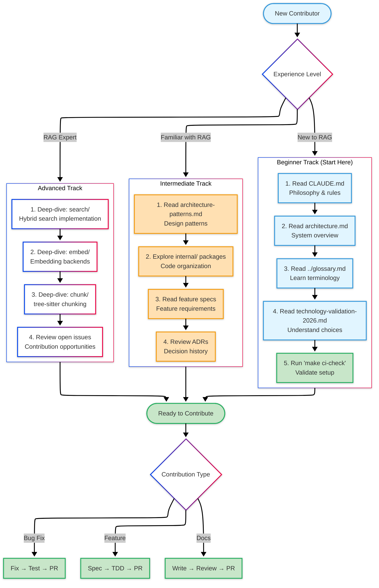

# Architecture Documentation

Technical architecture and design documentation for AmanMCP.

---

## Documents

| Document | Audience | Description |
|----------|----------|-------------|
| [architecture.md](./architecture.md) | All | System architecture, data flow, components. **Start here.** |
| [technology-validation-2026.md](./technology-validation-2026.md) | Contributors | Technology choices validation with research evidence |

---

## Documentation Navigation Map

This diagram shows how AmanMCP documentation is organized and where to find specific information:

```mermaid
---
config:
  layout: elk
  look: neo
  theme: neo
---
graph TB
    Start([I want to...])

    Start --> Learn{What do you<br/>want to learn?}
    Start --> Build{What do you<br/>want to build?}
    Start --> Fix{What needs<br/>fixing?}

    Learn -->|Architecture| LA[architecture.md<br/>System design & data flow]
    Learn -->|Why we chose X| LT[technology-validation-2026.md<br/>Technology decisions]
    Learn -->|Patterns| LP[../architecture-patterns.md<br/>Design patterns]
    Learn -->|API Reference| LR[../commands.md<br/>../configuration.md]

    Build -->|New feature| BF[.aman-pm/product/features/<br/>Feature specs]
    Build -->|Integration| BI[../guides/<br/>Setup & integration guides]
    Build -->|Testing| BT[CLAUDE.md<br/>TDD workflow]
    Build -->|Contributing| BC[CONTRIBUTING.md<br/>Contribution guide]

    Fix -->|Errors| FE[../error-codes.md<br/>Error catalog]
    Fix -->|Performance| FP[architecture.md#performance<br/>Optimization guide]
    Fix -->|Bugs| FB[GitHub Issues<br/>Bug tracker]
    Fix -->|Configuration| FC[../configuration.md<br/>Config reference]

    style Start fill:#e1f5ff,stroke:#3498db,stroke-width:2px
    style Learn fill:#c8e6c9,stroke:#27ae60,stroke-width:2px
    style Build fill:#ffe0b2,stroke:#f39c12,stroke-width:2px
    style Fix fill:#ffccbc,stroke:#e74c3c,stroke-width:2px
    style LA fill:#e1f5ff,stroke:#3498db,stroke-width:2px
    style LT fill:#e1f5ff,stroke:#3498db,stroke-width:2px
    style LP fill:#e1f5ff,stroke:#3498db,stroke-width:2px
    style LR fill:#e1f5ff,stroke:#3498db,stroke-width:2px
    style BF fill:#ffe0b2,stroke:#f39c12,stroke-width:2px
    style BI fill:#ffe0b2,stroke:#f39c12,stroke-width:2px
    style BT fill:#ffe0b2,stroke:#f39c12,stroke-width:2px
    style BC fill:#ffe0b2,stroke:#f39c12,stroke-width:2px
    style FE fill:#ffccbc,stroke:#e74c3c,stroke-width:2px
    style FP fill:#ffccbc,stroke:#e74c3c,stroke-width:2px
    style FB fill:#ffccbc,stroke:#e74c3c,stroke-width:2px
    style FC fill:#ffccbc,stroke:#e74c3c,stroke-width:2px
```

---

## Quick Navigation

**New to AmanMCP?**
Start with the [Quick Overview](./architecture.md#quick-overview) section in architecture.md.

**Want to understand "why" we chose specific technologies?**
See [technology-validation-2026.md](./technology-validation-2026.md) for decision rationale with industry research.

**Looking for feature specifications?**
See [.aman-pm/product/features/](../specs/features/index.md).

**Looking for ADRs (Architecture Decision Records)?**
See [docs/decisions/](../decisions/index.md).

---

## Learning Path for Contributors

This diagram shows the recommended reading order for new contributors:

**Tracks Explained:**
- **Beginner**: Start here if RAG/hybrid search is new to you. Builds foundational understanding.
- **Intermediate**: For developers familiar with RAG concepts. Focuses on AmanMCP-specific patterns.
- **Advanced**: Deep technical implementation details. For experienced contributors.

---

*For user guides, see [docs/guides/](../guides/).*
