# AmanMCP Architecture Design

**Version:** 1.0.0-draft | **Go:** 1.25.5+ | **MCP Spec:** 2025-11-25

---

## Quick Overview

**New here?** This section gives you the essentials in 2 minutes.

### How AmanMCP Works

1. **Auto-Discovery** — Detects project type (Go, Node, Python) and source directories automatically
2. **AST-Based Chunking** — Uses tree-sitter to split code at function/class boundaries (not arbitrary lines)
3. **Hybrid Search** — Combines BM25 keyword search + semantic vector search for best results
4. **Incremental Updates** — Only re-indexes changed files

### Key Components

| Component | Technology | Purpose |
|-----------|------------|---------|
| MCP Server | Official Go SDK | Claude Code integration |
| Code Parsing | tree-sitter | AST-aware chunking |
| Keyword Search | SQLite FTS5 BM25 | Exact term matching |
| Vector Search | coder/hnsw | Semantic similarity |
| Embeddings | Ollama (or Static768 fallback) | Text → vectors |
| Metadata | SQLite | File and chunk info |

### Multi-Project Support

Each VS Code/Cursor instance spawns its own isolated AmanMCP server. No manual switching needed.

```
VS Code #1 (api/)     VS Code #2 (web/)
       │                     │
       ▼                     ▼
  AmanMCP #1            AmanMCP #2
  (indexes api/)        (indexes web/)
```

**For detailed design, see the sections below.**

### Complete System Flow Diagram

This comprehensive diagram shows how all components interact during typical operations:


```mermaid
graph TB
    subgraph Client["CLIENT INTERACTION"]
        User[Developer using<br/>Claude Code/Cursor]
        MCPRequest[MCP Request<br/>search_code/search_docs]
    end

    subgraph ServerLayer["MCP SERVER (stdio/SSE)"]
        Protocol[Protocol Handler]
        ToolRouter[Tool Router]
        StateManager[State Manager]
    end

    subgraph QueryPipeline["QUERY PROCESSING PIPELINE"]
        QCache{Query Cache?}
        Classifier[Query Classifier<br/>Pattern analysis]
        Embedder[Embedder<br/>Ollama/Static768]

        subgraph ParallelSearch["Parallel Search Execution"]
            BM25Search[BM25 Searcher<br/>Keyword matching]
            VectorSearch[Vector Searcher<br/>Semantic HNSW]
        end

        Fusion[RRF Fusion<br/>k=60 merging]
        Hydrate[Result Hydrator<br/>Add metadata]
    end

    subgraph IndexPipeline["INDEXING PIPELINE"]
        FSWatcher[File Watcher<br/>fsnotify + debouncer]
        Scanner[File Scanner<br/>Worker pool]
        TSParser[tree-sitter Parser<br/>AST extraction]
        Chunker[Smart Chunker<br/>Context-aware]
        BatchEmbed[Batch Embedder<br/>100 chunks/call]
        Persister[Persister<br/>Transaction batching]
    end

    subgraph StorageLayer["STORAGE LAYER"]
        HNSWIndex[(HNSW Index<br/>coder/hnsw<br/>768-dim vectors)]
        BM25Index[(BM25 Index<br/>SQLite FTS5<br/>Inverted index)]
        MetadataDB[(Metadata DB<br/>SQLite<br/>Chunks, files, symbols)]
        DiskCache[(Disk Cache<br/>.amanmcp/<br/>Persistent state)]
    end

    subgraph External["EXTERNAL SERVICES"]
        Ollama[Ollama API<br/>localhost:11434<br/>Embedding model]
    end

    subgraph Concurrency["CONCURRENCY CONTROL"]
        RWLock[RWMutex<br/>Index access]
        Channels[Buffered Channels<br/>Backpressure]
        WorkerPools[Worker Pools<br/>CPU/IO bound]
    end

    User -->|types query| MCPRequest
    MCPRequest --> Protocol
    Protocol --> ToolRouter
    ToolRouter --> StateManager

    StateManager --> QCache
    QCache -->|miss| Classifier
    QCache -->|hit| Fusion

    Classifier --> Embedder
    Embedder -->|HTTP| Ollama
    Ollama -->|vector| Embedder

    Embedder --> ParallelSearch
    Classifier --> ParallelSearch

    ParallelSearch --> BM25Search
    ParallelSearch --> VectorSearch

    BM25Search --> BM25Index
    VectorSearch --> HNSWIndex

    BM25Search --> Fusion
    VectorSearch --> Fusion

    Fusion --> Hydrate
    Hydrate --> MetadataDB
    Hydrate --> Protocol
    Protocol --> User

    FSWatcher -->|file events| Scanner
    Scanner --> TSParser
    TSParser --> Chunker
    Chunker --> BatchEmbed
    BatchEmbed -->|HTTP| Ollama
    Ollama -->|vectors| BatchEmbed
    BatchEmbed --> Persister

    Persister --> HNSWIndex
    Persister --> BM25Index
    Persister --> MetadataDB
    Persister --> DiskCache

    StateManager -.->|read lock| RWLock
    Persister -.->|write lock| RWLock
    Scanner -.->|work queue| Channels
    TSParser -.->|workers| WorkerPools
    BatchEmbed -.->|workers| WorkerPools

    style Client fill:#3498db,stroke-width:2px
    style ServerLayer fill:#9b59b6,stroke-width:2px
    style QueryPipeline fill:#27ae60,stroke-width:2px
    style IndexPipeline fill:#e67e22,stroke-width:2px
    style StorageLayer fill:#34495e,stroke-width:2px
    style External fill:#e74c3c,stroke-width:2px
    style Concurrency fill:#f39c12,stroke-width:2px
    style ParallelSearch fill:#16a085,stroke-width:2px
```

**Key System Characteristics:**

| Aspect | Design Choice | Benefit |
|--------|--------------|---------|
| Search | Parallel BM25 + Vector with RRF fusion | Best of keyword + semantic |
| Concurrency | Worker pools + buffered channels | Controlled resource usage |
| State | RWMutex for reads, exclusive writes | High read throughput |
| Caching | LRU query cache + memory-mapped index | Sub-10ms warm queries |
| Resilience | Fallback chains at every layer | Always returns results |
| Locality | 100% local, no cloud dependencies | Privacy + performance |

---

## 1. Architectural Overview

### 1.1 Design Philosophy

AmanMCP follows the **"It Just Works"** philosophy, inspired by Apple's design principles:

1. **Simplicity First** - Zero configuration required
2. **Sensible Defaults** - Convention over configuration
3. **Progressive Disclosure** - Advanced options available but hidden
4. **Local-First** - Privacy by design, no cloud dependencies
5. **Single Binary** - No runtime dependencies for users

### 1.2 High-Level Architecture


```mermaid
flowchart TB
    subgraph Clients["CLIENT LAYER"]
        CC[Claude Code]
        Cursor[Cursor]
        Other[Other MCP Clients]
    end

    subgraph MCP["MCP SERVER LAYER"]
        Protocol[Protocol Handler]
        Tools[Tool Router]
        Resources[Resource Provider]
        Notifier[Event Notifier]
    end

    subgraph Core["CORE ENGINE"]
        subgraph Search["SEARCH ENGINE"]
            Parser[Query Parser]
            Router[Query Router]
            BM25[BM25 Searcher<br/>Keyword]
            Vector[Vector Searcher<br/>Semantic]
            RRF[Score Fusion<br/>RRF k=60]
            Aggregator[Result Aggregator]
        end

        subgraph Index["INDEXER"]
            Scanner[Scanner<br/>Discovery]
            Chunker[Chunker<br/>tree-sitter]
            Embedder[Embedder<br/>Ollama/MLX]
            Persister[Persister<br/>Storage]
        end

        subgraph Watch["WATCHER"]
            FSNotify[fsnotify]
            Debouncer[Debouncer]
            DiffQueue[Diff Queue]
        end
    end

    subgraph Storage["STORAGE LAYER"]
        HNSW[(coder/hnsw<br/>HNSW Vectors)]
        BM25Index[(BM25 Index<br/>Inverted)]
        Metadata[(SQLite<br/>Metadata)]
    end

    Clients -->|MCP Protocol<br/>stdio/SSE| MCP
    MCP --> Core

    Parser --> Router
    Router --> BM25
    Router --> Vector
    BM25 --> RRF
    Vector --> RRF
    RRF --> Aggregator

    Scanner --> Chunker --> Embedder --> Persister

    FSNotify --> Debouncer --> DiffQueue --> Scanner

    Persister --> Storage
    Search --> Storage

    style Clients fill:#3498db,stroke-width:2px
    style MCP fill:#9b59b6,stroke-width:2px
    style Search fill:#27ae60,stroke-width:2px
    style Index fill:#e67e22,stroke-width:2px
    style Watch fill:#f39c12,stroke-width:2px
    style Storage fill:#34495e,stroke-width:2px
```

---

## 2. Component Design

### 2.1 Project Structure

```
amanmcp/
├── cmd/
│   └── amanmcp/
│       └── main.go              # CLI entry point
├── internal/
│   ├── config/
│   │   ├── config.go            # Configuration management
│   │   ├── defaults.go          # Default values
│   │   └── detection.go         # Project type detection
│   ├── mcp/
│   │   ├── server.go            # MCP server implementation
│   │   ├── tools.go             # Tool definitions
│   │   ├── resources.go         # Resource providers
│   │   └── transport.go         # stdio/SSE transports
│   ├── search/
│   │   ├── engine.go            # Hybrid search coordinator
│   │   ├── bm25.go              # BM25 implementation
│   │   ├── vector.go            # Vector search wrapper
│   │   ├── fusion.go            # Score fusion (RRF)
│   │   └── classifier.go        # Query classification
│   ├── index/
│   │   ├── indexer.go           # Main indexer
│   │   ├── scanner.go           # File discovery
│   │   ├── chunker.go           # Chunking coordinator
│   │   └── watcher.go           # File system watcher
│   ├── chunk/
│   │   ├── code.go              # AST-based code chunker
│   │   ├── markdown.go          # Markdown chunker
│   │   ├── text.go              # Plain text chunker
│   │   └── treesitter.go        # tree-sitter integration
│   ├── embed/
│   │   ├── types.go             # Embedder interface
│   │   ├── ollama.go            # OllamaEmbedder (recommended, uses Ollama API)
│   │   ├── static768.go         # Static768 (768-dim fallback, default)
│   │   └── static.go            # Static256 (legacy fallback)
│   ├── store/
│   │   ├── store.go             # Storage coordinator
│   │   ├── hnsw.go              # coder/hnsw wrapper
│   │   ├── bm25.go              # BM25 index storage
│   │   └── metadata.go          # SQLite metadata
│   └── models/
│       ├── chunk.go             # Chunk model
│       ├── project.go           # Project model
│       └── result.go            # Search result model
├── pkg/
│   └── version/
│       └── version.go           # Version info
├── testdata/
│   ├── projects/                # Test projects
│   ├── fixtures/                # Test fixtures
│   └── golden/                  # Golden files
├── scripts/
│   ├── build.sh                 # Build script
│   └── release.sh               # Release script
├── .goreleaser.yaml             # GoReleaser config
├── Makefile                     # Development commands
├── go.mod
├── go.sum
├── LICENSE                      # Apache 2.0 License
└── README.md                    # User documentation
```

### 2.2 Component Interactions

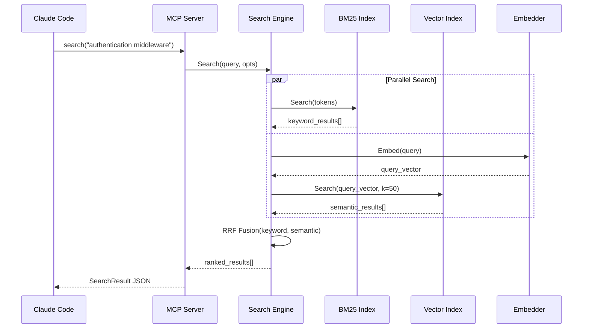
```mermaid
sequenceDiagram
    participant Client as Claude Code
    participant MCP as MCP Server
    participant Engine as Search Engine
    participant BM25 as BM25 Index
    participant Vec as Vector Index
    participant Embed as Embedder

    Client->>MCP: search("authentication middleware")
    MCP->>Engine: Search(query, opts)

    par Parallel Search
        Engine->>BM25: Search(tokens)
        BM25-->>Engine: keyword_results[]
    and
        Engine->>Embed: Embed(query)
        Embed-->>Engine: query_vector
        Engine->>Vec: Search(query_vector, k=50)
        Vec-->>Engine: semantic_results[]
    end

    Engine->>Engine: RRF Fusion(keyword, semantic)
    Engine-->>MCP: ranked_results[]
    MCP-->>Client: SearchResult JSON
```

### 2.3 Indexing Pipeline

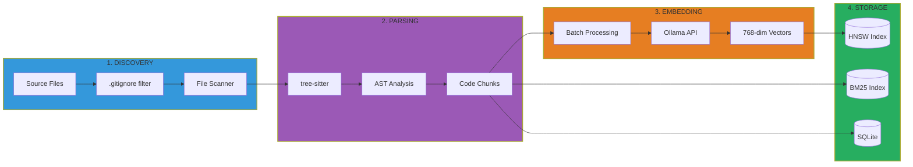
```mermaid
flowchart LR
    subgraph Discovery["1. DISCOVERY"]
        Files[Source Files]
        Gitignore[.gitignore filter]
        Scanner[File Scanner]
    end

    subgraph Parsing["2. PARSING"]
        TS[tree-sitter]
        AST[AST Analysis]
        Chunks[Code Chunks]
    end

    subgraph Embedding["3. EMBEDDING"]
        Batch[Batch Processing]
        Ollama[Ollama API]
        Vectors[768-dim Vectors]
    end

    subgraph Storage["4. STORAGE"]
        HNSW[(HNSW Index)]
        BM25[(BM25 Index)]
        Meta[(SQLite)]
    end

    Files --> Gitignore --> Scanner
    Scanner --> TS --> AST --> Chunks
    Chunks --> Batch --> Ollama --> Vectors
    Vectors --> HNSW
    Chunks --> BM25
    Chunks --> Meta

    style Discovery fill:#3498db,stroke-width:2px
    style Parsing fill:#9b59b6,stroke-width:2px
    style Embedding fill:#e67e22,stroke-width:2px
    style Storage fill:#27ae60,stroke-width:2px
```

### 2.4 Component Interaction Sequence (Search Query)

This diagram shows the detailed runtime interaction flow when processing a search query:

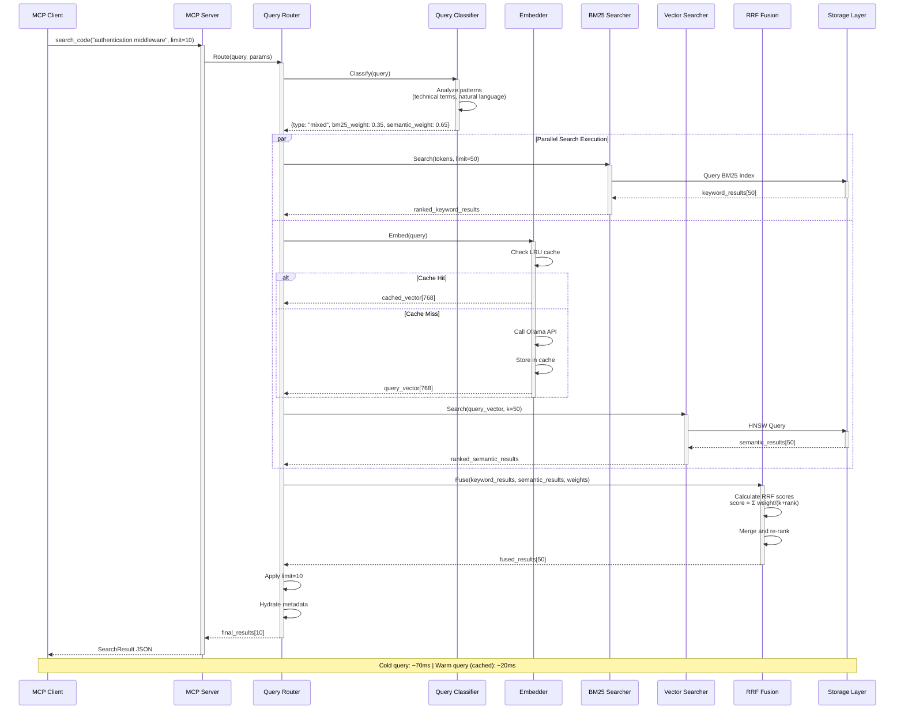
```mermaid
sequenceDiagram
    participant Client as MCP Client
    participant Server as MCP Server
    participant Router as Query Router
    participant Classifier as Query Classifier
    participant Embedder as Embedder
    participant BM25 as BM25 Searcher
    participant Vector as Vector Searcher
    participant RRF as RRF Fusion
    participant Store as Storage Layer

    Client->>Server: search_code("authentication middleware", limit=10)
    activate Server

    Server->>Router: Route(query, params)
    activate Router

    Router->>Classifier: Classify(query)
    activate Classifier
    Classifier->>Classifier: Analyze patterns<br/>(technical terms, natural language)
    Classifier-->>Router: {type: "mixed", bm25_weight: 0.35, semantic_weight: 0.65}
    deactivate Classifier

    par Parallel Search Execution
        Router->>BM25: Search(tokens, limit=50)
        activate BM25
        BM25->>Store: Query BM25 Index
        activate Store
        Store-->>BM25: keyword_results[50]
        deactivate Store
        BM25-->>Router: ranked_keyword_results
        deactivate BM25
    and
        Router->>Embedder: Embed(query)
        activate Embedder
        Embedder->>Embedder: Check LRU cache
        alt Cache Hit
            Embedder-->>Router: cached_vector[768]
        else Cache Miss
            Embedder->>Embedder: Call Ollama API
            Embedder->>Embedder: Store in cache
            Embedder-->>Router: query_vector[768]
        end
        deactivate Embedder

        Router->>Vector: Search(query_vector, k=50)
        activate Vector
        Vector->>Store: HNSW Query
        activate Store
        Store-->>Vector: semantic_results[50]
        deactivate Store
        Vector-->>Router: ranked_semantic_results
        deactivate Vector
    end

    Router->>RRF: Fuse(keyword_results, semantic_results, weights)
    activate RRF
    RRF->>RRF: Calculate RRF scores<br/>score = Σ weight/(k+rank)
    RRF->>RRF: Merge and re-rank
    RRF-->>Router: fused_results[50]
    deactivate RRF

    Router->>Router: Apply limit=10
    Router->>Router: Hydrate metadata
    Router-->>Server: final_results[10]
    deactivate Router

    Server-->>Client: SearchResult JSON
    deactivate Server

    Note over Client,Store: Cold query: ~70ms | Warm query (cached): ~20ms
```

---

## 3. Key Algorithms

### 3.1 Query Classification


```mermaid
flowchart TB
    Query["Query: 'useEffect cleanup function'"]

    subgraph Step1["Step 1: Pattern Detection"]
        P1{Has camelCase?}
        P2{Has error code?}
        P3{Natural language?}
        P4{Special chars?}
    end

    subgraph Step2["Step 2: Weight Assignment"]
        W1[Technical term → boost BM25]
        W2[Natural language → keep semantic]
        W3[Result: BM25=0.5, Semantic=0.5]
    end

    subgraph Step3["Step 3: Classification Output"]
        Output["{ type: 'mixed',<br/>bm25_weight: 0.5,<br/>semantic_weight: 0.5,<br/>boost_terms: ['useEffect'] }"]
    end

    Query --> Step1
    P1 -->|YES| W1
    P2 -->|NO| W2
    P3 -->|MIXED| W2
    P4 -->|NO| W3
    Step2 --> Output

    style Query fill:#3498db,stroke-width:2px
    style Step1 fill:#f39c12,stroke-width:2px
    style Step2 fill:#9b59b6,stroke-width:2px
    style Output fill:#27ae60,stroke-width:2px
```

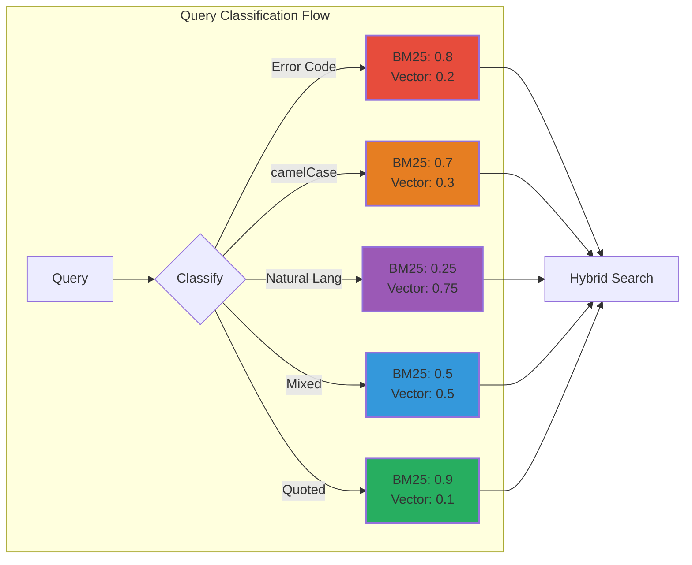
```mermaid
flowchart LR
    subgraph Classification["Query Classification Flow"]
        Q[Query] --> Classify{Classify}

        Classify -->|Error Code| EC["BM25: 0.8<br/>Vector: 0.2"]
        Classify -->|camelCase| CC["BM25: 0.7<br/>Vector: 0.3"]
        Classify -->|Natural Lang| NL["BM25: 0.25<br/>Vector: 0.75"]
        Classify -->|Mixed| MX["BM25: 0.5<br/>Vector: 0.5"]
        Classify -->|Quoted| QT["BM25: 0.9<br/>Vector: 0.1"]
    end

    EC --> Search
    CC --> Search
    NL --> Search
    MX --> Search
    QT --> Search

    Search[Hybrid Search]

    style EC fill:#e74c3c,stroke-width:2px
    style CC fill:#e67e22,stroke-width:2px
    style NL fill:#9b59b6,stroke-width:2px
    style MX fill:#3498db,stroke-width:2px
    style QT fill:#27ae60,stroke-width:2px
```

**Classification Rules:**

| Query Pattern | BM25 Weight | Semantic Weight | Reason |
|---------------|-------------|-----------------|--------|
| Error codes (ERR_*, E0001) | 0.8 | 0.2 | Exact match critical |
| camelCase/snake_case only | 0.7 | 0.3 | Technical identifier |
| Natural language | 0.25 | 0.75 | Conceptual understanding |
| Mixed (technical + NL) | 0.5 | 0.5 | Balanced approach |
| Quoted "exact phrase" | 0.9 | 0.1 | User wants exact |

### 3.2 Reciprocal Rank Fusion (RRF)

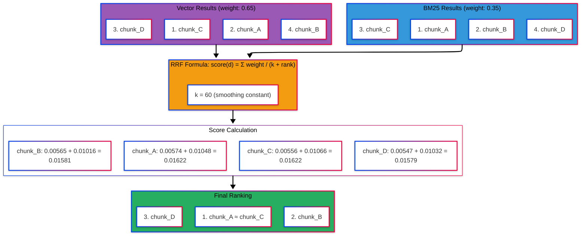
```mermaid
---
config:
  layout: elk
  theme: neo
  look: neo
---
flowchart TB
    subgraph BM25["BM25 Results (weight: 0.35)"]
        B1["1. chunk_A"]
        B2["2. chunk_B"]
        B3["3. chunk_C"]
        B4["4. chunk_D"]
    end

    subgraph Vector["Vector Results (weight: 0.65)"]
        V1["1. chunk_C"]
        V2["2. chunk_A"]
        V3["3. chunk_D"]
        V4["4. chunk_B"]
    end

    subgraph RRF["RRF Formula: score(d) = Σ weight / (k + rank)"]
        Formula["k = 60 (smoothing constant)"]
    end

    subgraph Scores["Score Calculation"]
        SA["chunk_A: 0.00574 + 0.01048 = 0.01622"]
        SC["chunk_C: 0.00556 + 0.01066 = 0.01622"]
        SB["chunk_B: 0.00565 + 0.01016 = 0.01581"]
        SD["chunk_D: 0.00547 + 0.01032 = 0.01579"]
    end

    subgraph Final["Final Ranking"]
        R1["1. chunk_A ≈ chunk_C"]
        R2["2. chunk_B"]
        R3["3. chunk_D"]
    end

    BM25 --> RRF
    Vector --> RRF
    RRF --> Scores --> Final

    style BM25 fill:#3498db,stroke-width:2px
    style Vector fill:#9b59b6,stroke-width:2px
    style RRF fill:#f39c12,stroke-width:2px
    style Final fill:#27ae60,stroke-width:2px
```

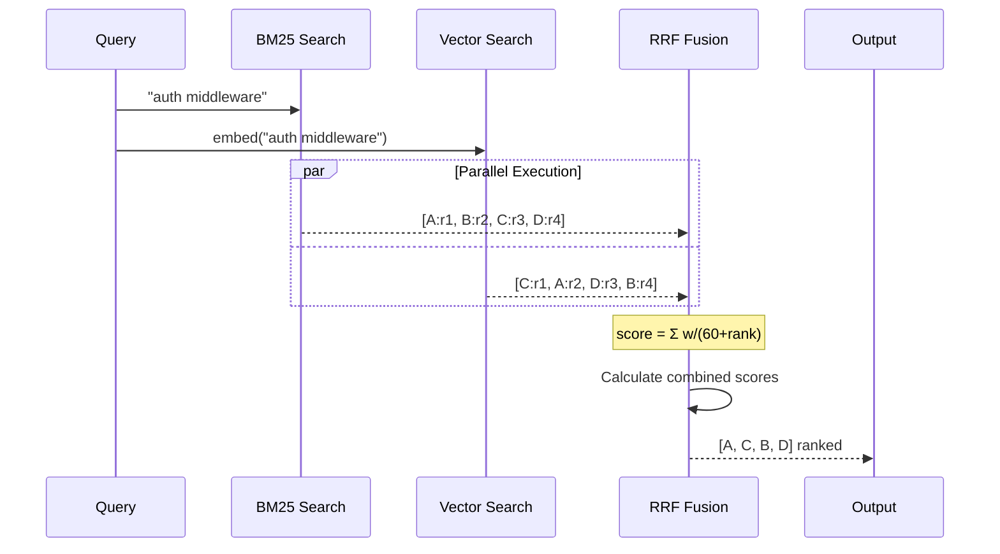
```mermaid
sequenceDiagram
    participant Q as Query
    participant BM25 as BM25 Search
    participant Vec as Vector Search
    participant RRF as RRF Fusion
    participant Out as Output

    Q->>BM25: "auth middleware"
    Q->>Vec: embed("auth middleware")

    par Parallel Execution
        BM25-->>RRF: [A:r1, B:r2, C:r3, D:r4]
    and
        Vec-->>RRF: [C:r1, A:r2, D:r3, B:r4]
    end

    Note over RRF: score = Σ w/(60+rank)
    RRF->>RRF: Calculate combined scores
    RRF-->>Out: [A, C, B, D] ranked
```

### 3.3 AST-Based Chunking (cAST Algorithm)

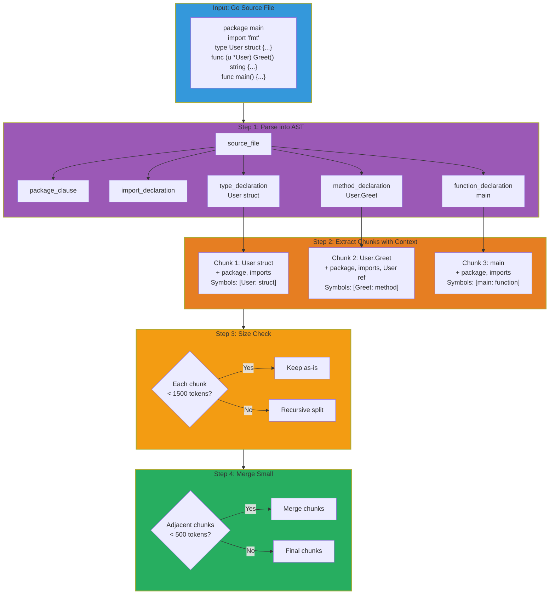
```mermaid
flowchart TB
    subgraph Input["Input: Go Source File"]
        Code["package main<br/>import 'fmt'<br/>type User struct {...}<br/>func (u *User) Greet() string {...}<br/>func main() {...}"]
    end

    subgraph Step1["Step 1: Parse into AST"]
        AST["source_file"]
        AST --> Pkg[package_clause]
        AST --> Imp[import_declaration]
        AST --> Type[type_declaration<br/>User struct]
        AST --> Method[method_declaration<br/>User.Greet]
        AST --> Func[function_declaration<br/>main]
    end

    subgraph Step2["Step 2: Extract Chunks with Context"]
        C1["Chunk 1: User struct<br/>+ package, imports<br/>Symbols: [User: struct]"]
        C2["Chunk 2: User.Greet<br/>+ package, imports, User ref<br/>Symbols: [Greet: method]"]
        C3["Chunk 3: main<br/>+ package, imports<br/>Symbols: [main: function]"]
    end

    subgraph Step3["Step 3: Size Check"]
        Check{Each chunk<br/>< 1500 tokens?}
        Check -->|Yes| Keep[Keep as-is]
        Check -->|No| Split[Recursive split]
    end

    subgraph Step4["Step 4: Merge Small"]
        Merge{Adjacent chunks<br/>< 500 tokens?}
        Merge -->|Yes| Combine[Merge chunks]
        Merge -->|No| Final[Final chunks]
    end

    Input --> Step1
    Type --> C1
    Method --> C2
    Func --> C3
    Step2 --> Step3 --> Step4

    style Input fill:#3498db,stroke-width:2px
    style Step1 fill:#9b59b6,stroke-width:2px
    style Step2 fill:#e67e22,stroke-width:2px
    style Step3 fill:#f39c12,stroke-width:2px
    style Step4 fill:#27ae60,stroke-width:2px
```

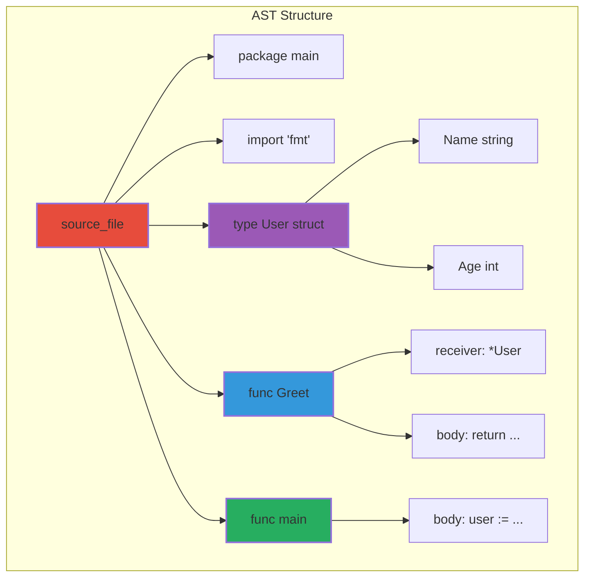
```mermaid
graph TD
    subgraph AST["AST Structure"]
        Root[source_file]
        Root --> P[package main]
        Root --> I[import 'fmt']
        Root --> T[type User struct]
        Root --> M[func Greet]
        Root --> F[func main]

        T --> TF1[Name string]
        T --> TF2[Age int]

        M --> MR[receiver: *User]
        M --> MB[body: return ...]

        F --> FB[body: user := ...]
    end

    style Root fill:#e74c3c,stroke-width:2px
    style T fill:#9b59b6,stroke-width:2px
    style M fill:#3498db,stroke-width:2px
    style F fill:#27ae60,stroke-width:2px
```

---

## 4. Storage Design

### 4.1 Storage Directory Structure

```
.amanmcp/
├── vectors.hnsw             # coder/hnsw HNSW index (GOB encoded)
├── vectors.hnsw.meta        # Vector ID mappings (GOB encoded)
├── bm25.db                  # SQLite FTS5 BM25 index
├── metadata.db              # SQLite metadata (chunks, files, symbols)
└── config.yaml              # Project-specific config (if any)
```

### 4.2 Metadata Schema (SQLite)

```sql
-- Projects table
CREATE TABLE projects (
    id TEXT PRIMARY KEY,
    name TEXT NOT NULL,
    root_path TEXT NOT NULL UNIQUE,
    project_type TEXT,
    created_at TIMESTAMP DEFAULT CURRENT_TIMESTAMP,
    updated_at TIMESTAMP DEFAULT CURRENT_TIMESTAMP
);

-- Files table (for incremental indexing)
CREATE TABLE files (
    id TEXT PRIMARY KEY,
    project_id TEXT NOT NULL,
    path TEXT NOT NULL,
    content_hash TEXT NOT NULL,
    size INTEGER,
    mod_time TIMESTAMP,
    indexed_at TIMESTAMP DEFAULT CURRENT_TIMESTAMP,
    FOREIGN KEY (project_id) REFERENCES projects(id),
    UNIQUE(project_id, path)
);

-- Chunks table (metadata only, content in vector store)
CREATE TABLE chunks (
    id TEXT PRIMARY KEY,
    file_id TEXT NOT NULL,
    content_type TEXT NOT NULL,
    language TEXT,
    start_line INTEGER,
    end_line INTEGER,
    symbols TEXT,  -- JSON array
    created_at TIMESTAMP DEFAULT CURRENT_TIMESTAMP,
    FOREIGN KEY (file_id) REFERENCES files(id)
);

-- Indexes for fast lookups
CREATE INDEX idx_files_project ON files(project_id);
CREATE INDEX idx_files_path ON files(path);
CREATE INDEX idx_chunks_file ON chunks(file_id);
CREATE INDEX idx_chunks_type ON chunks(content_type);
```

### 4.3 Vector Store Design (coder/hnsw)

AmanMCP uses [coder/hnsw](https://github.com/coder/hnsw) — a pure Go HNSW implementation
designed for simplicity and portability. Replaced USearch (CGO) in v0.1.38.

**Why coder/hnsw?**

- **Pure Go** — no CGO, portable binary distribution
- **HNSW algorithm** — scales logarithmically O(log n), not linearly
- **Simple persistence** — GOB encoding for fast save/load
- **Production-tested** — used by Coder for AI features
- **No external deps** — simplifies build and deployment

**Performance Benchmarks** (HNSW with typical embeddings):

| Documents | Query Time | Notes |
|-----------|------------|-------|
| 10,000 | < 1ms | ⚡ Instant |
| 100,000 | ~2-5ms | ⚡ Excellent |
| **300,000** | **~5-10ms** | ✅ **Target scale** |
| 1,000,000 | ~10-20ms | ✅ Scales logarithmically |
| 10,000,000+ | ~20-50ms | ✅ Memory-mapped for large indexes |

```go
// Collection structure
type VectorCollection struct {
    Name       string                 // "chunks"
    Metadata   map[string]interface{} // Collection metadata
    Embeddings []EmbeddingRecord      // Vector records
}

type EmbeddingRecord struct {
    ID        string            // Chunk ID
    Embedding []float32         // 768-dim vector
    Content   string            // Original text (for retrieval)
    Metadata  map[string]string // file_path, language, etc.
}

// Storage format: GOB-encoded for fast serialization
// Persistence: Write on shutdown, load on startup
// Memory: Keep full index in memory (typical: 50-200MB for 100K files)
```

#### 4.3.1 coder/hnsw Integration

```go
import (
    "github.com/coder/hnsw"
)

// Initialize HNSW graph for vector storage
func NewVectorIndex(dimensions int) (*hnsw.Graph[uint64], error) {
    graph := hnsw.NewGraph[uint64]()
    return graph, nil
}

// Add vector to the graph
func (s *HNSWStore) Add(id string, vector []float32) error {
    key := s.getOrCreateKey(id)
    node := hnsw.MakeNode(key, vector)
    s.graph.Add(node)
    return nil
}

// Search for similar vectors
func (s *HNSWStore) Search(vector []float32, k int) ([]VectorResult, error) {
    neighbors := s.graph.Search(vector, k)
    // Convert to VectorResult...
    return results, nil
}

// Persistence via GOB encoding
func (s *HNSWStore) Save(path string) error {
    return s.graph.Export(path)
}

func (s *HNSWStore) Load(path string) error {
    return s.graph.Import(path)
}
```

#### 4.3.2 Vector Store Selection (v0.1.38)

**Why we switched from USearch to coder/hnsw:**

USearch required CGO with dynamic library linking, which caused distribution problems
(BUG-018: CLI binary hung when installed to `~/.local/bin/`). coder/hnsw is pure Go,
eliminating all CGO-related distribution issues.

| Solution | Status | Notes |
|----------|--------|-------|
| **[coder/hnsw](https://github.com/coder/hnsw)** | **Current (v0.1.38+)** | Pure Go, no CGO, portable |
| USearch | Removed (v0.1.38) | CGO issues, see ADR-022 |
| chromem-go | Not used | Linear scan, doesn't scale |

**AmanMCP Default:** coder/hnsw is the vector store since v0.1.38. With 300K+ documents as the target scale,
HNSW's logarithmic scaling ensures sub-10ms queries even at scale.

### 4.4 Concurrency Model

This diagram shows how goroutines, channels, and synchronization primitives are used throughout the system:

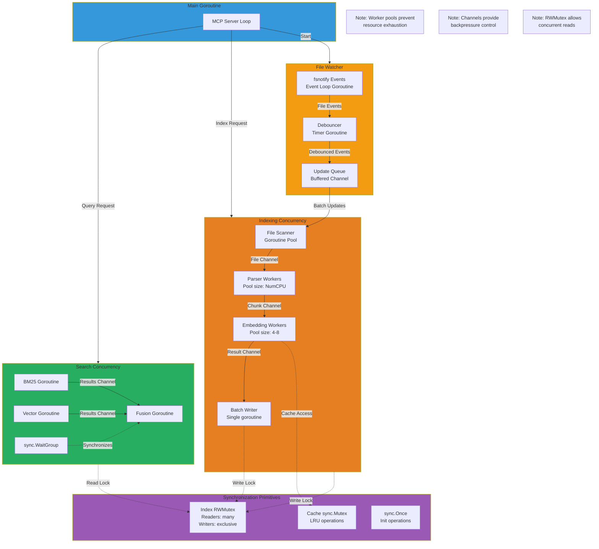
```mermaid
flowchart TB
    subgraph Main["Main Goroutine"]
        Server[MCP Server Loop]
    end

    subgraph Indexing["Indexing Concurrency"]
        Scanner[File Scanner<br/>Goroutine Pool]
        Parser[Parser Workers<br/>Pool size: NumCPU]
        Embedder[Embedding Workers<br/>Pool size: 4-8]

        Scanner -->|File Channel| Parser
        Parser -->|Chunk Channel| Embedder
        Embedder -->|Result Channel| Writer
        Writer[Batch Writer<br/>Single goroutine]
    end

    subgraph Search["Search Concurrency"]
        BM25Go[BM25 Goroutine]
        VectorGo[Vector Goroutine]
        WaitGroup[sync.WaitGroup]

        BM25Go -->|Results Channel| Fusion
        VectorGo -->|Results Channel| Fusion
        WaitGroup -.->|Synchronizes| Fusion[Fusion Goroutine]
    end

    subgraph Watcher["File Watcher"]
        FSEvents[fsnotify Events<br/>Event Loop Goroutine]
        Debouncer[Debouncer<br/>Timer Goroutine]
        Queue[Update Queue<br/>Buffered Channel]

        FSEvents -->|File Events| Debouncer
        Debouncer -->|Debounced Events| Queue
        Queue -->|Batch Updates| Scanner
    end

    subgraph Sync["Synchronization Primitives"]
        RWMutex["Index RWMutex<br/>Readers: many<br/>Writers: exclusive"]
        CacheMutex["Cache sync.Mutex<br/>LRU operations"]
        Once["sync.Once<br/>Init operations"]
    end

    Server -->|Query Request| Search
    Server -->|Index Request| Indexing
    Server -->|Start| Watcher

    Search -.->|Read Lock| RWMutex
    Indexing -.->|Write Lock| RWMutex
    Embedder -.->|Cache Access| CacheMutex
    Writer -.->|Write Lock| RWMutex

    style Main fill:#3498db,stroke-width:2px
    style Indexing fill:#e67e22,stroke-width:2px
    style Search fill:#27ae60,stroke-width:2px
    style Watcher fill:#f39c12,stroke-width:2px
    style Sync fill:#9b59b6,stroke-width:2px

    Note1[Note: Worker pools prevent<br/>resource exhaustion]
    Note2[Note: Channels provide<br/>backpressure control]
    Note3[Note: RWMutex allows<br/>concurrent reads]
```

**Key Patterns:**

| Pattern | Usage | Purpose |
|---------|-------|---------|
| Worker Pool | File scanning, parsing, embedding | Limit concurrent operations |
| Fan-out/Fan-in | Parallel BM25 + Vector search | Maximize throughput |
| Pipeline | Scanner → Parser → Embedder → Writer | Stream processing |
| Debouncing | File system events | Batch related changes |
| Read-Write Lock | Index access | Concurrent reads, exclusive writes |
| Buffered Channels | File events, chunk queue | Smooth throughput spikes |

**Concurrency Limits:**

```go
// Default worker pool sizes
const (
    ScannerWorkers   = runtime.NumCPU()      // File I/O bound
    ParserWorkers    = runtime.NumCPU()      // CPU bound
    EmbedderWorkers  = 8                      // Network I/O bound
    ChannelBuffer    = 100                    // Backpressure buffer
)
```

---

## 5. Performance Considerations

### 5.1 Memory Management

AmanMCP is designed for **typical developer hardware** (16-32GB RAM), not high-end workstations.

#### 5.1.1 Realistic Hardware Profiles

| Developer Setup | Total RAM | Available for AmanMCP | Recommended Settings |
|-----------------|-----------|----------------------|----------------------|
| MacBook Air M2 | 16 GB | ~4-6 GB | `GOGC=100 GOMEMLIMIT=4GiB` |
| **MacBook Pro M4** | **24 GB** | **~8-10 GB** | **`GOGC=100 GOMEMLIMIT=8GiB`** |
| MacBook Pro M4 Max | 32 GB | ~12-16 GB | `GOGC=50 GOMEMLIMIT=12GiB` |
| Linux Workstation | 64 GB+ | ~32+ GB | `GOGC=off GOMEMLIMIT=32GiB` |

**Why these limits?** Typical developer machines run:

- macOS + System: ~4-5 GB
- IDE (VS Code/Cursor): ~2-3 GB
- Browser: ~2-4 GB
- Ollama service: external process (memory varies by model)
- Other apps: ~2-4 GB

#### 5.1.2 Memory Budget (per 100K documents)

| Component | F32 (full) | F16 (default) | I8 (compact) |
|-----------|------------|---------------|--------------|
| Vector embeddings | ~300 MB | **~150 MB** | ~75 MB |
| BM25 inverted index | ~50 MB | ~50 MB | ~50 MB |
| Metadata (SQLite) | ~10 MB | ~10 MB | ~10 MB |
| Tree-sitter parsers | ~20 MB | ~20 MB | ~20 MB |
| Runtime overhead | ~50 MB | ~50 MB | ~50 MB |
| **Total** | **~430 MB** | **~280 MB** | **~205 MB** |

**Default:** F16 quantization — half the memory of F32, negligible quality loss.

#### 5.1.3 Memory-Mapped Index (Critical for Scale)

For 300K+ documents, memory-mapped mode is **essential**:

```go
// Memory-mapped loading — OS manages paging, not Go heap
func LoadIndexView(path string) (*usearch.Index, error) {
    index, err := usearch.NewIndex(usearch.DefaultConfig(768))
    if err != nil {
        return nil, err
    }
    // View() memory-maps the file instead of loading into RAM
    return index, index.View(path)
}
```

| Mode | 300K docs | 24GB System | Notes |
|------|-----------|-------------|-------|
| Load into RAM | ~450 MB heap | ⚠️ Tight | Faster queries |
| **Memory-mapped** | **~50 MB heap** | ✅ **Recommended** | OS pages on demand |

#### 5.1.4 Go Runtime Tuning

```bash
# For 24GB M4 Pro (recommended)
GOGC=100 GOMEMLIMIT=8GiB ./amanmcp serve

# For 16GB systems (conservative)
GOGC=100 GOMEMLIMIT=4GiB ./amanmcp serve

# For 32GB+ systems (aggressive)
GOGC=50 GOMEMLIMIT=12GiB ./amanmcp serve
```

Or programmatically with auto-detection:

```go
import (
    "runtime/debug"
    "github.com/pbnjay/memory"
)

func ConfigureMemory() {
    totalMem := memory.TotalMemory()

    // Reserve 60% for other apps, use 40% for AmanMCP
    limit := int64(float64(totalMem) * 0.4)

    // Cap at 16GB even on large systems
    if limit > 16*1024*1024*1024 {
        limit = 16 * 1024 * 1024 * 1024
    }

    debug.SetMemoryLimit(limit)
    debug.SetGCPercent(100) // Or -1 for GOGC=off on large systems
}
```

### 5.2 Latency Optimization


```mermaid
gantt
    title Query Latency Breakdown: "authentication middleware"
    dateFormat X
    axisFormat %L ms

    section Parsing
    Query parsing     :done, 0, 1
    Classification    :done, 1, 3

    section Search
    Query embedding   :active, 3, 53
    BM25 search       :done, 3, 8
    Vector search     :done, 3, 13

    section Fusion
    Score fusion      :done, 53, 54
    Result format     :done, 54, 55
```

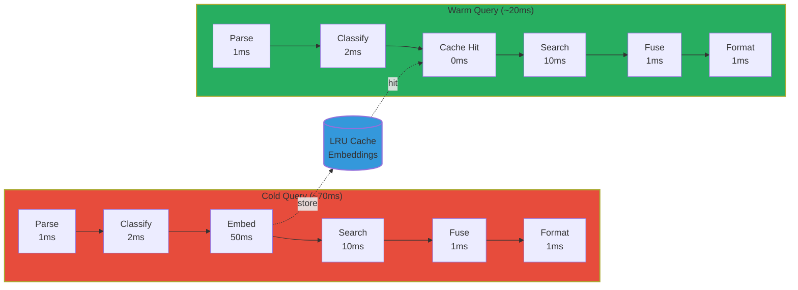
```mermaid
flowchart LR
    subgraph Cold["Cold Query (~70ms)"]
        C1[Parse<br/>1ms] --> C2[Classify<br/>2ms]
        C2 --> C3[Embed<br/>50ms]
        C3 --> C4[Search<br/>10ms]
        C4 --> C5[Fuse<br/>1ms]
        C5 --> C6[Format<br/>1ms]
    end

    subgraph Warm["Warm Query (~20ms)"]
        W1[Parse<br/>1ms] --> W2[Classify<br/>2ms]
        W2 --> W3[Cache Hit<br/>0ms]
        W3 --> W4[Search<br/>10ms]
        W4 --> W5[Fuse<br/>1ms]
        W5 --> W6[Format<br/>1ms]
    end

    Cache[(LRU Cache<br/>Embeddings)]
    C3 -.->|store| Cache
    Cache -.->|hit| W3

    style Cold fill:#e74c3c,stroke-width:2px
    style Warm fill:#27ae60,stroke-width:2px
    style Cache fill:#3498db,stroke-width:2px
```

| Component | Target | Strategy |
|-----------|--------|----------|
| Query parsing | < 1ms | Simple string ops |
| Classification | < 2ms | Pattern matching |
| Query embedding | ~30-50ms | Ollama (cached) |
| BM25 search | < 5ms | Inverted index |
| Vector search | < 10ms | HNSW |
| Score fusion | < 1ms | Simple arithmetic |
| **Total (cold)** | **~70ms** | |
| **Total (warm)** | **~20ms** | Embedding cached |

### 5.3 Indexing Throughput

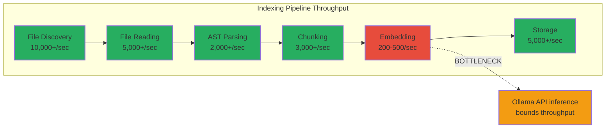
```mermaid
flowchart LR
    subgraph Pipeline["Indexing Pipeline Throughput"]
        D[File Discovery<br/>10,000+/sec]
        R[File Reading<br/>5,000+/sec]
        P[AST Parsing<br/>2,000+/sec]
        C[Chunking<br/>3,000+/sec]
        E[Embedding<br/>200-500/sec]
        S[Storage<br/>5,000+/sec]
    end

    D --> R --> P --> C --> E --> S

    E -.->|BOTTLENECK| Note["Ollama API inference<br/>bounds throughput"]

    style D fill:#27ae60,stroke-width:2px
    style R fill:#27ae60,stroke-width:2px
    style P fill:#27ae60,stroke-width:2px
    style C fill:#27ae60,stroke-width:2px
    style E fill:#e74c3c,stroke-width:2px
    style S fill:#27ae60,stroke-width:2px
    style Note fill:#f39c12,stroke-width:2px
```

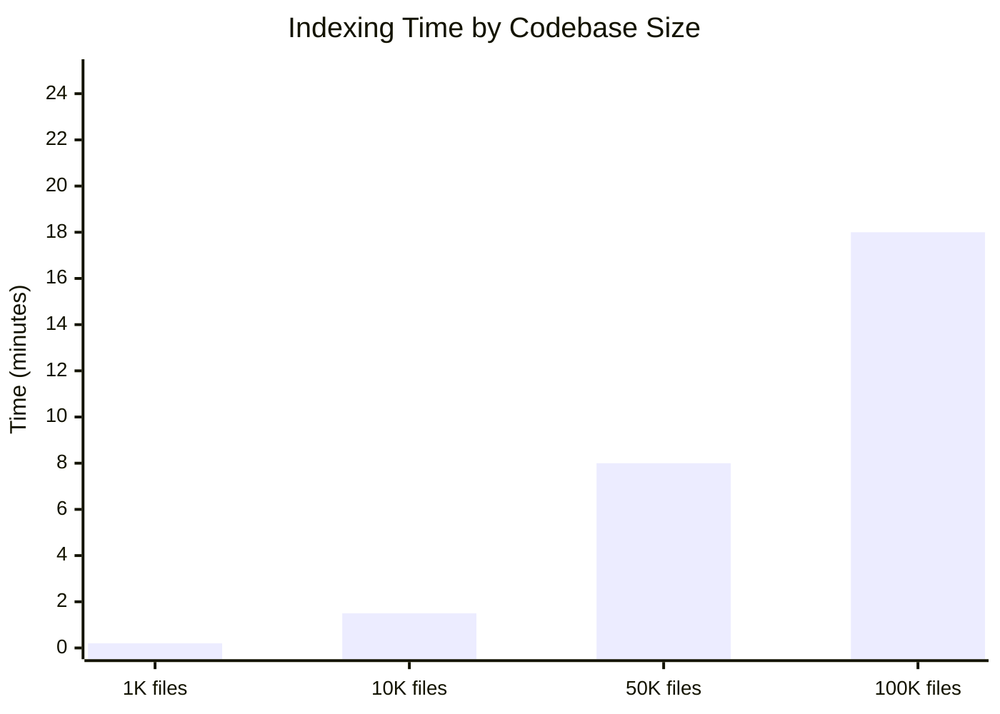
```mermaid
xychart-beta
    title "Indexing Time by Codebase Size"
    x-axis ["1K files", "10K files", "50K files", "100K files"]
    y-axis "Time (minutes)" 0 --> 25
    bar [0.2, 1.5, 8, 18]
```

| Pipeline Stage | Throughput | Strategy |
|----------------|------------|----------|
| File discovery | 10,000+/sec | Concurrent walk |
| File reading | 5,000+/sec | Buffered I/O |
| AST parsing | 2,000+/sec | tree-sitter (fast) |
| Chunking | 3,000+/sec | Simple splitting |
| **Embedding** | **200-500/sec** | **Batch + concurrent (bottleneck)** |
| Storage | 5,000+/sec | Batch writes |

**Effective throughput:** ~100-200 files/sec (embedding-bound)

**Mitigations:**

1. Progress bar with ETA
2. Incremental indexing (changed files only)
3. Background indexing (serve queries while indexing)
4. Priority indexing (frequently-accessed dirs first)

### 5.4 Performance Optimization Points

This diagram shows where optimizations are applied throughout the query and indexing pipelines:


```mermaid
---
config:
  layout: elk
  theme: neo
  look: neo
---
flowchart LR
 subgraph Query["Query Pipeline Optimizations"]
        Q1["1. Query Cache<br>LRU cache for embeddings<br>Hit rate: ~60-80%<br>Speedup: 50ms → 0ms"]
        Q2["2. Parallel Search<br>BM25 + Vector concurrent<br>Speedup: 2x"]
        Q3["3. Early Termination<br>Stop at k results<br>Speedup: Variable"]
        Q4["4. Result Pooling<br>Reuse result structs<br>Memory: -30%"]
  end
 subgraph Index["Indexing Pipeline Optimizations"]
        I1["1. Worker Pools<br>Limit goroutines to NumCPU<br>Prevents thrashing"]
        I2["2. Batch Processing<br>100 chunks per embed call<br>Throughput: 5x"]
        I3["3. Incremental Updates<br>Hash-based change detection<br>Time: 90% reduction"]
        I4["4. Memory-Mapped Index<br>OS page cache for vectors<br>Memory: -80%"]
  end
 subgraph Storage["Storage Optimizations"]
        S1["1. Write Batching<br>Buffer 1000 ops<br>Throughput: 10x"]
        S2["2. Read Caching<br>Metadata in memory<br>Latency: 100μs → 1μs"]
        S3["3. Connection Pooling<br>Reuse SQLite connections<br>Overhead: -50%"]
        S4["4. Prepared Statements<br>Pre-compile frequent queries<br>Parse time: 0ms"]
  end
 subgraph Memory["Memory Optimizations"]
        M1["1. Object Pooling<br>sync.Pool for allocations<br>GC pressure: -40%"]
        M2["2. String Interning<br>Deduplicate file paths<br>Memory: -20%"]
        M3["3. Vector Quantization<br>F32 → F16 compression<br>Memory: -50%"]
        M4["4. GOGC Tuning<br>Adaptive GC threshold<br>Latency spikes: -60%"]
  end
    Query --> Target1["Target: &lt;100ms<br>p99 latency"]
    Index --> Target2["Target: &lt;10min<br>100K files"]
    Storage --> Target3["Target: &lt;10ms<br>per operation"]
    Memory --> Target4["Target: &lt;300MB<br>100K files"]

    style Q1 fill:#27ae60,stroke-width:2px
    style Q2 fill:#27ae60,stroke-width:2px
    style Q3 fill:#27ae60,stroke-width:2px
    style Q4 fill:#27ae60,stroke-width:2px
    style I1 fill:#3498db,stroke-width:2px
    style I2 fill:#3498db,stroke-width:2px
    style I3 fill:#3498db,stroke-width:2px
    style I4 fill:#3498db,stroke-width:2px
    style S1 fill:#9b59b6,stroke-width:2px
    style S2 fill:#9b59b6,stroke-width:2px
    style S3 fill:#9b59b6,stroke-width:2px
    style S4 fill:#9b59b6,stroke-width:2px
    style M1 fill:#e67e22,stroke-width:2px
    style M2 fill:#e67e22,stroke-width:2px
    style M3 fill:#e67e22,stroke-width:2px
    style M4 fill:#e67e22,stroke-width:2px
    style Target1 fill:#2ecc71,stroke-width:2px
    style Target2 fill:#2ecc71,stroke-width:2px
    style Target3 fill:#2ecc71,stroke-width:2px
    style Target4 fill:#2ecc71,stroke-width:2px
```

**Optimization Impact Summary:**

| Optimization | Before | After | Improvement |
|--------------|--------|-------|-------------|
| Query embedding (cached) | 50ms | 0ms | 100% |
| Parallel search | 20ms | 10ms | 2x |
| Batch embedding | 5 files/sec | 25 files/sec | 5x |
| Incremental indexing | Full rebuild | Changed only | 90% |
| Memory-mapped vectors | 450 MB heap | 50 MB heap | 89% |
| Write batching | 100 ops/sec | 1000 ops/sec | 10x |
| Vector quantization (F16) | 300 MB | 150 MB | 50% |
| Object pooling | High GC | Low GC | 40% less pressure |

---

## 6. Error Handling & Resilience

### 6.1 Failure Modes

| Failure | Detection | Recovery |
|---------|-----------|----------|
| Model download fails | Network error | Use static embeddings |
| Corrupted index | Checksum mismatch | Rebuild from scratch |
| File read error | OS error | Skip file, log warning |
| Parse error | tree-sitter error | Fall back to line chunking |
| OOM during indexing | Memory threshold | Pause, flush, resume |
| Network timeout | HTTP timeout | Retry with backoff |

### 6.2 Error Propagation Flow

This diagram shows how errors flow through the system and where they are handled or transformed:

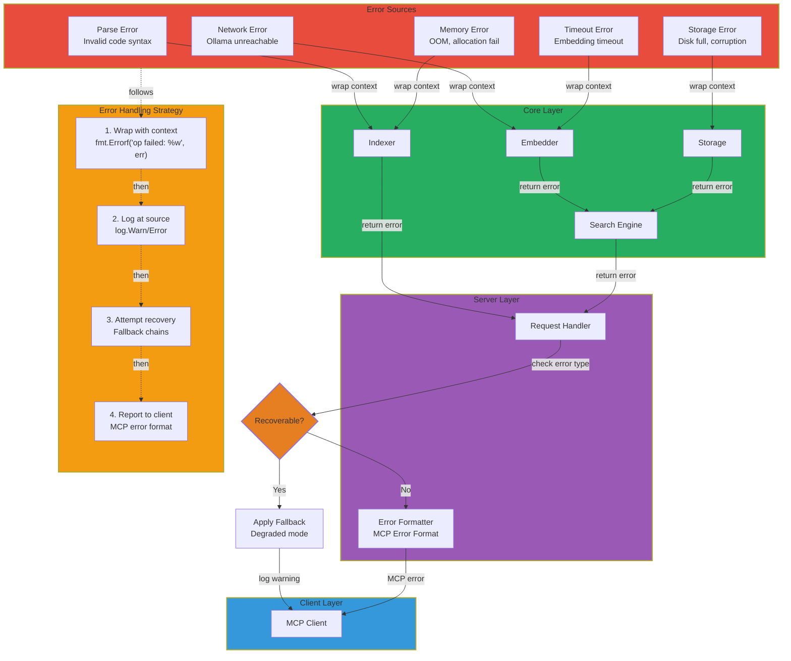
```mermaid
flowchart TB
    subgraph Client["Client Layer"]
        MCPClient[MCP Client]
    end

    subgraph Server["Server Layer"]
        Handler[Request Handler]
        ErrorFormatter[Error Formatter<br/>MCP Error Format]
    end

    subgraph Core["Core Layer"]
        SearchEngine[Search Engine]
        Indexer[Indexer]
        Embedder[Embedder]
        Store[Storage]
    end

    subgraph Errors["Error Sources"]
        E1[Network Error<br/>Ollama unreachable]
        E2[Parse Error<br/>Invalid code syntax]
        E3[Storage Error<br/>Disk full, corruption]
        E4[Memory Error<br/>OOM, allocation fail]
        E5[Timeout Error<br/>Embedding timeout]
    end

    E1 -->|wrap context| Embedder
    E2 -->|wrap context| Indexer
    E3 -->|wrap context| Store
    E4 -->|wrap context| Indexer
    E5 -->|wrap context| Embedder

    Embedder -->|return error| SearchEngine
    Indexer -->|return error| Handler
    Store -->|return error| SearchEngine
    SearchEngine -->|return error| Handler

    Handler -->|check error type| Recovery{Recoverable?}

    Recovery -->|Yes| Fallback[Apply Fallback<br/>Degraded mode]
    Recovery -->|No| ErrorFormatter

    Fallback -->|log warning| MCPClient
    ErrorFormatter -->|MCP error| MCPClient

    subgraph ErrorHandling["Error Handling Strategy"]
        Wrap["1. Wrap with context<br/>fmt.Errorf('op failed: %w', err)"]
        Log["2. Log at source<br/>log.Warn/Error"]
        Recover["3. Attempt recovery<br/>Fallback chains"]
        Report["4. Report to client<br/>MCP error format"]
    end

    Errors -.->|follows| Wrap
    Wrap -.->|then| Log
    Log -.->|then| Recover
    Recover -.->|then| Report

    style Client fill:#3498db,stroke-width:2px
    style Server fill:#9b59b6,stroke-width:2px
    style Core fill:#27ae60,stroke-width:2px
    style Errors fill:#e74c3c,stroke-width:2px
    style ErrorHandling fill:#f39c12,stroke-width:2px
    style Recovery fill:#e67e22,stroke-width:2px
```

**Error Handling Principles:**

| Layer | Strategy | Example |
|-------|----------|---------|
| Storage | Wrap + retry | `fmt.Errorf("failed to write chunk %s: %w", id, err)` |
| Indexer | Wrap + skip | Skip file, log warning, continue with rest |
| Embedder | Wrap + fallback | Fall back to Static768 if Ollama fails |
| Search | Wrap + degrade | Use BM25 only if vector search fails |
| Server | Format + report | Convert to MCP error format with code |

**Error Context Chain Example:**

```go
// At storage layer
return fmt.Errorf("failed to insert chunk: %w", err)

// At indexer layer
return fmt.Errorf("failed to index file %s: %w", path, err)

// At handler layer
return fmt.Errorf("indexing failed for project %s: %w", projectID, err)

// Result: "indexing failed for project abc123: failed to index file src/main.go: failed to insert chunk: database is locked"
```

### 6.3 Graceful Degradation

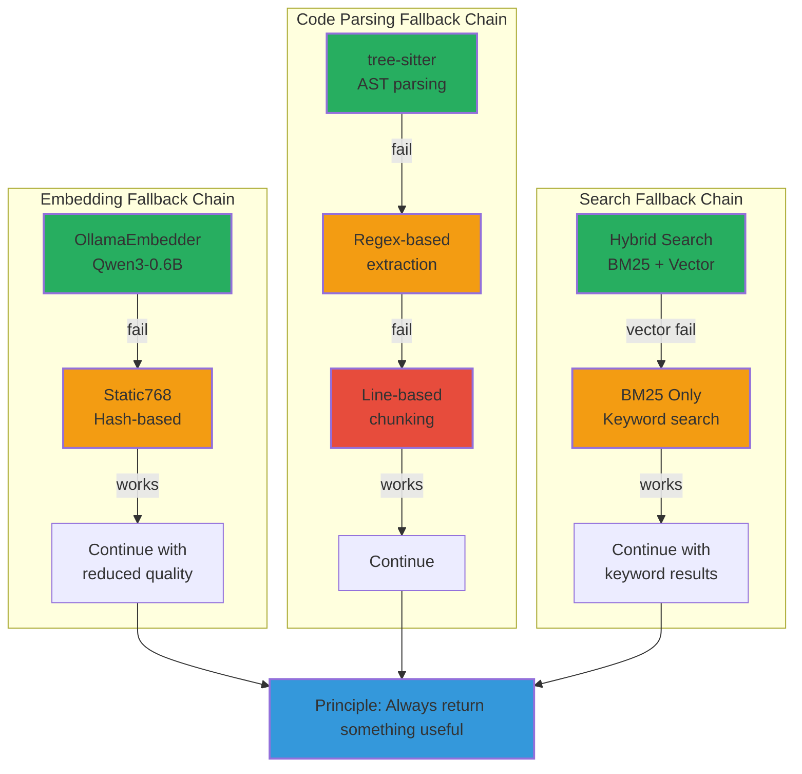
```mermaid
flowchart TB
    subgraph Embedding["Embedding Fallback Chain"]
        E1[OllamaEmbedder<br/>Qwen3-0.6B] -->|fail| E2[Static768<br/>Hash-based]
        E2 -->|works| EC[Continue with<br/>reduced quality]

        style E1 fill:#27ae60,stroke-width:2px
        style E2 fill:#f39c12,stroke-width:2px
    end

    subgraph Parsing["Code Parsing Fallback Chain"]
        P1[tree-sitter<br/>AST parsing] -->|fail| P2[Regex-based<br/>extraction]
        P2 -->|fail| P3[Line-based<br/>chunking]
        P3 -->|works| PC[Continue]

        style P1 fill:#27ae60,stroke-width:2px
        style P2 fill:#f39c12,stroke-width:2px
        style P3 fill:#e74c3c,stroke-width:2px
    end

    subgraph Search["Search Fallback Chain"]
        S1[Hybrid Search<br/>BM25 + Vector] -->|vector fail| S2[BM25 Only<br/>Keyword search]
        S2 -->|works| SC[Continue with<br/>keyword results]

        style S1 fill:#27ae60,stroke-width:2px
        style S2 fill:#f39c12,stroke-width:2px
    end

    Principle["Principle: Always return something useful"]
    EC --> Principle
    PC --> Principle
    SC --> Principle

    style Principle fill:#3498db,stroke-width:2px
```

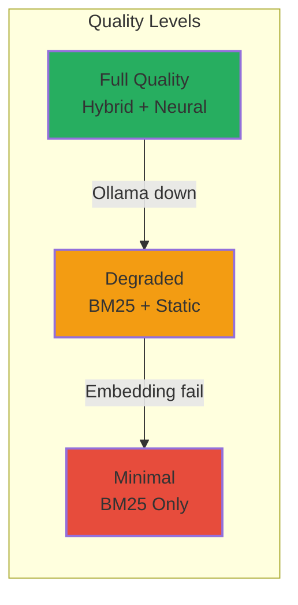
```mermaid
flowchart LR
    subgraph Quality["Quality Levels"]
        Q1["Full Quality<br/>Hybrid + Neural"]
        Q2["Degraded<br/>BM25 + Static"]
        Q3["Minimal<br/>BM25 Only"]
    end

    Q1 -->|Ollama down| Q2
    Q2 -->|Embedding fail| Q3

    style Q1 fill:#27ae60,stroke-width:2px
    style Q2 fill:#f39c12,stroke-width:2px
    style Q3 fill:#e74c3c,stroke-width:2px
```

### 6.4 State Management

This diagram shows how state is maintained and synchronized across different operations:

```mermaid
stateDiagram-v2
    [*] --> Uninitialized

    Uninitialized --> Initializing: Start Server
    Initializing --> Ready: Load Index Success
    Initializing --> Degraded: Load Index Partial Fail
    Initializing --> Error: Load Index Complete Fail

    Ready --> Indexing: Index Request
    Ready --> Searching: Search Request
    Ready --> Watching: File Change Detected

    Indexing --> IndexingActive: Start Workers
    IndexingActive --> IndexingWrite: Chunks Ready
    IndexingWrite --> Ready: Write Complete
    IndexingWrite --> Error: Write Failed

    Searching --> SearchActive: Execute Query
    SearchActive --> Ready: Results Ready
    SearchActive --> Degraded: Partial Failure
    SearchActive --> Error: Complete Failure

    Watching --> WatchDebounce: Accumulate Events
    WatchDebounce --> Indexing: Debounce Timer Fired

    Degraded --> Ready: Component Recovered
    Degraded --> Error: Additional Failure

    Error --> Recovering: Retry
    Recovering --> Ready: Recovery Success
    Recovering --> Error: Recovery Failed

    Ready --> Shutdown: Stop Request
    Degraded --> Shutdown: Stop Request
    Error --> Shutdown: Stop Request
    Shutdown --> [*]: Cleanup Complete

    note right of Uninitialized
        State: No index loaded
        Actions: None allowed
    end note

    note right of Ready
        State: Index loaded, all systems operational
        Actions: Search, index, watch
        Locks: None held
    end note

    note right of IndexingActive
        State: Workers processing files
        Actions: Search allowed (read-only)
        Locks: Write lock pending
    end note

    note right of IndexingWrite
        State: Writing to index
        Actions: Search blocked
        Locks: Write lock held
    end note

    note right of SearchActive
        State: Query executing
        Actions: Other searches allowed
        Locks: Read lock held
    end note

    note right of Degraded
        State: Partial functionality
        Actions: BM25 search only
        Fallback: Static embeddings
    end note

    note right of Error
        State: Critical failure
        Actions: Read-only operations
        Recovery: Automatic retry
    end note
```

**State Transitions and Locks:**

| State | Concurrent Searches | Concurrent Indexing | Locks Held |
|-------|---------------------|---------------------|------------|
| Uninitialized | No | No | None |
| Initializing | No | No | Write lock |
| Ready | Yes | No | None |
| SearchActive | Yes | No | Read lock (multiple) |
| IndexingActive | Yes | No | None (buffering) |
| IndexingWrite | No | No | Write lock |
| Watching | Yes | No | None |
| Degraded | Yes (BM25 only) | No | None |
| Error | No | No | None |
| Shutdown | No | No | None |

**State Persistence:**

```go
// State stored in memory and disk
type ServerState struct {
    Status        StateEnum         // Current state
    IndexVersion  string            // Index version hash
    LastIndexed   time.Time         // Last successful index
    IndexStats    IndexStatistics   // File count, chunk count
    HealthStatus  HealthCheck       // Component health
    ActiveWorkers int               // Active goroutines
    QueuedFiles   int               // Files waiting to index

    mu sync.RWMutex                 // Protects state access
}

// State transitions are atomic
func (s *ServerState) Transition(from, to StateEnum) error {
    s.mu.Lock()
    defer s.mu.Unlock()

    if s.Status != from {
        return fmt.Errorf("invalid state transition: expected %s, got %s", from, s.Status)
    }
    s.Status = to
    s.persistState() // Save to disk
    return nil
}
```

**State Recovery on Startup:**

1. Check for existing index at `.amanmcp/`
2. Validate index integrity (checksums)
3. Load metadata from SQLite
4. Attempt to load HNSW index
5. If corruption detected, rebuild from scratch
6. Transition to Ready or Degraded based on results

---

## 7. Security Model

### 7.1 Threat Model

```mermaid
flowchart TB
    subgraph Trusted["TRUSTED ZONE (User's Machine)"]
        Claude[Claude Code<br/>Client]
        AmanMCP[AmanMCP<br/>Server]
        FS[(File System<br/>Project)]
        Ollama[Ollama<br/>localhost:11434]

        Claude <-->|MCP Protocol| AmanMCP
        AmanMCP --> FS
        AmanMCP <-->|localhost only| Ollama
    end

    subgraph Untrusted["UNTRUSTED ZONE (External Network)"]
        Internet((Internet))
        Cloud[Cloud Services]
        Telemetry[Telemetry]
    end

    AmanMCP x--x|"No outbound"| Internet
    AmanMCP x--x|"No cloud sync"| Cloud
    AmanMCP x--x|"No telemetry"| Telemetry

    style Trusted fill:#d5f4e6,stroke-width:2px
    style Untrusted fill:#fadbd8,stroke-width:2px
    style Claude fill:#3498db,stroke-width:2px
    style AmanMCP fill:#27ae60,stroke-width:2px
    style FS fill:#9b59b6,stroke-width:2px
    style Ollama fill:#e67e22,stroke-width:2px
```

```mermaid
flowchart LR
    subgraph Privacy["Privacy Guarantees"]
        P1["100% Local<br/>No internet after install"]
        P2["No Telemetry<br/>Zero data collection"]
        P3["No Cloud<br/>Code stays on machine"]
    end

    style P1 fill:#27ae60,stroke-width:2px
    style P2 fill:#27ae60,stroke-width:2px
    style P3 fill:#27ae60,stroke-width:2px
```

### 7.2 Sensitive File Handling

```go
// Default patterns to exclude from indexing
var SensitivePatterns = []string{
    // Environment and secrets
    ".env*",
    "*.pem",
    "*.key",
    "*.p12",
    "*.pfx",
    "*credentials*",
    "*secrets*",
    "*password*",

    // Cloud provider configs
    ".aws/*",
    ".gcp/*",
    ".azure/*",

    // SSH and auth
    ".ssh/*",
    ".netrc",
    ".npmrc",
    ".pypirc",

    // Database files
    "*.sqlite",
    "*.db",
    "*.sql",

    // IDE and local configs
    ".idea/*",
    ".vscode/*",
    "*.local.*",
}
```

---

## 8. Extensibility

### 8.1 Plugin Architecture (Future)

```mermaid
classDiagram
    class Chunker {
        <<interface>>
        +Name() string
        +Extensions() []string
        +Chunk(path, content) []Chunk, error
    }

    class Embedder {
        <<interface>>
        +Name() string
        +Dimensions() int
        +Embed(text) []float32, error
    }

    class Searcher {
        <<interface>>
        +Name() string
        +Search(query, opts) []Result, error
    }

    class PluginManager {
        +LoadPlugins(dir string)
        +RegisterChunker(c Chunker)
        +RegisterEmbedder(e Embedder)
        +RegisterSearcher(s Searcher)
    }

    PluginManager --> Chunker : loads
    PluginManager --> Embedder : loads
    PluginManager --> Searcher : loads
```

```mermaid
flowchart TB
    subgraph PluginSystem["Plugin System (v2.0)"]
        subgraph Types["Plugin Types"]
            Chunkers["Chunkers<br/>Add language support"]
            Embedders["Embedders<br/>Add embedding providers"]
            Searchers["Searchers<br/>Add search strategies"]
        end

        subgraph Discovery["Plugin Discovery"]
            Dir["~/.amanmcp/plugins/"]
            Startup["Auto-load at startup"]
            Format["Format: .so/.dylib or gRPC"]
        end
    end

    Types --> Discovery

    style Chunkers fill:#3498db,stroke-width:2px
    style Embedders fill:#9b59b6,stroke-width:2px
    style Searchers fill:#27ae60,stroke-width:2px
```

### 8.2 Language Support Matrix

| Language | Phase 1 | Phase 2 | Method |
|----------|---------|---------|--------|
| Go | ✅ | - | tree-sitter |
| TypeScript | ✅ | - | tree-sitter |
| JavaScript | ✅ | - | tree-sitter |
| Python | ✅ | - | tree-sitter |
| Markdown | ✅ | - | Custom parser |
| HTML | - | ✅ | tree-sitter |
| CSS | - | ✅ | tree-sitter |
| React/JSX | ✅ | - | tree-sitter (tsx) |
| React Native | - | ✅ | tree-sitter (tsx) |
| Next.js | - | ✅ | tree-sitter + special handling |
| Vue | - | ✅ | tree-sitter |
| SQL | - | ✅ | tree-sitter |
| JSON | - | ✅ | Built-in |
| YAML | - | ✅ | Built-in |

---

## 9. Testing Strategy

### 9.1 Test Pyramid

```mermaid
%%{init: {'theme': 'base', 'themeVariables': { 'primaryColor': '#3498db'}}}%%
flowchart TB
    subgraph Pyramid["Test Pyramid"]
        E2E["E2E Tests<br/>MCP protocol compliance<br/>Full server tests"]
        Integration["Integration Tests<br/>Component interactions<br/>Database operations"]
        Unit["Unit Tests<br/>Chunkers, BM25, Fusion<br/>Edge cases"]
    end

    E2E --> Integration --> Unit

    style E2E fill:#e74c3c,stroke-width:2px
    style Integration fill:#f39c12,stroke-width:2px
    style Unit fill:#27ae60,stroke-width:2px
```

```mermaid
pie showData
    title "Test Distribution Target"
    "Unit Tests" : 70
    "Integration Tests" : 20
    "E2E Tests" : 10
```

### 9.2 Benchmark Suite

```go
// Performance benchmarks
func BenchmarkSearch_SmallIndex(b *testing.B)    // 1K files
func BenchmarkSearch_MediumIndex(b *testing.B)   // 10K files
func BenchmarkSearch_LargeIndex(b *testing.B)    // 100K files

func BenchmarkIndexing_GoProject(b *testing.B)   // Go codebase
func BenchmarkIndexing_NodeProject(b *testing.B) // Node.js project

func BenchmarkChunking_LargeFile(b *testing.B)   // 10K line file
func BenchmarkEmbedding_Batch(b *testing.B)      // 100 texts
```

---

## 10. Deployment Considerations

### 10.1 Build Matrix

| OS | Arch | CGO | Status |
|----|------|-----|--------|
| macOS | amd64 | Yes | Primary |
| macOS | arm64 | Yes | Primary |
| Linux | amd64 | Yes | Primary |
| Linux | arm64 | Yes | Secondary |
| Windows | amd64 | Yes | Community |

### 10.2 Release Checklist

1. **Pre-release**
   - [ ] All tests pass
   - [ ] Benchmarks within targets
   - [ ] CHANGELOG updated
   - [ ] Version bumped

2. **Build**
   - [ ] GoReleaser build
   - [ ] Cross-platform binaries
   - [ ] Homebrew formula

3. **Publish**
   - [ ] GitHub Release
   - [ ] Homebrew tap update
   - [ ] Documentation update

4. **Verification**
   - [ ] macOS smoke test
   - [ ] Linux smoke test
   - [ ] MCP integration test

---

## Appendix A: Technology Validation

For comprehensive validation of all technology choices against 2025 industry best practices, see:

**[Technology Validation Report (2026)](./technology-validation-2026.md)**

This document validates each component choice with grounded research from 20+ industry sources, including:

- Embedding backend comparison (Ollama vs vLLM vs TEI)
- Vector store evaluation (Pure Go HNSW vs CGO alternatives)
- Hybrid search strategy validation (RRF vs linear combination)
- Code parsing approach (tree-sitter AST vs alternatives)

---

## Appendix B: Decision Log

| Decision | Options Considered | Choice | Rationale |
|----------|-------------------|--------|-----------|
| Vector DB | Qdrant, Milvus, chromem-go, USearch, coder/hnsw | [coder/hnsw](https://github.com/coder/hnsw) (v0.1.38+) | Pure Go, no CGO, portable binary (ADR-022) |
| Previous Vector DB | USearch | Removed in v0.1.38 | CGO caused distribution issues (BUG-018) |
| Embeddings | OpenAI, Ollama, Hugot, gollama.cpp | Ollama API (OllamaEmbedder) + Static768 fallback | HTTP API, Metal GPU via Ollama, dimension-compatible fallback |
| Embedding Model | Qwen3-embedding, nomic-embed-text | [Qwen3-embedding](https://huggingface.co/Qwen/Qwen3-Embedding-8B) (recommended) | #1 MTEB, 32K context, via Ollama |
| Code parsing | Regex, custom, tree-sitter | [tree-sitter](https://github.com/tree-sitter/go-tree-sitter) | Battle-tested, 40+ languages, official Go bindings |
| MCP SDK | Custom, mcp-go, official | [Official Go SDK](https://github.com/modelcontextprotocol/go-sdk) | Maintained by Google & Anthropic, stable since July 2025 |
| Search fusion | Linear, RRF, learned | RRF | Simple, effective, no training |
| Storage | JSON, SQLite, custom | SQLite + GOB | Best of both: queries + speed |
| CLI framework | flag, cobra, urfave | cobra | Widely used, good UX |
