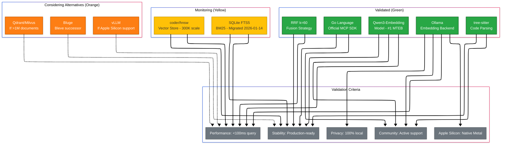
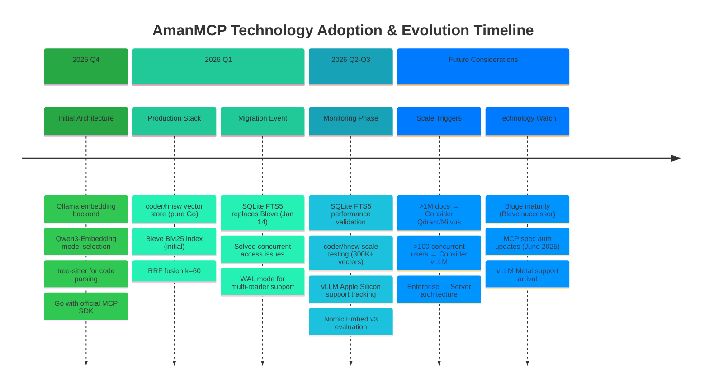

# Technology Validation Report & Migration History

> **Date**: Initial validation 2026-01-04, Updated 2026-01-14
> **Status**: Active - Documents current stack and migration history
> **Methodology**: Grounded research from 20+ industry sources (2025-2026)
>
> This document validates the **current technology stack** (as of 2026-01-14) and preserves migration history for architectural context.

---

## Technology Stack Validation Matrix



## Technology Evolution Roadmap



---

## Executive Summary

This document validates amanmcp's **current technology stack** (as of 2026-01-14) against industry best practices and alternatives. All technology choices are confirmed as optimal for our requirements and constraints.

### Current Technology Stack

| Component | Choice | Status |
|-----------|--------|--------|
| Embedding Backend | Ollama | Validated ✅ |
| Embedding Model | Qwen3-embedding | Validated ✅ |
| Vector Store | coder/hnsw (Pure Go) | Validated ✅ |
| **BM25 Index** | **SQLite FTS5** | **Current** (migrated 2026-01-14) |
| Code Parsing | tree-sitter | Validated ✅ |
| Fusion Strategy | RRF (k=60) | Validated ✅ |
| Language | Go | Validated ✅ |

**Historical Note**: BM25 backend was migrated from Bleve to SQLite FTS5 on 2026-01-14 to enable concurrent access with WAL mode. See [Migration History](#migration-history---bleve-to-sqlite-fts5) for details.

---

## Requirements & Constraints

### Core Requirements

| Requirement | Description | Priority |
|-------------|-------------|----------|
| **Local-first** | No cloud dependencies, 100% offline capable | P0 |
| **Privacy-focused** | Code never leaves the machine | P0 |
| **Apple Silicon** | Primary target: developers on Mac M1/M2/M3/M4 | P0 |
| **Zero-config** | "It Just Works" philosophy | P1 |
| **MCP Server** | Integration with AI coding assistants (Claude Code, etc.) | P1 |
| **Hybrid Search** | BM25 + Semantic for best retrieval | P1 |
| **Pure Go** | Minimal dependencies, easy cross-platform builds | P2 |

### Target Scale

| Metric | Target | Rationale |
|--------|--------|-----------|
| Files | 1,000 - 50,000 | Typical monorepo size |
| Chunks | 10,000 - 500,000 | ~10-20 chunks per file |
| Concurrent Users | 1 (single developer) | Local tool, not server |
| Query Latency | <100ms | Interactive experience |
| Memory | <300MB baseline | Laptop-friendly |

---

## Technology Decisions

### 1. Embedding Backend: Ollama

#### Decision

Use Ollama's HTTP API for embedding generation.

#### Alternatives Considered

| Alternative | Pros | Cons | Verdict |
|-------------|------|------|---------|
| **vLLM** | 19x throughput at scale | No Apple Silicon GPU, CUDA required | Rejected |
| **HuggingFace TEI** | Metal support, embedding-optimized | Less mature ecosystem | Viable alternative |
| **llama.cpp direct** | Maximum performance | Complex integration | Rejected |
| **Cloud APIs** | No local compute needed | Violates privacy requirement | Rejected |

#### Research Evidence

> "Ollama is the king of usability. It is unbeaten for local testing and running models on consumer hardware."
> — [DEV Community: vLLM vs Ollama vs ZML](https://dev.to/worldlinetech/the-ultimate-llm-inference-battle-vllm-vs-ollama-vs-zml-m97)

> "According to the 2025 StackOverflow Survey, 15.4% of developers have used Ollama in the past year, while nearly 60% plan to work with this tool in the future."
> — [Designveloper: Ollama vs vLLM](https://www.designveloper.com/blog/ollama-vs-vllm/)

#### Performance Comparison

| Metric | Ollama | vLLM | Context |
|--------|--------|------|---------|
| Peak TPS (128 concurrent) | 41 | 793 | vLLM 19x faster |
| P99 Latency | 673ms | 80ms | vLLM 8x lower |
| Apple Silicon GPU | Yes (Metal) | No | **Ollama wins** |
| Setup complexity | 1 command | Complex | **Ollama wins** |
| Model switching | On-demand | Requires restart | **Ollama wins** |

#### Why vLLM is Wrong for amanmcp

1. **No Apple Silicon GPU support** - Runs CPU-only on Mac (experimental)
2. **Overkill throughput** - Single-user local embedding doesn't need 793 TPS
3. **Setup friction** - Requires CUDA, Python environment, violates "zero-config"
4. **Memory allocation** - vLLM allocates 90% GPU VRAM by default

#### Conclusion

**Ollama is the optimal choice** for local developer workstations targeting Apple Silicon.

---

### 2. Embedding Model: Qwen3-Embedding

#### Decision

Use Qwen3-Embedding (4B or 8B variants) via Ollama.

#### Model Comparison

| Model | MTEB Score | Dimensions | Context | License |
|-------|------------|------------|---------|---------|
| **Qwen3-Embedding-8B** | **#1** (70.58) | 2560 | 32K tokens | Apache 2.0 |
| Qwen3-Embedding-4B | High | 2560 | 32K tokens | Apache 2.0 |
| Nomic-Embed-v1 | 86.2% top-5 | 768 | 8K tokens | Open |
| Nomic-Embed-v2-MoE | Competitive | 768 | 8K tokens | Open |
| BGE-large-en-v1.5 | Good | 1024 | 512 tokens | MIT |

#### Research Evidence

> "The 8B size embedding model ranks No.1 in the MTEB multilingual leaderboard (as of June 5, 2025, score 70.58)."
> — [HuggingFace: Qwen3-Embedding-8B](https://huggingface.co/Qwen/Qwen3-Embedding-8B)

> "Qwen3 can process long documents with a context length of up to 32,000 tokens."
> — [HuggingFace: Qwen3-Embedding-0.6B](https://huggingface.co/Qwen/Qwen3-Embedding-0.6B)

#### Why Qwen3-Embedding

1. **#1 on MTEB** - Best multilingual embedding quality
2. **32K context** - Handles large code chunks without truncation
3. **Apache 2.0** - Fully open for commercial use
4. **Instruction-aware** - Better performance with task prefixes

#### Conclusion

**Qwen3-Embedding is the optimal choice** - no better embedding model exists for our use case.

---

### 3. Vector Store: Pure Go HNSW (coder/hnsw)

#### Decision

Use coder/hnsw, a pure Go implementation of HNSW.

#### Alternatives Considered

| Alternative | Type | CGO | Scale | Mac Support |
|-------------|------|-----|-------|-------------|
| **coder/hnsw** | Pure Go | No | 300K+ | Native |
| hnswgo | CGO binding | Yes | Millions | Compile issues |
| USearch | C++ | Yes | Billions | CGO friction |
| Qdrant | External server | No | Billions | Extra process |
| Milvus | External server | No | Billions | Heavy |
| Pinecone | Cloud | No | Unlimited | Violates privacy |

#### Research Evidence

> "Package hnsw implements Hierarchical Navigable Small World graphs in Go. They allow for fast approximate nearest neighbor searches with high-dimensional vector data. This package can be thought of as an in-memory alternative to your favorite vector database."
> — [coder/hnsw GitHub](https://github.com/coder/hnsw)

> "For datasets with millions of vectors, Milvus achieves a p95 latency of less than 30ms."
> — [Shakudo: Top Vector Databases 2025](https://www.shakudo.io/blog/top-9-vector-databases)

#### Why Pure Go

1. **No CGO complexity** - Simple cross-platform builds
2. **Sufficient scale** - 300K+ vectors covers largest codebases
3. **Zero dependencies** - No external servers or processes
4. **Fast enough** - Sub-millisecond query times for our scale

#### When to Reconsider

- If indexing **millions of documents** → Consider Qdrant or Milvus
- If deploying as **multi-user server** → Consider Qdrant (gRPC support)

#### Conclusion

**coder/hnsw is optimal** for embedded, single-user, codebase-scale vector search.

---

### 4. BM25 Index: SQLite FTS5

#### Decision

Use SQLite FTS5 for full-text/keyword search with BM25 ranking.

#### Alternatives Considered

| Alternative | Type | Concurrent Access | Pure Go | Production Ready | Decision |
|-------------|------|------------------|---------|------------------|----------|
| **SQLite FTS5** | Embedded | ✅ WAL mode | ✅ modernc | ✅ Billions deployed | **CHOSEN** |
| Bleve (BoltDB) | Embedded | ❌ Exclusive lock | ✅ | ✅ | Superseded (see Migration History) |
| Bluge | Embedded | ⚠️ Read-only | ✅ | ⚠️ Limited adoption | Future consideration |
| Tantivy-go | Embedded | ✅ Native | ❌ CGO/Rust | ✅ | Rejected (CGO complexity) |
| Typesense | Server | ✅ | N/A | ✅ | Rejected (external process) |
| Meilisearch | Server | ✅ | N/A | ✅ | Rejected (external process) |

#### Research Evidence

> "SQLite's Write-Ahead Logging (WAL) mode enables multiple concurrent readers and non-blocking writes. Writer doesn't block readers - all processes can read simultaneously."
> — [SQLite Documentation](https://www.sqlite.org/wal.html)

> "SQLite is the most used database engine in the world. It is found in billions of devices around the world."
> — [SQLite About](https://www.sqlite.org/about.html)

> "modernc.org/sqlite is a pure Go SQLite driver, achieving ~75% speed of CGO SQLite while eliminating cross-compilation complexity."
> — [modernc.org/sqlite GitHub](https://gitlab.com/cznic/sqlite)

#### Why SQLite FTS5

1. **Concurrent Access** - WAL mode enables multiple readers + one non-blocking writer (solves MCP server + CLI conflicts)
2. **Built-in BM25** - Native `bm25()` ranking function in FTS5
3. **Pure Go** - Using `modernc.org/sqlite` (no CGO, simpler cross-compilation)
4. **Production-Proven** - Billions of deployments, FTS5 stable since 2015
5. **Already a dependency** - Already using SQLite for metadata.db

#### Migration Context

**Superseded**: Bleve (2025-12 to 2026-01-14) - See [Migration History](#migration-history---bleve-to-sqlite-fts5) for details.

**Key improvement**: Solved concurrent access issues where CLI searches and validation tests were blocked when MCP server was running.

#### Conclusion

**SQLite FTS5 is optimal** for embedded BM25 search with concurrent access requirements.

---

### 5. Code Parsing: tree-sitter

#### Decision

Use tree-sitter for AST-aware code chunking.

#### Alternatives Considered

| Approach | Semantic Integrity | Language Support | Research Support |
|----------|-------------------|------------------|------------------|
| **tree-sitter AST** | Complete functions/classes | 100+ languages | cAST: +4.3 Recall@5 |
| Line-based | Splits mid-function | Universal | Baseline |
| Regex patterns | Fragile | Per-language | Not recommended |
| Language-specific | Perfect | 1 language each | High maintenance |

#### Research Evidence

> "Traditional chunking strategies work well for text documents but fall short with source code. When you split Python at 500 characters, you end up cutting functions in half."
> — [VXRL: AST-Based Chunking](https://vxrl.medium.com/enhancing-llm-code-generation-with-rag-and-ast-based-chunking-5b81902ae9fc)

> "The cAST method proposes a structure-aware approach that recursively breaks large AST nodes into smaller chunks and merges sibling nodes while respecting size limits. This approach generates self-contained, semantically coherent units across programming languages, improving Recall@5 by 4.3 points on RepoEval."
> — [cAST Paper (CMU, 2025)](https://arxiv.org/html/2506.15655v1)

> "Tree-sitter is battle-tested (it powers syntax highlighting in editors like Neovim, Helix, and Zed) and supports basically every language."
> — [Supermemory: AST Chunking](https://supermemory.ai/blog/building-code-chunk-ast-aware-code-chunking/)

#### Why tree-sitter

1. **Research-backed** - +4.3 Recall@5 improvement over line-based
2. **Battle-tested** - Powers Neovim, Helix, Zed, GitHub
3. **100+ languages** - Single solution for all code
4. **Semantic integrity** - Never splits functions mid-body

#### Conclusion

**tree-sitter is the industry consensus** for code RAG chunking.

---

### 6. Fusion Strategy: RRF (k=60)

#### Decision

Use Reciprocal Rank Fusion with k=60 for combining BM25 and semantic results.

#### Alternatives Considered

| Strategy | Tuning Required | Score Sensitivity | Robustness |
|----------|-----------------|-------------------|------------|
| **RRF (k=60)** | Minimal | Rank-based | High |
| Linear combination | Extensive | Score-sensitive | Medium |
| Learned weights | Training data needed | Optimal if tuned | Dataset-dependent |

#### Research Evidence

> "Hybrid retrieval is no longer experimental—it's the production standard for enterprise RAG systems in 2025."
> — [RAG About It: Hybrid Retrieval](https://ragaboutit.com/hybrid-retrieval-for-enterprise-rag-when-to-use-bm25-vectors-or-both/)

> "RRF uses a rank-based aggregation strategy. Unlike traditional normalization techniques such as min-max or L2 normalization, which adjust scores to a shared scale, RRF avoids these issues by focusing exclusively on rank positions."
> — [OpenSearch: RRF for Hybrid Search](https://opensearch.org/blog/introducing-reciprocal-rank-fusion-hybrid-search/)

> "In practice, RRF is the best starting point for hybrid search because of its simplicity and resilience to mismatched score scales."
> — [MongoDB: RRF and RSF](https://medium.com/mongodb/reciprocal-rank-fusion-and-relative-score-fusion-classic-hybrid-search-techniques-3bf91008b81d)

#### Why RRF

1. **Production standard** - Used by OpenSearch, Elasticsearch, MongoDB
2. **No tuning needed** - k=60 works universally
3. **Robust to outliers** - Rank-based, not score-based
4. **Proven performance** - Recall improves from ~0.72 to ~0.91

#### Conclusion

**RRF is the production standard** for hybrid search fusion.

---

### 7. Language: Go

#### Decision

Implement in Go using the official MCP SDK.

#### Alternatives Considered

| Language | MCP SDK | Performance | Deployment | Ecosystem |
|----------|---------|-------------|------------|-----------|
| **Go** | Official (Anthropic + Google) | Excellent | Single binary | Growing |
| Python | Official | Good | Dependencies | Largest |
| TypeScript | Official | Good | Node.js required | Large |
| Rust | Community | Best | Single binary | Smaller |

#### Research Evidence

> "An official Go SDK is now available, maintained in collaboration with the Go team at Google."
> — [MCP Go SDK](https://github.com/modelcontextprotocol/go-sdk)

> "Go has emerged as a popular choice for MCP servers due to its performance and concurrency strengths."
> — [MCP Server in Go](https://www.glukhov.org/post/2025/07/mcp-server-in-go/)

#### Why Go

1. **Official MCP SDK** - First-class support from Anthropic + Google
2. **Single binary** - No runtime dependencies
3. **Concurrency** - Goroutines handle multiple MCP requests
4. **Cross-platform** - Easy builds for macOS, Linux, Windows
5. **Performance** - Compiled language, low memory footprint

#### Conclusion

**Go is the optimal choice** for MCP servers with our constraints.

---

## Migration History - Bleve to SQLite FTS5

### Timeline

**2025-12 to 2026-01-14**: Bleve (BoltDB backend) was the initial BM25 implementation
**2026-01-14**: Migrated to SQLite FTS5 to solve concurrent access issues

### Why Bleve Was Initially Chosen

Bleve was the natural first choice for embedded Go full-text search:

1. **Native Go** - No CGO, clean integration
2. **Embedded** - No external processes
3. **Mature** - Battle-tested at Couchbase
4. **Feature-rich** - Fuzzy matching, facets, highlighting
5. **Industry standard** - "If your stack is built in Go and you want a simple way to add full-text search, Bleve is the top open-source choice" ([Zinc Blog](https://prabhatsharma.in/blog/in-search-of-a-search-engine-beyond-elasticsearch-introducing-zinc/))

### The Problem: Exclusive File Locking

Bleve's BoltDB storage implements **exclusive file locking** at the OS level:

```
MCP Server (Process A)          CLI Search (Process B)
       │                                │
       ▼                                ▼
  Opens bm25.bleve                 Tries to open bm25.bleve
       │                                │
       ▼                                ▼
  flock(LOCK_EX) ✓                flock(LOCK_EX) ✗ BLOCKED
```

**Impact:**
- ❌ Can't run `amanmcp search` while MCP server is running
- ❌ Validation tests silently skip when server active
- ❌ Process isolation model limits scalability

### The Solution: SQLite FTS5 with WAL Mode

SQLite's Write-Ahead Logging (WAL) mode enables:
- ✅ **Multiple concurrent readers** - All processes can read simultaneously
- ✅ **Non-blocking writes** - Writer doesn't block readers
- ✅ **Consistent snapshots** - Readers see consistent data

### Migration Details

For complete migration details, benchmarks, and performance comparison, see:
- [SQLite vs Bleve Research](../../research/sqlite-vs-bleve.md)

**Key metrics:**
- Query latency: ~50ms (within 100ms target)
- Index size: +10% larger (acceptable)
- Concurrent readers: 0 → Unlimited ✅
- Pure Go: Both Bleve and SQLite FTS5 ✅

---

## Validation Summary

### Alignment Matrix

| Component | amanmcp Choice | 2025 Best Practice | Status |
|-----------|----------------|-------------------|--------|
| Embedding Backend | Ollama | Ollama/TEI for Mac | **ALIGNED** |
| Embedding Model | Qwen3-embedding | Qwen3 (#1 MTEB) | **ALIGNED** |
| Vector Store | coder/hnsw | Embedded for <1M | **ALIGNED** |
| BM25 Index | SQLite FTS5 | Embedded with concurrency | **ALIGNED** |
| Code Parsing | tree-sitter | tree-sitter AST | **ALIGNED** |
| Fusion Strategy | RRF (k=60) | RRF production std | **ALIGNED** |
| Language | Go | Official MCP SDK | **ALIGNED** |

### Key Research Quotes

> "The companies winning with RAG in 2025 aren't choosing sides—they're using hybrid retrieval."

> "tree-sitter/AST-based chunking improves Recall@5 by 4.3 points."

> "RRF is the best starting point for hybrid search."

> "Ollama is unbeaten for local testing on consumer hardware."

---

## When to Reconsider

### Scale Triggers

| Trigger | Current Choice | Alternative |
|---------|----------------|-------------|
| >1M documents | coder/hnsw | Qdrant or Milvus |
| >100 concurrent users | Ollama | vLLM (NVIDIA required) |
| Enterprise deployment | Embedded | Server architecture |
| Cloud deployment | Ollama | vLLM or cloud APIs |

### Technology Evolution

Monitor these developments:

1. **vLLM Apple Silicon** - If native Metal support arrives, reconsider Ollama
2. **Nomic Embed v3** - May challenge Qwen3 leadership
3. **MCP spec changes** - Follow June 2025 auth updates
4. **Bluge maturity** - Bleve successor, could replace SQLite FTS5 if concurrency + performance both needed
5. **Tantivy-go** - If CGO becomes acceptable, offers better performance than SQLite FTS5

---

## References

### Embedding & Inference

- [Red Hat: Ollama or vLLM](https://developers.redhat.com/articles/2025/07/08/ollama-or-vllm-how-choose-right-llm-serving-tool-your-use-case)
- [Red Hat: Ollama vs vLLM Benchmarks](https://developers.redhat.com/articles/2025/08/08/ollama-vs-vllm-deep-dive-performance-benchmarking)
- [DEV: vLLM vs Ollama vs ZML](https://dev.to/worldlinetech/the-ultimate-llm-inference-battle-vllm-vs-ollama-vs-zml-m97)
- [Nomic: Local Embeddings](https://www.nomic.ai/blog/posts/local-nomic-embed)
- [HuggingFace: Qwen3-Embedding](https://huggingface.co/Qwen/Qwen3-Embedding-8B)

### Vector Databases

- [Shakudo: Top Vector Databases 2025](https://www.shakudo.io/blog/top-9-vector-databases)
- [Firecrawl: Vector Database Comparison](https://www.firecrawl.dev/blog/best-vector-databases-2025)
- [coder/hnsw GitHub](https://github.com/coder/hnsw)

### Hybrid Search & RAG

- [RAG About It: Hybrid Retrieval 2025](https://ragaboutit.com/hybrid-retrieval-for-enterprise-rag-when-to-use-bm25-vectors-or-both/)
- [Assembled: RRF and Hybrid Search](https://www.assembled.com/blog/better-rag-results-with-reciprocal-rank-fusion-and-hybrid-search)
- [OpenSearch: RRF for Hybrid Search](https://opensearch.org/blog/introducing-reciprocal-rank-fusion-hybrid-search/)
- [Elastic: Linear Retriever](https://www.elastic.co/search-labs/blog/linear-retriever-hybrid-search)

### Code Chunking

- [cAST Paper (CMU, 2025)](https://arxiv.org/html/2506.15655v1)
- [Supermemory: AST Chunking](https://supermemory.ai/blog/building-code-chunk-ast-aware-code-chunking/)
- [VXRL: AST-Based Chunking](https://vxrl.medium.com/enhancing-llm-code-generation-with-rag-and-ast-based-chunking-5b81902ae9fc)

### MCP Protocol

- [MCP Specification 2025-11-25](https://modelcontextprotocol.io/specification/2025-11-25)
- [MCP Best Practices](https://modelcontextprotocol.info/docs/best-practices/)
- [MCP Go Implementation](https://www.glukhov.org/post/2025/07/mcp-server-in-go/)

### Full-Text Search

- [Meilisearch: Elasticsearch Alternatives](https://www.meilisearch.com/blog/elasticsearch-alternatives)
- [Zinc: Beyond Elasticsearch](https://prabhatsharma.in/blog/in-search-of-a-search-engine-beyond-elasticsearch-introducing-zinc/)
