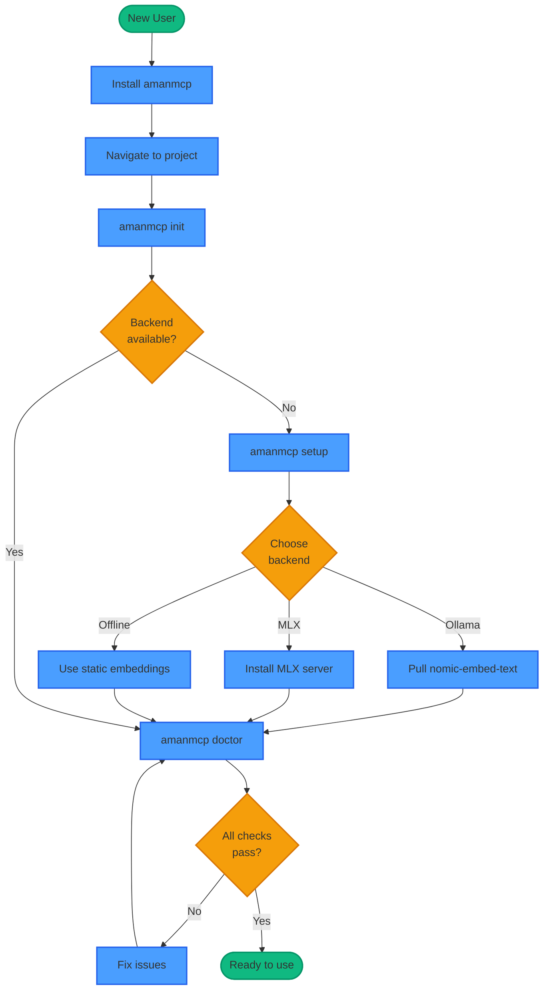
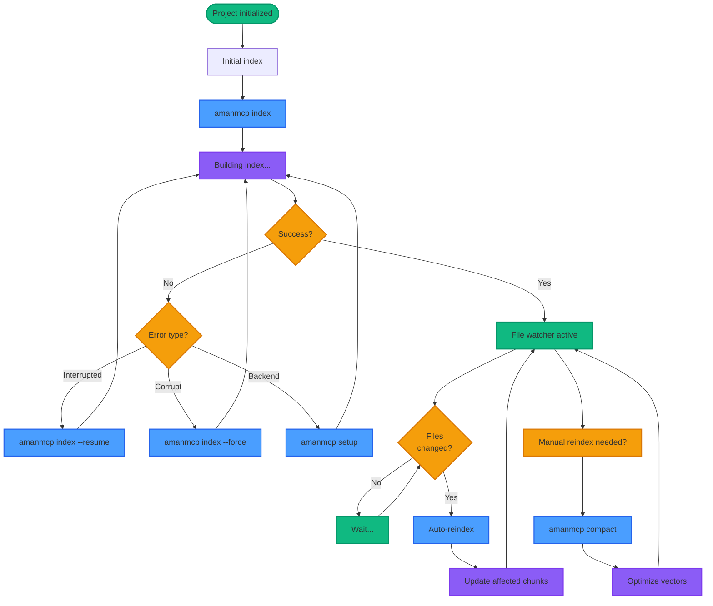
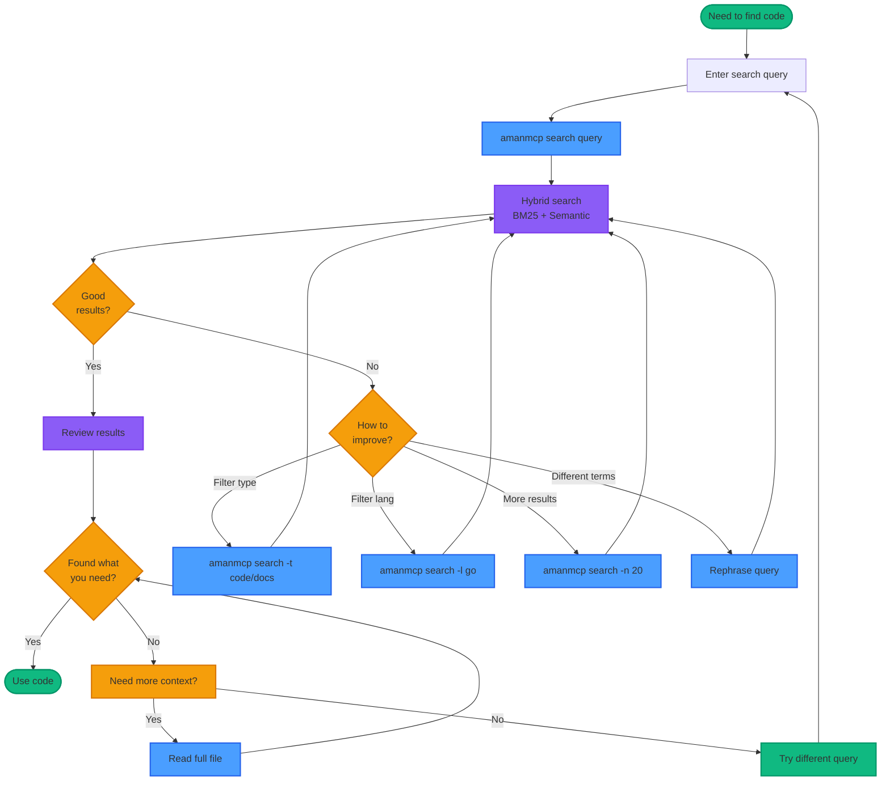

# Command Reference

Complete reference for all AmanMCP CLI commands.

---

## Quick Reference

| Command | Description |
|---------|-------------|
| `amanmcp` | Smart default: auto-index + start server |
| `amanmcp init` | Initialize project |
| `amanmcp search "query"` | Search codebase |
| `amanmcp doctor` | Check system health |

---

## Command Hierarchy

```mermaid
---
config:
  layout: elk
  look: neo
  theme: neo
---
graph TD
    root[amanmcp]

    %% Core Commands
    root --> default[amanmcp<br/>auto-index + start server]
    root --> init[init<br/>initialize project]
    root --> setup[setup<br/>configure backend]
    root --> index[index<br/>build search index]
    root --> search[search<br/>query codebase]
    root --> serve[serve<br/>start MCP server]

    %% Management
    root --> config[config]
    root --> sessions[sessions]
    root --> daemon[daemon]

    %% Diagnostics
    root --> doctor[doctor<br/>system health]
    root --> status[status<br/>index health]
    root --> stats[stats<br/>statistics]
    root --> version[version<br/>show version]

    %% Utilities
    root --> compact[compact<br/>optimize index]
    root --> resume[resume<br/>continue session]
    root --> switch[switch<br/>change session]

    %% Init Subcommands
    init --> init_force[--force<br/>overwrite config]
    init --> init_config[--config-only<br/>skip indexing]
    init --> init_offline[--offline<br/>static embeddings]

    %% Setup Subcommands
    setup --> setup_check[--check<br/>status only]
    setup --> setup_auto[--auto<br/>non-interactive]
    setup --> setup_offline[--offline<br/>static mode]

    %% Index Subcommands
    index --> index_info[info<br/>show stats]
    index --> index_backend[--backend<br/>ollama/mlx]
    index --> index_force[--force<br/>rebuild]
    index --> index_resume[--resume<br/>continue]

    %% Search Subcommands
    search --> search_type[-t code/docs<br/>filter type]
    search --> search_lang[-l LANG<br/>filter language]
    search --> search_num[-n NUM<br/>limit results]
    search --> search_json[-f json<br/>JSON output]

    %% Config Subcommands
    config --> config_init[init<br/>create config]
    config --> config_path[path<br/>show locations]
    config --> config_show[show<br/>view settings]

    %% Sessions Subcommands
    sessions --> sessions_list[list<br/>show all]
    sessions --> sessions_delete[delete<br/>remove session]
    sessions --> sessions_prune[prune<br/>clean old]

    %% Daemon Subcommands
    daemon --> daemon_start[start<br/>background]
    daemon --> daemon_stop[stop<br/>shutdown]
    daemon --> daemon_status[status<br/>check state]

    %% Stats Subcommands
    stats --> stats_queries[queries<br/>analytics]

    classDef core fill:#4a9eff,stroke:#2563eb,stroke-width:2px
    classDef mgmt fill:#10b981,stroke:#059669,stroke-width:2px
    classDef diag fill:#f59e0b,stroke:#d97706,stroke-width:2px
    classDef util fill:#8b5cf6,stroke:#7c3aed,stroke-width:2px
    classDef sub fill:#f3f4f6,stroke:#9ca3af,stroke-width:2px

    class default,init,setup,index,search,serve core
    class config,sessions,daemon mgmt
    class doctor,status,stats,version diag
    class compact,resume,switch util
    class init_force,init_config,init_offline,setup_check,setup_auto,setup_offline,index_info,index_backend,index_force,index_resume,search_type,search_lang,search_num,search_json,config_init,config_path,config_show,sessions_list,sessions_delete,sessions_prune,daemon_start,daemon_stop,daemon_status,stats_queries sub
```



---

## Common Workflows

### Setup Workflow



### Indexing Workflow



### Search Workflow



---

## Getting Started

| Command | Description |
|---------|-------------|
| `amanmcp` | Smart default: auto-index + start server |
| `amanmcp init` | Initialize project (MCP config + indexing) |
| `amanmcp init --force` | Reinitialize, overwrite existing config |
| `amanmcp init --config-only` | Fix config without reindexing |
| `amanmcp init --offline` | Use static embeddings (no Ollama) |
| `amanmcp setup` | Check/configure embedding backend |
| `amanmcp setup --check` | Check status only, don't start/pull |
| `amanmcp setup --auto` | Non-interactive mode (for scripts) |
| `amanmcp setup --offline` | Configure for offline mode |

---

## Indexing

| Command | Description |
|---------|-------------|
| `amanmcp index` | Index current directory |
| `amanmcp index [path]` | Index specific directory |
| `amanmcp index --backend=ollama` | Force Ollama backend |
| `amanmcp index --backend=mlx` | Force MLX backend (Apple Silicon) |
| `amanmcp index --force` | Clear existing index and rebuild |
| `amanmcp index --resume` | Resume interrupted indexing |
| `amanmcp index --no-tui` | Plain text output (no TUI) |
| `amanmcp index info` | Show index configuration and stats |
| `amanmcp index info --json` | Index info as JSON |
| `amanmcp compact` | Optimize vector index |

---

## Search

| Command | Description |
|---------|-------------|
| `amanmcp search "query"` | Hybrid search across codebase |
| `amanmcp search -t code "query"` | Search code files only |
| `amanmcp search -t docs "query"` | Search documentation only |
| `amanmcp search -l go "query"` | Filter by language |
| `amanmcp search -n 20 "query"` | Limit results (default: 10) |
| `amanmcp search -f json "query"` | JSON output format |

### Search Examples

```bash
# Find authentication code
amanmcp search "authentication"

# Search only Go files
amanmcp search -l go "error handling"

# Get JSON output for scripting
amanmcp search -f json "database connection" | jq '.results[0]'
```

---

## Session Management

| Command | Description |
|---------|-------------|
| `amanmcp sessions` | List all sessions |
| `amanmcp sessions delete NAME` | Delete a session |
| `amanmcp sessions prune` | Remove sessions older than 30 days |
| `amanmcp resume NAME` | Resume a saved session |
| `amanmcp switch NAME` | Switch to different session |

---

## Server & Daemon

| Command | Description |
|---------|-------------|
| `amanmcp serve` | Start MCP server (stdio) |
| `amanmcp serve --transport sse --port 8765` | SSE transport on port |
| `amanmcp daemon start` | Start background daemon |
| `amanmcp daemon stop` | Stop daemon |
| `amanmcp daemon status` | Check daemon status |

---

## Configuration

| Command | Description |
|---------|-------------|
| `amanmcp config init` | Create user config from template |
| `amanmcp config init --force` | Upgrade config (preserves settings) |
| `amanmcp config path` | Show config file locations |
| `amanmcp config show` | Show effective configuration |

---

## Diagnostics

| Command | Description |
|---------|-------------|
| `amanmcp doctor` | Check system requirements |
| `amanmcp status` | Show index health |
| `amanmcp stats` | Show statistics |
| `amanmcp stats queries --days 7` | Query analytics |
| `amanmcp version` | Show version |
| `amanmcp version --json` | Version as JSON |

---

## Debugging

| Command | Description |
|---------|-------------|
| `amanmcp --debug <cmd>` | Enable file logging |
| `amanmcp-logs` | Show last 50 log lines |
| `amanmcp-logs -f` | Follow logs real-time |
| `amanmcp-logs --level error` | Filter by level |
| `amanmcp-logs --source mlx` | View MLX server logs |
| `amanmcp-logs --source all` | View all logs merged |

### Log Locations

| Source | File |
|--------|------|
| Go server | `~/.amanmcp/logs/server.log` |
| MLX server | `~/.amanmcp/logs/mlx-server.log` |

---

## Global Flags

These flags work with most commands:

| Flag | Description |
|------|-------------|
| `--debug` | Enable verbose logging to file |
| `--help` | Show help for command |
| `--version` | Show version |

---

## Environment Variables

For complete environment variable reference, see [Configuration Reference](configuration.md#environment-variables).

| Variable | Default | Description |
|----------|---------|-------------|
| `AMANMCP_EMBEDDER` | `auto` | Backend: `mlx`, `ollama`, `static` |
| `AMANMCP_OLLAMA_HOST` | `http://localhost:11434` | Ollama endpoint |
| `AMANMCP_MLX_ENDPOINT` | `http://localhost:9659` | MLX endpoint |
| `AMANMCP_LOG_LEVEL` | `info` | Log level |

---

## See Also

- [Configuration Reference](configuration.md) - All configuration options
- [First-Time User Guide](../getting-started/first-time-user-guide.md) - Step-by-step setup
- [MLX Setup Guide](../guides/mlx-setup.md) - Apple Silicon optimization
- [Backend Switching](../guides/backend-switching.md) - Managing embedding backends
