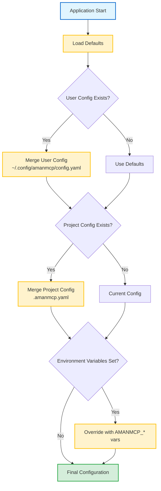
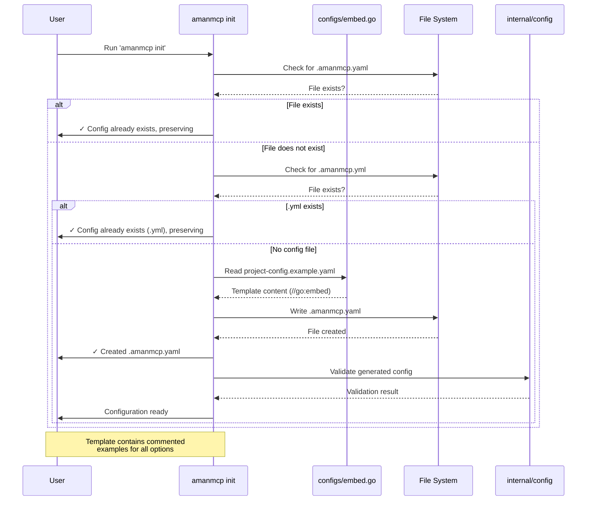
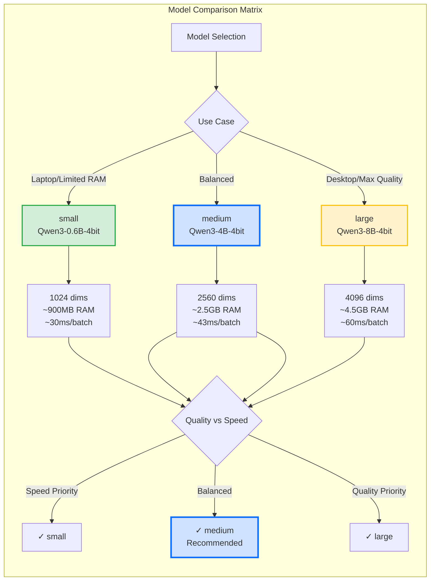
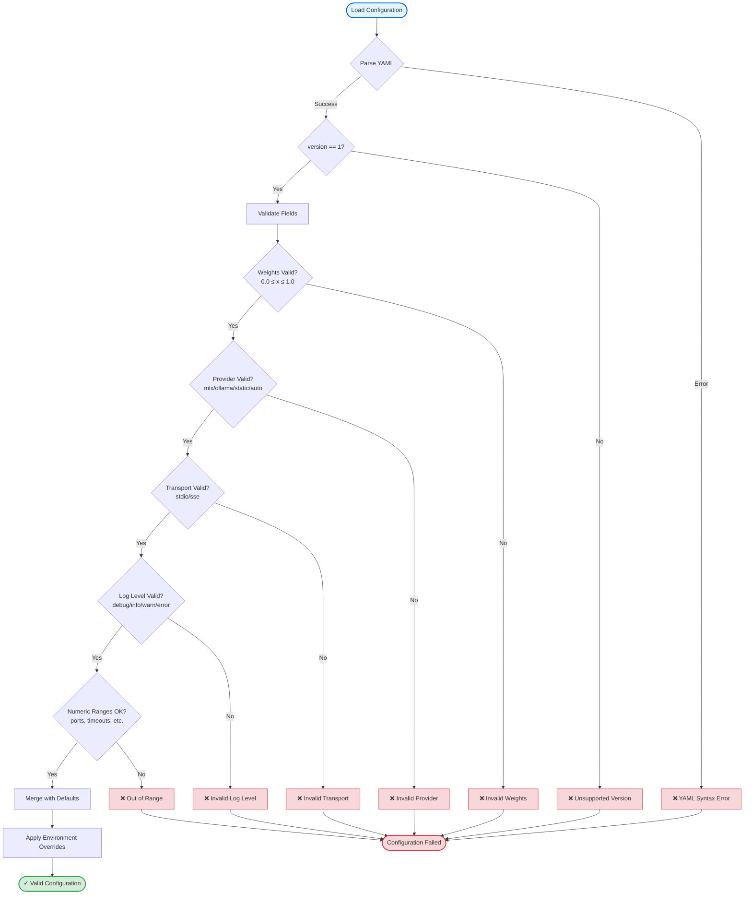

# Configuration Reference

Complete reference for all AmanMCP configuration options.

---

## Configuration Hierarchy

Configuration is loaded in order of increasing precedence:

| Layer | Location | Scope |
|-------|----------|-------|
| Defaults | Hardcoded | Global |
| User Config | `~/.config/amanmcp/config.yaml` | Machine-wide |
| Project Config | `.amanmcp.yaml` in project root | Project-specific |
| Environment | `AMANMCP_*` variables | Process-wide |



**Commands:**

```bash
amanmcp config init          # Create user config
amanmcp config init --force  # Upgrade config (backup + merge new defaults)
amanmcp config path          # Show config locations
amanmcp config show          # Show effective config
amanmcp init                 # Create project config
```

**Upgrading:** When you upgrade AmanMCP, your user config is automatically upgraded with new default options. Your existing settings are preserved, and a timestamped backup is created (last 3 kept).

---

## Auto-Generation of .amanmcp.yaml

When you run `amanmcp init`, a `.amanmcp.yaml` file is automatically created in your project root.

### How It Works

1. **Template Source:** The configuration template is embedded at build time from `configs/project-config.example.yaml` using Go's `//go:embed` directive (see `configs/embed.go`). This ensures the template is available in all distributions (Homebrew, binary releases, etc.).

2. **File Priority:** The `init` command checks for both `.amanmcp.yaml` and `.amanmcp.yml` extensions. If either exists, the existing file is preserved and never overwritten.

3. **Implementation:** See `cmd/amanmcp/cmd/init.go` → `generateAmanmcpYAML()` function for the auto-generation logic.

4. **Template Content:** The generated file contains commented examples for all configuration options. Users uncomment only what they need—default values work out of the box.



### Source Files

| File | Purpose |
|------|---------|
| `configs/project-config.example.yaml` | Template for project config |
| `configs/user-config.example.yaml` | Template for user config |
| `configs/embed.go` | Go embed directives |
| `cmd/amanmcp/cmd/init.go` | Auto-generation logic |
| `internal/config/config.go` | Config loading and merging |

---

## Quick Reference

| Section | Options | Key Settings |
|---------|---------|--------------|
| [Paths](#paths) | 2 | `include`, `exclude` |
| [Search](#search) | 5 | `bm25_weight`, `semantic_weight`, `chunk_size` |
| [Embeddings](#embeddings) | 10 | `provider`, `model`, `timeout_progression` |
| [Performance](#performance) | 7 | `max_files`, `index_workers`, `quantization` |
| [Server](#server) | 3 | `transport`, `log_level` |
| [Submodules](#submodules) | 4 | `enabled`, `recursive` |
| [Sessions](#sessions) | 3 | `storage_path`, `auto_save` |

---

## Paths

Controls which files are indexed for semantic search.

| Key | Type | Default | Description |
|-----|------|---------|-------------|
| `paths.include` | []string | `[]` (all) | Glob patterns to include |
| `paths.exclude` | []string | See below | Glob patterns to exclude (merged with defaults) |

**Default Exclude Patterns:**

```yaml
- "**/node_modules/**"
- "**/.git/**"
- "**/vendor/**"
- "**/__pycache__/**"
- "**/dist/**"
- "**/build/**"
- "**/*.min.js"
- "**/*.min.css"
- "**/package-lock.json"
- "**/yarn.lock"
- "**/pnpm-lock.yaml"
- "**/go.sum"
```

### Preventing Search Pollution

**Important:** Project management directories containing documentation with code examples should be excluded from indexing. Otherwise, documentation files may outrank actual source code in search results.

For example, if you have a `.aman-pm/` directory (AI-native PM system) or similar documentation folders that contain code snippets:

```yaml
paths:
  exclude:
    # Project management / internal documentation
    - ".aman-pm/**"        # AI-native PM system files
    - "archive/**"         # Historical/archived content
    - ".claude/**"         # Claude Code configuration/skills

    # Generated / test fixtures
    - "**/generated/**"
    - "**/testdata/**"
```

**Why this matters:** PM documentation often contains:

- Code examples and snippets
- Implementation notes with function signatures
- Technical specifications

BM25 keyword search cannot distinguish "documentation about code" from "actual code." When PM docs mention search-related terms more frequently than actual implementations, they rank higher. Excluding these directories ensures search results prioritize real source code.

**Example:**

```yaml
paths:
  include:
    - "src/**"
    - "docs/**"
  exclude:
    - "**/generated/**"
    - "**/testdata/**"
```

---

## Search

Configures hybrid search behavior.

| Key | Type | Default | Range | Description | Env Override |
|-----|------|---------|-------|-------------|--------------|
| `search.bm25_weight` | float64 | `0.65` | 0.0-1.0 | Keyword matching weight | `AMANMCP_BM25_WEIGHT` |
| `search.semantic_weight` | float64 | `0.35` | 0.0-1.0 | Semantic similarity weight | `AMANMCP_SEMANTIC_WEIGHT` |
| `search.rrf_constant` | int | `60` | >0 | RRF fusion k parameter | `AMANMCP_RRF_CONSTANT` |
| `search.chunk_size` | int | `1500` | >0 | Characters per chunk | - |
| `search.chunk_overlap` | int | `200` | 0-chunk_size | Overlap between chunks | - |
| `search.max_results` | int | `20` | 1-1000 | Max results per query | - |

**Notes:**

- Weights should sum to 1.0 for proper RRF fusion
- Default weights favor BM25 (0.65) for code search (RCA-015)
- RRF constant k=60 is industry standard (Azure AI Search, OpenSearch)
- Larger chunks = more context, fewer chunks
- Overlap prevents information loss at chunk boundaries

---

## Embeddings

Configures the embedding provider and thermal management.

### Basic Settings

| Key | Type | Default | Description | Env Override |
|-----|------|---------|-------------|--------------|
| `embeddings.provider` | string | `"auto"` | Provider: `mlx`, `ollama`, `static` (auto-detects MLX on Apple Silicon) | `AMANMCP_EMBEDDER` |
| `embeddings.model` | string | `"qwen3-embedding:0.6b"` | Model identifier | `AMANMCP_EMBEDDINGS_MODEL` |
| `embeddings.dimensions` | int | `0` (auto) | Embedding dimensions (0 = auto-detect) | - |
| `embeddings.batch_size` | int | `32` | Texts per batch (1-256) | - |
| `embeddings.model_download_timeout` | duration | `10m` | Timeout for model downloads | - |

### MLX Settings (Apple Silicon)

MLX provides ~55x faster embeddings on Apple Silicon. The MLX server is bundled in `mlx-server/`.

| Key | Type | Default | Description | Env Override |
|-----|------|---------|-------------|--------------|
| `embeddings.mlx_endpoint` | string | `"http://localhost:9659"` | MLX server URL | `AMANMCP_MLX_ENDPOINT` |
| `embeddings.mlx_model` | string | `"large"` | Model size: `small`, `medium`, `large` | `AMANMCP_MLX_MODEL` |

**MLX Model Sizes:**

| Alias | Model | Dimensions | Memory | Speed (32 texts) |
|-------|-------|------------|--------|------------------|
| `small` | Qwen3-Embedding-0.6B-4bit | 1024 | ~900MB | ~30ms |
| `medium` | Qwen3-Embedding-4B-4bit | 2560 | ~2.5GB | ~43ms |
| `large` | Qwen3-Embedding-8B-4bit | 4096 | ~4.5GB | ~60ms |



**Selection Guide:**

- **small**: Laptops with <8GB RAM, speed-critical workflows
- **medium**: Default choice for most users (best balance)
- **large**: Desktops with >16GB RAM, quality-critical applications

Models are stored in `~/.amanmcp/models/mlx/` (configurable via `AMANMCP_MLX_MODELS_DIR`).

### Ollama Settings (Fallback)

| Key | Type | Default | Description | Env Override |
|-----|------|---------|-------------|--------------|
| `embeddings.ollama_host` | string | `"http://localhost:11434"` | Ollama API endpoint | `AMANMCP_OLLAMA_HOST` |

### Thermal Management

Settings for sustained GPU workloads (Apple Silicon). See [Thermal Management Guide](thermal-management.md) for details.

| Key | Type | Default | Range | Description |
|-----|------|---------|-------|-------------|
| `embeddings.inter_batch_delay` | string | `""` (disabled) | 0-5s | Pause between batches (e.g., "200ms") |
| `embeddings.timeout_progression` | float64 | `1.5` | 1.0-3.0 | Timeout multiplier per 1000 chunks |
| `embeddings.retry_timeout_multiplier` | float64 | `1.0` | 1.0-2.0 | Timeout multiplier per retry |

**Timeout Calculation:**

```
timeout = base_timeout × min(progression^(batch/31.25), 3.0) × final_batch_boost
```

For a 10K chunk codebase at 99% completion:

- Base: 60s → With progression: 180s → With final boost: 270s

```mermaid
gantt
    title Thermal Timeout Progression (10K Chunk Indexing)
    dateFormat X
    axisFormat %Lms

    section Batch 0-1K
    60s timeout (base) :0, 60000

    section Batch 3K
    90s timeout :0, 90000

    section Batch 5K
    120s timeout :0, 120000

    section Batch 7K
    150s timeout :0, 150000

    section Batch 9K
    180s timeout (capped) :0, 180000

    section Batch 9.9K
    270s timeout (final boost) :crit, 0, 270000
```



**Visual Timeline:**

- Early batches (0-33%): Short timeouts, GPU cool
- Mid batches (33-66%): Progressive increase as GPU warms
- Late batches (66-99%): Max timeout (3x base), managing thermal throttling
- Final batch (>99%): Extra boost (1.5x max) for completion

---

## Performance

Configures resource usage and optimization.

| Key | Type | Default | Description |
|-----|------|---------|-------------|
| `performance.max_files` | int | `100000` | Maximum files to index |
| `performance.index_workers` | int | CPU cores | Parallel indexing workers |
| `performance.watch_debounce` | string | `"500ms"` | File watch debounce delay |
| `performance.cache_size` | int | `1000` | LRU cache entries |
| `performance.memory_limit` | string | `"auto"` | Memory limit (`"auto"`, `"2G"`, `"512M"`) |
| `performance.quantization` | string | `"F16"` | Vector quantization: `F32`, `F16`, `I8` |
| `performance.sqlite_cache_mb` | int | `64` | SQLite cache size in MB |

**Performance Targets:**

- Query latency: <100ms
- Memory usage: <300MB
- Startup time: <2s

---

## Server

Configures the MCP server.

| Key | Type | Default | Valid Values | Env Override |
|-----|------|---------|--------------|--------------|
| `server.transport` | string | `"stdio"` | `stdio`, `sse` | `AMANMCP_TRANSPORT` |
| `server.port` | int | `8765` | 1024-65535 | - |
| `server.log_level` | string | `"info"` | `debug`, `info`, `warn`, `error` | `AMANMCP_LOG_LEVEL` |

---

## Submodules

Configures git submodule discovery (opt-in).

| Key | Type | Default | Description |
|-----|------|---------|-------------|
| `submodules.enabled` | bool | `false` | Enable submodule discovery |
| `submodules.recursive` | bool | `true` | Index nested submodules |
| `submodules.include` | []string | `[]` (all) | Submodules to include |
| `submodules.exclude` | []string | `[]` | Submodules to exclude |

**Example:**

```yaml
submodules:
  enabled: true
  exclude:
    - third-party/
    - legacy/
```

---

## Sessions

Configures session management.

| Key | Type | Default | Description |
|-----|------|---------|-------------|
| `sessions.storage_path` | string | `~/.amanmcp/sessions` | Session storage directory |
| `sessions.auto_save` | bool | `true` | Auto-save on shutdown |
| `sessions.max_sessions` | int | `20` | Maximum concurrent sessions |

---

## Environment Variables

| Variable | Config Path | Example |
|----------|-------------|---------|
| `AMANMCP_EMBEDDER` | `embeddings.provider` | `"mlx"`, `"ollama"`, `"static"` |
| `AMANMCP_MLX_ENDPOINT` | `embeddings.mlx_endpoint` | `"http://localhost:9659"` |
| `AMANMCP_MLX_MODEL` | `embeddings.mlx_model` | `"large"`, `"medium"`, `"small"` |
| `AMANMCP_MLX_MODELS_DIR` | (server only) | `"~/.amanmcp/models/mlx"` |
| `AMANMCP_OLLAMA_HOST` | `embeddings.ollama_host` | `"http://192.168.1.100:11434"` |
| `AMANMCP_EMBEDDINGS_MODEL` | `embeddings.model` | `"nomic-embed-text"` |
| `AMANMCP_LOG_LEVEL` | `server.log_level` | `"debug"` |
| `AMANMCP_TRANSPORT` | `server.transport` | `"sse"` |

---

## Validation Rules

| Field | Rule | Error |
|-------|------|-------|
| `search.bm25_weight` | 0.0 ≤ x ≤ 1.0 | "must be between 0 and 1" |
| `search.semantic_weight` | 0.0 ≤ x ≤ 1.0 | "must be between 0 and 1" |
| `embeddings.provider` | `ollama`, `static`, `llama` | "must be one of..." |
| `server.transport` | `stdio`, `sse` | "must be 'stdio' or 'sse'" |
| `server.log_level` | `debug`, `info`, `warn`, `error` | "must be one of..." |



**Validation Behavior:**

- **Early Exit:** Validation stops at first error, displays clear message
- **Zero Values:** Empty/zero values use defaults (not treated as invalid)
- **Environment Override:** Applied AFTER validation (can override invalid config values)
- **Merge Safety:** Array merging (paths.exclude) cannot create invalid state

---

## Merge Behavior

When multiple configs exist:

| Type | Behavior |
|------|----------|
| Scalars | Non-zero values override |
| `paths.exclude` | Arrays merge (append) |
| Booleans | Override only when parent section set |

---

## Example Configurations

### Minimal (All Defaults)

```yaml
version: 1
```

### User Config with MLX (Apple Silicon - Recommended)

```yaml
version: 1

embeddings:
  provider: mlx
  mlx_endpoint: http://localhost:9659
  mlx_model: large  # small (1024d), medium (2560d), large (4096d)

server:
  log_level: info
```

### User Config with Ollama (Universal Fallback)

```yaml
version: 1

embeddings:
  provider: ollama
  ollama_host: http://localhost:11434
  inter_batch_delay: "200ms"
  timeout_progression: 1.5

server:
  log_level: info
```

### Project Config

```yaml
version: 1

paths:
  exclude:
    - "**/testdata/**"
    - "**/fixtures/**"

search:
  chunk_size: 2000
  max_results: 50

submodules:
  enabled: true
```

---

## Related Documentation

- [Thermal Management Guide](../guides/thermal-management.md) - Deep-dive on GPU thermal settings
- [First-Time User Guide](../guides/first-time-user-guide.md) - Getting started
- [F02: Configuration Spec](../specs/features/F02-configuration.md) - Feature specification
