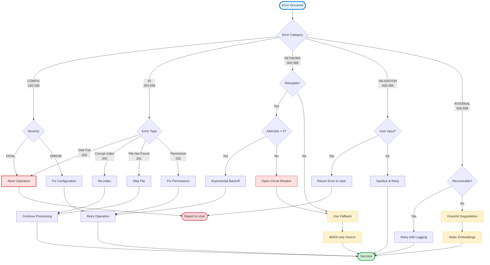
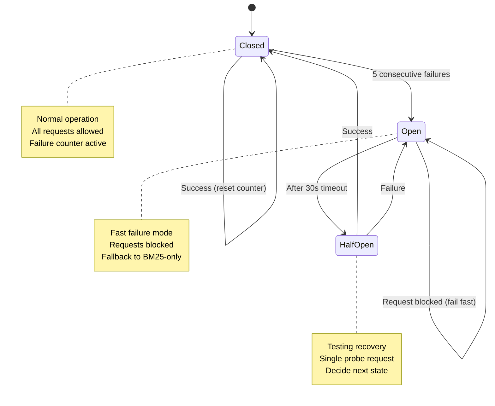
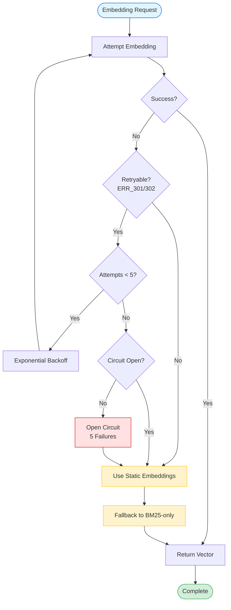
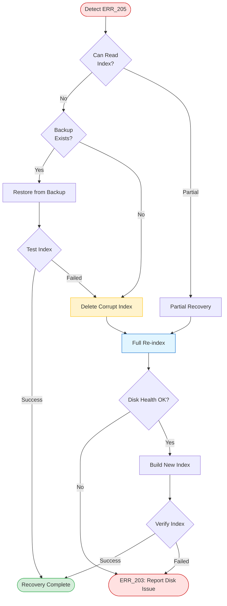
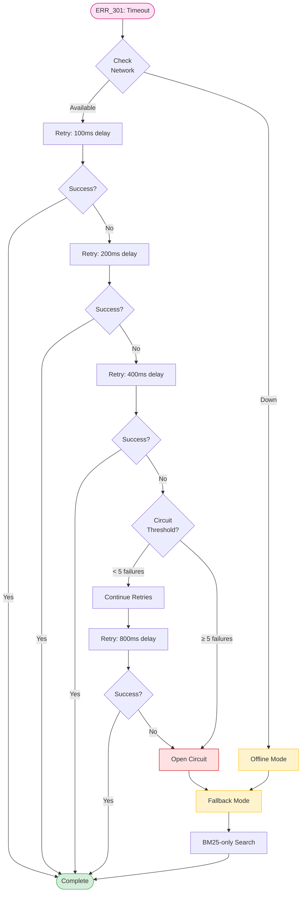

# AmanMCP Error Codes Reference

This document provides a complete catalog of error codes used in AmanMCP, including their meanings, categories, and suggested recovery actions.

## Error Code Format

Error codes follow the pattern: `ERR_XXX_DESCRIPTION`

Where:
- `ERR_` - Standard prefix for all AmanMCP errors
- `XXX` - Three-digit numeric code indicating category
- `DESCRIPTION` - Human-readable description

## Categories

| Range | Category | Description |
|-------|----------|-------------|
| 100-199 | CONFIG | Configuration-related errors |
| 200-299 | IO | File and disk I/O errors |
| 300-399 | NETWORK | Network and connectivity errors |
| 400-499 | VALIDATION | Input validation errors |
| 500-599 | INTERNAL | Internal system errors |

### Error Code Taxonomy

```mermaid
---
config:
  layout: elk
  look: neo
  theme: neo
---
graph TB
    Root[AmanMCP Errors]
    Root --> Config[100-199: CONFIG]
    Root --> IO[200-299: IO]
    Root --> Network[300-399: NETWORK]
    Root --> Validation[400-499: VALIDATION]
    Root --> Internal[500-599: INTERNAL]

    Config --> C101[101: Not Found]
    Config --> C102[102: Invalid]
    Config --> C103[103: Permission]

    IO --> I201[201: File Not Found]
    IO --> I202[202: File Permission]
    IO --> I203[203: Disk Full]
    IO --> I204[204: File Too Large]
    IO --> I205[205: Corrupt Index]
    IO --> I206[206: File Corrupt]

    Network --> N301[301: Timeout]
    Network --> N302[302: Unavailable]
    Network --> N303[303: Model Download]

    Validation --> V401[401: Invalid Input]
    Validation --> V402[402: Dimension Mismatch]
    Validation --> V403[403: Invalid Query]
    Validation --> V404[404: Query Empty]
    Validation --> V405[405: Query Too Long]
    Validation --> V406[406: Invalid Path]

    Internal --> In501[501: Internal]
    Internal --> In502[502: Embedding Failed]
    Internal --> In503[503: Search Failed]
    Internal --> In504[504: Chunking Failed]
    Internal --> In505[505: Index Failed]

    classDef configClass fill:#e1f5ff,stroke:#0066cc,stroke-width:2px
    classDef ioClass fill:#fff4e1,stroke:#cc6600,stroke-width:2px
    classDef networkClass fill:#ffe1f5,stroke:#cc0066,stroke-width:2px
    classDef validationClass fill:#f5e1ff,stroke:#6600cc,stroke-width:2px
    classDef internalClass fill:#ffe1e1,stroke:#cc0000,stroke-width:2px

    class Config,C101,C102,C103 configClass
    class IO,I201,I202,I203,I204,I205,I206 ioClass
    class Network,N301,N302,N303 networkClass
    class Validation,V401,V402,V403,V404,V405,V406 validationClass
    class Internal,In501,In502,In503,In504,In505 internalClass
```



## Severity Levels

| Level | Meaning | Action |
|-------|---------|--------|
| FATAL | Unrecoverable error | Must abort operation |
| ERROR | Operation failed | Can continue with degraded functionality |
| WARNING | Degraded operation | Continuing with fallback |
| INFO | Informational | No action required |

---

## Error Handling Decision Tree



**Decision Guidelines:**

| Scenario | Action | Rationale |
|----------|--------|-----------|
| Network timeout | Retry with backoff → Fallback | Transient issues often resolve |
| Config invalid | Fail fast | User must fix before proceeding |
| Disk full | Abort immediately | Cannot continue safely |
| File not found | Skip and continue | Isolated issue, don't block indexing |
| Embedding fails | Fallback to BM25 | Maintain partial functionality |
| Index corrupt | Re-index from source | Data can be regenerated |
| Dimension mismatch | Abort and re-index | Incompatible state requires rebuild |

---

## Accessing Logs

### Enable Debug Logging

By default, AmanMCP is silent ("It Just Works"). Enable detailed logging with `--debug`:

```bash
amanmcp --debug serve
amanmcp --debug index .
amanmcp --debug search "query"
```

Logs write to: `~/.amanmcp/logs/server.log`

### View Logs

Use the `amanmcp-logs` viewer:

```bash
amanmcp-logs              # Last 50 lines
amanmcp-logs -f           # Follow real-time
amanmcp-logs -n 100       # Last 100 lines
amanmcp-logs --level error # Errors only
amanmcp-logs --filter "embed" # Filter by pattern
```

### Log Format

Logs are JSON-structured with fields:

| Field | Description |
|-------|-------------|
| `time` | Timestamp (ISO 8601) |
| `level` | DEBUG, INFO, WARN, ERROR |
| `msg` | Log message |
| `component` | Source (indexer, search, mcp, etc.) |
| `duration` | Operation timing (when applicable) |

### Log Rotation

- **Max file size:** 10 MB
- **Max files:** 5 (server.log, server.log.1, ..., server.log.5)
- **Location:** `~/.amanmcp/logs/`

---

## Configuration Errors (100-199)

### ERR_101_CONFIG_NOT_FOUND

**Severity:** ERROR
**Retryable:** No

Configuration file not found at the expected location.

**Causes:**
- `.amanmcp.yaml` doesn't exist in project root
- Running from wrong directory
- File was deleted or moved

**Recovery:**
1. Run `amanmcp init` to create default configuration
2. Verify you're in the correct project directory
3. Check file permissions

---

### ERR_102_CONFIG_INVALID

**Severity:** ERROR
**Retryable:** No

Configuration file exists but contains invalid syntax or values.

**Causes:**
- YAML syntax error
- Invalid configuration values
- Unknown configuration keys

**Recovery:**
1. Run `amanmcp config validate` to see specific errors
2. Fix syntax issues in `.amanmcp.yaml`
3. Refer to configuration documentation for valid options

---

### ERR_103_CONFIG_PERMISSION

**Severity:** ERROR
**Retryable:** No

Cannot read or write configuration file due to permission issues.

**Causes:**
- File owned by different user
- Read-only filesystem
- Restricted directory permissions

**Recovery:**
1. Check file ownership: `ls -la .amanmcp.yaml`
2. Fix permissions: `chmod 644 .amanmcp.yaml`
3. Ensure directory is writable

---

## I/O Errors (200-299)

### ERR_201_FILE_NOT_FOUND

**Severity:** ERROR
**Retryable:** No

A referenced file does not exist on disk.

**Causes:**
- File was deleted after indexing
- Path is incorrect
- Symlink target doesn't exist

**Recovery:**
1. Re-run `amanmcp index` to update the index
2. Verify the file path exists
3. Check for broken symlinks

---

### ERR_202_FILE_PERMISSION

**Severity:** ERROR
**Retryable:** No

Cannot access file due to permission restrictions.

**Causes:**
- File not readable by current user
- Directory not traversable
- File locked by another process

**Recovery:**
1. Check file permissions: `ls -la <file>`
2. Grant read permission if appropriate
3. Close applications that may have the file locked

---

### ERR_203_DISK_FULL

**Severity:** FATAL
**Retryable:** No

Disk is full and cannot write index data.

**Causes:**
- No free space on disk
- Quota exceeded
- Index growing too large

**Recovery:**
1. Free up disk space
2. Check disk usage: `df -h`
3. Consider excluding large directories from indexing
4. Move index to disk with more space

---

### ERR_204_FILE_TOO_LARGE

**Severity:** WARNING
**Retryable:** No

File exceeds maximum size limit for processing.

**Causes:**
- File larger than `maxFileSize` setting (default: 1MB)
- Binary or generated file incorrectly included

**Recovery:**
1. Increase `maxFileSize` in configuration if intentional
2. Add file pattern to exclude list if unintended
3. File will be skipped automatically during indexing

---

### ERR_205_CORRUPT_INDEX

**Severity:** FATAL
**Retryable:** No

Index data is corrupted and cannot be read.

**Causes:**
- Interrupted write operation
- Disk errors
- Incompatible index version

**Recovery:**
1. Delete index: `rm -rf .amanmcp/`
2. Re-index: `amanmcp index .`
3. Check disk health if recurring

---

### ERR_206_FILE_CORRUPT

**Severity:** ERROR
**Retryable:** No

Source file appears corrupted or has unexpected format.

**Causes:**
- Binary file mistakenly included
- Encoding issues
- Truncated file

**Recovery:**
1. Verify file opens correctly in editor
2. Check file encoding (should be UTF-8)
3. Exclude file if it's binary

---

## Network Errors (300-399)

### ERR_301_NETWORK_TIMEOUT

**Severity:** WARNING
**Retryable:** Yes (with exponential backoff)

Network request timed out.

**Causes:**
- Slow network connection
- Remote service overloaded
- Firewall blocking connection

**Recovery:**
1. Automatic retry with exponential backoff
2. Check network connectivity
3. Increase timeout in configuration
4. Falls back to BM25-only search if embeddings fail

---

### ERR_302_NETWORK_UNAVAILABLE

**Severity:** WARNING
**Retryable:** Yes

Network connection unavailable.

**Causes:**
- No internet connection
- DNS resolution failure
- Proxy configuration issues

**Recovery:**
1. Automatic retry with exponential backoff
2. Check internet connectivity
3. Falls back to local-only operation
4. Semantic search degrades gracefully

---

### ERR_303_MODEL_DOWNLOAD

**Severity:** WARNING
**Retryable:** Yes

Failed to download embedding model.

**Causes:**
- Network issues during download
- Disk space insufficient
- Model URL changed or unavailable

**Recovery:**
1. Automatic retry with exponential backoff
2. Falls back to static embeddings
3. Manual download: check `~/.cache/hugot/` directory
4. Use offline mode if recurring

---

## Validation Errors (400-499)

### ERR_401_INVALID_INPUT

**Severity:** ERROR
**Retryable:** No

Input parameter is invalid.

**Causes:**
- Missing required parameter
- Wrong parameter type
- Value out of allowed range

**Recovery:**
1. Check the error message for specific parameter
2. Verify input against API documentation
3. Ensure proper encoding for special characters

---

### ERR_402_DIMENSION_MISMATCH

**Severity:** FATAL
**Retryable:** No

Vector dimensions don't match between query and index.

**Causes:**
- Index created with different embedding model
- Configuration changed after indexing
- Corrupted vector data

**Recovery:**
1. Re-index with current embedding model: `amanmcp index --force .`
2. Verify embedding configuration hasn't changed
3. Delete and recreate index if persistent

---

### ERR_403_INVALID_QUERY

**Severity:** ERROR
**Retryable:** No

Search query is malformed or unsupported.

**Causes:**
- Query syntax error
- Unsupported query operators
- Character encoding issues

**Recovery:**
1. Simplify the query
2. Remove special characters
3. Check for proper UTF-8 encoding

---

### ERR_404_QUERY_EMPTY

**Severity:** ERROR
**Retryable:** No

Search query is empty.

**Causes:**
- Empty string provided
- Whitespace-only query
- Query preprocessing removed all content

**Recovery:**
1. Provide a non-empty search query
2. Ensure query isn't just whitespace

---

### ERR_405_QUERY_TOO_LONG

**Severity:** WARNING
**Retryable:** No

Search query exceeds maximum length.

**Causes:**
- Query longer than model's context window
- Accidentally pasting large content

**Recovery:**
1. Query will be truncated automatically
2. Consider breaking into smaller queries
3. Maximum length depends on embedding model (typically 2048 tokens)

---

### ERR_406_INVALID_PATH

**Severity:** ERROR
**Retryable:** No

File path is invalid or unsafe.

**Causes:**
- Path contains invalid characters
- Path traversal attempt detected
- Non-existent directory reference

**Recovery:**
1. Use absolute paths or paths relative to project root
2. Avoid `..` in paths
3. Ensure path uses correct separator for OS

---

## Internal Errors (500-599)

### ERR_501_INTERNAL

**Severity:** ERROR
**Retryable:** No

Unexpected internal error occurred.

**Causes:**
- Bug in AmanMCP
- Unexpected system state
- Resource exhaustion

**Recovery:**
1. Check logs for detailed error information
2. Report issue with reproduction steps
3. Restart the server

---

### ERR_502_EMBEDDING_FAILED

**Severity:** WARNING
**Retryable:** Yes

Failed to generate embeddings for content.

**Causes:**
- Embedding model unavailable
- Memory exhaustion
- Invalid input text

**Recovery:**
1. Automatic fallback to BM25-only search
2. Check available memory
3. Verify embedding model is loaded
4. Use static embeddings as fallback

---

### ERR_503_SEARCH_FAILED

**Severity:** ERROR
**Retryable:** No

Search operation failed unexpectedly.

**Causes:**
- Index corruption
- Resource exhaustion
- Concurrent modification

**Recovery:**
1. Re-run the query
2. Check system resources
3. Re-index if persistent

---

### ERR_504_CHUNKING_FAILED

**Severity:** WARNING
**Retryable:** No

Failed to chunk file content.

**Causes:**
- Unsupported language
- Parser error
- File encoding issue

**Recovery:**
1. File skipped with warning
2. Check file is valid source code
3. Report if common language unsupported

---

### ERR_505_INDEX_FAILED

**Severity:** ERROR
**Retryable:** No

Failed to index file or directory.

**Causes:**
- Permission issues
- Disk space
- Database error

**Recovery:**
1. Check error message for specific cause
2. Verify permissions on source files
3. Ensure sufficient disk space

---

## MCP Error Code Mapping

AmanMCP errors are mapped to standard JSON-RPC error codes for MCP clients:

| AmanMCP Error | MCP Code | Description |
|---------------|----------|-------------|
| ERR_201_FILE_NOT_FOUND | -32004 | File not found |
| ERR_204_FILE_TOO_LARGE | -32005 | File too large |
| ERR_205_CORRUPT_INDEX | -32001 | Index not found/corrupt |
| ERR_3XX (Network) | -32003 | Timeout |
| ERR_4XX (Validation) | -32602 | Invalid params |
| ERR_5XX (Internal) | -32603 | Internal error |

---

## Circuit Breaker Behavior

Network operations use circuit breaker pattern:

| State | Behavior |
|-------|----------|
| Closed | Normal operation, requests pass through |
| Open | Failing fast, requests blocked (after 5 failures) |
| Half-Open | Testing recovery (after 30s timeout) |

When circuit is open:
- ERR_3XX errors fall back to BM25-only search
- Embedding failures use static embeddings
- Index operations continue without semantic features

### Circuit Breaker State Machine



---

## Retry Behavior

Retryable errors use exponential backoff:

| Attempt | Delay |
|---------|-------|
| 1 | 100ms |
| 2 | 200ms |
| 3 | 400ms |
| 4 | 800ms |
| 5 | 1600ms |

With jitter enabled, delays vary by ±10% to prevent thundering herd.

### Retry Exponential Backoff Timeline

```mermaid
%%{init: {'theme':'base', 'themeVariables': { 'primaryColor':'#e1f5ff','primaryBorderColor':'#0066cc'}}}%%
gantt
    title Retry Attempts with Exponential Backoff
    dateFormat X
    axisFormat %Lms

    section Attempt 1
    Request 1 :a1, 0, 10
    Wait 100ms :crit, w1, after a1, 100

    section Attempt 2
    Request 2 :a2, after w1, 10
    Wait 200ms :crit, w2, after a2, 200

    section Attempt 3
    Request 3 :a3, after w2, 10
    Wait 400ms :crit, w3, after a3, 400

    section Attempt 4
    Request 4 :a4, after w3, 10
    Wait 800ms :crit, w4, after a4, 800

    section Attempt 5
    Request 5 :a5, after w4, 10
    Final Result :done, after a5, 10
```



**Notes:**
- Each retry doubles the wait time (exponential backoff)
- Jitter adds ±10% randomness to prevent synchronized retries
- Total max retry time: ~3.1 seconds (100+200+400+800+1600ms)
- After 5 attempts, operation fails with error

---

## Error Recovery Strategies

### Embedding Failure Recovery Flow



### Index Corruption Recovery Flow



### Network Timeout Recovery Flow



---

## Logging and Debugging

### Enable Debug Logging

```bash
AMANMCP_DEBUG=true amanmcp serve
```

### Error Format in Logs

```json
{
  "code": "ERR_301_NETWORK_TIMEOUT",
  "message": "connection timed out after 30s",
  "category": "NETWORK",
  "severity": "WARNING",
  "details": {
    "host": "example.com",
    "timeout": "30s"
  },
  "retryable": true,
  "suggestion": "Check network connectivity"
}
```

---

## Reporting Issues

When reporting errors, include:

1. Error code and message
2. AmanMCP version: `amanmcp version`
3. OS and architecture
4. Steps to reproduce
5. Debug logs if available

File issues at: https://github.com/Aman-CERP/amanmcp/issues
