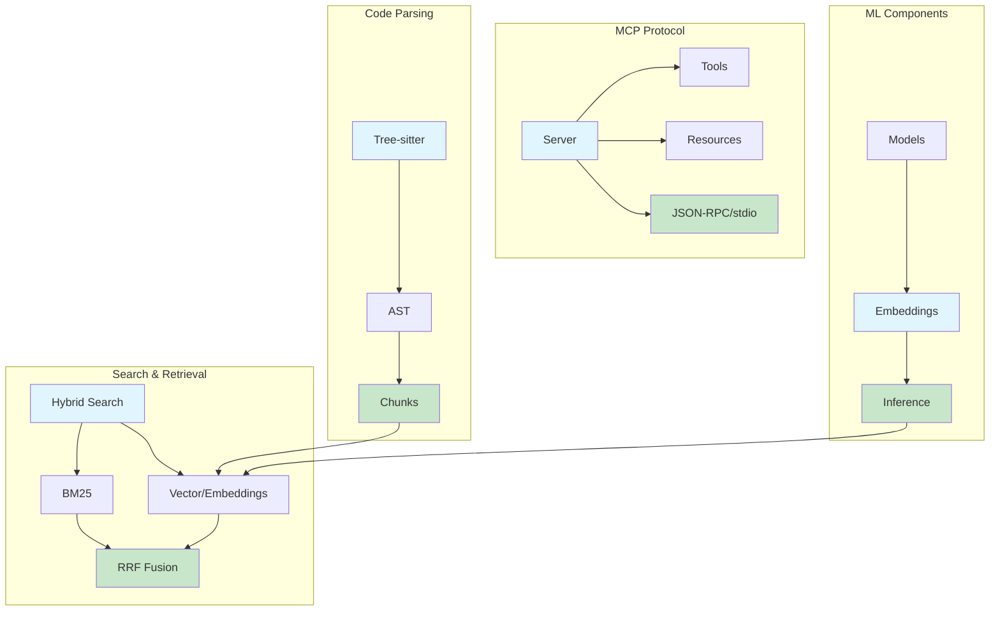
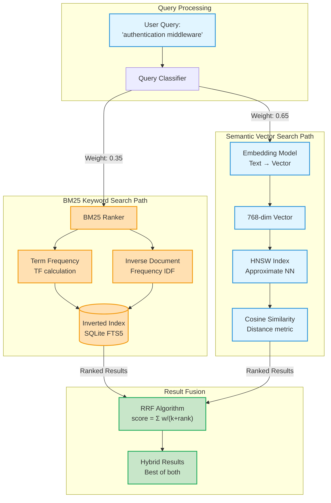
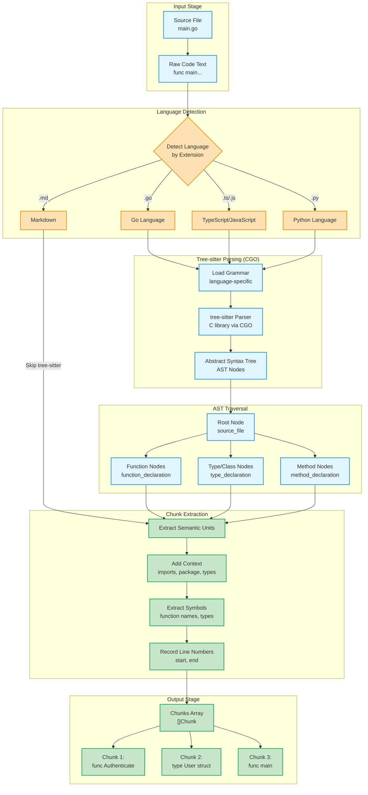
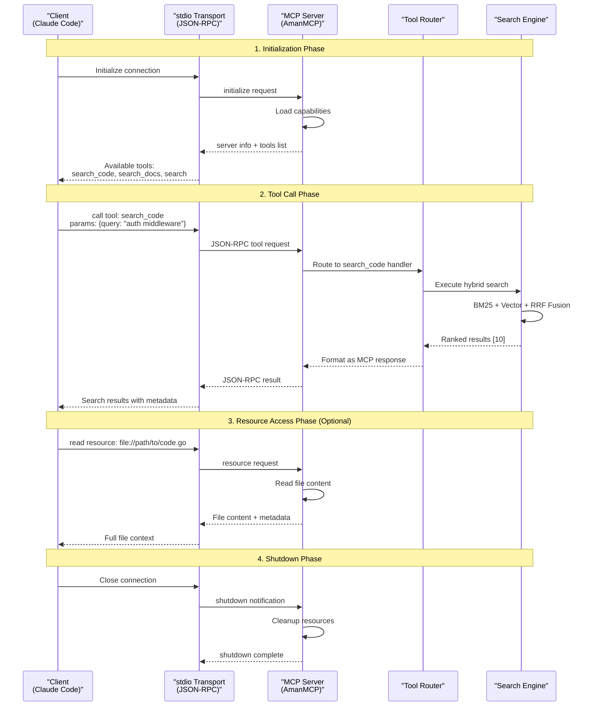
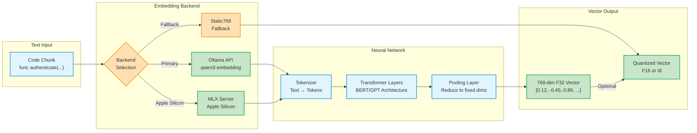
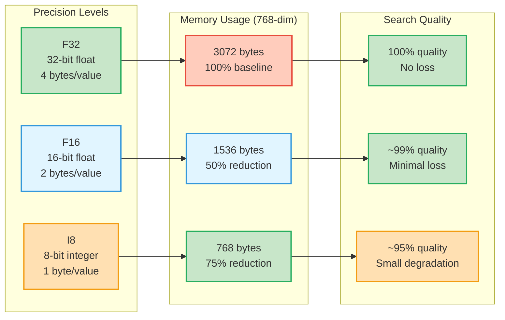
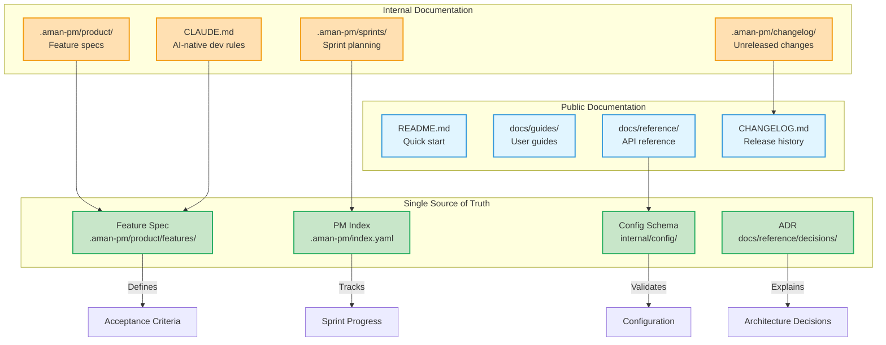

# Glossary

Definitions of terms used throughout AmanMCP documentation and code.

---

## Search & Retrieval

| Term | Definition |
|------|------------|
| **BM25** | Best Match 25. A ranking function for keyword search based on term frequency and inverse document frequency. |
| **Chunk** | A semantic unit of code (function, class, method) extracted for indexing. Smaller than a file, larger than a line. |
| **Cosine Similarity** | Measure of similarity between two vectors based on the angle between them. Range: -1 to 1. |
| **Embedding** | A dense vector representation of text that captures semantic meaning. Typically 384-1536 dimensions. |
| **HNSW** | Hierarchical Navigable Small World. Graph-based algorithm for approximate nearest neighbor search. O(log n) complexity. |
| **Hybrid Search** | Combining multiple search methods (e.g., BM25 + vector) for better results. |
| **IDF** | Inverse Document Frequency. Weights rare terms higher than common ones. |
| **RAG** | Retrieval-Augmented Generation. Pattern where AI retrieves relevant context before generating responses. |
| **RRF** | Reciprocal Rank Fusion. Algorithm to combine ranked results from multiple sources. Formula: 1/(k + rank). |
| **Semantic Search** | Finding documents by meaning rather than exact keyword match. Uses embeddings. |
| **TF** | Term Frequency. How often a term appears in a document. |
| **Vector Database** | Database optimized for storing and querying high-dimensional vectors. |

### Search Concepts Relationship Diagram

This diagram shows how the core search concepts interact in AmanMCP's hybrid search architecture:

**Key Relationships:**

- **BM25** combines TF (how often terms appear) with IDF (how rare terms are)
- **Semantic Search** uses embeddings and HNSW for approximate nearest neighbor search
- **RRF** fuses both paths using reciprocal rank scoring
- **Hybrid Search** balances keyword precision with semantic understanding

---

## Code Parsing

| Term | Definition |
|------|------------|
| **AST** | Abstract Syntax Tree. Tree representation of code structure. |
| **CGO** | Go's foreign function interface for calling C code. Required for tree-sitter. |
| **Grammar** | Rules defining the syntax of a programming language. Used by parsers. |
| **Node** | Element in an AST representing a syntactic construct (function, class, statement). |
| **Parser** | Tool that converts source code text into an AST. |
| **Tree-sitter** | Incremental parsing library used for code understanding. Supports 100+ languages. |

### Code Parsing Flow Visualization

This diagram shows how AmanMCP processes source code from files to searchable chunks using tree-sitter:

**Processing Stages:**

1. **Input**: Read source file and raw code text
2. **Detection**: Identify language by file extension
3. **Parsing**: Use tree-sitter grammar to build AST (requires CGO)
4. **Traversal**: Walk AST nodes to find semantic units (functions, classes, methods)
5. **Chunking**: Extract chunks with context (imports, symbols, line numbers)
6. **Output**: Array of searchable chunks ready for embedding and indexing

**Why tree-sitter?** Language-aware chunking respects code structure, unlike naive line-based splitting.

---

## MCP (Model Context Protocol)

| Term | Definition |
|------|------------|
| **Client** | Application that connects to MCP servers (e.g., Claude Code, Cursor). |
| **JSON-RPC** | JSON Remote Procedure Call. Protocol used for MCP communication. |
| **MCP** | Model Context Protocol. Open protocol for AI-tool integration. |
| **Prompt** | Reusable template exposed by MCP server. |
| **Resource** | Data that an MCP server makes available (files, database entries). |
| **Server** | Application that exposes tools/resources via MCP (AmanMCP). |
| **stdio** | Standard input/output. Transport mechanism for MCP communication. |
| **Tool** | Function that an AI can call via MCP (e.g., search, lookup). |

### MCP Architecture Client-Server Diagram

This diagram illustrates the MCP protocol flow between clients and the AmanMCP server:

**Key Interactions:**

- **stdio Transport**: MCP uses standard input/output for process communication
- **JSON-RPC**: All messages are formatted as JSON-RPC 2.0 requests/responses
- **Tool Calls**: Client invokes server tools (search_code, search_docs, search)
- **Resources**: Server exposes file contents and project metadata
- **Stateful Connection**: Single process lifecycle from init to shutdown

---

## Machine Learning

| Term | Definition |
|------|------------|
| **Dimension** | Number of values in an embedding vector. Higher = more nuance, more memory. |
| **F16** | Half-precision floating point. 16 bits per value. Half memory of F32. |
| **F32** | Single-precision floating point. 32 bits per value. Standard precision. |
| **I8** | 8-bit integer quantization. Quarter memory of F32, some quality loss. |
| **Inference** | Running a trained model to get predictions/embeddings. |
| **Model** | Trained neural network that performs a specific task. |
| **Quantization** | Reducing precision of numbers to save memory (F32 → F16 → I8). |
| **Transformer** | Neural network architecture used in modern embedding models. |

### Embedding Model Inference Flow

This diagram shows how AmanMCP converts code text into vector embeddings for semantic search:

**Inference Pipeline:**

- **Backend Selection**: Auto-detects best available embedder (MLX > Ollama > Static)
- **Tokenization**: Converts text into tokens (subword units)
- **Transformer**: Processes tokens through neural network layers
- **Pooling**: Reduces variable-length token embeddings to fixed dimensions
- **Quantization**: Optional precision reduction (F32 → F16 → I8) for memory savings

### Quantization Quality vs Memory Tradeoff

**Tradeoff Analysis:**

- **F32 (Default)**: Maximum quality, highest memory, standard precision
- **F16 (Recommended)**: Near-identical quality, 50% less memory, negligible loss
- **I8 (Aggressive)**: Good quality, 75% less memory, small quality degradation

**AmanMCP Default**: F16 for optimal balance (see `performance.quantization` in config)

---

## Development Process

| Term | Definition |
|------|------------|
| **AC** | Acceptance Criteria. Testable conditions that define "done" for a feature. |
| **ADR** | Architecture Decision Record. Document explaining why a decision was made. |
| **CI** | Continuous Integration. Automated testing on code changes. |
| **Feature** | Discrete unit of functionality with ID (F01, F02, etc.). |
| **Phase** | Group of related features implemented together. |
| **RCA** | Root Cause Analysis. Post-mortem document for incidents. |
| **RFC** | Request for Comments. Proposal for significant changes. |
| **SSOT** | Single Source of Truth. One authoritative location for each piece of information. |
| **TDD** | Test-Driven Development. Write tests before implementation. |

### TDD Workflow (Red-Green-Refactor)

This diagram shows AmanMCP's test-driven development cycle:

```mermaid
flowchart LR
    subgraph Red["RED Phase"]
        R1[Write Failing Test]
        R2[Verify Test Fails<br/>for right reason]
        R1 --> R2
    end

    subgraph Green["GREEN Phase"]
        G1[Write Minimal Code<br/>to pass test]
        G2[Run Tests]
        G3{All Tests Pass?}
        G1 --> G2 --> G3
        G3 -->|No| G1
    end

    subgraph Refactor["REFACTOR Phase"]
        RF1[Improve Code Quality]
        RF2[Run Tests Again]
        RF3{Tests Still Pass?}
        RF4[make ci-check]
        RF5{CI Pass?}
        RF1 --> RF2 --> RF3
        RF3 -->|Yes| RF4 --> RF5
        RF3 -->|No| RF1
        RF5 -->|No| RF1
    end

    subgraph Done["Completion"]
        D1[Commit Changes]
        D2[Update Changelog]
    end

    R2 --> G1
    G3 -->|Yes| RF1
    RF5 -->|Yes| D1 --> D2

    D2 --> Next{More Features?}
    Next -->|Yes| R1
    Next -->|No| Complete([Done])

    style R1 fill:#ffccbc,stroke:#e74c3c,stroke-width:2px
    style R2 fill:#ffccbc,stroke:#e74c3c,stroke-width:2px
    style G1 fill:#c8e6c9,stroke:#27ae60,stroke-width:2px
    style G2 fill:#c8e6c9,stroke:#27ae60,stroke-width:2px
    style G3 fill:#c8e6c9,stroke:#27ae60,stroke-width:2px
    style RF1 fill:#e1f5ff,stroke:#3498db,stroke-width:2px
    style RF2 fill:#e1f5ff,stroke:#3498db,stroke-width:2px
    style RF3 fill:#e1f5ff,stroke:#3498db,stroke-width:2px
    style RF4 fill:#e1f5ff,stroke:#3498db,stroke-width:2px
    style RF5 fill:#e1f5ff,stroke:#3498db,stroke-width:2px
    style D1 fill:#c8e6c9,stroke:#27ae60,stroke-width:2px
    style D2 fill:#c8e6c9,stroke:#27ae60,stroke-width:2px
    style Complete fill:#c8e6c9,stroke:#27ae60,stroke-width:2px
```

**TDD Principles:**

- **RED**: Write a test that fails because the feature doesn't exist yet
- **GREEN**: Write just enough code to make the test pass (no more, no less)
- **REFACTOR**: Clean up code while ensuring tests still pass

**AmanMCP Requirements:**

- All tests must pass with race detector (`go test -race`)
- `make ci-check` must pass before commit (linting, tests, coverage)
- Acceptance Criteria (AC) defines what tests verify
- SSOT for feature specs: `.aman-pm/product/features/`

### Documentation Hierarchy (SSOT)

**SSOT Principles:**

- **One authoritative source** for each type of information
- **Public docs** generated/derived from internal sources
- **Feature specs** are the definitive source for requirements
- **ADRs** capture architectural decisions with rationale
- **No duplicate information** - link to SSOT instead

---

## Project-Specific

| Term | Definition |
|------|------------|
| **AmanMCP** | This project. Local-first RAG MCP server for developers. |
| **coder/hnsw** | Pure Go HNSW vector database. Primary vector store (300K+ scale). |
| **Ollama** | Local LLM runner. Default embedding provider for AmanMCP. |
| **MLX** | Apple's machine learning framework. Optional faster embeddings on Apple Silicon. |
| **qwen3-embedding** | Default embedding model (0.6b variant). Optimized for code and documentation. |

---

## Metrics & Performance

| Term | Definition |
|------|------------|
| **Latency** | Time from request to response. Target: <100ms P95. |
| **P95** | 95th percentile. 95% of requests complete faster than this. |
| **Recall** | Percentage of relevant results actually retrieved. |
| **Throughput** | Requests processed per second. |

---

## Adding Terms

When adding new terms:

1. Place in appropriate category
2. Keep definitions concise (1-2 sentences)
3. Link to related terms if helpful
4. Update alphabetically within category

---

*Shared vocabulary enables clear communication.*
