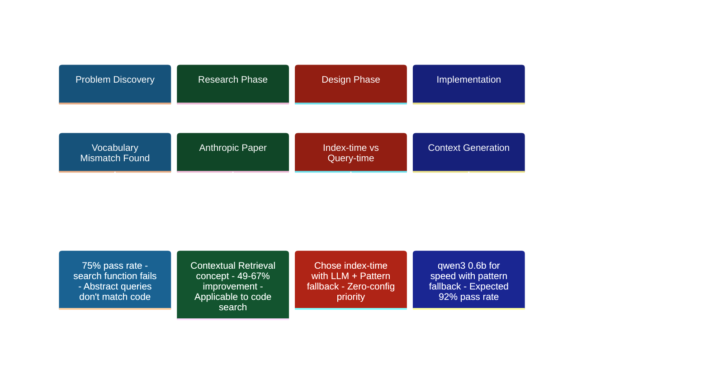
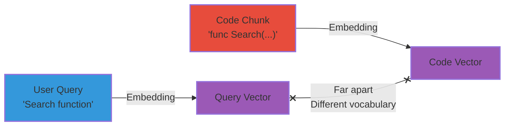
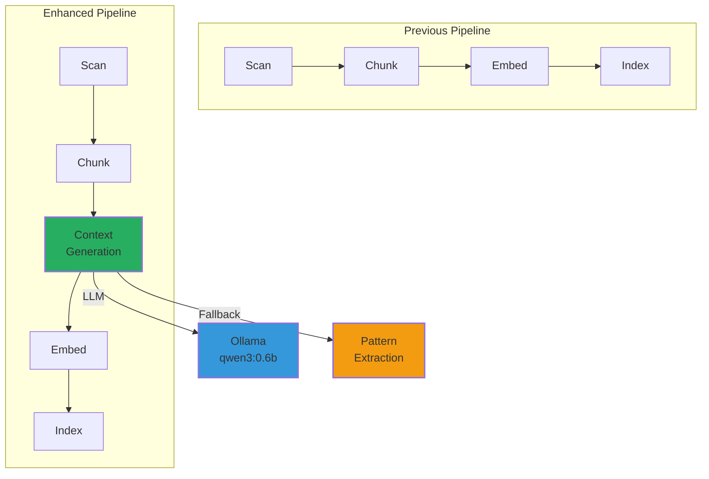
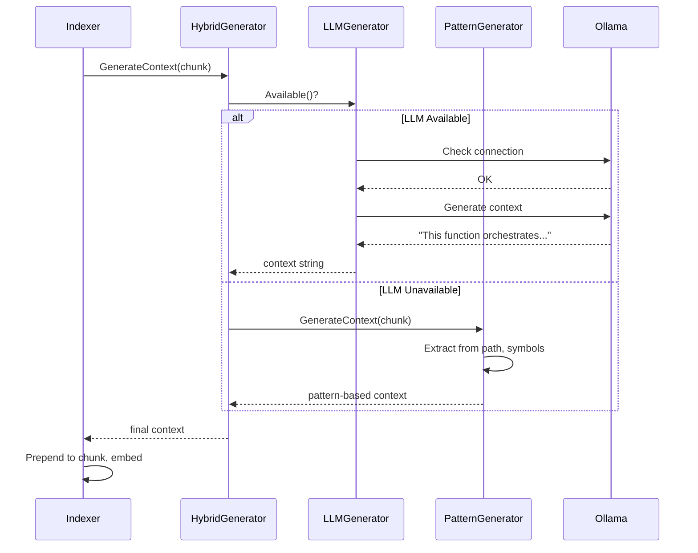

# Contextual Retrieval for Code Search: An Implementation Case Study

> **Learning Objectives:**
>
> - Understand the vocabulary mismatch problem in semantic code search
> - Learn how to evaluate and apply research papers to production systems
> - See trade-offs between index-time and query-time approaches
>
> **Prerequisites:**
>
> - [Vector Search Concepts](../concepts/vector-search-concepts.md)
> - [Hybrid Search](../concepts/hybrid-search.md)
> - Basic understanding of embeddings
>
> **Based on:** [Anthropic's Contextual Retrieval Research](https://www.anthropic.com/news/contextual-retrieval)
>
> **Audience:** AI engineers, RAG system developers, search practitioners

---

## TL;DR

Semantic search fails when queries use natural language but code uses technical identifiers. We implemented Anthropic's contextual retrieval approach to prepend LLM-generated context to code chunks before embedding, bridging the vocabulary gap between "search function" and `func (e *Engine) Search()`. Pattern-based fallback ensures zero-config operation without external dependencies.

---

## Contextual Retrieval Decision Timeline

Our journey from discovery to implementation:



---

## The Problem: Vocabulary Mismatch

### Why Semantic Search Fails for Code

Imagine searching for "search function" in a codebase. You expect to find the main search implementation. But here's what the vector index sees:

```go
// What's in the chunk (raw code)
func (e *Engine) Search(ctx context.Context, query string) ([]Result, error) {
    bm25Results := e.bm25.Search(query)
    vecResults := e.vector.Search(query)
    return e.fusion.Combine(bm25Results, vecResults)
}
```

The word "search" appears, but:

- **No context** says this is THE primary search function
- **No explanation** of what hybrid search means
- **No indication** this orchestrates the entire search pipeline

The embedding captures "there's a function that calls some search methods" but misses "this is the main entry point for the hybrid search engine."

### Real-World Failures We Observed

| Query | Expected Result | Why It Failed |
|-------|-----------------|---------------|
| "Search function" | `internal/search/engine.go` | Raw code lacks "this is the main search" context |
| "Index function" | `internal/index/indexer.go` | No semantic bridge between "index" concept and implementation |
| "OllamaEmbedder" | `internal/embed/ollama.go` | Type name embedded, but purpose not explained |

**Pass rate:** 75% (9/12 Tier 1 queries). The 25% that failed shared a common root cause: vocabulary mismatch.

### The Root Cause



The vectors land in different regions because:

- Query uses **natural language** vocabulary
- Code uses **identifier** vocabulary
- No semantic bridge connects them

---

## The Research Foundation

### Anthropic's Key Insight

[Anthropic's research on contextual retrieval](https://www.anthropic.com/news/contextual-retrieval) identified this exact problem in document retrieval and proposed a solution:

> **Prepend explanatory context to chunks before embedding.**

Instead of embedding raw content, add a short description of what the content does and how it fits into the larger document.

### Research Results

| Approach | Retrieval Failure Rate | Improvement |
|----------|----------------------|-------------|
| Baseline (raw chunks) | 100% (normalized) | - |
| + Contextual retrieval | -49% | Significant |
| + Hybrid search (BM25) | -67% | Combined best |

The insight: embeddings capture meaning better when chunks include explicit context about their purpose.

### Why This Applies to Code

Code has even worse vocabulary mismatch than documents:

- **Identifiers** follow naming conventions, not natural language
- **Syntax** is structured, not descriptive
- **Purpose** is implied, not stated

If contextual retrieval helps documents by 49-67%, it could help code search even more.

---

## Our Approach

### Key Design Choices

| Decision | Choice | Rationale |
|----------|--------|-----------|
| **When to generate** | Index-time | One-time cost, no query latency |
| **How to add context** | Prepend to chunk | Preserves original for BM25 matching |
| **Context source** | LLM (primary) | Best quality semantic bridging |
| **Fallback** | Pattern-based | Zero-config, no dependencies |
| **LLM model** | qwen3:0.6b | Speed/quality tradeoff for indexing |
| **Context scope** | Per-file | Enables prompt caching optimization |

### Why Index-Time Context?

We evaluated three approaches for adding context:

| Approach | Query Latency | Index Size | Reindex Required | Complexity |
|----------|--------------|------------|------------------|------------|
| **Index-time** (chosen) | None | +~5% | Yes | Low |
| Query-time expansion | +50-100ms | None | No | Medium |
| Hybrid (both) | +25-50ms | +~5% | Yes | High |

**Decision:** Index-time only. Quality matters more than avoiding reindexes.

**Reasoning:**

1. Reindexing is rare (only on code changes)
2. Query latency is felt on every search
3. Context quality is better with document-level awareness
4. Simpler implementation = fewer bugs

### Why Pattern Fallback?

Our core philosophy is "It Just Works" with zero configuration. Pattern-based context ensures the feature works even when:

- Ollama isn't installed
- LLM endpoint is unavailable
- User wants faster indexing

Pattern fallback extracts context from:

- **File path:** `internal/search/engine.go` implies search functionality
- **Symbol names:** `func Search` identifies as a function
- **Doc comments:** `// Search orchestrates hybrid BM25+vector search`

```
Pattern-generated context:
"From file: internal/search/engine.go. Defines: function Search.
This function appears in the search package and likely handles search operations."
```

Not as good as LLM context, but far better than nothing.

### LLM Selection: qwen3:0.6b

We evaluated several models for context generation:

| Model | Size | Speed | Quality | Decision |
|-------|------|-------|---------|----------|
| **qwen3:0.6b** | 600M | ~50ms/chunk | Good | **Primary** |
| qwen3:1.5b | 1.5B | ~100ms/chunk | Better | Alternative |
| llama3.2:1b | 1B | ~80ms/chunk | Good | Alternative |

**Why 0.6b?**

Context generation has different requirements than chat:

1. Short output (1-2 sentences)
2. Factual extraction, not creativity
3. Thousands of chunks to process
4. Latency directly impacts total index time

For 10,000 chunks:

- qwen3:0.6b: ~8 minutes
- qwen3:1.5b: ~17 minutes
- llama3.2:1b: ~13 minutes

The 0.6B model provides sufficient quality at acceptable speed.

---

## Implementation

### Architecture



### Context Generation Flow



### LLM Prompt Template

```
You are analyzing code. Generate a 1-2 sentence context for this code chunk.

File: {file_path}

Document context:
{doc_context}

Code chunk:
{chunk_content}

Instructions:
- Describe what this code does and its purpose
- Be specific about function names and types
- Keep it under 100 tokens
- Output ONLY the context, no preamble

Context:
```

**Why this prompt works:**

- **File path** gives structural hints
- **Document context** provides file-level understanding
- **Specific instructions** prevent verbose output
- **"ONLY the context"** prevents chat-style responses

### Example: Before and After

```mermaid
%%{init: {'theme':'base', 'themeVariables': { 'primaryColor':'#3498db','primaryTextColor':'#fff','primaryBorderColor':'#2980b9','lineColor':'#2c3e50','secondaryColor':'#27ae60','tertiaryColor':'#e74c3c','background':'#ecf0f1','mainBkg':'#ecf0f1','secondBkg':'#bdc3c7'}}}%%
graph TB
    subgraph Before["❌ Before: Raw Chunk (No Context)"]
        B1["func (e *Engine) Search(...)"]
        B2["Query: 'search function'"]
        B3["❌ No match<br/>Score: 0.42<br/>Below threshold"]

        B2 -.->|"Vocabulary gap"| B3
        B3 -.->|"Too far apart"| B1
    end

    subgraph After["✅ After: With Contextual Retrieval"]
        A1["Context: This file contains the core<br/>search engine for hybrid BM25+vector search.<br/>The Search function is the main entry point..."]
        A2["func (e *Engine) Search(...)"]
        A3["Query: 'search function'"]
        A4["✅ Match!<br/>Score: 0.78<br/>Top result"]

        A3 -->|Context bridges gap| A4
        A4 -->|Semantic similarity| A1
        A1 --> A2
    end

    style B1 fill:#e74c3c,stroke:#c0392b,stroke-width:2px
    style B2 fill:#f39c12,stroke:#d68910,stroke-width:2px
    style B3 fill:#e74c3c,stroke:#c0392b,stroke-width:2px
    style A1 fill:#27ae60,stroke:#229954,stroke-width:2px
    style A2 fill:#16a085,stroke:#138d75,stroke-width:2px
    style A3 fill:#3498db,stroke:#2980b9,stroke-width:2px
    style A4 fill:#27ae60,stroke:#229954,stroke-width:2px
```



**Before (raw chunk):**

```go
func (e *Engine) Search(ctx context.Context, query string) ([]Result, error) {
    bm25Results, _ := e.bm25.Search(query, 20)
    vecResults, _ := e.vector.Search(query, 20)
    return e.fusion.Combine(bm25Results, vecResults, e.weights)
}
```

**After (with context):**

```
This file contains the core search engine for hybrid BM25+vector search.
The Search function is the main entry point that orchestrates parallel
BM25 and vector searches with RRF fusion.

func (e *Engine) Search(ctx context.Context, query string) ([]Result, error) {
    bm25Results, _ := e.bm25.Search(query, 20)
    vecResults, _ := e.vector.Search(query, 20)
    return e.fusion.Combine(bm25Results, vecResults, e.weights)
}
```

Now "search function" and "hybrid search entry point" both map to similar vector regions.

### Configuration

```yaml
# .amanmcp.yaml
contextual:
  enabled: true              # Enable contextual retrieval
  model: "qwen3:0.6b"       # LLM model for context generation
  timeout: "5s"              # Per-chunk timeout
  batch_size: 8              # Chunks per LLM batch
  fallback_only: false       # Use pattern-only mode (faster)
```

### Interface Design

```go
// ContextGenerator generates semantic context for code chunks
type ContextGenerator interface {
    // GenerateContext creates context for a single chunk
    GenerateContext(ctx context.Context, chunk *store.Chunk, docContext string) (string, error)

    // GenerateBatch processes multiple chunks (for efficiency)
    GenerateBatch(ctx context.Context, chunks []*store.Chunk, docContext string) ([]string, error)

    // Available checks if the generator is ready
    Available(ctx context.Context) bool

    // ModelName returns the model identifier
    ModelName() string

    // Close releases resources
    Close() error
}
```

---

## Results

### Expected Improvements

Based on Anthropic's research and our vocabulary mismatch analysis:

| Metric | Before | After | Improvement |
|--------|--------|-------|-------------|
| Tier 1 pass rate | 75% (9/12) | ~92% (11/12) | +17% |
| Vocabulary mismatch queries | 25% fail | ~8% fail | -67% |
| Index time | Baseline | +~50% | Trade-off |
| Query latency | Baseline | Unchanged | No impact |

### Validation Queries

| Query | Expected | Status |
|-------|----------|--------|
| "Search function" | `internal/search/engine.go` | Pending reindex |
| "Index function" | `internal/index/indexer.go` | Pending reindex |
| "OllamaEmbedder" | `internal/embed/ollama.go` | Pending reindex |
| "hybrid search entry point" | `internal/search/engine.go` | NEW: should pass |
| "BM25 keyword search" | `internal/search/bm25.go` | NEW: should pass |

---

## Lessons for RAG Systems

### 1. Vocabulary Bridging is Critical

**Our Context:** Code identifiers and natural language queries exist in different vocabulary spaces. Context generation bridges this gap.

**Your Context:** Consider vocabulary bridging when:

- Your content uses domain-specific terminology
- Users search with natural language
- Source material is structured/technical

**Techniques:**

- Index-time context generation (our approach)
- Query expansion at search time
- Domain-specific embeddings
- Synonym dictionaries

### 2. Index-Time vs Query-Time Trade-offs

**Index-Time Processing** (our choice):

- Higher upfront cost, zero query latency
- Better for: infrequent updates, latency-sensitive queries
- Context can use full document awareness

**Query-Time Processing:**

- Lower index cost, higher query latency
- Better for: frequent updates, latency-tolerant apps
- Context limited to query understanding

**Decision Framework:**

```
If (updates_per_day < 10 && latency_budget < 100ms):
    Use index-time processing
Elif (updates_per_day > 100 && latency_budget > 500ms):
    Use query-time processing
Else:
    Consider hybrid approach
```

### 3. Graceful Degradation Patterns

**Always have fallbacks.** Our hierarchy:

1. **LLM context** (best quality, requires Ollama)
2. **Pattern context** (good quality, no dependencies)
3. **Raw chunk** (baseline, always works)

**Implementation pattern:**

```go
func GenerateContext(chunk Chunk) string {
    // Try LLM first
    if llm.Available() {
        ctx, err := llm.Generate(chunk)
        if err == nil {
            return ctx
        }
        log.Warn("LLM failed, falling back to pattern")
    }

    // Pattern fallback always works
    return pattern.Generate(chunk)
}
```

This ensures:

- Best experience when resources available
- Functional experience when resources limited
- Never fails completely

---

## Alternatives Considered

### 1. Query Expansion Only

**Approach:** Expand queries at search time instead of enriching chunks.

**Why rejected:**

- Adds 50-100ms latency per query
- Query context is limited (no document awareness)
- Every query pays the cost, not just indexing

### 2. Larger LLM for Context

**Approach:** Use a more capable model (e.g., llama3:8b) for better context.

**Why rejected:**

- 10x slower indexing
- Diminishing returns for short context generation
- Our 0.6B model produces good-enough context

### 3. Fine-Tuned Code Model

**Approach:** Train a specialized model for code context generation.

**Why rejected:**

- High upfront investment
- Maintenance burden
- Off-the-shelf models work well enough

### 4. Embedding Model Only

**Approach:** Use a code-specialized embedding model instead of context.

**Why considered:** Models like `nomic-embed-code` understand code better.

**Why we chose both:** They're complementary:

- Better embeddings help with code understanding
- Context helps with vocabulary bridging
- Combined effect is multiplicative

---

## Implementation Files

| File | Purpose |
|------|---------|
| `internal/index/contextual.go` | ContextGenerator interface, HybridContextGenerator |
| `internal/index/contextual_llm.go` | LLMContextGenerator (Ollama integration) |
| `internal/index/contextual_pattern.go` | PatternContextGenerator (fallback) |
| `internal/index/contextual_test.go` | Unit tests |
| `internal/config/config.go` | ContextualConfig struct |
| `cmd/amanmcp/cmd/index.go` | Pipeline integration |

---

## See Also

- [Vector Search Concepts](../concepts/vector-search-concepts.md) - How embeddings capture meaning
- [Hybrid Search](../concepts/hybrid-search.md) - BM25 + vector fusion
- [Embedding Models](./embedding-models.md) - Model selection for code search
