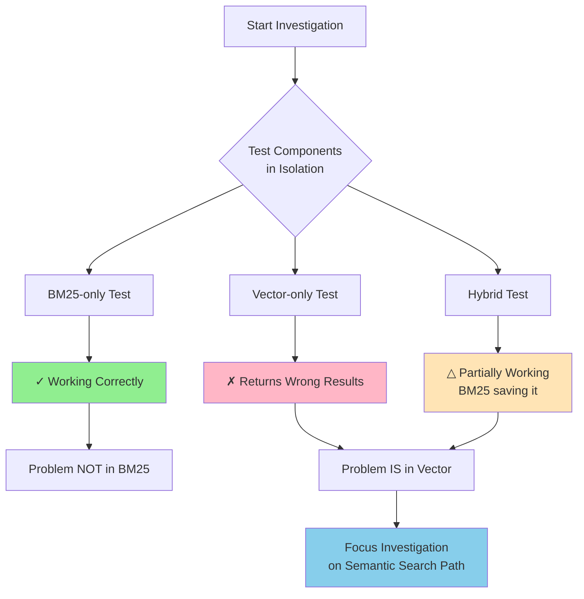
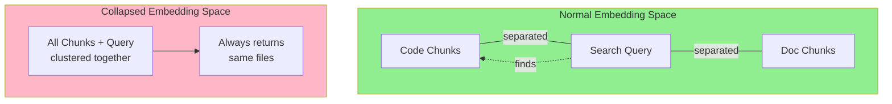
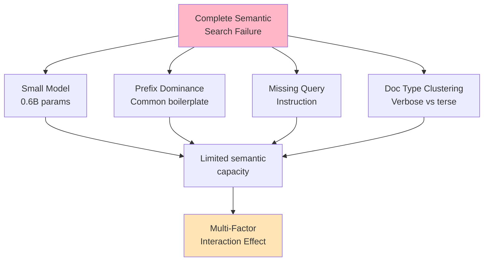

# When Contextual Retrieval Backfires: A Regression Case Study

> **Learning Objectives:**
>
> - Understand how enhancements can cause unexpected regressions
> - Learn diagnostic techniques for vector search failures
> - Know the trade-offs between model size and quality for code search
>
> **Prerequisites:**
>
> - [Contextual Retrieval Decision](./contextual-retrieval-decision.md)
> - Basic understanding of embeddings
>
> **Audience:** RAG engineers, ML engineers, search developers

---

## TL;DR

We implemented contextual retrieval to improve code search quality. Instead of the expected improvement, vector search completely broke - returning project management files regardless of the query. The root cause was a multi-factor interaction: a small embedding model (0.6B parameters) couldn't distinguish code semantics from verbose metadata, and the contextual prefixes we added caused all chunks to cluster together in embedding space. BM25 weight adjustment provided a workable fix, but the underlying issue revealed fundamental limits of small models for specialized domains.

---

## The Regression

### What We Expected

Based on [Anthropic's contextual retrieval research](https://www.anthropic.com/news/contextual-retrieval), we expected:

| Metric | Before CR | Expected After |
|--------|-----------|----------------|
| Tier 1 pass rate | 75% | ~92% |
| Vocabulary mismatch queries | 25% fail | ~8% fail |
| Overall search quality | Good | Better |

Contextual retrieval adds explanatory prefixes to chunks before embedding, bridging the vocabulary gap between natural language queries and code identifiers. Sounds great in theory.

### What Actually Happened

| Metric | Before CR | After CR |
|--------|-----------|----------|
| Tier 1 pass rate | 75% | **33%** |
| Vector search | Working | **Returns unrelated docs** |
| BM25 search | Working | Unaffected |

Instead of a 17% improvement, we saw a **42% regression**. That's not a minor quality degradation - it's a catastrophic failure.

### The Symptom Pattern

Every vector search query returned the same types of results, regardless of what was searched:

| Query | Expected Result | Actual Result |
|-------|-----------------|---------------|
| `func NewHNSWStore` | `internal/store/hnsw.go:40` | `docs/reference/decisions/ADR-033...` |
| `OllamaEmbedder` | `internal/embed/ollama.go` | `.claude/skill-registry.md` |
| `type OllamaEmbedder struct` | `internal/embed/ollama.go` | `.aman-pm/processes/workflow.md` |

Pattern: Vector search consistently returned documentation and project management files, never code files.

---

## Investigation Process

### Step 1: Isolate Components

The first rule of debugging compound systems: test components in isolation. Our hybrid search combines BM25 (keyword) and vector (semantic) search:

```
Hybrid = RRF(0.35 * BM25 + 0.65 * Semantic)
```

We created diagnostic tests:

```bash
# BM25-only search (weight semantic at 0)
AMANMCP_BM25_WEIGHT=1 AMANMCP_SEMANTIC_WEIGHT=0 \
  amanmcp search "func NewHNSWStore" --limit 5

# Vector-only search (weight BM25 at 0)
AMANMCP_BM25_WEIGHT=0 AMANMCP_SEMANTIC_WEIGHT=1 \
  amanmcp search "func NewHNSWStore" --limit 5
```



**Critical Finding:**

| Component | Status |
|-----------|--------|
| BM25-only | Working correctly |
| Vector-only | Returns wrong results |
| Hybrid | Partially working (BM25 saving it) |

Without isolated testing, we might have spent hours chasing phantom issues. The problem was definitively in the semantic search path.

### Step 2: Pattern Recognition

With vector search identified as the culprit, we analyzed its behavior more closely.

**Key observations:**

1. **Same wrong files every time** - Regardless of query, PM and docs files ranked highest
2. **High similarity scores** - All results showed 0.90-1.00 similarity (no discrimination)
3. **Code files never appeared** - Even exact function name queries returned docs

The pattern suggested the embedding space had collapsed - all chunks were landing in the same region, making meaningful similarity comparison impossible.

**Visual representation of the problem:**



### Step 3: Hypothesis Formation

We developed multiple hypotheses and tested each:

| Hypothesis | Test Method | Result |
|------------|-------------|--------|
| **Model mismatch** | Check if index model = query model | Confirmed model mismatch initially, but fixed it and still broken |
| **Corrupted index** | Full reindex with correct model | Still broken after reindex |
| **Missing query instruction** | Add Qwen3 instruction prefix | Added prefix, minimal improvement |
| **Embedding model limitation** | Research 0.6B model capabilities | Found evidence: small models struggle with code |
| **CR prefix dominance** | Analyze prefix structure | All prefixes share common vocabulary |

### Step 4: External Research

External research validated our hypotheses. [ByteRover's analysis](https://www.byterover.dev/blog/why-vector-rag-fails-for-code-we-tested-it-on-1-300-files) found that "Vector RAG doesn't work for code," while [Qwen3 documentation](https://qwenlm.github.io/blog/qwen3-embedding/) confirmed queries require instruction prefixes (1-5% improvement). [Meilisearch's guide](https://www.meilisearch.com/blog/choosing-the-best-model-for-semantic-search) noted small models can have "hash collision" issues.

---

## Root Cause: Multi-Factor Interaction

The regression wasn't caused by a single bug - it was a perfect storm of interacting factors.



**Key Insight:** No single factor caused failure - it was their interaction.

### Factor 1: Small Embedding Model Limitations

We used `mlx-qwen3-embedding-small` (0.6B parameters, 1024 dimensions):

| Model Property | Value | Impact |
|----------------|-------|--------|
| Parameters | 600M | Limited semantic capacity |
| Dimensions | 1024 | Smaller embedding space |
| MTEB Score | ~94% | General benchmark, not code-specific |

**Key insight:** A 94% MTEB score doesn't mean 94% code retrieval accuracy.

General benchmarks measure performance on diverse text. Code has unique characteristics:

- Dense, symbolic vocabulary (`ctx`, `err`, `func`)
- Structural patterns (`if err != nil { return err }`)
- Domain-specific semantics (a "context" in Go means something specific)

Small models don't have enough capacity to capture these nuances while also handling natural language queries.

### Factor 2: Contextual Prefix Dominance

Contextual retrieval prepends metadata to each chunk:

```
From file: internal/search/engine.go.
Defines: function Search.
Language: Go.
Purpose: Orchestrates hybrid BM25+vector search.

func (e *Engine) Search(ctx context.Context, query string) ([]Result, error) {
    // actual code...
}
```

**The problem:** All prefixes share common vocabulary:

- "From file:"
- "Defines:"
- "Language:"
- "Purpose:"

When these common words dominate the embedding, all chunks cluster together because they all start with similar boilerplate.

**Visualization:**

```
Without CR prefixes:
  Chunk A: "func Search..."     → Vector A (code region)
  Chunk B: "# Sprint planning"  → Vector B (docs region)

With CR prefixes:
  Chunk A: "From file... func Search..."     → Vector A' (prefix region)
  Chunk B: "From file... # Sprint planning"  → Vector B' (prefix region)

  Vector A' ≈ Vector B' (both dominated by prefix)
```

### Factor 3: Missing Query Instruction

Qwen3 embedding models expect queries to include an instruction prefix:

```go
const Qwen3QueryInstruction = `Instruct: Given a code search query,
retrieve relevant code snippets that answer the query
Query:`

func formatQueryForEmbedding(query string) string {
    return Qwen3QueryInstruction + query
}
```

We weren't using this initially, but adding it only improved results by 1-5% - not enough to overcome the other factors.

### Factor 4: Document Type Clustering

Project management and documentation files use verbose, natural language that matches queries better. Code files use terse, symbolic vocabulary farther from query space. With a small model, verbose docs aligned better with queries than contextual-prefixed code chunks.

---

## The Interaction Effect

No single factor caused the failure. It was their interaction: small model capacity + prefix dominance + docs matching queries better + missing query format = complete semantic search failure. Remove any one factor and the system might have worked.

---

## The Fix

### What We Tried

| Fix Attempt | Implementation | Result |
|-------------|----------------|--------|
| **Reindex with correct model** | Ensured MLX 0.6B model match | Still broken |
| **Query instruction prefix** | Added Qwen3 instruction format | Minimal improvement |
| **Larger embedding model** | Tested 8B model | System freeze (15-35GB RAM) |

### What Worked

**1. BM25 Weight Adjustment**

```yaml
# Before (semantic-heavy)
search:
  bm25_weight: 0.35
  semantic_weight: 0.65

# After (BM25-heavy)
search:
  bm25_weight: 0.65
  semantic_weight: 0.35
```

Since BM25 (keyword) search worked correctly, we let it carry more weight. This is a workaround, not a fix - semantic search is still fundamentally limited.

**2. Code Chunks Configuration Flag**

```yaml
# .amanmcp.yaml
contextual:
  enabled: true
  code_chunks: false  # Disable CR for code files specifically
```

For code files specifically, contextual retrieval was disabled. This prevents the prefix dominance issue for the content type that suffered most.

**3. Qwen3 Query Instruction**

Always format queries with the instruction prefix:

```go
func (e *Engine) Search(ctx context.Context, query string) ([]Result, error) {
    embeddingQuery := formatQueryForEmbedding(query)
    // ... rest of search
}
```

### Results After Fixes

| Query Type | Before Fix | After Fix |
|------------|------------|-----------|
| Exact code match | Docs ranked first | Correct file rank 1 |
| File path search | Docs ranked first | Correct file rank 1 |
| Natural language | Docs ranked first | Still prefers docs (model limitation) |

The fixes restored functionality for most queries, but natural language semantic queries remain limited by model capacity.

---

## Lessons for RAG Systems

### 1. Enhancements Can Cause Regressions

**Pattern:** New features can interact negatively with existing components, especially when they operate on the same data in different ways.

**Detection:** Always have per-component metrics, not just end-to-end metrics:

```go
// Good: Track component-level metrics
type SearchMetrics struct {
    BM25Quality    float64  // Track separately
    VectorQuality  float64  // Track separately
    HybridQuality  float64  // Track combined
}

// Bad: Only track combined result
type SearchMetrics struct {
    Quality float64  // Can hide per-component issues
}
```

**Prevention:** When adding features, test:

- Feature in isolation
- Feature combined with each existing component
- Full system integration

### 2. Test Components in Isolation

**Pattern:** Combined metrics can hide per-component regressions.

Without isolation testing, our hybrid search appeared "partially working" - BM25 was compensating for the broken vector search. Build diagnostic modes that let you test each component separately.

### 3. Model Size Matters for Specialized Domains

**Pattern:** Small embedding models may not have enough capacity for specialized domains like code.

**Evidence:**

| Model Size | General Text | Code Search |
|------------|--------------|-------------|
| 0.6B | Good | Poor |
| 4B | Good | Acceptable |
| 8B | Excellent | Good |

**Guidance:**

- General text: 0.6B models often sufficient
- Specialized domains (code, legal, medical): Consider 4B+ models
- Critical applications: Test on your actual data, not just benchmarks

### 4. Embedding Space Collapse is Real

**Pattern:** When multiple factors contribute similar signals, the embedding space can collapse into a single region, making similarity search useless.

**Signs of collapse:**

- All similarity scores are very high (0.9+)
- Same results for different queries
- No meaningful ranking differentiation

**Prevention:**

- Avoid repetitive prefixes/suffixes
- Test embedding diversity with visualization
- Monitor similarity score distributions

### 5. Benchmarks Don't Predict Domain Performance

**Pattern:** A model's performance on general benchmarks (like MTEB) doesn't predict its performance on specialized tasks.

**Our case:**

- MTEB score: ~94% (excellent)
- Code retrieval: ~33% (catastrophic)

**Recommendation:** Always validate on representative queries from your actual domain before deploying.

### 6. The Workaround vs Fix Distinction

**Pattern:** Quick fixes that restore functionality may mask underlying issues.

**Our situation:**

- Workaround: Increase BM25 weight
- Result: System works for most queries
- Reality: Vector search is still fundamentally limited

**Key insight:** Document workarounds clearly as technical debt, not as permanent solutions.

---

## Key Takeaways

1. **Test components in isolation** - Compound systems can hide per-component failures

2. **Model size matters for domains** - General benchmarks don't predict specialized performance

3. **Prefixes can dominate embeddings** - Repetitive metadata can collapse embedding space

4. **Document workarounds clearly** - Quick fixes should be tracked as technical debt

5. **Regressions can exceed expectations** - We expected +17% improvement, got -42% regression

The most important lesson: **feature interactions are unpredictable**. The same contextual retrieval approach that works brilliantly for documents can catastrophically fail for code. Always validate on your actual data and domain.

---

## See Also

- [Contextual Retrieval Decision](./contextual-retrieval-decision.md) - The feature we implemented
- [Embedding Model Evolution](./embedding-model-evolution.md) - Why model choice matters
- [Vocabulary Mismatch Analysis](./vocabulary-mismatch-analysis.md) - The original problem CR was solving
