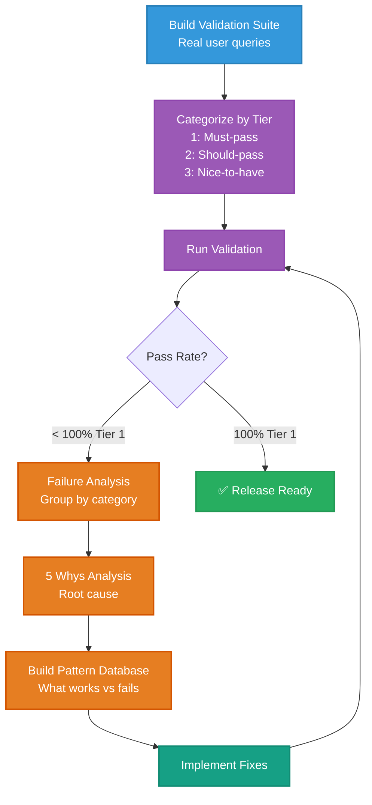
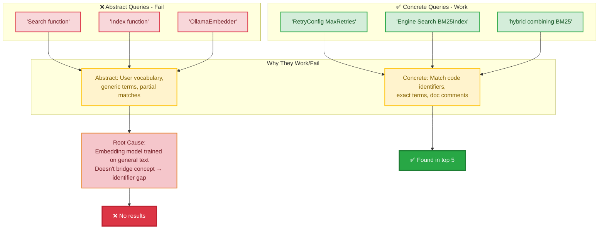
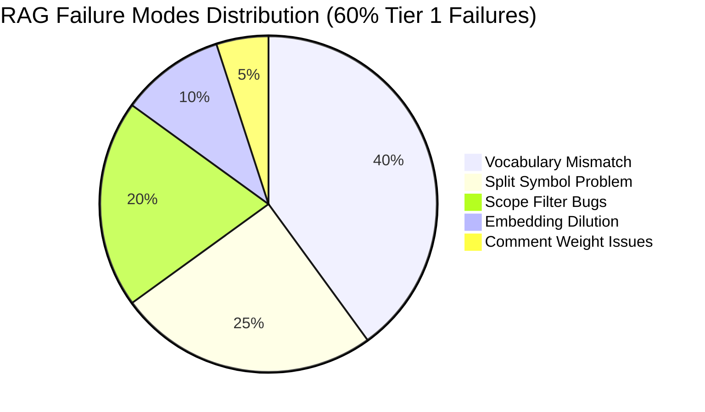
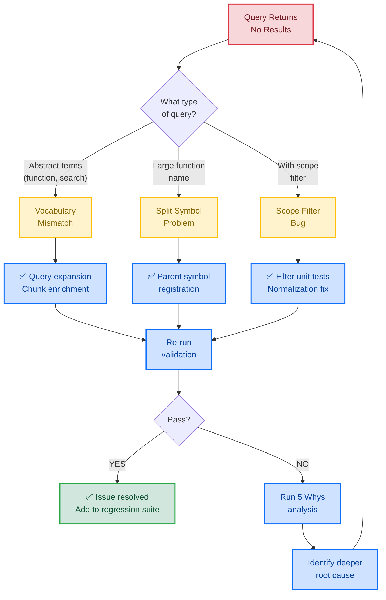

# Dogfooding Methodology for RAG Systems: Lessons from Search Quality Validation

> **Learning Objectives:**
>
> - Understand how to design dogfood tests for RAG/search systems
> - Learn the "5 Whys" technique for root cause analysis
> - Recognize vocabulary mismatch as a common RAG failure mode
>
> **Prerequisites:**
>
> - [Hybrid Search](../concepts/hybrid-search.md)
> - Basic understanding of semantic search
>
> **Audience:** RAG engineers, QA engineers, search developers

---

## TL;DR

Dogfooding RAG systems requires tiered validation that mirrors real user queries, not just unit tests. Our baseline testing achieved only 60% pass rate on must-pass queries, revealing three root causes: vocabulary mismatch between user language and code identifiers, broken scope filters, and reduced discoverability of split symbols. The key insight: abstract concepts like "search function" fail while concrete terms like "Engine Search BM25" succeed.

---

## The Problem: Measuring RAG Quality

Traditional search systems can be tested with precision/recall metrics on labeled datasets. RAG systems are harder because:

1. **Relevance is subjective**: What counts as a "good" result depends on user intent
2. **Natural language queries vary**: Users phrase the same question differently
3. **Ground truth changes**: Codebases evolve, so test expectations must too
4. **Semantic gaps are invisible**: Unit tests pass while real queries fail

Standard unit tests verify that components work correctly in isolation. They do not verify that the system finds what users actually search for. A search engine can have 100% unit test coverage and still fail 40% of real queries.

### The Testing Gap

```
Unit Tests                          Dogfood Tests
─────────────────                   ─────────────────
"Does BM25 rank correctly?"         "Does 'search function' find engine.go?"
"Is HNSW returning neighbors?"      "Can I find retry logic with natural language?"
"Does RRF combine scores?"          "Does semantic search understand my intent?"
```

Unit tests answer: "Does it work as coded?"
Dogfood tests answer: "Does it work for users?"

---

## Our Dogfooding Framework

### Dogfooding Workflow



### Tiered Query System

Not all queries are equal. We categorize them by criticality:

| Tier | Description | Pass Target | Example |
|------|-------------|-------------|---------|
| 1 | Must-pass core queries | 100% | "Find the search engine implementation" |
| 2 | Should-pass common queries | 85% | "How does retry work?" |
| 3 | Nice-to-have edge cases | 70% | "Authentication flow diagram" |

**Why tiers matter:** A Tier 1 failure blocks release. A Tier 3 failure is tracked but does not block. This prevents both over-engineering and under-testing.

### Query Categories

Different query types stress different parts of the search system:

| Category | Example Query | Expected Target | Tests |
|----------|---------------|-----------------|-------|
| Exact code match | "func NewHNSWStore" | internal/store/hnsw.go | BM25 exact match |
| Natural language | "search function" | internal/search/engine.go | Semantic understanding |
| Concept to code | "retry with backoff" | internal/errors/retry.go | Vocabulary bridging |
| Cross-reference | "where is Engine used" | Multiple files | Relationship traversal |
| Documentation | "performance targets" | docs/F23-performance.md | Multi-format search |
| Configuration | "add new language support" | CONTRIBUTING.md | Non-code content |

### Sample Validation Suite

```yaml
# validation-queries.yaml
tier_1:
  - query: "Vector store implementation"
    expected: ["internal/store/hnsw.go"]
    type: natural_language

  - query: "RRF fusion"
    expected: ["internal/search/fusion.go"]
    type: concept_to_code

  - query: "Embedder interface"
    expected: ["internal/embed/embedder.go"]
    type: natural_language

  - query: "MCP tools registered"
    expected: ["internal/mcp/server.go"]
    type: code_location

  - query: "func (e *Engine) Search"
    expected: ["internal/search/engine.go"]
    type: exact_match

tier_2:
  - query: "how to add a new chunker"
    expected: ["CONTRIBUTING.md", "internal/chunk/"]
    type: documentation

  - query: "error handling patterns"
    expected: ["internal/errors/"]
    type: concept
```

---

## What We Discovered

Our initial baseline run produced sobering results:

```
Tier 1 Results: 9/15 passed (60%)
Target: 15/15 passed (100%)
Gap: 6 queries (40%)
```

The failures were not random. They followed patterns.

### Issue 1: Vocabulary Mismatch (The "5 Whys")

The query "Search function" returned empty results. The code exists. Why?

**The 5 Whys Analysis:**

1. **Why** did "Search function" return empty?
   - Because no indexed chunk's embedding was close enough to the query embedding.

2. **Why** were embeddings not close enough?
   - Because "Search function" is semantically distant from `func (e *Engine) Search(ctx context.Context...`.

3. **Why** is there semantic distance?
   - Because the embedding model treats "function" as a concept, not the Go keyword `func`.

4. **Why** does not the model understand programming vocabulary?
   - The embedding model (general-purpose) was not trained primarily on code.

5. **Why** was not a code-specialized model used?
   - Trade-off between model size, speed, and local-first philosophy.

**Root cause:** Users think in concepts ("function"), code uses identifiers (`func`). Embeddings do not always bridge this gap.

### Pattern Analysis from Vocabulary Mismatch

```
Queries that WORK:
─────────────────────────────────────────────────────────────────
"RetryConfig MaxRetries InitialDelay"     → Found retry.go
"Engine Search BM25Index VectorStore"     → Found engine.go
"Search executes hybrid combining BM25"   → Found engine.go

Queries that FAIL:
─────────────────────────────────────────────────────────────────
"Search function"                         → Empty
"Index function"                          → Empty
"OllamaEmbedder"                          → Empty

THE PATTERN: Queries matching actual code text succeed.
             Abstract queries fail.
```

#### Vocabulary Mismatch Impact



### Issue 2: Split Symbol Problem

Large functions exceed chunk size limits and get split:

```
Original:   func Search(...) { /* 500+ lines */ }
Indexed as: Search_part1, Search_part2, Search_part3...

Problem: No chunk is named "Search"
         Each part has lower individual relevance
         The original symbol loses discoverability
```

**The 5 Whys Analysis:**

1. **Why** does "Search method" not find the Search method?
   - Because Search is stored as `Search_part1`, `Search_part2`, etc.

2. **Why** is the method split?
   - Because it exceeds the chunk token limit (~500 tokens).

3. **Why** does the original name not appear?
   - The chunker only stores the part names, not the original symbol.

4. **Why** is this a problem?
   - Each part has lower individual relevance, and no part is named "Search".

5. **Why** was a parent symbol not created?
   - Design trade-off: simpler chunking vs. symbol aggregation.

### Issue 3: Scope Filter Edge Cases

Adding a scope filter (`scope=["internal/search"]`) caused some queries to return empty instead of narrowing results.

**Diagnosis process:**

```sql
-- Symbols ARE in database
SELECT name, type FROM symbols WHERE file_path LIKE '%engine.go'
-- Returns: Engine (type), Search_part1 (method), Search_part2 (method)...

-- But scope filter produces empty results
-- Root cause: Implementation bug in scope normalization
```

This issue was initially tracked as a separate bug (BUG-049) but investigation revealed the true root cause was vocabulary mismatch interacting with scope filtering.

---

## Lessons for RAG Validation

### 1. Test With Real Queries

**Our Context:** Unit tests did not catch semantic gaps. They verified BM25 ranked documents correctly but did not verify that user queries found the right documents.

**Your Context:** Build validation suites from actual user queries. Track what users search for in production. Add failing queries to your test suite.

**Pattern:**

```python
# Instead of synthetic tests
def test_bm25_ranking():
    assert bm25.score("foo", doc_with_foo) > bm25.score("foo", doc_without_foo)

# Add real query tests
def test_real_user_query():
    results = search("how do I implement retry logic")
    assert "retry.go" in [r.file for r in results[:3]]
```

### 2. Separate Keyword vs Natural Language Tests

**Our Context:** BM25 and semantic search have different failure modes. BM25 fails on vocabulary mismatch. Semantic search fails on query dilution.

**Your Context:** Test each backend independently before testing combined results.

```yaml
# Test BM25 in isolation
bm25_tests:
  - query: "RetryConfig"
    backend: bm25_only
    expected: ["retry.go"]

# Test vector in isolation
vector_tests:
  - query: "error handling with exponential delay"
    backend: vector_only
    expected: ["retry.go"]

# Test combined
hybrid_tests:
  - query: "retry backoff"
    backend: hybrid
    expected: ["retry.go"]
```

### 3. The 5 Whys Technique

The "5 Whys" is a root cause analysis technique from Toyota's manufacturing process. It works for RAG failures too.

**How to apply:**

1. Start with the symptom: "Query X returned no results"
2. Ask "Why?" and answer factually
3. Ask "Why?" about that answer
4. Continue until you reach actionable root cause
5. Stop when further "whys" lead to business decisions, not technical issues

**Example for any RAG system:**

```
Symptom: "API documentation search returns no results"

Why 1: Query embedding does not match any document embedding closely enough
Why 2: The query uses different terminology than the documents
Why 3: Users say "endpoint" but docs say "route"
Why 4: Documentation was written by developers, queries come from users
Why 5: No vocabulary alignment process exists

Root cause: Vocabulary gap between user terminology and document terminology
Action: Add query expansion or document enrichment
```

### 4. Track Query Patterns That Work vs Fail

Build a pattern database from your validation runs:

```
PATTERN DATABASE
─────────────────────────────────────────────────────────────────

Working Patterns:
- Exact identifier matches: "NewClient", "HandleRequest"
- Doc comment phrases: "executes with exponential"
- Type + method: "Engine Search"

Failing Patterns:
- Abstract nouns: "function", "method", "class"
- User vocabulary: "database thing", "API caller"
- Partial matches: "auth" (when code has "authentication")

Implications:
- Add synonyms for abstract terms
- Enrich chunks with alternative vocabulary
- Consider query suggestion UI
```

### 5. Measure Per-Backend Metrics

Combined metrics can hide per-backend regressions:

```
Scenario: Adding query expansion

Combined metrics:
  Before: 75% pass rate
  After:  50% pass rate
  Conclusion: "Expansion is bad"

Per-backend metrics:
  BM25 alone:   45% → 60% (+15%)  Expansion helps
  Vector alone: 70% → 55% (-15%)  Expansion hurts
  Combined:     75% → 50% (-25%)  Vector regression dominates

Real conclusion: Apply expansion to BM25 only, not vector
```

---

## Validation Framework Template

Use this template to build dogfooding for your RAG system:

### 1. Define Tiers

```yaml
# tiers.yaml
tiers:
  tier_1:
    name: "Critical"
    description: "Must pass for release"
    pass_target: 100%
    failure_action: "block"

  tier_2:
    name: "Important"
    description: "Should pass for good UX"
    pass_target: 85%
    failure_action: "warn"

  tier_3:
    name: "Nice-to-have"
    description: "Edge cases and advanced queries"
    pass_target: 70%
    failure_action: "log"
```

### 2. Categorize Queries

```yaml
# queries.yaml
queries:
  # Category: Exact match (tests BM25)
  - id: "exact-001"
    query: "func HandleRequest"
    expected: ["handler.go"]
    tier: 1
    category: "exact_match"

  # Category: Natural language (tests semantic)
  - id: "nl-001"
    query: "how does authentication work"
    expected: ["auth/", "login.go"]
    tier: 1
    category: "natural_language"

  # Category: Concept mapping (tests vocabulary bridging)
  - id: "concept-001"
    query: "database connection pooling"
    expected: ["db/pool.go"]
    tier: 2
    category: "concept_to_code"
```

### 3. Run Validation

```python
# validate.py
def run_validation(search_engine, queries):
    results = {
        "tier_1": {"passed": 0, "failed": 0, "failures": []},
        "tier_2": {"passed": 0, "failed": 0, "failures": []},
        "tier_3": {"passed": 0, "failed": 0, "failures": []},
    }

    for query in queries:
        actual = search_engine.search(query["query"])
        actual_files = [r.file_path for r in actual[:5]]

        passed = any(
            expected in actual_file
            for expected in query["expected"]
            for actual_file in actual_files
        )

        tier = query["tier"]
        if passed:
            results[f"tier_{tier}"]["passed"] += 1
        else:
            results[f"tier_{tier}"]["failed"] += 1
            results[f"tier_{tier}"]["failures"].append({
                "query": query["query"],
                "expected": query["expected"],
                "actual": actual_files[:3],
                "category": query["category"]
            })

    return results
```

### 4. Analyze Failures

```python
# analyze.py
def analyze_failures(results):
    """Group failures by category to identify patterns."""
    by_category = defaultdict(list)

    for tier in ["tier_1", "tier_2", "tier_3"]:
        for failure in results[tier]["failures"]:
            by_category[failure["category"]].append(failure)

    print("Failure Analysis by Category:")
    for category, failures in by_category.items():
        print(f"\n{category}: {len(failures)} failures")
        for f in failures[:3]:
            print(f"  - Query: {f['query']}")
            print(f"    Expected: {f['expected']}")
            print(f"    Got: {f['actual']}")
```

### 5. Apply 5 Whys to Patterns

For each category with multiple failures, run 5 Whys analysis:

```markdown
## 5 Whys: Natural Language Failures

**Symptom:** 4 natural language queries returned wrong results

**Why 1:** Embeddings for user queries do not match code chunk embeddings
**Why 2:** User vocabulary differs from code vocabulary
**Why 3:** Users describe concepts; code uses identifiers
**Why 4:** No vocabulary bridging in place
**Why 5:** Initial design assumed embeddings handle synonyms

**Root Cause:** Vocabulary gap between user language and code
**Actions:**
1. Add query expansion for BM25 (synonyms)
2. Enrich chunks with concept descriptions at index time
3. Document effective query patterns for users
```

---

## Post-Validation Checklist

After running dogfood validation:

- [ ] Document pass rate per tier
- [ ] Categorize failures by type
- [ ] Run 5 Whys on each failure category
- [ ] Identify actionable root causes
- [ ] Create issues/tasks for fixes
- [ ] Add failing queries to regression suite
- [ ] Schedule re-validation after fixes

---

## Common RAG Failure Modes

Based on our analysis, these failure modes appear frequently:

| Failure Mode | Symptom | Root Cause | Solution |
|--------------|---------|------------|----------|
| Vocabulary mismatch | Abstract queries fail | User/code language differs | Query expansion, chunk enrichment |
| Split symbols | Large functions unfindable | Chunking loses symbol names | Parent symbol registration |
| Scope filter bugs | Filters produce empty results | Implementation edge cases | Filter-specific unit tests |
| Embedding dilution | Expanded queries worse | Over-expansion hurts vectors | Asymmetric expansion |
| Comment weight | Concept terms only in comments | Comments weighted too low | Adjust chunk weighting |

### RAG Failure Mode Breakdown



### Failure Mode Investigation Flow



---

## Metrics to Track

### Per-Validation Run

- Pass rate by tier
- Pass rate by category
- Most common failure patterns
- Regression from previous run

### Over Time

- Pass rate trend
- New queries added to suite
- Time to fix Tier 1 failures
- Categories improving/degrading

### Per-Backend

- BM25-only pass rate
- Vector-only pass rate
- Hybrid pass rate
- Contribution of each backend to wins/losses

---

## Key Takeaways

1. **Unit tests are necessary but not sufficient.** They verify components work correctly but do not verify user queries succeed.

2. **Tier your queries.** Not all failures are equal. Block releases on Tier 1, track Tier 2-3 for improvement.

3. **Use the 5 Whys.** Surface root causes, not symptoms. Stop when you reach actionable decisions.

4. **Test backends separately.** Combined metrics hide per-backend regressions.

5. **Build pattern databases.** Track what works and what fails to guide future improvements.

6. **Vocabulary mismatch is universal.** Users think in concepts; code uses identifiers. Plan for this gap.

---

## See Also

- [Query Expansion Asymmetry](./query-expansion-asymmetric.md) - Why expansion helps BM25 but hurts vectors
- [Vocabulary Mismatch Analysis](./vocabulary-mismatch-analysis.md) - Deep dive on the user/code vocabulary gap
- [Hybrid Search Concepts](../concepts/hybrid-search.md) - How BM25 and vector search complement each other
