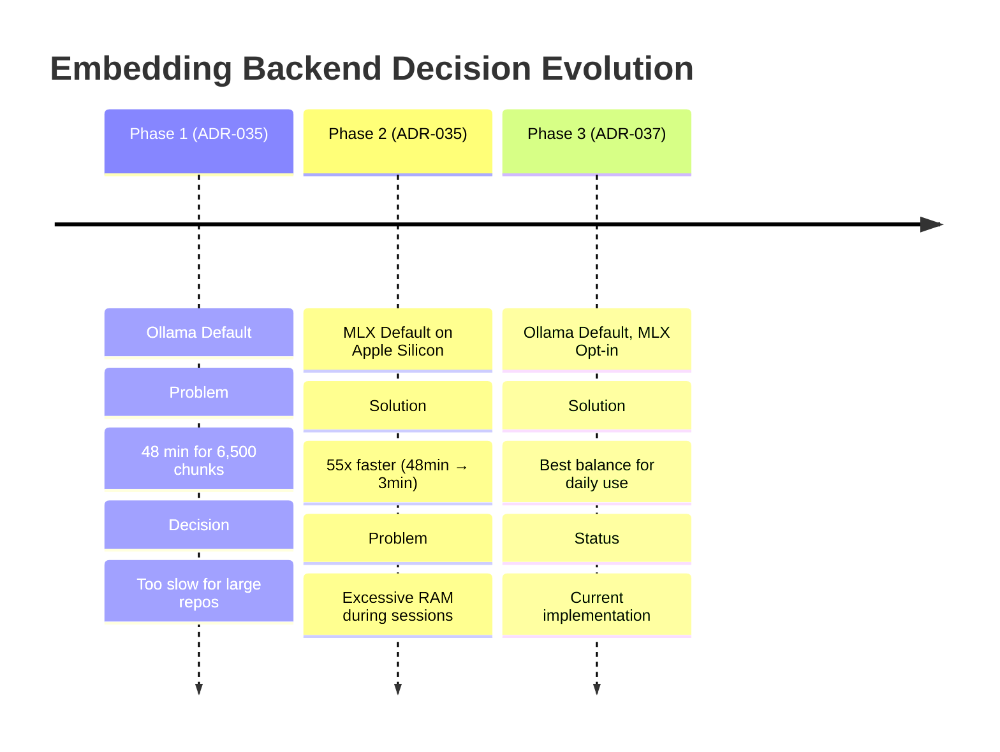
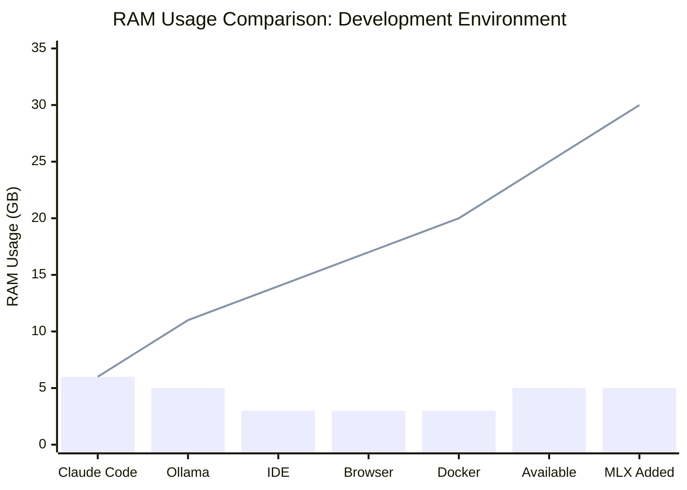

# Embedding Backend Evolution: Why We Reversed Course on MLX

> **Learning Objectives:**
>
> - Understand that speed is not everything - RAM matters for development workflows
> - Learn how to evaluate trade-offs for developer experience
> - See that reversing decisions when new data emerges is healthy engineering
>
> **Prerequisites:**
>
> - [Embedding Optimization](./embedding-optimization.md) - MLX benchmarks and why it was 55x faster
> - [MLX Migration Case Study](./mlx-migration-case-study.md) - Original migration story
>
> **Audience:** Engineers making backend choices, anyone balancing speed vs resources

---

## TL;DR

MLX was 55x faster than Ollama for batch embedding, but it used too much RAM during sustained development sessions. The speed advantage only mattered for initial indexing (done once), while the RAM cost hurt daily development (done constantly). We reversed course: Ollama is now the default, MLX is opt-in for users who need speed.

**Key Lesson:** Optimize for the common case, not the impressive benchmark.

---

## The Decision Chain



This evolution shows healthy engineering: we made a decision based on available data (ADR-035), gathered more data through real-world usage, and reversed when evidence demanded it (ADR-037).

---

## Why MLX Seemed Right (ADR-035)

The initial benchmarks were compelling:

| Backend | Qwen3-8B Status | Batch (32 texts) | Speed vs Ollama |
|---------|-----------------|------------------|-----------------|
| **MLX** | Works perfectly | ~60ms | **55x faster** |
| Ollama | Works | ~3300ms | Baseline |
| TEI | Crashes | N/A | Not viable |

For indexing 6,500 chunks:

- **Ollama:** ~48 minutes
- **MLX:** ~3 minutes

This was a dramatic improvement. The decision to make MLX the default on Apple Silicon was obvious - why would anyone want to wait 16x longer?

### The Decision Logic (ADR-035)

```go
// Auto-detection made MLX the default on Apple Silicon
func newDefaultWithFallback(ctx context.Context, model string) (Embedder, error) {
    if isAppleSilicon() {
        return newMLXWithFallback(ctx, false)  // MLX on Apple Silicon
    }
    return newOllamaWithFallback(ctx, model, false)
}
```

---

## What We Missed: RAM Pressure

The benchmarks measured **indexing speed**, but development sessions involve more than indexing.

### The Reality of a Development Session



**Legend:**

- Bar chart: Individual component RAM usage
- Line chart: Cumulative RAM usage
- Red zone (>24GB): System becomes sluggish

Adding MLX embedding server pushes a 24GB system into the red zone during sustained development sessions.

### The Discovery

During extended development sessions with Claude Code:

1. **MLX server + Ollama = combined RAM pressure**
2. System became sluggish during sustained usage
3. Users with 24GB RAM hit limits during indexing + search
4. The speed advantage didn't justify the RAM cost for most use cases

This was a **fundamental mismatch** between what we optimized for (indexing speed) and what mattered (development session comfort).

---

## Usage Pattern Analysis

The key insight came from analyzing when each operation happens:

| Use Case | Frequency | Duration | MLX Benefit | RAM Cost |
|----------|-----------|----------|-------------|----------|
| Initial indexing | Once per project | Minutes | Significant (16x faster) | Temporary |
| Incremental reindex | Rare (file watcher) | Seconds | Minimal | Temporary |
| Search queries | Very frequent | Milliseconds | None (same latency) | N/A |
| Development sessions | Hours/day | Hours | None | **Continuous** |

### The Frequency Problem

```mermaid
gantt
    title Usage Pattern Analysis: When Speed vs RAM Matters
    dateFormat X
    axisFormat %s

    section Initial Indexing (Once)
    MLX saves 45 min :crit, 0, 1

    section Daily Development (8 hrs)
    Hour 1 RAM cost :active, 1, 2
    Hour 2 RAM cost :active, 2, 3
    Hour 3 RAM cost :active, 3, 4
    Hour 4 RAM cost :active, 4, 5
    Hour 5 RAM cost :active, 5, 6
    Hour 6 RAM cost :active, 6, 7
    Hour 7 RAM cost :active, 7, 8
    Hour 8 RAM cost :active, 8, 9
```



**The math didn't work.** Saving 45 minutes once doesn't justify hours of degraded development experience every day.

### Search Latency is Equal

Both backends have similar single-query latency:

| Operation | MLX | Ollama |
|-----------|-----|--------|
| Single query embed | ~20ms | ~100ms |
| HTTP overhead | ~5ms | ~5ms |
| Total user-perceived | ~25ms | ~105ms |

The difference is imperceptible to users. The 55x speedup only manifests in batch operations (indexing), not interactive search.

---

## The Reversal: ADR-037

On January 14, 2026, we made the decision to reverse:

### New Default Behavior

```go
// After ADR-037: Always default to Ollama
func newDefaultWithFallback(ctx context.Context, model string) (Embedder, error) {
    // Always default to Ollama - MLX is opt-in only
    return newOllamaWithFallback(ctx, model, false)
}
```

### What Changed

| Aspect | Before (ADR-035) | After (ADR-037) |
|--------|------------------|-----------------|
| Apple Silicon default | MLX | Ollama |
| MLX availability | Automatic | Opt-in |
| Cross-platform | Different defaults | Same default |
| RAM impact | High during sessions | Lower baseline |

### Why This Reversal is Healthy

1. **Data-driven:** We gathered real-world usage data before deciding
2. **Reversible:** MLX still available for users who want it
3. **Documented:** ADR-037 explicitly supersedes ADR-035
4. **User-focused:** Optimizes for daily experience, not benchmarks

---

## Lessons for Backend Choices

### 1. Speed Is Not Everything

Fast benchmarks are seductive but incomplete. Consider the full picture:

| Factor | Benchmark | Real-World |
|--------|-----------|------------|
| Speed | Measured | One factor among many |
| RAM | Often ignored | Critical for long sessions |
| Stability | Assumed | Must be validated |
| Simplicity | Ignored | Reduces failure modes |
| Maintenance | Ignored | Time cost is real |

**Lesson:** A slower solution that's stable and resource-efficient often wins over time.

### 2. Benchmark Real Workflows, Not Just Operations

Our initial benchmarks measured:

- Batch embedding throughput (indexing speed)

What we should have also measured:

- Memory usage during sustained operation
- System responsiveness with other applications
- Development session impact

**Lesson:** If your tool runs for hours, benchmark hour-long sessions.

### 3. Reversing Decisions is OK

ADR-037 explicitly supersedes ADR-035. This is **good engineering**:

```
ADR-035: MLX is default on Apple Silicon
         ↓ (real-world usage reveals RAM issues)
ADR-037: Ollama is default, MLX is opt-in
         ↓ (supersedes ADR-035)
```

**Lesson:** Document decisions and their reversals. Future engineers benefit from the full history.

### 4. Opt-In Performance, Not Default

The pattern that emerged:

```
Default: Works for everyone, everywhere
  └── Ollama: Lower RAM, universal

Opt-in: Available for those who need it
  └── MLX: Higher speed for specific use cases
```

**Lesson:** Make the common case simple, the advanced case possible.

---

## Current Recommendation

| Scenario | Backend | Rationale |
|----------|---------|-----------|
| Day-to-day development | Ollama (default) | Lower RAM, sustainable |
| Large initial index (>10k files) | MLX (then switch back) | Speed matters for one-time ops |
| RAM-constrained system (<16GB) | Ollama | Cannot afford MLX overhead |
| Speed-critical batch operations | MLX | When speed is the priority |

### The Recommended Workflow

```bash
# Initial setup (once)
AMANMCP_EMBEDDER=mlx amanmcp index  # Fast initial index

# Daily development (ongoing)
amanmcp search "query"              # Default Ollama
```

---

## Configuration

### YAML Configuration

```yaml
# .amanmcp.yaml - Ollama (default, recommended)
embeddings:
  provider: ollama

# .amanmcp.yaml - MLX (opt-in for speed)
embeddings:
  provider: mlx
  mlx_endpoint: http://localhost:9659
  mlx_model: large  # small (1024d), medium (2560d), large (4096d)
```

### Environment Variables

```bash
# Default (Ollama)
AMANMCP_EMBEDDER=ollama

# Opt-in (MLX) - for speed when needed
AMANMCP_EMBEDDER=mlx
AMANMCP_MLX_ENDPOINT=http://localhost:9659
AMANMCP_MLX_MODEL=large
```

### Switching for One-Time Operations

```bash
# Index with MLX (fast), search with Ollama (low RAM)
AMANMCP_EMBEDDER=mlx amanmcp index --force
AMANMCP_EMBEDDER=ollama amanmcp search "query"
```

---

## Key Takeaways

1. **Optimize for the common case.** Daily development happens more than initial indexing.

2. **Measure what matters.** Benchmarks showing 55x speedup missed the RAM impact that affected daily usage.

3. **Reversing decisions is healthy.** ADR-037 superseding ADR-035 shows good engineering judgment.

4. **Default to reliability, opt-in to performance.** Users who need speed can configure it; everyone else gets stability.

5. **Real-world usage reveals what benchmarks miss.** Extended development sessions exposed the RAM problem that micro-benchmarks hid.

---

## See Also

- [Embedding Optimization](./embedding-optimization.md) - MLX benchmarks and why it's 55x faster
- [MLX Migration Case Study](./mlx-migration-case-study.md) - Original migration story
- [Embedding Model Evolution](./embedding-model-evolution.md) - Full history of embedding choices
