# Embedding Models Research for Code Search

> **TL;DR**: We chose qwen3-0.6b because it runs on 24GB RAM and gives good retrieval quality. Code-specialized models like nomic-embed-code can improve results by 7-8% but may require more resources.

**Date:** 2026-01-14
**Status:** Current
**Context:** Research - finding better embedding models for code search
**Constraint:** Laptop with 24GB RAM, Ollama backend, local-only

## Executive Summary

**Current Model:** qwen3-embedding:0.6b (1024 dimensions, ~640MB)

**Key Finding:** There are **several superior alternatives** available on Ollama that could significantly improve code search quality over qwen3-0.6b. Code-specialized models like **nomic-embed-code** and **jina-embeddings-v2-base-code** achieve 7-8% better retrieval quality.

## What This Means for You

- ✅ **Default setup works great** - qwen3-0.6b provides good retrieval quality for most use cases
- 🚀 **Want better results?** Try `nomic-embed-code` (7-8% improvement on code-specific queries)
- 💻 **Limited RAM?** qwen3-0.6b is optimized for laptops (640MB vs 1.5GB+ for larger models)
- 🔬 **Researcher?** See full model comparison and benchmarks below

---

## The Problem with General Embedding Models for Code

The observation that "quality results only come from code files, not documents" is a known limitation of general-purpose embedding models. Code has fundamentally different semantics than natural language:

- **Syntactic patterns** (function signatures, method receivers)
- **Naming conventions** (camelCase, snake_case)
- **Structural relationships** (imports, inheritance)
- **Language-specific keywords** (func, def, class)

General models like qwen3-embedding-0.6b are trained primarily on natural language, with code as a secondary concern.

---

## Models Available on Ollama (Local-Only)

### Tier 1: Code-Specialized Models

| Model | Params | Size | Dims | Context | MTEB-Code | Ollama Command |
|-------|--------|------|------|---------|-----------|----------------|
| **nomic-embed-code** | 7B | 7.5GB | 1024 | 32K | ~81% | `manutic/nomic-embed-code` |
| **jina-embeddings-v2-base-code** | 161M | ~307MB | 768 | 8K | ~79% | `unclemusclez/jina-embeddings-v2-base-code` |

### Tier 2: Strong General Models

| Model | Params | Size | Dims | Context | Quality | Ollama Command |
|-------|--------|------|------|---------|---------|----------------|
| **qwen3-embedding:0.6b** | 0.6B | 639MB | 1024 | 32K | 75.41% | `qwen3-embedding:0.6b` (current) |
| **qwen3-embedding:4b** | 4B | 2.5GB | 2560 | 40K | ~81% | `qwen3-embedding:4b` |
| **bge-m3** | 567M | 1.2GB | 1024 | 8K | ~63% | `bge-m3` |
| **mxbai-embed-large** | 335M | 670MB | 1024 | 512 | ~65% | `mxbai-embed-large` |
| **embeddinggemma** | 300M | 622MB | 768 | 2K | ~60% | `embeddinggemma` |

### Tier 3: Lightweight/Fast Options

| Model | Params | Size | Dims | Context | Speed | Ollama Command |
|-------|--------|------|------|---------|-------|----------------|
| **nomic-embed-text** | 137M | ~274MB | 768 | 8K | Very Fast | `nomic-embed-text` |
| **snowflake-arctic-embed:335m** | 335M | 669MB | 1024 | 512 | Fast | `snowflake-arctic-embed` |
| **snowflake-arctic-embed:137m** | 137M | 274MB | 768 | 2K | Fast | `snowflake-arctic-embed:137m` |
| **all-minilm** | 22M | 46MB | 384 | 256 | Fastest | `all-minilm` |

---

## Detailed Model Analysis

### 1. nomic-embed-code (BEST FOR CODE)

**Why it's the best option:**

- **Purpose-built for code search** - trained specifically on code retrieval tasks
- Outperforms Voyage Code 3 and OpenAI Embed 3 Large on CodeSearchNet
- Supports Python, Java, Ruby, PHP, JavaScript, Go
- 32K context window (handles large functions/classes)
- Apache 2.0 license, fully open source

**Benchmark Scores (CodeSearchNet):**

| Language | Score |
|----------|-------|
| Python | 81.7% |
| Java | 80.5% |
| Average | ~81% |

**Drawback:** 7B parameters = 7.5GB download, ~8-10GB RAM during inference

**Verdict:** If your 24GB RAM can spare 10GB, this is the clear winner.

---

### 2. jina-embeddings-v2-base-code (BEST LIGHTWEIGHT CODE MODEL)

**Why it's compelling:**

- **Small but code-specialized** (161M params)
- Trained on 150M+ code Q&A and docstring-source pairs
- 8K context window with ALiBi extrapolation
- Leads in 9/15 CodeSearchNet benchmarks for its size class

**Performance:**

- NL2Code: ~86.45% (COIR-CodeSearchNet)
- Doc2Code: ~96.34%
- Size: ~307MB (quantized options available)

**Verdict:** Best quality-to-size ratio for code. If nomic-embed-code is too large, this is the answer.

---

### 3. qwen3-embedding:4b (STRONG GENERAL + CODE)

**Why consider upgrading from 0.6b:**

- 4x parameters = significantly better semantic understanding
- MTEB-Code: ~81% (vs 75.41% for 0.6b)
- 40K context window
- Still fits in 24GB RAM comfortably

**Comparison:**

| Metric | 0.6B | 4B | Improvement |
|--------|------|-----|-------------|
| MTEB-Code | 75.41% | ~81% | +7.4% |
| MTEB-R (retrieval) | 61.82% | ~69% | +11.6% |
| Size | 639MB | 2.5GB | +4x |
| RAM (inference) | ~2GB | ~6GB | +4x |

**Verdict:** If you want to stay in the Qwen family, 4B is a substantial upgrade.

---

### 4. bge-m3 (VERSATILE HYBRID)

**Unique capabilities:**

- Supports dense, sparse, AND multi-vector retrieval
- 100+ languages
- 8K context window
- Multi-granularity (sentences to documents)

**Performance:** ~63% MTEB average, but excels at long-document retrieval

**Verdict:** Good if you need hybrid retrieval, but not specialized for code.

---

### 5. EmbeddingGemma (EFFICIENT OPTION)

**Why it's interesting:**

- Only 300M parameters but punches above its weight
- Designed for on-device/edge deployment
- Matryoshka representation (flexible dimensions 32-768)
- Trained on 320B tokens including code/technical docs

**Limitation:** 2K context window is restrictive for large code files

**Verdict:** Good for resource-constrained scenarios, but context limit hurts code search.

---

## Comparison Matrix

### Model Evolution and Recommendations

```mermaid
%%{init: {'theme':'base', 'themeVariables': {'primaryColor':'#2563eb','primaryTextColor':'#fff','primaryBorderColor':'#1e40af','lineColor':'#475569','secondaryColor':'#059669','tertiaryColor':'#dc2626'}}}%%
timeline
    title Embedding Model Comparison Timeline
    section Lightweight<br/>< 2GB RAM
        all-minilm : 46MB · 56% quality<br/>Fastest · Speed-critical only
        jina-v2-base-code : 307MB · 79% quality<br/>Code-specialized · ✅ Best lightweight
    section Balanced<br/>2-6GB RAM
        qwen3-0.6b : 639MB · 75% quality<br/>Current default · Good balance
        mxbai-embed-large : 670MB · 65% quality<br/>Fast general · Alternative
        bge-m3 : 1.2GB · 63% quality<br/>Multilingual · Specialized use
    section High Quality<br/>6-10GB RAM
        qwen3-4b : 2.5GB · 81% quality<br/>General + code · Upgrade path
        nomic-embed-code : 7.5GB · 81% quality<br/>Code-specialized · ✅ Best for code
```



### Quality vs Resources (Ollama Models)

| Model | Code Quality | RAM Required | Throughput | Best For |
|-------|-------------|--------------|------------|----------|
| nomic-embed-code (7B) | Excellent (81%) | 8-10GB | ~10-15 c/s | Pure code search |
| jina-v2-base-code (161M) | Very Good (79%) | 2-3GB | ~50-80 c/s | Code search, limited RAM |
| qwen3-embedding:4b | Very Good (81%) | 5-6GB | ~20-30 c/s | General + code |
| qwen3-embedding:0.6b | Good (75%) | 2GB | ~17-25 c/s | Current baseline |
| bge-m3 | Good (63%) | 3-4GB | ~30-40 c/s | Multilingual |
| mxbai-embed-large | Moderate (65%) | 2-3GB | ~40-50 c/s | Fast general |
| all-minilm | Basic (56%) | 1GB | ~100+ c/s | Speed-critical |

### Model Quality-to-Resources Tradeoff


### Model Performance Spectrum

```mermaid
%%{init: {'theme':'base', 'themeVariables': {'primaryColor':'#2563eb','primaryTextColor':'#fff','primaryBorderColor':'#1e40af','lineColor':'#64748b','fontSize':'14px'}}}%%
graph LR
    subgraph Lightweight["💡 Lightweight · <2GB RAM"]
        L1["all-minilm<br/>56% quality · 1GB RAM"] --> L2["Fast but basic<br/>Speed-critical only"]
        L3["jina-v2-base-code<br/>79% quality · 307MB"] --> L4["✅ Best lightweight<br/>Code-specialized"]
    end

    subgraph Balanced["⚖️ Balanced · 2-6GB RAM"]
        B1["qwen3-0.6b<br/>75% quality · 639MB"] --> B2["Current default<br/>Good balance"]
        B3["mxbai-embed-large<br/>65% quality · 670MB"] --> B4["Fast general<br/>Not code-specific"]
        B5["bge-m3<br/>63% quality · 1.2GB"] --> B6["Multilingual<br/>Hybrid retrieval"]
    end

    subgraph HighQuality["🚀 High Quality · 6-10GB RAM"]
        H1["qwen3-4b<br/>81% quality · 2.5GB"] --> H2["General + code<br/>Upgrade path"]
        H3["nomic-embed-code<br/>81% quality · 7.5GB"] --> H4["✅ Best for code<br/>Purpose-built"]
    end

    style L3 fill:#059669,stroke:#047857,stroke-width:3px,color:#fff
    style L4 fill:#d1fae5,stroke:#047857,stroke-width:2px,color:#065f46
    style B1 fill:#2563eb,stroke:#1e40af,stroke-width:3px,color:#fff
    style B2 fill:#dbeafe,stroke:#1e40af,stroke-width:2px,color:#1e3a8a
    style H3 fill:#059669,stroke:#047857,stroke-width:3px,color:#fff
    style H4 fill:#d1fae5,stroke:#047857,stroke-width:2px,color:#065f46
```



### Expected Improvement Over Current (qwen3-0.6b)

| Model | Quality Gain | Indexing Speed | Trade-off |
|-------|-------------|----------------|-----------|
| nomic-embed-code | +7-8% | 2-3x slower | RAM usage |
| jina-v2-base-code | +5-6% | 2-3x faster | None significant |
| qwen3-embedding:4b | +7-8% | Similar | 4x RAM |
| bge-m3 | -10% | Similar | Not code-specialized |

---

## Recommendations

### Option A: Maximum Code Quality (Recommended)

**Model:** `manutic/nomic-embed-code` (7B)

```bash
ollama pull manutic/nomic-embed-code
```

- **Quality:** +7-8% over current
- **RAM:** ~10GB (fits in 24GB with headroom)
- **Trade-off:** Slower indexing, but search quality is primary goal

### Option B: Best Quality-to-Size Ratio

**Model:** `unclemusclez/jina-embeddings-v2-base-code`

```bash
ollama pull unclemusclez/jina-embeddings-v2-base-code
```

- **Quality:** +5-6% over current
- **RAM:** ~3GB (very lightweight)
- **Trade-off:** Smaller dimensions (768 vs 1024)

### Option C: Stay in Qwen Family, Upgrade

**Model:** `qwen3-embedding:4b`

```bash
ollama pull qwen3-embedding:4b
```

- **Quality:** +7-8% over current
- **RAM:** ~6GB
- **Trade-off:** 4x larger, no code specialization

---

## Why Code-Specialized Models Matter

From the research, code embedding models are trained differently:

1. **Code-specific pretraining**: GitHub code datasets, not Wikipedia
2. **Contrastive learning**: Code-to-docstring, code-to-query pairs
3. **Language-aware**: Syntax tokens, not just BPE
4. **Structural understanding**: Functions, classes, imports

A general model like qwen3-0.6b sees `func (e *Engine) Search` as tokens, while nomic-embed-code understands it as a Go method receiver pattern.

---

## Implementation Notes

### Dimension Compatibility

If switching models, the vector index must be rebuilt:

- qwen3-0.6b: 1024 dimensions
- jina-v2-base-code: 768 dimensions
- nomic-embed-code: 1024 dimensions (compatible!)

### Configuration Change

```yaml
# .amanmcp.yaml
embedder:
  provider: ollama
  model: manutic/nomic-embed-code  # or your choice
  dimensions: 1024  # match model output
```

### Validation

After switching, re-run Tier 1 validation to measure actual improvement:

```bash
# Reindex with new model
rm -rf .amanmcp/
amanmcp index .

# Run validation queries
amanmcp search "Search function"
amanmcp search "how does RRF fusion work"
```

---

## Sources

- [Modal: 6 Best Code Embedding Models Compared](https://modal.com/blog/6-best-code-embedding-models-compared)
- [Nomic Blog: Introducing Nomic Embed Code](https://www.nomic.ai/blog/posts/introducing-state-of-the-art-nomic-embed-code)
- [Jina AI: Code Embeddings SOTA](https://jina.ai/news/jina-code-embeddings-sota-code-retrieval-at-0-5b-and-1-5b/)
- [Qwen3 Embedding Blog](https://qwenlm.github.io/blog/qwen3-embedding/)
- [HuggingFace: Qwen3-Embedding-0.6B](https://huggingface.co/Qwen/Qwen3-Embedding-0.6B)
- [Ollama Embedding Models](https://ollama.com/search?c=embedding)
- [MTEB Leaderboard](https://huggingface.co/spaces/mteb/leaderboard)
- [Ollama: nomic-embed-code](https://ollama.com/manutic/nomic-embed-code)
- [Ollama: jina-embeddings-v2-base-code](https://ollama.com/unclemusclez/jina-embeddings-v2-base-code)
- [CodeSage V2 (HuggingFace)](https://huggingface.co/codesage/codesage-small-v2)
- [Mistral Codestral Embed](https://mistral.ai/news/codestral-embed)

---

## Conclusion

**qwen3-embedding:0.6b is NOT the best option for code search.** It's a general-purpose model that happens to support code, but it wasn't optimized for it.

For code search specifically, **nomic-embed-code** or **jina-embeddings-v2-base-code** are significantly better choices. Both are available on Ollama, run locally, and are optimized for code retrieval.

**Recommendation:** Start with `jina-embeddings-v2-base-code` for a quick test (lightweight, fast). If quality is still insufficient, upgrade to `nomic-embed-code` (7B).

---

## Next Steps

1. Benchmark current qwen3-0.6b on Tier 1 validation queries (baseline)
2. Pull and test jina-embeddings-v2-base-code on same queries
3. Pull and test nomic-embed-code on same queries
4. Compare results, decide on default model
