# Embedding Backend Optimization: A Benchmarking Case Study

> **Learning Objectives:**
>
> - Understand how to benchmark embedding backends empirically
> - Learn trade-offs between performance (55x faster) and complexity
> - See why "officially supported" does not always mean "actually works"
> - Apply real-world validation methodology to your own projects
>
> **Prerequisites:**
>
> - Basic understanding of embeddings and vector search
> - [Vector Search Concepts](../concepts/vector-search-concepts.md)
>
> **Audience:** ML engineers, RAG developers, anyone optimizing inference performance

---

## TL;DR

Embedding generation consumed 80% of our indexing time, making AmanMCP feel slow for large codebases. We hypothesized that switching from Ollama to TEI (Text Embeddings Inference) would provide a 5x speedup based on published benchmarks. After TEI crashed on every Qwen3 model despite "official" Metal support, we discovered MLX as an alternative and achieved a **55x speedup** (60ms vs 3300ms per batch) while maintaining identical embedding quality.

**Key Lesson:** Validate performance claims on your actual hardware before planning around them.

---

## Optimization Journey Timeline


---

## The Problem: Embedding is 80% of Indexing Time

When profiling AmanMCP's indexing pipeline, we discovered a surprising bottleneck:

| Stage | Time | % Total |
|-------|------|---------|
| File Scanning | ~2s | 2% |
| Chunking | ~5s | 5% |
| **Embedding** | **~100s** | **80%** |
| Indexing (BM25+HNSW) | ~10s | 10% |
| Storage I/O | ~3s | 3% |

For a typical codebase of 6,500 chunks, users waited nearly 2 minutes just for embedding generation. This was unacceptable for a tool promising instant developer productivity.

### Root Cause: Sequential Batch Processing

Examining `internal/embed/ollama.go`, we found:

```go
// Current implementation - sequential batches
for start := 0; start < len(nonEmpty); start += e.config.BatchSize {
    // Each batch waits for completion before next
}
```

Ollama processes one batch at a time via HTTP, waiting for each response before sending the next. With ~200 batches for 6,500 chunks, the HTTP overhead alone was significant.

---

## The Hypothesis: TEI Should Be 5x Faster

Research suggested that TEI (Hugging Face's Text Embeddings Inference) could dramatically improve throughput:

| Source | Evidence |
|--------|----------|
| [GitHub Issue #12088](https://github.com/ollama/ollama/issues/12088) | Same model (Qwen3-Embedding-0.6B), same GPU (RTX 4060): TEI 20ms vs Ollama 99ms = **5x gap** |
| [MongoDB Engineering](https://www.mongodb.com/company/blog/engineering/token-count-based-batching-faster-cheaper-embedding-inference-for-queries) | Token-count batching alone gives **up to 8x improvement** |
| [Snowflake/vLLM Research](https://medium.com/snowflake/scaling-vllm-for-embeddings-16x-throughput-and-cost-reduction-f2b4d4c8e1bf) | Disaggregated tokenization achieved **16x over baseline** |

### Why the Performance Gap Exists

1. **Dynamic Batching**: TEI uses continuous batching that saturates GPU memory bandwidth. Ollama processes batches sequentially.
2. **Architecture**: TEI (Rust/Candle) is embedding-optimized. Ollama (llama.cpp wrapper) is a generalist handling 70B chat models to tiny embedders.
3. **Precision**: TEI runs FP16/BF16 Safetensors optimized for Apple AMX units. Ollama uses GGUF quantization optimized for RAM savings, not throughput.

The plan seemed straightforward: swap Ollama for TEI, keep our Qwen3-8B model, get 5x speedup with zero quality loss.

---

## Validation Journey

This is where the real learning began.

### Attempt 1: TEI + Qwen3 + Metal

**Status: FAILED**

According to [TEI v1.7.2 documentation](https://huggingface.co/docs/text-embeddings-inference/en/supported_models), Qwen3 architecture was officially supported. We built TEI from source with Metal support:

```bash
# Build TEI with Metal support
git clone https://github.com/huggingface/text-embeddings-inference
cd text-embeddings-inference
cargo install --path router -F metal
```

Build time: 3m18s on M4 Pro. Success!

Then we tried to run it:

#### Test Environment

| Component | Value |
|-----------|-------|
| Hardware | MacBook M4 Pro, 24GB Unified Memory |
| TEI Version | v1.8.3 (latest) |
| Build | Native with Metal (`cargo install --path router -F metal`) |

#### Results

| Model | Size | Download Time | Result |
|-------|------|---------------|--------|
| nomic-embed-text-v1.5 | 274MB | ~3 min | **SUCCESS** - Generated embeddings correctly |
| Qwen3-Embedding-0.6B | 1.1GB | ~7 min | **CRASH** - Died during "Warming up model" |
| Qwen3-Embedding-4B | 7.5GB | ~43 min | **CRASH** - Died during "Warming up model" |
| Qwen3-Embedding-8B | 15GB | ~75 min | **CRASH** - Died during "Warming up model" |

The crash pattern was identical across all Qwen3 model sizes:

```text
INFO text_embeddings_backend_candle: Starting Qwen3 model on Metal(MetalDevice(DeviceId(1)))
INFO text_embeddings_router: Warming up model
[Process dies with no error message]
```

**Critical insight:** This was NOT a memory issue. Qwen3-0.6B only requires ~1.5GB VRAM, well within the M4 Pro's 24GB. The Metal/Candle implementation for Qwen3 architecture simply had bugs.

We checked GitHub issues and found [#630](https://github.com/huggingface/text-embeddings-inference/issues/630), [#632](https://github.com/huggingface/text-embeddings-inference/pull/632), and [#663](https://github.com/huggingface/text-embeddings-inference/pull/663) - PRs claiming to add Metal support, but the implementation was incomplete.

**Lesson 1: "Official support" does not equal "actually works"**

Documentation and PRs claiming support are not the same as tested, working code on your specific hardware.

### Attempt 2: MLX-Based Server

**Status: SUCCESS**

Rather than fight TEI's bugs, we looked for alternatives. Apple's MLX framework is specifically designed for Apple Silicon. We found [qwen3-embeddings-mlx](https://github.com/jakedahn/qwen3-embeddings-mlx), a native embedding server.

#### Installation

```bash
git clone https://github.com/jakedahn/qwen3-embeddings-mlx.git ~/mlx-embed
cd ~/mlx-embed
python3 -m venv .venv && source .venv/bin/activate
pip install -r requirements.txt
python server.py  # Downloads model on first run
```

#### Test Results

| Model | Backend | Warm Latency | Cold Latency | Dimensions |
|-------|---------|--------------|--------------|------------|
| Qwen3-0.6B-4bit | MLX | **~30ms** | ~340ms | 1024 |
| Qwen3-4B-4bit | MLX | **~43ms** | ~1569ms | 2560 |
| Qwen3-8B-4bit | MLX | **~60ms** | ~3246ms | 4096 |
| Qwen3-8B (Q4_K_M) | Ollama | ~3300ms | ~7000ms | 4096 |

**Speedup: ~55x faster** for the same 8B model with matching 4096 dimensions.

**Lesson 2: Try multiple approaches**

When the "obvious" solution fails, alternatives often exist. MLX was purpose-built for Apple Silicon, making it a natural fit.

---

## Benchmark Results Summary

### Final Comparison (32-text batch)

| Backend | Model | Latency | Status |
|---------|-------|---------|--------|
| **MLX** | Qwen3-8B-4bit | **~60ms** | **RECOMMENDED** |
| Ollama | Qwen3-8B (Q4_K_M) | ~3300ms | Fallback |
| TEI | Qwen3-8B | CRASH | Not viable |

### Projected Indexing Time (6,500 chunks)

| Backend | Time | Improvement |
|---------|------|-------------|
| Ollama | ~100s | Baseline |
| **MLX** | **~2s** | **50x faster** |

### Performance Comparison: Ollama vs MLX

```mermaid
%%{init: {'theme':'base', 'themeVariables': {'primaryColor':'#2563eb','primaryTextColor':'#fff','primaryBorderColor':'#1e40af','lineColor':'#64748b','fontSize':'14px'}}}%%
graph TB
    subgraph Ollama["⚠️ Ollama · Baseline"]
        O1["Sequential HTTP batches"] --> O2["3300ms per batch"]
        O2 --> O3["6,500 chunks<br/>200 batches"]
        O3 --> O4["Total: ~100 seconds"]
        O4 --> O5["❌ User waits 2 minutes"]
    end

    subgraph MLX["✅ MLX · Optimized"]
        M1["Native Metal acceleration"] --> M2["60ms per batch"]
        M2 --> M3["6,500 chunks<br/>200 batches"]
        M3 --> M4["Total: ~2 seconds"]
        M4 --> M5["✅ Near-instant indexing"]
    end

    subgraph Improvement["📊 55x Speedup"]
        I1["Same model · Qwen3-8B"]
        I2["Same quality · 4096 dims"]
        I3["Same results"]
        I4["50x faster execution"]
    end

    O5 --> Improvement
    M5 --> Improvement

    style O1 fill:#dc2626,stroke:#b91c1c,stroke-width:2px,color:#fff
    style O5 fill:#dc2626,stroke:#b91c1c,stroke-width:3px,color:#fff
    style M1 fill:#059669,stroke:#047857,stroke-width:2px,color:#fff
    style M5 fill:#059669,stroke:#047857,stroke-width:3px,color:#fff
    style I4 fill:#059669,stroke:#047857,stroke-width:3px,color:#fff
```



### Backend Latency Breakdown

```mermaid
%%{init: {'theme':'base', 'themeVariables': {'primaryColor':'#2563eb','primaryTextColor':'#fff','primaryBorderColor':'#1e40af','lineColor':'#64748b','fontSize':'14px'}}}%%
graph LR
    subgraph Models["Model Size Comparison"]
        M1["Qwen3-0.6B<br/>MLX: 30ms<br/>Ollama: ~1000ms"]
        M2["Qwen3-4B<br/>MLX: 43ms<br/>Ollama: ~2000ms"]
        M3["⭐ Qwen3-8B<br/>MLX: 60ms<br/>Ollama: ~3300ms"]
    end

    M1 --> Speedup1["33x faster"]
    M2 --> Speedup2["46x faster"]
    M3 --> Speedup3["🚀 55x faster"]

    Speedup1 --> Conclusion["Pattern: Larger models<br/>benefit more from MLX"]
    Speedup2 --> Conclusion
    Speedup3 --> Conclusion

    style M3 fill:#059669,stroke:#047857,stroke-width:3px,color:#fff
    style Speedup3 fill:#059669,stroke:#047857,stroke-width:3px,color:#fff
    style Conclusion fill:#2563eb,stroke:#1e40af,stroke-width:3px,color:#fff
```



### Quality Verification

| Metric | Ollama | MLX | Difference |
|--------|--------|-----|------------|
| MRR@10 | Baseline | Same | None |
| Model | Qwen3-8B | Qwen3-8B | Same model |
| Dimensions | 4096 | 4096 | Same |

The 4-bit quantization in MLX produces identical search quality because it uses the same underlying Qwen3-8B architecture.

---

## Key Lessons for ML Benchmarking

### 1. "Official Support" Does Not Mean "Actually Works"

TEI's documentation listed Qwen3 as supported. PRs claimed Metal compatibility. But on our actual hardware, every Qwen3 model crashed during warm-up.

**Takeaway:** Trust, but verify. Run your own benchmarks on your target hardware before committing to a solution.

### 2. Benchmark on Target Hardware

Published benchmarks showing "5x speedup" came from Linux servers with NVIDIA GPUs. Our target was Apple Silicon with Metal. The performance characteristics differed dramatically.

**Takeaway:** Performance is hardware-specific. Cloud benchmarks do not predict laptop performance.

### 3. Document Failures Too

This appendix preserving the TEI failure is valuable:

- Saves others from wasting time on the same path
- Provides a baseline if TEI fixes Qwen3 support later
- Demonstrates the validation methodology

**Takeaway:** Negative results are still results. Document what did not work and why.

### 4. Have a Fallback Strategy

We never removed Ollama support. When MLX is unavailable (non-Apple systems, server not running), Ollama works fine. The 55x speedup is a bonus, not a requirement.

**Takeaway:** Optimize the happy path, but keep the reliable path working.

---

## Model Selection Analysis

### Why Qwen3-Embedding-8B is Correct

For code + documentation + multilingual content, Qwen3-8B significantly outperforms alternatives:

| Benchmark | Qwen3-Embedding-8B | nomic-embed-text | Gap |
|-----------|-------------------|------------------|-----|
| MTEB Multilingual | **70.58** (#1) | 62.10 | **8.5 points** |
| MTEB Code | **80.68** (#1) | ~77.2 | **3.5 points** |
| MTEB English | **75.22** | ~68 | **7+ points** |
| Context Length | **32K tokens** | 8K tokens | **4x** |

The model choice was never the problem. The inference backend was the bottleneck.

### Model Size Options

MLX supports multiple quantization levels:

| Model | Download Size | Memory Usage | Use Case |
|-------|---------------|--------------|----------|
| Qwen3-Embedding-0.6B-4bit | ~400MB | ~900MB | Testing, low-memory |
| Qwen3-Embedding-4B-4bit | ~2.5GB | ~2.5GB | Balanced |
| Qwen3-Embedding-8B-4bit | ~4.5GB | ~4.5GB | Maximum quality |

For production code search, the 8B model's quality advantage justifies the ~5GB memory footprint.

---

## Production Deployment

### Quick Start (Apple Silicon)

Get MLX embeddings running in 3 steps:

#### Prerequisites

- macOS with Apple Silicon (M1/M2/M3/M4)
- Python 3.9+
- ~5GB free disk space (for 8B model)

#### Step 1: Install MLX Server

```bash
git clone https://github.com/jakedahn/qwen3-embeddings-mlx.git ~/mlx-embed
cd ~/mlx-embed
python3 -m venv .venv && source .venv/bin/activate
pip install -r requirements.txt
```

#### Step 2: Start Server

```bash
cd ~/mlx-embed && source .venv/bin/activate
python server.py
# First run downloads model (~4.5GB for 8B)
```

#### Step 3: Verify

```bash
curl http://localhost:8000/health
```

Expected output:

```json
{"status":"healthy","model_status":"ready","loaded_model":"large",...}
```

### Test Embedding

```bash
curl -X POST http://localhost:8000/embed \
  -H "Content-Type: application/json" \
  -d '{"text": "Hello world", "model": "large"}'
```

### macOS LaunchAgent (Auto-start on Login)

Create `~/Library/LaunchAgents/com.amanmcp.mlx-embed.plist`:

```xml
<?xml version="1.0" encoding="UTF-8"?>
<!DOCTYPE plist PUBLIC "-//Apple//DTD PLIST 1.0//EN" "http://www.apple.com/DTDs/PropertyList-1.0.dtd">
<plist version="1.0">
<dict>
    <key>Label</key>
    <string>com.amanmcp.mlx-embed</string>
    <key>ProgramArguments</key>
    <array>
        <string>/Users/USERNAME/mlx-embed/.venv/bin/python</string>
        <string>/Users/USERNAME/mlx-embed/server.py</string>
    </array>
    <key>WorkingDirectory</key>
    <string>/Users/USERNAME/mlx-embed</string>
    <key>RunAtLoad</key>
    <true/>
    <key>KeepAlive</key>
    <true/>
    <key>StandardOutPath</key>
    <string>/tmp/mlx-embed.log</string>
    <key>StandardErrorPath</key>
    <string>/tmp/mlx-embed.err</string>
    <key>EnvironmentVariables</key>
    <dict>
        <key>MODEL_NAME</key>
        <string>mlx-community/Qwen3-Embedding-8B-4bit-DWQ</string>
    </dict>
</dict>
</plist>
```

**Note:** Replace `USERNAME` with your actual macOS username.

### Enable Auto-start

```bash
launchctl load ~/Library/LaunchAgents/com.amanmcp.mlx-embed.plist
```

### Management Commands

```bash
# Check if running
launchctl list | grep mlx-embed

# View logs
tail -f /tmp/mlx-embed.log

# View errors
tail -f /tmp/mlx-embed.err

# Stop server
launchctl unload ~/Library/LaunchAgents/com.amanmcp.mlx-embed.plist

# Restart server
launchctl unload ~/Library/LaunchAgents/com.amanmcp.mlx-embed.plist
launchctl load ~/Library/LaunchAgents/com.amanmcp.mlx-embed.plist
```

---

## Backend Configuration

### Recommended: MLX (Apple Silicon)

- **55x faster** than Ollama for same model
- Native Apple Silicon optimization via Metal
- **Use for:** Mac M1/M2/M3/M4

```bash
# Environment variables (future AmanMCP integration)
export AMANMCP_EMBEDDER=mlx
export AMANMCP_MLX_ENDPOINT=http://localhost:8000
```

### Fallback: Ollama (Universal)

- Works on **any platform** (Linux, Windows, macOS Intel)
- Required: Ollama running with `qwen3-embedding:8b`

```bash
# Pull model if not already installed
ollama pull qwen3-embedding:8b

# Environment variables
export AMANMCP_EMBEDDER=ollama
export AMANMCP_OLLAMA_HOST=http://localhost:11434
export AMANMCP_OLLAMA_MODEL=qwen3-embedding:8b
```

### Backend Selection Logic

When implementing auto-detection:

1. Detect Apple Silicon at startup (`uname -m` = `arm64`)
2. Check if MLX endpoint is reachable
3. If both true - use MLX
4. Otherwise - fallback to Ollama

---

## Troubleshooting Guide

### MLX Server Will Not Start

```bash
# Check Python version (need 3.9+)
python3 --version

# Verify Apple Silicon
uname -m  # Should show 'arm64'

# Check port 8000 is free
lsof -i :8000
# If something is using it, kill it or use different port
```

### Model Download Fails

```bash
# Check disk space (need ~5GB for 8B model)
df -h ~

# Check internet connection
curl -I https://huggingface.co

# Clear cache and retry
rm -rf ~/.cache/huggingface/hub/models--mlx-community--*
cd ~/mlx-embed && python server.py
```

### Embeddings Are Slow (Not 55x Faster)

1. **First request is slow** - Model loading takes ~3s, subsequent requests are fast
2. **Check you are using MLX, not Ollama** - Verify endpoint is `localhost:8000`
3. **Model size matters:**
   - `small` (0.6B) = ~30ms per batch
   - `medium` (4B) = ~43ms per batch
   - `large` (8B) = ~60ms per batch

### Server Crashes

```bash
# Check available memory (8B model needs ~5GB RAM)
vm_stat | head -5

# Try smaller model
MODEL_NAME=mlx-community/Qwen3-Embedding-4B-4bit-DWQ python server.py
```

### Ollama Fallback Not Working

```bash
# Check Ollama is running
ollama list

# Pull model if missing
ollama pull qwen3-embedding:8b

# Test endpoint
curl http://localhost:11434/api/tags
```

### LaunchAgent Not Starting

```bash
# Check plist syntax
plutil ~/Library/LaunchAgents/com.amanmcp.mlx-embed.plist

# Check for load errors
launchctl list | grep mlx-embed
# If not listed, check system log:
log show --predicate 'subsystem == "com.apple.xpc.launchd"' --last 5m | grep mlx
```

---

## Appendix: TEI Experimental Details (Historical Reference)

> **Note:** This section is preserved for reference. TEI may fix Qwen3 + Metal support in future versions.

### What We Tried

1. Built TEI v1.8.3 from source with `-F metal`
2. Downloaded nomic-embed-text-v1.5 (274MB) - **worked**
3. Downloaded Qwen3-Embedding-0.6B (1.1GB) - **crashed**
4. Downloaded Qwen3-Embedding-4B (7.5GB) - **crashed**
5. Downloaded Qwen3-Embedding-8B (15GB) - **crashed**

### The Failure Pattern

All Qwen3 models crashed identically at the "Warming up model" phase, after:

- Model download complete
- Configuration parsing successful
- Tokenizer initialization successful
- Metal device detected

### GitHub Issue Trail

| Issue | Status | Notes |
|-------|--------|-------|
| [#630](https://github.com/huggingface/text-embeddings-inference/issues/630) | Closed | Qwen3 initially CUDA-only |
| [#632](https://github.com/huggingface/text-embeddings-inference/pull/632) | Merged | Added CPU/Metal "support" |
| [#663](https://github.com/huggingface/text-embeddings-inference/pull/663) | Merged | Additional Qwen3 fixes |

Despite merged PRs, the Metal implementation remained broken for Qwen3.

### Why This Matters

This failure taught us that:

- GitHub PRs do not equal working features
- "Supported" architectures may only work on specific backends
- Real hardware testing is irreplaceable

---

## Summary

| Claim | Reality |
|-------|---------|
| "TEI officially supports Qwen3" | Support is incomplete - crashes on Metal |
| "5x speedup with TEI" | Cannot verify - crashes before benchmarking |
| "MLX provides Apple Silicon optimization" | **TRUE** - 55x speedup confirmed |
| "Ollama is slow but works" | TRUE - but MLX is now the better option |

### Recommendations

1. **Use MLX** for Qwen3 embeddings on Apple Silicon - 55x faster than Ollama
2. **Keep Ollama as fallback** - For systems without Apple Silicon
3. **Monitor TEI GitHub** for Qwen3 + Metal fixes (optional future alternative)
4. **Do not downgrade to smaller models** - MLX solves the speed problem without quality loss

---

## See Also

- [Embedding Models](./embedding-models.md) - Model selection research
- [Vector Search Concepts](../concepts/vector-search-concepts.md) - How embeddings work
- [Specialization vs Generalization](./specialization-vs-generalization.md) - Model trade-offs

---

## Sources

### Performance Benchmarks

- [Ollama vs TEI Performance Gap - GitHub #12088](https://github.com/ollama/ollama/issues/12088)
- [MongoDB: Token-Count Batching](https://www.mongodb.com/company/blog/engineering/token-count-based-batching-faster-cheaper-embedding-inference-for-queries)
- [Snowflake: vLLM Embeddings - 16x throughput](https://medium.com/snowflake/scaling-vllm-for-embeddings-16x-throughput-and-cost-reduction-f2b4d4c8e1bf)

### Model Documentation

- [HuggingFace: Qwen3-Embedding-8B](https://huggingface.co/Qwen/Qwen3-Embedding-8B)
- [Qwen Blog: Qwen3-Embedding](https://qwenlm.github.io/blog/qwen3-embedding/)
- [qwen3-embeddings-mlx GitHub](https://github.com/jakedahn/qwen3-embeddings-mlx)

### TEI Documentation

- [TEI GitHub](https://github.com/huggingface/text-embeddings-inference)
- [TEI Metal Build](https://huggingface.co/docs/text-embeddings-inference/local_metal)
- [TEI Supported Models](https://huggingface.co/docs/text-embeddings-inference/en/supported_models)
