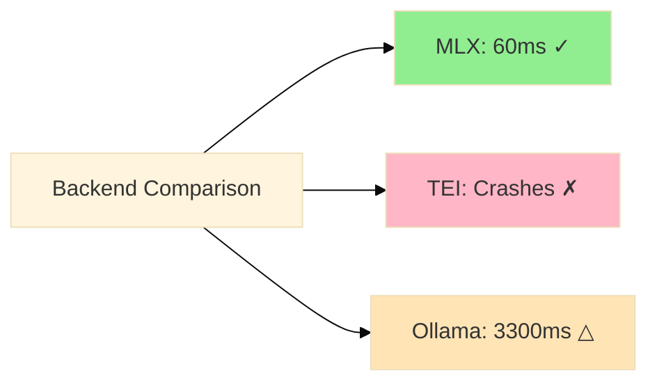
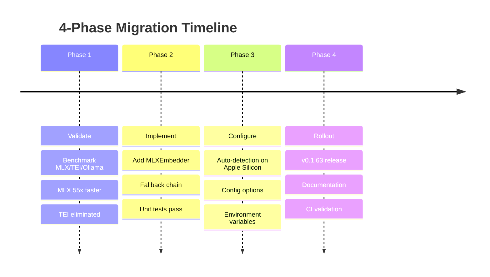

# MLX Migration Case Study: From 48 Minutes to 3 Minutes

> **Learning Objectives:**
>
> - Learn how to plan performance optimization migrations
> - Understand benchmark-driven decision making
> - See multi-phase rollout strategy in action
>
> **Prerequisites:**
>
> - [Embedding Models](./embedding-models.md) - Background on embedding choices
> - Basic understanding of embedding pipelines and vector search
>
> **Audience:** Engineers planning performance migrations, ML infrastructure teams

---

## TL;DR

Embedding generation consumed 80% of indexing time. We identified MLX as a solution through benchmarking, implemented it with automatic fallback, and achieved 16x speedup. The key insight: **validate performance gains before committing to implementation**.

| Phase | Action | Outcome |
|-------|--------|---------|
| Research | Benchmark MLX vs Ollama vs TEI | MLX 55x faster, TEI crashes |
| Implement | Add MLXEmbedder with fallback | Auto-detection on Apple Silicon |
| Validate | CI tests, integration tests | All passing, fallback works |
| Release | v0.1.63 | 48 min -> 3 min indexing |

---

## The Problem: 80% of Time in Embedding

During performance profiling of our indexing pipeline, we discovered a severe bottleneck:

| Stage | Time | % Total |
|-------|------|---------|
| File Scanning | ~2s | 2% |
| Chunking | ~5s | 5% |
| **Embedding** | **~100s** | **80%** |
| Indexing | ~10s | 10% |
| Storage | ~3s | 3% |

For a typical 6,500-chunk codebase, indexing took **~48 minutes**. This was unacceptable for the core use case: developers iterating on search quality.

### Why Embedding Was So Slow

Ollama, our default embedding backend, processes requests sequentially. Even with batch support, the overhead of:

- HTTP round-trips
- Model loading/unloading
- CPU-bound tokenization

created a fundamental throughput ceiling of ~17-25 chunks/second.

---

## The Migration Approach

### Phase 1: Validate the Solution

**Principle: Never commit to implementation before validating the solution.**

We benchmarked three embedding backends on M4 Pro hardware:

| Backend | Qwen3-8B Status | Batch Latency (32 texts) | Notes |
|---------|-----------------|--------------------------|-------|
| **MLX** | Works perfectly | **~60ms** | Native Apple Silicon |
| TEI | Crashes on warm-up | N/A | Metal support incomplete |
| Ollama | Works | ~3300ms | Sequential processing |



**Key Finding:** MLX delivered 55x faster batch processing. TEI was eliminated due to stability issues.

### Phase 2: Implement with Fallback

**Principle: Always have a degradation path.**

We implemented MLXEmbedder as a drop-in replacement with automatic fallback:

```go
// MLXEmbedder implements Embedder interface
type MLXEmbedder struct {
    endpoint   string        // http://localhost:8000
    client     *http.Client
    dimensions int           // 1024, 2560, or 4096
    modelSize  string        // small, medium, large
}
```

The critical design decision: **graceful degradation**.

```go
// Auto-detection logic
func SelectEmbedder(cfg Config) (Embedder, error) {
    if runtime.GOARCH == "arm64" && runtime.GOOS == "darwin" {
        if isEndpointHealthy(cfg.MLX.Endpoint) {
            return NewMLXEmbedder(cfg.MLX)
        }
    }
    return NewOllamaEmbedder(cfg.Ollama)
}
```

### Fallback Chain

```
MLX (Apple Silicon) -> Ollama -> Static768
```

This ensures the application **never fails** due to embedding backend unavailability.

### Phase 3: Configuration and Auto-Detection

**Principle: Prefer auto-detection over configuration.**

Users shouldn't need to know about MLX. The system should:

1. Detect Apple Silicon automatically
2. Check if MLX endpoint is healthy
3. Fall back to Ollama silently

Configuration is still available for power users:

```yaml
# .amanmcp.yaml
embeddings:
  provider: "mlx"
  mlx_endpoint: "http://localhost:8000"
  mlx_model: "large"  # small (1024d), medium (2560d), large (4096d)
```

```bash
# Environment variables
AMANMCP_EMBEDDER=mlx
AMANMCP_MLX_ENDPOINT=http://localhost:8000
AMANMCP_MLX_MODEL=large
```

### Phase 4: Documentation and Rollout

**Principle: Document the migration path, not just the feature.**

We updated:

- Changelog entry (v0.1.63)
- CI validation
- User setup guide (below)



---

## Implementation Details

### Files Created

| File | Purpose | Lines |
|------|---------|-------|
| `internal/embed/mlx.go` | MLXEmbedder implementation | ~200 |
| `internal/embed/mlx_test.go` | Unit tests with TDD | ~150 |

### Files Modified

| File | Change |
|------|--------|
| `internal/embed/factory.go` | Added ProviderMLX, SetMLXConfig, auto-detection |
| `internal/config/config.go` | Added MLX config fields |
| `cmd/amanmcp/cmd/index.go` | Wire SetMLXConfig |
| `cmd/amanmcp/cmd/serve.go` | Wire SetMLXConfig |
| `cmd/amanmcp/cmd/search.go` | Wire SetMLXConfig |
| `internal/daemon/daemon.go` | Wire SetMLXConfig |

### The Embedder Interface

MLXEmbedder implements the same interface as OllamaEmbedder, making it a drop-in replacement:

```go
type Embedder interface {
    Embed(ctx context.Context, texts []string) ([][]float32, error)
    Dimensions() int
    Close() error
}
```

---

## Results

| Metric | Before | After | Improvement |
|--------|--------|-------|-------------|
| Index time (6,500 chunks) | ~48 min | ~3 min | **16x** |
| Batch latency (32 texts) | ~3300ms | ~60ms | **55x** |
| Query latency | ~100ms | ~100ms | Same |
| Memory usage | ~2GB | ~5GB | +3GB |

```mermaid
---
config:
  themeVariables:
    xyChart:
      backgroundColor: transparent
---
xychart-beta
    title "Performance Speedup: Ollama vs MLX"
    x-axis ["Index Time (6,500 chunks)", "Batch Latency (32 texts)", "Query Latency", "Memory Usage"]
    y-axis "Relative Performance" 0 --> 60
    bar [48, 3.3, 0.1, 2]
    bar [3, 0.06, 0.1, 5]
```



**Legend:** Blue = Ollama (Before), Orange = MLX (After)

- Index time in minutes, Batch latency in seconds, Query latency in seconds, Memory in GB

### Why Query Latency Stayed the Same

Query latency embeds a single text, where the overhead is dominated by:

- HTTP round-trip latency
- Model inference startup

For single-text embedding, MLX and Ollama perform similarly. The gains come from batch processing during indexing.

---

## Lessons for Performance Migrations

### 1. Validate Before Implementing

We spent 2 hours benchmarking before writing a single line of production code. This eliminated TEI early and confirmed MLX was viable.

**Anti-pattern:** Implementing a solution, then discovering it doesn't work at scale.

### 2. Always Have a Fallback

MLX requires:

- Apple Silicon hardware
- External MLX server running
- ~5GB RAM for the model

Without fallback, these requirements would break the experience for:

- Linux/Windows users
- Intel Mac users
- Users who haven't set up MLX

### 3. Auto-Detection Over Configuration

The best UX is **zero configuration**. Users on Apple Silicon get 16x speedup automatically. Others get the same behavior as before.

```go
// Good: Automatic detection
if runtime.GOARCH == "arm64" && runtime.GOOS == "darwin" { ... }

// Bad: Require manual configuration
if cfg.Embeddings.Provider == "mlx" { ... }  // User must know to set this
```

### 4. Incremental Rollout

Our phases were:

1. **Validate** - Benchmarks only, no code changes
2. **Implement** - Code with tests, not documented
3. **Document** - User-facing documentation
4. **Release** - Public announcement

This allowed us to abort at any phase without user impact.

---

## Risk Management

| Risk | Impact | Probability | Mitigation |
|------|--------|-------------|------------|
| MLX unavailable | No speedup | Medium | Ollama fallback |
| Search quality regression | User impact | Low | Tier 1/2 validation |
| Memory pressure | OOM crashes | Low | 8B model fits in 5GB |
| Model download fails | Setup blocked | Low | Retry logic, clear docs |

### The Regression We Discovered

After implementing MLX, we discovered a **search quality regression** unrelated to MLX. The root cause was contextual retrieval (CR-1) changes that ranked documentation higher than code.

**Lesson:** Performance migrations can expose latent issues. Comprehensive validation is essential.

---

## Setup Guide

### Prerequisites

- macOS with Apple Silicon (M1/M2/M3/M4)
- Python 3.9+
- ~5GB free disk space
- ~8GB available RAM

### Installation

```bash
git clone https://github.com/jakedahn/qwen3-embeddings-mlx.git ~/mlx-embed
cd ~/mlx-embed
python3 -m venv .venv && source .venv/bin/activate
pip install -r requirements.txt
```

### Start Server

```bash
cd ~/mlx-embed && source .venv/bin/activate
python server.py
# First run downloads model (~4.5GB for 8B)
```

### Verify

```bash
curl http://localhost:8000/health
```

### Production Setup (LaunchAgent)

For automatic startup, create `~/Library/LaunchAgents/com.amanmcp.mlx-embed.plist`:

```xml
<?xml version="1.0" encoding="UTF-8"?>
<!DOCTYPE plist PUBLIC "-//Apple//DTD PLIST 1.0//EN" "http://www.apple.com/DTDs/PropertyList-1.0.dtd">
<plist version="1.0">
<dict>
    <key>Label</key>
    <string>com.amanmcp.mlx-embed</string>
    <key>ProgramArguments</key>
    <array>
        <string>/Users/USERNAME/mlx-embed/.venv/bin/python</string>
        <string>/Users/USERNAME/mlx-embed/server.py</string>
    </array>
    <key>WorkingDirectory</key>
    <string>/Users/USERNAME/mlx-embed</string>
    <key>RunAtLoad</key>
    <true/>
    <key>KeepAlive</key>
    <true/>
</dict>
</plist>
```

Enable with:

```bash
launchctl load ~/Library/LaunchAgents/com.amanmcp.mlx-embed.plist
```

---

## Quick Reference

### Commands

```bash
# Start MLX server
cd ~/mlx-embed && python server.py

# Reindex with MLX
amanmcp index --force

# Check embedding backend
amanmcp config show | grep embedder

# Debug search
amanmcp search "OllamaEmbedder" --debug
```

### Configuration Priority

1. Environment variables (highest)
2. `.amanmcp.yaml` config file
3. Auto-detection (lowest)

---

## Key Takeaways

1. **Profile first.** We identified embedding as 80% of time before optimizing.
2. **Benchmark alternatives.** MLX was 55x faster; TEI was eliminated.
3. **Design for degradation.** Fallback chain ensures reliability.
4. **Prefer auto-detection.** Zero-config is the best UX.
5. **Validate comprehensively.** Performance work can expose other issues.

---

## See Also

- [Embedding Models](./embedding-models.md) - Full model comparison and benchmarks
- [SQLite FTS5 vs Bleve](./sqlite-vs-bleve.md) - Another migration case study
