# Query Expansion in Hybrid Search: Why Asymmetry Matters

> **Learning Objectives:**
>
> - Understand why query expansion helps BM25 but hurts vector search
> - Learn the fundamental difference between term matching and embeddings
> - Apply asymmetric query handling to hybrid search systems
>
> **Prerequisites:**
>
> - [Hybrid Search Concepts](../concepts/hybrid-search.md)
> - Basic understanding of BM25 and vector search
>
> **Audience:** Search engineers, RAG developers, anyone building hybrid search

---

## TL;DR

Query expansion improves BM25 search but **degrades** vector search. The solution is asymmetric query handling: expand queries for BM25, use original queries for vectors. This counter-intuitive finding increased our validation pass rate from 75% to 80%.

---

## Asymmetric Query Expansion Architecture

How we handle queries differently for each backend:


---

## The Surprising Result

We tested three configurations and found a counter-intuitive pattern:

| Configuration | Pass Rate | Change |
|---------------|-----------|--------|
| No expansion | 75% | baseline |
| BM25 + Vector expansion | 50% | -25% |
| BM25-only expansion | 80% | +5% |

**The finding:** Expanding queries for both search backends caused a 25% regression. Expanding only for BM25 improved results.

This is surprising because intuitively, giving both backends more information should help both. It does not.

---

## The Problem: Vocabulary Mismatch

Consider a user searching for "Search function" in a Go codebase. The code uses:

- `Search` (capitalized method name)
- `Engine` (the containing struct)
- `query` (the parameter name)
- `func` (Go keyword, not "function")

BM25 requires exact or near-exact matches. None of these terms match "Search function" directly:

- "search" does NOT match "Search" (case matters in tokens)
- "function" does NOT match "func" (different words)

### BM25 Vocabulary Sensitivity

BM25 is a term-frequency based algorithm. It scores documents based on:

1. **Term frequency (TF):** How often the search term appears
2. **Inverse document frequency (IDF):** How rare the term is across all documents
3. **Document length normalization:** Adjusts for document size

The critical limitation: BM25 only scores documents containing the *exact query terms*. If your query says "function" but the code says "func", BM25 scores that document at zero for that term.

```
Query: "search function"

Document A: "func Search(ctx context.Context..."
  - "search" → no match (case-sensitive "Search")
  - "function" → no match (code says "func")
  - Score: LOW

Document B: "// search function for the API..."
  - "search" → match!
  - "function" → match!
  - Score: HIGH (but this is a comment, not implementation!)
```

---

## Why Query Expansion Helps BM25

Query expansion bridges the vocabulary gap by adding synonyms and variants:

```
Original:  "search function"
Expanded:  "search Search find query lookup function func fn method"
```

Now BM25 can match:

```
Document A: "func Search(ctx context.Context..."
  - "Search" → match!
  - "func" → match!
  - Score: HIGH (correct!)
```

### Our Synonym Mappings

We added targeted expansions for common vocabulary gaps:

```go
// internal/search/synonyms.go
"search":    {"Search", "search", "find", "query", "lookup", "Engine"},
"index":     {"Index", "index", "indexer", "Indexer", "Coordinator"},
"embedder":  {"Embedder", "embedder", "embed", "embedding", "Ollama", "vector"},
"function":  {"function", "func", "fn", "method", "Function"},
```

Each mapping targets a specific mismatch:

| User Says | Code Uses | Expansion Bridges |
|-----------|-----------|-------------------|
| "search" | `Search` | Case variant |
| "function" | `func` | Go keyword |
| "embedder" | `Embedder` | Case + related terms |

---

## Why Vector Search Does NOT Need Expansion

### Embeddings Already Capture Semantic Similarity

Vector embeddings represent meaning as dense vectors (e.g., 768 dimensions). Similar meanings produce similar vectors:

```
"authentication" → [0.12, -0.34, 0.56, ...]
"login"          → [0.11, -0.32, 0.58, ...]  (similar vector)
"weather"        → [0.89, 0.12, -0.45, ...]  (different vector)
```

When you search for "search function", the embedding model already understands:

- "search" is semantically similar to "find", "query", "lookup"
- "function" is semantically similar to "method", "procedure"

**The embedding does this mapping internally.** You do not need to add synonyms---the model has learned these relationships from training on billions of documents.

### The Query Dilution Effect

Here is why expansion *hurts* vector search. Consider:

```
Original query:    "Search function"
Expanded query:    "Search function func fn search query lookup Engine"
```

The embedding for the expanded query is a **blend** of all these concepts:

```
Original embedding:   Focused on "Search function"
Expanded embedding:   Blend of search + func + fn + query + lookup + Engine
```

The expanded embedding is less precise. It matches more documents, but the top results are worse because the embedding no longer precisely captures the user's intent.

### Visualizing the Dilution

Think of embedding space as a map where proximity indicates semantic similarity:


**Key insight:** The original query (🎯) lands precisely where "Search function" concepts cluster. The expanded query (🌐) lands in the middle of multiple concepts—less precise, worse results.

---

## Our Solution: Asymmetric Query Handling

The insight is simple: **different backends need different query preprocessing.**

### BM25 Gets Expanded Query

```go
// BM25 benefits from synonyms
bm25Query := query
if e.expander != nil {
    bm25Query = e.expander.Expand(query)
}

// Search with expanded terms
bm25Results := e.bm25.Search(bm25Query)
```

### Vector Search Uses Original Query

```go
// Vector search uses ORIGINAL query - embeddings handle semantics
embedding, err := e.embedder.Embed(ctx, query)  // Not bm25Query!

// Search with precise embedding
vectorResults := e.vector.Search(embedding)
```

### The Full Pattern

```go
func (e *Engine) parallelSearch(ctx context.Context, query string) {
    // BM25: expand for term matching
    bm25Query := query
    if e.expander != nil {
        bm25Query = e.expander.Expand(query)
    }

    // Launch parallel searches
    go func() {
        bm25Results <- e.bm25.Search(bm25Query)      // Expanded
    }()

    go func() {
        embedding, _ := e.embedder.Embed(ctx, query) // Original!
        vectorResults <- e.vector.Search(embedding)
    }()

    // Fuse results with RRF
    return e.fusion.Combine(bm25Results, vectorResults)
}
```

---

## Lessons for Search Systems

### 1. Different Backends Need Different Preprocessing

**Pattern:** Do not treat all search backends the same.

BM25 and vector search have fundamentally different properties:

| Property | BM25 | Vector |
|----------|------|--------|
| Matching | Exact terms | Semantic similarity |
| Vocabulary | Sensitive | Tolerant |
| Synonyms | Needs expansion | Built-in |
| Query length | More terms can help | Precision matters |

**Application:** Consider asymmetric query handling for any hybrid search system.

### 2. Test Expansion Separately Per Backend

**Pattern:** Measure impact on each backend independently.

We initially tested expansion on the combined system. Overall metrics hid the per-backend story:

```
Test 1: Overall metrics
  Before expansion: 75% pass rate
  After expansion:  50% pass rate
  Conclusion: Expansion is bad?

Test 2: Per-backend metrics
  BM25 alone:   45% → 60% (+15%)  ✅ Expansion helps
  Vector alone: 70% → 55% (-15%)  ❌ Expansion hurts
  Combined:     75% → 50% (-25%)  ❌ Vector regression dominates
```

**Gotcha:** Combined metrics can hide per-backend regressions. A helpful change to one backend can be masked---or reversed---by a harmful change to another.

### 3. Embeddings Already Handle Semantics

**Pattern:** Trust the embedding model for semantic understanding.

Modern embedding models (like `nomic-embed-text`, `text-embedding-ada-002`, `qwen3`) are trained on massive corpora. They have already learned:

- Synonym relationships
- Conceptual similarity
- Domain-specific terminology

**Anti-pattern:** Over-engineering query preprocessing for vector search. Adding synonyms, stemming, or expansion to vector queries often degrades results.

### 4. Measure, Do Not Assume

We assumed expansion would help both backends. It did not. The only way to know is to measure.

**Build a validation suite** that tests your specific queries against your specific corpus. Generic intuitions about search do not always apply.

---

## When to Expand Queries (Decision Tree)

```mermaid
%%{init: {'theme':'base', 'themeVariables': { 'primaryColor':'#667eea','primaryTextColor':'#fff','primaryBorderColor':'#5568d3','lineColor':'#4a5568','secondaryColor':'#48bb78','tertiaryColor':'#f56565','fontFamily':'system-ui, -apple-system, sans-serif'}}}%%
flowchart TD
    Start["<b>Query Expansion Decision</b>"] --> Backend{<b>Which Search<br/>Backend?</b>}

    Backend -->|"<b>BM25</b>"| Expand["<b>✅ EXPAND Query</b><br/>• Add synonyms<br/>• Add case variants<br/>• Add abbreviations"]
    Backend -->|"<b>Vector</b>"| Original["<b>✅ USE ORIGINAL</b><br/>• Trust embedding model<br/>• Embeddings capture semantics<br/>• Expansion dilutes meaning"]

    Expand --> Fusion["<b>Fuse Results with RRF</b><br/>k=60"]
    Original --> Fusion

    Fusion --> Result["<b>Final Ranked Results</b>"]

    style Start fill:#667eea,stroke:#5568d3,stroke-width:3px,color:#fff
    style Backend fill:#f6ad55,stroke:#ed8936,stroke-width:3px,color:#fff
    style Expand fill:#48bb78,stroke:#38a169,stroke-width:3px,color:#fff
    style Original fill:#4299e1,stroke:#3182ce,stroke-width:3px,color:#fff
    style Fusion fill:#9f7aea,stroke:#805ad5,stroke-width:3px,color:#fff
    style Result fill:#48bb78,stroke:#38a169,stroke-width:3px,color:#fff
```



---

## Embedding Space vs Lexical Space

Understanding the fundamental difference helps explain the asymmetry:

```mermaid
%%{init: {'theme':'base', 'themeVariables': { 'primaryColor':'#667eea','primaryTextColor':'#fff','primaryBorderColor':'#5568d3','lineColor':'#4a5568','fontFamily':'system-ui, -apple-system, sans-serif'}}}%%
graph TB
    subgraph lexical["<b>LEXICAL SPACE (BM25)</b>"]
        direction TB
        L1["<b>car</b><br/>Token 1"]
        L2["<b>automobile</b><br/>Token 2"]
        L3["<b>vehicle</b><br/>Token 3"]
        L4["<b>auto</b><br/>Token 4"]

        L1 -.->|"NO relationship"| L2
        L1 -.->|"NO relationship"| L3
        L2 -.->|"NO relationship"| L4

        Lnote["<b>Properties:</b><br/>• Bags of tokens<br/>• Exact matching only<br/>• car ≠ automobile<br/>• Must add synonyms explicitly"]
    end

    subgraph embedding["<b>EMBEDDING SPACE (Vector)</b>"]
        direction TB
        E1["<b>car</b>"]
        E2["<b>automobile</b>"]
        E3["<b>vehicle</b>"]
        E4["<b>auto</b>"]

        E3 <--> E1
        E3 <--> E2
        E1 <--> E2
        E1 <--> E4
        E2 <--> E4

        Enote["<b>Properties:</b><br/>• Points in vector space<br/>• Similarity matching<br/>• car ≈ automobile<br/>• Relationships learned from data"]
    end

    style lexical fill:#fff5f5,stroke:#fc8181,stroke-width:2px,color:#2d3748
    style embedding fill:#f0fff4,stroke:#48bb78,stroke-width:2px,color:#2d3748

    style L1 fill:#e2e8f0,stroke:#cbd5e0,stroke-width:2px,color:#2d3748
    style L2 fill:#e2e8f0,stroke:#cbd5e0,stroke-width:2px,color:#2d3748
    style L3 fill:#e2e8f0,stroke:#cbd5e0,stroke-width:2px,color:#2d3748
    style L4 fill:#e2e8f0,stroke:#cbd5e0,stroke-width:2px,color:#2d3748
    style Lnote fill:#fff5f5,stroke:#fc8181,stroke-width:1px,stroke-dasharray: 5 5,color:#2d3748

    style E1 fill:#d4f4dd,stroke:#48bb78,stroke-width:2px,color:#2d3748
    style E2 fill:#d4f4dd,stroke:#48bb78,stroke-width:2px,color:#2d3748
    style E3 fill:#d4f4dd,stroke:#48bb78,stroke-width:2px,color:#2d3748
    style E4 fill:#d4f4dd,stroke:#48bb78,stroke-width:2px,color:#2d3748
    style Enote fill:#f0fff4,stroke:#48bb78,stroke-width:1px,stroke-dasharray: 5 5,color:#2d3748
```



**Implication:** Query preprocessing that helps lexical matching (synonyms, stemming, expansion) often hurts embedding matching (dilutes precision).

---

## Related Research

This finding aligns with broader research in information retrieval:

1. **Query expansion for sparse retrieval:** Well-established technique for BM25/TF-IDF systems. PRF (Pseudo-Relevance Feedback) and thesaurus expansion have decades of research.

2. **Dense retrieval query encoding:** Research shows that for dense retrievers, the query encoder should capture user intent precisely. Over-expansion degrades performance.

3. **Hybrid search:** Modern RAG systems increasingly use hybrid approaches, making asymmetric preprocessing a relevant design pattern.

---

## See Also

- [Hybrid Search Concepts](../concepts/hybrid-search.md) - How BM25 and vector search combine
- [Specialization vs Generalization](./specialization-vs-generalization.md) - Related research on search tuning
