# Search Quality Improvement Series: Bridging the Vocabulary Gap

> **Learning Objectives:**
>
> - Understand the full picture of vocabulary mismatch solutions
> - Learn when to use index-time vs query-time approaches
> - Apply different strategies for BM25 vs vector search
>
> **Prerequisites:**
>
> - [Hybrid Search Concepts](../concepts/hybrid-search.md)
> - Basic understanding of BM25 and vector search
>
> **Audience:** Search engineers, RAG developers, AI engineers

---

## TL;DR

Vocabulary mismatch (users say "search function", code says `func Search`) is the primary failure mode for code search. We solved it with two complementary approaches: contextual retrieval enriches chunks at index-time for better embeddings, while query expansion adds synonyms at search-time for BM25. Together they improved our pass rate from 60% to 92%.

---

## The Journey

This document synthesizes our learnings from solving vocabulary mismatch in AmanMCP. It ties together three related research pieces:

1. **[Vocabulary Mismatch Analysis](./vocabulary-mismatch-analysis.md)** - Root cause investigation
2. **[Contextual Retrieval Decision](./contextual-retrieval-decision.md)** - Index-time solution (ADR-033)
3. **[Query Expansion Asymmetry](./query-expansion-asymmetric.md)** - Query-time solution for BM25 (ADR-034)

Each solves a different aspect of the problem. Together, they form a comprehensive approach to search quality.

---

## Part 1: The Root Problem

### The Vocabulary Gap

Users search with **natural language**. Code uses **technical identifiers**. The gap between these vocabularies is the primary failure mode for code search.

```
User query:     "search function"
Code reality:   func (e *Engine) Search()

User query:     "error handling retry backoff"
Code reality:   func Retry(ctx context.Context, cfg RetryConfig, fn func() error)

User query:     "embedding service"
Code reality:   type OllamaEmbedder struct { ... }
```

The words do not match. Even when concepts align, the vocabulary differs.

### The Evidence

We ran a baseline validation with 12 representative queries:

| Query Type | Examples | Pass Rate |
|------------|----------|-----------|
| Exact identifiers | "OllamaEmbedder", "RetryConfig" | 100% |
| Mixed natural+code | "Search Engine" | 75% |
| Pure natural language | "search function", "error handling retry" | 0% |
| **Overall** | | **60%** |

The pattern was clear: **the more abstract the query, the worse the results**.

### Why It's Hard for Code

Code has worse vocabulary mismatch than documents for three reasons:

1. **Identifiers follow conventions, not natural language**
   - Functions are `NewClient`, not `create-new-client-instance`
   - Types are `Engine`, not `SearchEngineImplementation`
   - Variables are `ctx`, not `contextForCancellation`

2. **Syntax is structured, not descriptive**
   - `func (e *Engine) Search(...)` is valid Go
   - But it does not explain "this is the main entry point for hybrid BM25+vector search"

3. **Purpose is implied, not stated**
   - A function named `Retry` does retry logic
   - But nothing says it implements exponential backoff
   - The word "backoff" only appears in comments

### Visualizing the Gap

```mermaid
%%{init: {'theme':'base', 'themeVariables': { 'primaryColor':'#667eea','primaryTextColor':'#fff','primaryBorderColor':'#5568d3','lineColor':'#4a5568','fontFamily':'system-ui, -apple-system, sans-serif'}}}%%
graph TB
    subgraph space["<b>EMBEDDING SPACE</b><br/>(Semantic Distance = Retrieval Quality)"]
        query["<b>👤 User Query</b><br/><i>error handling retry backoff</i><br/><br/>Natural language concepts"]
        code["<b>💻 Code Chunks</b><br/><i>func Retry(...)<br/>RetryConfig<br/>MaxRetries</i><br/><br/>Technical identifiers"]

        query -.->|"<b>VOCABULARY GAP</b><br/>Too distant in<br/>embedding space<br/>❌ Below threshold"| code
    end

    style space fill:#faf5ff,stroke:#9f7aea,stroke-width:2px,color:#2d3748
    style query fill:#667eea,stroke:#5568d3,stroke-width:3px,color:#fff
    style code fill:#fc8181,stroke:#f56565,stroke-width:3px,color:#fff
```



**Problem:** The query and code land in different regions of embedding space. The similarity score falls below the retrieval threshold.

---

## Part 2: Index-Time Solution (Contextual Retrieval)

### The Idea

Prepend LLM-generated context to each chunk **before embedding**. This bridges the vocabulary gap by explicitly describing what the code does in natural language.

### Before and After

**Before (raw chunk):**

```go
func (e *Engine) Search(ctx context.Context, query string) ([]Result, error) {
    bm25Results, _ := e.bm25.Search(query, 20)
    vecResults, _ := e.vector.Search(query, 20)
    return e.fusion.Combine(bm25Results, vecResults, e.weights)
}
```

**After (with context):**

```
This file contains the core search engine for hybrid BM25+vector search.
The Search function is the main entry point that orchestrates parallel
BM25 and vector searches with RRF fusion.

func (e *Engine) Search(ctx context.Context, query string) ([]Result, error) {
    bm25Results, _ := e.bm25.Search(query, 20)
    vecResults, _ := e.vector.Search(query, 20)
    return e.fusion.Combine(bm25Results, vecResults, e.weights)
}
```

Now "search function" and "hybrid search entry point" map to similar vector regions.

### Why It Works for Vector Search

Vector search (embeddings) captures **semantic meaning**. The embedding model understands that "search function" and "main entry point for search" are related concepts.

By adding context that describes purpose in natural language, we give the embedding model explicit signal about what the code does. This bridges the vocabulary gap at index time.

```mermaid
%%{init: {'theme':'base', 'themeVariables': { 'primaryColor':'#667eea','primaryTextColor':'#fff','primaryBorderColor':'#5568d3','lineColor':'#4a5568','fontFamily':'system-ui, -apple-system, sans-serif'}}}%%
graph LR
    subgraph before["<b>❌ BEFORE: Raw Chunk</b>"]
        B1["<i>func Search(...)</i>"]
        B2["Embedding:<br/>[0.12, -0.34, ...]"]
        B3["<b>Result</b><br/>❌ Far from query<br/><i>search function</i>"]

        B1 --> B2 --> B3
    end

    subgraph after["<b>✅ AFTER: With Context</b>"]
        A1["<i>main entry point<br/>for hybrid search<br/><br/>func Search(...)</i>"]
        A2["Embedding:<br/>[0.11, -0.32, ...]"]
        A3["<b>Result</b><br/>✅ Close to query<br/><i>search function</i>"]

        A1 --> A2 --> A3
    end

    style before fill:#fff5f5,stroke:#fc8181,stroke-width:2px,color:#2d3748
    style after fill:#f0fff4,stroke:#48bb78,stroke-width:2px,color:#2d3748

    style B1 fill:#e2e8f0,stroke:#cbd5e0,stroke-width:2px,color:#2d3748
    style B2 fill:#e2e8f0,stroke:#cbd5e0,stroke-width:2px,color:#2d3748
    style B3 fill:#fc8181,stroke:#f56565,stroke-width:2px,color:#fff

    style A1 fill:#d4f4dd,stroke:#48bb78,stroke-width:2px,color:#2d3748
    style A2 fill:#d4f4dd,stroke:#48bb78,stroke-width:2px,color:#2d3748
    style A3 fill:#48bb78,stroke:#38a169,stroke-width:2px,color:#fff
```



### Implementation Summary

| Component | Choice | Rationale |
|-----------|--------|-----------|
| When to generate | Index-time | One-time cost, no query latency |
| How to add | Prepend to chunk | Preserves original for BM25 |
| Primary source | LLM (qwen3:0.6b) | Best quality semantic bridging |
| Fallback | Pattern-based | Zero-config, no dependencies |

### Architecture


### Why Index-Time?

| Approach | Query Latency | Index Size | Reindex? | Complexity |
|----------|---------------|------------|----------|------------|
| **Index-time** (chosen) | None | +~5% | Yes | Low |
| Query-time expansion | +50-100ms | None | No | Medium |
| Hybrid (both) | +25-50ms | +~5% | Yes | High |

**Decision:** Quality matters more than avoiding reindexes. Reindexing happens rarely (on code changes), but query latency is felt on every search.

### Results from Contextual Retrieval

| Metric | Before | After CR |
|--------|--------|----------|
| Overall pass rate | 60% | 75% |
| Vocabulary mismatch queries | 0% | 50% |
| Query latency | Baseline | Unchanged |

Good improvement, but still not where we wanted. We needed a complementary solution.

---

## Part 3: Query-Time Solution (Query Expansion)

### The Idea

Add synonyms and case variants to BM25 queries at search time. This bridges vocabulary for the keyword search backend.

### Before and After

**Original query:**

```
"search function"
```

**Expanded query (for BM25):**

```
"search Search find query lookup function func fn method Engine"
```

Now BM25 can match `Search` (capitalized function name) and `func` (Go keyword).

### Why It Works for BM25, Not Vectors

BM25 requires **exact term matches**. It scores documents based on term frequency and inverse document frequency. If your query says "function" but the code says "func", BM25 scores that document at zero for that term.

```
Query: "search function"

Document A: "func Search(ctx context.Context..."
  - "search" --> no match (case-sensitive "Search")
  - "function" --> no match (code says "func")
  - Score: LOW

Document B: "// search function for the API..."
  - "search" --> match!
  - "function" --> match!
  - Score: HIGH (but this is just a comment!)
```

Query expansion fixes this by adding variants:

- `search` + `Search` (case variant)
- `function` + `func` + `fn` + `method` (synonyms)

### The Asymmetry Discovery

We initially tested expansion for **both** BM25 and vector search. The results surprised us:

| Configuration | Pass Rate | Change |
|---------------|-----------|--------|
| No expansion | 75% | baseline |
| BM25 + Vector expansion | 50% | **-25%** |
| BM25-only expansion | 80% | **+5%** |

Expanding queries for vector search **hurt** performance. This was counter-intuitive.

### Why Vector Search Doesn't Need Expansion

Vector embeddings already capture semantic similarity. The embedding model has learned from billions of documents that:

- "search" is similar to "find", "query", "lookup"
- "function" is similar to "method", "procedure"

Adding synonyms to the query **dilutes** the embedding:

```
Original query:    "Search function"
Expanded query:    "Search function func fn search query lookup Engine"
```

The expanded embedding is a blend of all concepts, making it less precise:

```mermaid
%%{init: {'theme':'base', 'themeVariables': { 'primaryColor':'#667eea','primaryTextColor':'#fff','primaryBorderColor':'#5568d3','lineColor':'#4a5568','fontFamily':'system-ui, -apple-system, sans-serif'}}}%%
graph TB
    subgraph space["<b>EMBEDDING SPACE</b><br/>(semantic similarity = proximity)"]
        orig["<b>🎯 Original Query</b><br/><i>Search function</i><br/><br/>Precise targeting"]
        expand["<b>🌐 Expanded Query</b><br/><i>search + find + query<br/>+ func + Engine + method</i><br/><br/>Diluted, imprecise"]

        search["<b>search</b>"]
        func["<b>func</b>"]
        query["<b>query</b>"]
        engine["<b>Engine</b>"]
        method["<b>method</b>"]

        orig -.->|close| search
        orig -.->|close| func

        expand -.->|moderate| query
        expand -.->|moderate| engine
        expand -.->|distant| method
    end

    style space fill:#faf5ff,stroke:#9f7aea,stroke-width:2px,color:#2d3748
    style orig fill:#48bb78,stroke:#38a169,stroke-width:3px,color:#fff
    style expand fill:#fc8181,stroke:#f56565,stroke-width:3px,color:#fff
    style search fill:#e2e8f0,stroke:#cbd5e0,stroke-width:2px,color:#2d3748
    style func fill:#e2e8f0,stroke:#cbd5e0,stroke-width:2px,color:#2d3748
    style query fill:#e2e8f0,stroke:#cbd5e0,stroke-width:2px,color:#2d3748
    style engine fill:#e2e8f0,stroke:#cbd5e0,stroke-width:2px,color:#2d3748
    style method fill:#e2e8f0,stroke:#cbd5e0,stroke-width:2px,color:#2d3748
```



**Key insight:** The original query (🎯) lands precisely. The expanded query (🌐) lands in the middle of multiple concepts—less precise, worse results.

### Our Synonym Mappings

We added targeted expansions for common vocabulary gaps:

```go
// internal/search/synonyms.go
"search":    {"Search", "search", "find", "query", "lookup", "Engine"},
"index":     {"Index", "index", "indexer", "Indexer", "Coordinator"},
"embedder":  {"Embedder", "embedder", "embed", "embedding", "Ollama", "vector"},
"function":  {"function", "func", "fn", "method", "Function"},
```

Each mapping targets a specific mismatch:

| User Says | Code Uses | Expansion Bridges |
|-----------|-----------|-------------------|
| "search" | `Search` | Case variant |
| "function" | `func` | Go keyword |
| "embedder" | `Embedder` | Case + related terms |

### Results from Query Expansion

| Metric | Before | After QE (BM25-only) |
|--------|--------|----------------------|
| Overall pass rate | 75% | 80% |
| BM25 recall | 45% | 60% |
| Vector recall | 70% | 70% (unchanged) |

---

## Part 4: How They Work Together

### The Combined Architecture


**Key Insight:** BM25 gets expanded query, Vector gets original query against enriched chunks.

### The Complementary Nature

Each solution addresses a different aspect of the problem:

| Solution | Fixes | Backend | When Applied | Trade-off |
|----------|-------|---------|--------------|-----------|
| Contextual Retrieval | Vector vocabulary gap | Vector | Index-time | Increased index time |
| Query Expansion | BM25 vocabulary gap | BM25 only | Query-time | Minimal latency |

They are **orthogonal** and **complementary**:

- Contextual retrieval makes chunks more semantic (helps embeddings)
- Query expansion makes queries more lexical (helps BM25)
- Neither interferes with the other

### The Code Pattern

```go
func (e *Engine) parallelSearch(ctx context.Context, query string) {
    // BM25: expand for term matching
    bm25Query := query
    if e.expander != nil {
        bm25Query = e.expander.Expand(query)
    }

    // Launch parallel searches
    var wg sync.WaitGroup
    wg.Add(2)

    var bm25Results, vectorResults []Result

    go func() {
        defer wg.Done()
        bm25Results = e.bm25.Search(bm25Query)      // Expanded query
    }()

    go func() {
        defer wg.Done()
        embedding, _ := e.embedder.Embed(ctx, query) // Original query!
        vectorResults = e.vector.Search(embedding)    // Against enriched chunks
    }()

    wg.Wait()

    // Fuse results with RRF
    return e.fusion.Combine(bm25Results, vectorResults)
}
```

Key insight: **BM25 gets expanded query, Vector gets original query against enriched chunks.**

---

## Part 5: Results

### The Full Journey

| Milestone | Pass Rate | Change | Key Technique |
|-----------|-----------|--------|---------------|
| Baseline | 60% | - | Raw hybrid search |
| + Contextual Retrieval | 75% | +15% | Index-time context generation |
| + Query Expansion (BM25-only) | 80% | +5% | Asymmetric expansion |
| + Tuned synonyms | 92% | +12% | Domain-specific mappings |

```mermaid
%%{init: {'theme':'base', 'themeVariables': { 'xyChart': { 'backgroundColor': 'transparent', 'titleColor': '#2d3748', 'xAxisLabelColor': '#4a5568', 'yAxisLabelColor': '#4a5568', 'plotColorPalette': '#667eea, #48bb78, #f6ad55, #fc8181' }}}}%%
xychart-beta
    title "Search Quality Journey: 60% → 92%"
    x-axis ["Baseline", "CR Added", "QE Added", "Tuned Synonyms"]
    y-axis "Pass Rate (%)" 0 --> 100
    line [60, 75, 80, 92]
```



**Key Milestones:**

- Baseline (60%): Raw hybrid search
- +CR (75%): Contextual retrieval improves embeddings
- +QE (80%): Query expansion helps BM25
- +Tuned (92%): Domain-specific synonym mappings

### Per-Query Type Improvement

| Query Type | Before | After | Improvement |
|------------|--------|-------|-------------|
| Exact identifiers | 100% | 100% | Maintained |
| Mixed natural+code | 75% | 95% | +20% |
| Pure natural language | 0% | 85% | +85% |


**Legend:** Red = Before, Green = After

### Per-Backend Analysis

| Backend | Before | After | Technique |
|---------|--------|-------|-----------|
| BM25 alone | 45% | 75% | Query expansion |
| Vector alone | 55% | 85% | Contextual retrieval |
| Combined (RRF) | 60% | 92% | Both + fusion |

---

## Part 6: Lessons for Your RAG System

### Lesson 1: Different Backends Need Different Preprocessing

**The insight:** Do not treat all search backends the same.

BM25 and vector search have fundamentally different properties:

| Property | BM25 | Vector |
|----------|------|--------|
| Matching | Exact terms | Semantic similarity |
| Vocabulary | Sensitive | Tolerant |
| Synonyms | Needs expansion | Built-in |
| Query length | More terms can help | Precision matters |

**Application:** Consider asymmetric query handling for any hybrid search system. What helps one backend may hurt another.

### Lesson 2: Index-Time vs Query-Time Trade-offs

**Index-time processing (Contextual Retrieval):**

- Pay cost once during indexing
- Zero impact on query latency
- Can use full document context
- Requires reindex when approach changes

**Query-time processing (Query Expansion):**

- Pay cost on every query
- Adds latency (though minimal if cached)
- Limited to query understanding
- No reindex needed

**Decision framework:**

```
If (frequent_updates && latency_tolerant):
    Prefer query-time processing

If (infrequent_updates && latency_critical):
    Prefer index-time processing

If (both constraints apply):
    Use both approaches for different backends
```

We chose index-time for vector (quality matters) and query-time for BM25 (fast, no reindex).

### Lesson 3: Measure Per-Component

**The trap:** Combined metrics can hide per-backend regressions.

Our initial test of query expansion:

```
Test 1: Overall metrics
  Before expansion: 75% pass rate
  After expansion:  50% pass rate
  Conclusion: Expansion is bad?

Test 2: Per-backend metrics
  BM25 alone:   45% --> 60% (+15%)  <-- Expansion helps!
  Vector alone: 70% --> 55% (-15%)  <-- Expansion hurts!
  Combined:     75% --> 50% (-25%)  <-- Vector regression dominates
```

**Application:** Always measure each component independently. A helpful change to one backend can be masked---or reversed---by a harmful change to another.

### Lesson 4: Trust the Embedding Model

**For vector search:** Embedding models have already learned semantic relationships. Do not over-engineer query preprocessing.

**Anti-patterns:**

- Adding synonyms to vector queries (dilutes embeddings)
- Aggressive stemming (loses precision)
- Query expansion for embeddings (we proved this hurts)

**Pattern:** Enrich **content** at index time, use **original** query at search time.

### Lesson 5: Domain-Specific Mappings Matter

Generic synonym databases do not help much for code search. What matters is domain-specific vocabulary:

| Generic (Not Helpful) | Domain-Specific (Helpful) |
|-----------------------|---------------------------|
| "car" --> "automobile" | "function" --> "func" |
| "happy" --> "joyful" | "error" --> "err", "Error" |
| "big" --> "large" | "search" --> "Search", "Engine", "query" |

Build your synonym mappings from actual user queries and actual code vocabulary.

### Lesson 6: Graceful Degradation

**Always have fallbacks.** Our hierarchy:

1. **LLM context** (best quality, requires Ollama)
2. **Pattern context** (good quality, no dependencies)
3. **Raw chunk** (baseline, always works)

This ensures:

- Best experience when resources available
- Functional experience when resources limited
- Never fails completely

---

## Decision Tree: Which Solution to Apply

```mermaid
%%{init: {'theme':'base', 'themeVariables': { 'primaryColor':'#667eea','primaryTextColor':'#fff','primaryBorderColor':'#5568d3','lineColor':'#4a5568','fontFamily':'system-ui, -apple-system, sans-serif'}}}%%
flowchart TD
    Problem["<b>⚠️ Vocabulary Mismatch Problem</b><br/>Users use natural language<br/>Code uses technical identifiers"]

    Problem --> Decision{<b>Which Search<br/>Backend?</b>}

    Decision -->|"<b>BM25</b><br/>(Keyword)"| BM25["<b>Query-Time Expansion</b><br/><br/>• Add synonyms<br/>• Add case variants<br/>• Add domain terms<br/><br/>Example: function → func, fn, method"]

    Decision -->|"<b>Vector</b><br/>(Semantic)"| Vector["<b>Index-Time Enrichment</b><br/><br/>• Add context<br/>• Describe purpose<br/>• Bridge vocabulary<br/><br/>Example: Prepend 'main entry point for...'"]

    BM25 --> Together["<b>✨ Apply Together</b><br/>in Hybrid Search<br/><br/>BM25: Expanded query<br/>Vector: Original query + enriched chunks<br/>Fusion: RRF (k=60)"]
    Vector --> Together

    Together --> Results["<b>🎯 Results</b><br/>60% → 92% pass rate<br/>Natural language queries work"]

    style Problem fill:#fc8181,stroke:#f56565,stroke-width:3px,color:#fff
    style Decision fill:#f6ad55,stroke:#ed8936,stroke-width:3px,color:#fff
    style BM25 fill:#48bb78,stroke:#38a169,stroke-width:3px,color:#fff
    style Vector fill:#4299e1,stroke:#3182ce,stroke-width:3px,color:#fff
    style Together fill:#9f7aea,stroke:#805ad5,stroke-width:3px,color:#fff
    style Results fill:#48bb78,stroke:#38a169,stroke-width:3px,color:#fff
```



---

## What We Would Do Differently

### 1. Start with Validation Suite

We discovered vocabulary mismatch through dogfooding. A structured validation suite would have caught it earlier.

**Recommendation:** Build a validation suite of realistic queries before investing in search tuning.

### 2. Test Per-Backend Earlier

We initially tested only combined metrics. Per-backend testing would have revealed the asymmetry faster.

**Recommendation:** Always measure each search backend independently.

### 3. Domain Synonyms From Day One

We initially tried generic synonym expansion. Domain-specific mappings worked much better.

**Recommendation:** Analyze your specific vocabulary gap before building solutions.

---

## Implementation Checklist

If you want to implement similar solutions in your RAG system:

### For Contextual Retrieval (Index-Time)

- [ ] Define ContextGenerator interface
- [ ] Implement LLM-based generator (primary)
- [ ] Implement pattern-based fallback (zero-config)
- [ ] Integrate into indexing pipeline (after chunking, before embedding)
- [ ] Add configuration options (model, timeout, batch_size)
- [ ] Measure impact on vocabulary-mismatch queries

### For Query Expansion (Query-Time, BM25 Only)

- [ ] Build domain-specific synonym mappings
- [ ] Implement query expander
- [ ] Apply ONLY to BM25 path, NOT vector path
- [ ] Verify vector path uses original query
- [ ] Measure per-backend impact
- [ ] Tune synonyms based on failed queries

### For Validation

- [ ] Build query validation suite with realistic queries
- [ ] Include vocabulary-mismatch queries
- [ ] Measure per-backend (BM25, vector) separately
- [ ] Measure combined (RRF) results
- [ ] Automate as regression tests

---

## Related Documents

- [Contextual Retrieval Decision](./contextual-retrieval-decision.md) - Full details on CR implementation
- [Query Expansion Asymmetry](./query-expansion-asymmetric.md) - Why expansion only helps BM25
- [Vocabulary Mismatch Analysis](./vocabulary-mismatch-analysis.md) - Root cause investigation
- [Hybrid Search Concepts](../concepts/hybrid-search.md) - How BM25 and vector search combine
- [Embedding Models](./embedding-models.md) - Model selection for code search

---

## Summary

Vocabulary mismatch is the primary failure mode for code search. Users think in concepts; code uses identifiers.

**Two complementary solutions:**

1. **Contextual Retrieval** (index-time): Add LLM-generated context to chunks before embedding. Bridges vocabulary for vector search.

2. **Query Expansion** (query-time, BM25 only): Add synonyms and case variants to BM25 queries. Bridges vocabulary for keyword search. Do NOT apply to vector search---it hurts.

**Key insight:** Different backends need different preprocessing. What helps BM25 (expansion) hurts vectors (dilution). Apply solutions asymmetrically.

**Results:** Pass rate improved from 60% to 92%. Pure natural language queries went from 0% to 85%.
