# SQLite FTS5 vs Bleve BM25 Backend Research

> **TL;DR**: We migrated from Bleve to SQLite FTS5 to enable concurrent access from multiple processes (CLI + MCP server + tests). SQLite's WAL mode allows multiple readers and one non-blocking writer, solving the exclusive lock issue.

## What This Means for You

- ✅ **Concurrent access** - Run CLI searches while MCP server is active
- ✅ **Pure Go** - No CGO dependencies, easier cross-compilation
- ✅ **Production-proven** - SQLite powers billions of devices
- 📁 **File format** - Index file is `bm25.db` instead of `bm25.bleve/` directory
- 🔄 **Auto-migration** - Existing indexes automatically converted on first run

---

## The Problem: Exclusive File Locking

### BoltDB's Limitation

Bleve used BoltDB for storage, which implements **exclusive file locking** at the OS level. When one process opens the index, no other process can access it—even for reading.


### Impact

| Issue | Description |
|-------|-------------|
| **CLI Blocked** | Can't run `amanmcp search` while MCP server is running |
| **Tests Skip** | Validation tests silently skip when server active |
| **Multi-Project** | Process isolation model limits scalability |

---

## Technology Comparison

Visual comparison of evaluated backends:


## Alternatives Evaluated

| Backend | Concurrent Read | Pure Go | Production Ready | Decision |
|---------|-----------------|---------|------------------|----------|
| **SQLite FTS5** | ✅ WAL mode | ✅ modernc | ✅ Billions | ✅ **CHOSEN** |
| Bluge | ⚠️ Read-only | ✅ | ⚠️ Limited | ❌ Partial fix |
| Tantivy-go | ✅ Native | ❌ CGO/Rust | ✅ Anytype | ❌ CGO complexity |
| Keep Bleve | ❌ | ✅ | ✅ | ❌ Doesn't solve problem |

---

## Why SQLite FTS5 Won

### 1. Concurrent Access via WAL Mode

SQLite's Write-Ahead Logging (WAL) mode enables:

- **Multiple concurrent readers** - All processes can read simultaneously
- **Non-blocking writes** - Writer doesn't block readers
- **Consistent snapshots** - Readers see consistent data

```mermaid
%%{init: {'theme':'default', 'themeVariables': {'fontSize':'14px'}}}%%
sequenceDiagram
    participant Writer as Writer Process
    participant WAL as WAL File<br/>(bm25.db-wal)
    participant DB as Main Database<br/>(bm25.db)
    participant Readers as Reader Process(es)

    Note over Writer,Readers: Concurrent Operations

    par Writer commits changes
        Writer->>WAL: Write changes
        Note over WAL: Append-only log
    and Readers access data
        Readers->>DB: Read from main DB
        Note over DB,Readers: Consistent snapshot
    end

    rect rgb(230, 255, 230)
        Note over Writer,Readers: ✓ Non-blocking: Writes and reads happen simultaneously
    end

    Note over WAL,DB: WAL periodically checkpointed to main DB
```



### 2. Built-in BM25 Support

SQLite FTS5 has native BM25 ranking:

```sql
SELECT rowid, bm25(fts_index) as score
FROM fts_index
WHERE content MATCH 'search query'
ORDER BY score;
```

### 3. Pure Go Implementation

Using `modernc.org/sqlite`:

- ✅ No CGO required
- ✅ Simpler cross-compilation
- ✅ ~75% speed of CGO SQLite (acceptable tradeoff)
- ✅ Already dependency (used for metadata.db)

### 4. Production-Proven

- **Deployment:** Billions of devices
- **Projects using modernc:** Gogs (2+ years in CI), River Queue
- **Maturity:** SQLite development started in 2000
- **Stability:** FTS5 stable since 2015

---

## Performance Comparison

| Metric | Bleve (BoltDB) | SQLite FTS5 | Notes |
|--------|----------------|-------------|-------|
| Query latency | < 50ms | < 100ms | Acceptable for our use case |
| Index size | ~500MB | ~550MB | +10% larger (acceptable) |
| Concurrent readers | ❌ 0 | ✅ Unlimited | Key advantage |
| Concurrent writers | ❌ 0 | ⚠️ 1 | One writer, but non-blocking |
| Memory usage | ~100MB | ~120MB | Slightly higher |

---

## Migration


### What Changed

**File Structure:**

```diff
.amanmcp/
- ├── bm25.bleve/          # Bleve index directory (BoltDB)
+ ├── bm25.db              # SQLite FTS5 database
  ├── metadata.db
  └── vectors.hnsw
```

**Code:**

```diff
- type BleveBM25Index struct { ... }
+ type SQLiteBM25Index struct { ... }
```

### Auto-Migration

On first run after upgrade:

1. Detects old `bm25.bleve/` directory
2. Creates new `bm25.db`
3. Re-indexes content from metadata.db
4. Removes old index after verification

---

## Results

### Problems Solved

✅ **CLI search works while MCP server runs**
✅ **Validation tests run concurrently**
✅ **Multi-project support enabled**
✅ **Pure Go distribution simplified**

### Trade-offs Accepted

⚠️ **~25% slower than CGO SQLite** - Acceptable for < 100ms target
⚠️ **Single writer** - Sufficient (only indexer writes)
⚠️ **Slightly larger index** - +10% size acceptable

---

## Lessons Learned

1. **Concurrency matters** - Even for "single user" tools, multiple processes emerge
2. **Production testing** - BUG-064 only appeared when MCP server + tests ran together
3. **Pure Go wins** - Avoiding CGO simplifies distribution far more than micro-optimizations
4. **SQLite is everywhere** - Already had metadata.db, consolidating to SQLite reduced dependencies

---

## Future Considerations

### If Performance Becomes Critical

**Option:** Tantivy-go (Rust FFI)

- **Pros:** 2x faster than SQLite, true multi-writer support
- **Cons:** Requires CGO + Rust toolchain, complex cross-compilation
- **When:** If query latency consistently exceeds 100ms at scale

### Current Status: ✅ SQLite FTS5 Meets All Requirements

As of 2026-01-14:

- Query latency: ~50ms (well under 100ms target)
- Concurrent access: Fully supported
- Distribution: Simple (pure Go)
- Stability: Production-proven

No immediate need for alternatives.

---

## Related Documentation

- [Architecture Overview](../reference/architecture/architecture.md) - System design
- [Hybrid Search Guide](../guides/hybrid-search.md) - How BM25 + semantic search works
- [Technology Validation Report](../reference/architecture/technology-validation-2026.md) - All tech choices
