# AST-Based Code Chunking with Tree-sitter

> **Learning Objectives:**
>
> - Understand why AST-based chunking beats naive text splitting for code
> - Learn the trade-offs of using tree-sitter (CGO vs pure Go)
> - Apply proper memory management for tree-sitter in Go
>
> **Prerequisites:**
>
> - Basic understanding of AST (Abstract Syntax Tree)
> - Familiarity with Go and CGO
>
> **Audience:** Engineers building code search, RAG for code repositories

## TL;DR

Tree-sitter provides universal AST parsing for 40+ languages, enabling semantic code chunks that preserve function boundaries. This is critical for code search because embedding partial functions produces poor search results. The trade-off is CGO complexity, but for code-specific RAG, AST-aware chunking is non-negotiable.

## Why AST-Based Chunking?

### Chunking Strategy Comparison

```mermaid
%%{init: {'theme':'base', 'themeVariables': {'primaryColor':'#ff6b6b','primaryTextColor':'#212529','primaryBorderColor':'#ee5a5a','lineColor':'#495057','secondaryColor':'#51cf66','tertiaryColor':'#4dabf7','background':'#f8f9fa','mainBkg':'#ffffff','secondBkg':'#e9ecef','fontSize':'14px','fontFamily':'system-ui, -apple-system, sans-serif'}}}%%
graph TB
    subgraph Naive["<b>❌ Naive Text Splitting</b>"]
        direction TB
        N1["<b>Split at 500 chars</b>"]
        N2["Broken context"]
        N3["Lost semantics"]
        N4["Poor embeddings"]
        N5["<b>❌ Search fails</b>"]

        N1 -.->|arbitrary cut| N2
        N2 -.->|incomplete code| N3
        N3 -.->|noisy vectors| N4
        N4 -.->|missed results| N5
    end

    subgraph AST["<b>✅ AST-Based Chunking (Tree-sitter)</b>"]
        direction TB
        A1["<b>Parse AST</b>"]
        A2["Identify semantic boundaries<br/><i>(functions, classes, methods)</i>"]
        A3["Complete units"]
        A4["Better embeddings"]
        A5["<b>✅ Search succeeds</b>"]

        A1 ==>|understand structure| A2
        A2 ==>|preserve boundaries| A3
        A3 ==>|full context| A4
        A4 ==>|accurate matches| A5
    end

    style Naive fill:#fff5f5,stroke:#ff6b6b,stroke-width:3px,color:#c92a2a
    style AST fill:#f3faf7,stroke:#51cf66,stroke-width:3px,color:#2b8a3e

    style N1 fill:#ffe3e3,stroke:#ff6b6b,stroke-width:2px,color:#c92a2a
    style N2 fill:#ffffff,stroke:#ff8787,stroke-width:2px,color:#c92a2a
    style N3 fill:#ffffff,stroke:#ff8787,stroke-width:2px,color:#c92a2a
    style N4 fill:#ffffff,stroke:#ff8787,stroke-width:2px,color:#c92a2a
    style N5 fill:#ff8787,stroke:#fa5252,stroke-width:3px,color:#fff
    style A1 fill:#d0ebff,stroke:#4dabf7,stroke-width:2px,color:#1864ab
    style A2 fill:#e5dbff,stroke:#9775fa,stroke-width:2px,color:#5f3dc4
    style A3 fill:#ffffff,stroke:#69db7c,stroke-width:2px,color:#2b8a3e
    style A4 fill:#ffffff,stroke:#69db7c,stroke-width:2px,color:#2b8a3e
    style A5 fill:#51cf66,stroke:#40c057,stroke-width:3px,color:#fff
```



### The Problem with Text Splitting

Naive text splitting treats code as prose. It splits at arbitrary character or line counts:

```python
# Naive split might produce this chunk:
def calculate_metrics(data):
    """Calculate performance metrics."""
    results = {}
    for item in data:
        if item.is_valid():
            results[item.id] = {
                'latency': item.latency,
# --- CHUNK BOUNDARY --- (500 chars)
                'throughput': item.throughput,
                'errors': item.error_count
            }
    return results
```

This creates several problems:

1. **Broken context**: The function is split mid-dictionary literal
2. **Lost semantics**: Neither chunk represents a complete unit of meaning
3. **Poor embeddings**: Vector representations of partial code are noisy
4. **Search failures**: Queries like "how are metrics calculated" miss relevant results

### How AST Chunking Helps

AST-based chunking understands code structure. It identifies semantic boundaries:

```
File AST
├── function_definition: calculate_metrics  ← Chunk boundary
│   ├── parameters
│   ├── docstring
│   └── body
├── class_definition: MetricsCollector      ← Chunk boundary
│   ├── method: __init__
│   ├── method: collect                     ← Sub-chunk if needed
│   └── method: report                      ← Sub-chunk if needed
└── function_definition: main               ← Chunk boundary
```

Benefits:

- **Complete units**: Each chunk is a self-contained semantic unit
- **Preserved boundaries**: Functions, classes, methods stay intact
- **Better embeddings**: Full context produces meaningful vectors
- **Accurate search**: "calculate metrics" finds the complete function

## Why Tree-sitter?

| Option | Pros | Cons |
|--------|------|------|
| Regex | Simple, no dependencies | Fragile, misses nested structures, no AST |
| Language-specific parsers | Maximum accuracy | Different API per language, heavy deps |
| **Tree-sitter** | Universal API, 40+ languages, error-tolerant | CGO required |

### The Universal API Advantage

Tree-sitter provides one API for all languages:

```go
func extractFunctions(source []byte, lang *sitter.Language) []Chunk {
    parser := sitter.NewParser()
    defer parser.Close()

    parser.SetLanguage(lang)  // Go, Python, TypeScript - same code
    tree := parser.Parse(source, nil)
    defer tree.Close()

    // Same traversal logic works for any language
    return walkForFunctions(tree.RootNode())
}
```

Without tree-sitter, you need:

- `go/parser` for Go
- `typescript-eslint` for TypeScript
- `ast` module for Python
- Each with different APIs, install methods, and quirks

### Error Tolerance

Real-world code is often broken. Tree-sitter handles this gracefully:

```python
# Syntax error: missing closing paren
def broken_function(x, y:
    return x + y

def next_function():  # Tree-sitter still parses this!
    return 42
```

Tree-sitter produces a partial AST with an ERROR node for the broken function but still correctly parses `next_function`. This matters for code search - you want to index what you can, not fail entirely.

### Performance

Tree-sitter is fast:

- **~5ms** for 1000 lines of code
- **Incremental parsing**: Re-parse only changed regions
- **Parallel safe**: Parse multiple files concurrently

For a 10,000 file codebase:

- Naive regex: Minutes of parsing
- Tree-sitter: Seconds (with parallelism)

### Adoption

Tree-sitter is battle-tested in production:

- **GitHub**: Code navigation, semantic search
- **Neovim**: Syntax highlighting, code folding
- **Helix**: Primary parsing engine
- **Zed**: Real-time code intelligence

This adoption means bugs get found and fixed, edge cases get handled, and the ecosystem matures.

## Binding Choice: Official vs Community

Two Go binding options exist:

| Option | Pros | Cons |
|--------|------|------|
| smacker/go-tree-sitter | Auto-GC via finalizers, bundled grammars | Community maintained, finalizer issues |
| **tree-sitter/go-tree-sitter** | Official, actively maintained, modular | Requires explicit Close() calls |

**Recommendation:** Use official bindings (`github.com/tree-sitter/go-tree-sitter`).

Why:

1. **Long-term maintenance**: Backed by the tree-sitter project, not a volunteer
2. **Correct memory management**: CGO finalizers are notoriously buggy
3. **Modular grammars**: Import only languages you need
4. **Active development**: Regular updates track tree-sitter core

## Memory Management (Critical)

This is the most important section for Go developers. CGO objects are NOT managed by Go's garbage collector.

```go
// CORRECT: Explicit cleanup
func parseFile(source []byte) (*sitter.Tree, error) {
    parser := sitter.NewParser()
    defer parser.Close()  // MANDATORY - parser freed on function exit

    parser.SetLanguage(golang.Language())
    tree := parser.Parse(source, nil)
    // Note: tree.Close() is caller's responsibility
    return tree, nil
}

func processTree(tree *sitter.Tree) {
    defer tree.Close()  // MANDATORY

    cursor := sitter.NewTreeCursor(tree.RootNode())
    defer cursor.Close()  // MANDATORY

    // ... traverse tree
}
```

### Memory Management Flow

```mermaid
%%{init: {'theme':'base', 'themeVariables': {'primaryColor':'#4dabf7','primaryTextColor':'#212529','primaryBorderColor':'#339af0','lineColor':'#495057','secondaryColor':'#51cf66','tertiaryColor':'#ffd43b','background':'#f8f9fa','mainBkg':'#ffffff','secondBkg':'#e9ecef','fontSize':'14px','fontFamily':'system-ui, -apple-system, sans-serif'}}}%%
flowchart TD
    Start["<b>Create Parser</b><br/><code>parser := sitter.NewParser()</code>"]
    Defer1["<b>defer parser.Close()</b><br/>✅ MANDATORY"]
    SetLang["<b>Set Language</b><br/><code>parser.SetLanguage(golang.Language())</code>"]
    Parse["<b>Parse Source</b><br/><code>tree := parser.Parse(source, nil)</code>"]
    ReturnTree["<b>Return tree to caller</b>"]
    CallerDefer["<b>Caller: defer tree.Close()</b><br/>✅ MANDATORY"]
    CreateCursor["<b>Create Cursor</b><br/><code>cursor := sitter.NewTreeCursor()</code>"]
    CursorDefer["<b>defer cursor.Close()</b><br/>✅ MANDATORY"]
    Traverse["<b>Traverse AST</b>"]
    End["<b>Function ends</b><br/>All defers execute"]
    Cleanup1["<code>cursor.Close()</code> called"]
    Cleanup2["<code>tree.Close()</code> called"]
    Cleanup3["<code>parser.Close()</code> called"]
    Done["<b>✅ No memory leaks</b>"]

    Start ==>|allocate| Defer1
    Defer1 ==>|configure| SetLang
    SetLang ==>|parse| Parse
    Parse ==>|transfer ownership| ReturnTree
    ReturnTree ==>|register cleanup| CallerDefer
    CallerDefer ==>|navigate| CreateCursor
    CreateCursor ==>|register cleanup| CursorDefer
    CursorDefer ==>|work| Traverse
    Traverse ==>|exit scope| End
    End -.->|LIFO order| Cleanup1
    Cleanup1 -.->|then| Cleanup2
    Cleanup2 -.->|then| Cleanup3
    Cleanup3 ==>|success| Done

    style Start fill:#d0ebff,stroke:#4dabf7,stroke-width:3px,color:#1864ab
    style SetLang fill:#ffffff,stroke:#74c0fc,stroke-width:2px,color:#1864ab
    style Parse fill:#ffffff,stroke:#74c0fc,stroke-width:2px,color:#1864ab
    style ReturnTree fill:#ffffff,stroke:#74c0fc,stroke-width:2px,color:#1864ab
    style CreateCursor fill:#ffffff,stroke:#74c0fc,stroke-width:2px,color:#1864ab
    style Traverse fill:#ffffff,stroke:#74c0fc,stroke-width:2px,color:#1864ab
    style Defer1 fill:#d3f9d8,stroke:#51cf66,stroke-width:3px,color:#2b8a3e
    style CallerDefer fill:#d3f9d8,stroke:#51cf66,stroke-width:3px,color:#2b8a3e
    style CursorDefer fill:#d3f9d8,stroke:#51cf66,stroke-width:3px,color:#2b8a3e
    style Done fill:#51cf66,stroke:#40c057,stroke-width:3px,color:#fff
    style End fill:#fff3bf,stroke:#ffd43b,stroke-width:2px,color:#f08c00
    style Cleanup1 fill:#e7f5ff,stroke:#74c0fc,stroke-width:2px,color:#1864ab
    style Cleanup2 fill:#e7f5ff,stroke:#74c0fc,stroke-width:2px,color:#1864ab
    style Cleanup3 fill:#e7f5ff,stroke:#74c0fc,stroke-width:2px,color:#1864ab
```



### Memory Leak vs Proper Cleanup

```mermaid
%%{init: {'theme':'base', 'themeVariables': {'primaryColor':'#ff6b6b','primaryTextColor':'#212529','primaryBorderColor':'#ee5a5a','lineColor':'#495057','secondaryColor':'#51cf66','tertiaryColor':'#ffd43b','background':'#f8f9fa','mainBkg':'#ffffff','secondBkg':'#e9ecef','fontSize':'14px','fontFamily':'system-ui, -apple-system, sans-serif'}}}%%
graph TB
    subgraph Wrong["<b>❌ Wrong: No Close() Calls</b>"]
        direction TB
        W1["<code>parser := sitter.NewParser()</code>"]
        W2["<code>tree := parser.Parse(...)</code>"]
        W3["<code>cursor := sitter.NewTreeCursor()</code>"]
        W4["<b>Process and return</b>"]
        W5["<b>❌ Memory leaked</b><br/>C heap not freed"]
        W6["<b>After 10,000 files:</b><br/>💥 OOM crash"]

        W1 -.->|no cleanup| W2
        W2 -.->|no cleanup| W3
        W3 -.->|no cleanup| W4
        W4 -.->|leak| W5
        W5 x-.-x|inevitable| W6
    end

    subgraph Right["<b>✅ Right: defer Close() Pattern</b>"]
        direction TB
        R1["<code>parser := sitter.NewParser()</code><br/><code>defer parser.Close()</code>"]
        R2["<code>tree := parser.Parse(...)</code><br/><code>defer tree.Close()</code>"]
        R3["<code>cursor := sitter.NewTreeCursor()</code><br/><code>defer cursor.Close()</code>"]
        R4["<b>Process and return</b>"]
        R5["<b>✅ All memory freed</b><br/>C heap cleaned up"]
        R6["<b>After 10,000 files:</b><br/>✨ Stable memory"]

        R1 ==>|cleanup registered| R2
        R2 ==>|cleanup registered| R3
        R3 ==>|cleanup registered| R4
        R4 ==>|auto cleanup| R5
        R5 ==>|healthy| R6
    end

    style Wrong fill:#fff5f5,stroke:#ff6b6b,stroke-width:3px,color:#c92a2a
    style Right fill:#f3faf7,stroke:#51cf66,stroke-width:3px,color:#2b8a3e

    style W1 fill:#ffe3e3,stroke:#ff6b6b,stroke-width:2px,color:#c92a2a
    style W2 fill:#ffffff,stroke:#ff8787,stroke-width:2px,color:#c92a2a
    style W3 fill:#ffffff,stroke:#ff8787,stroke-width:2px,color:#c92a2a
    style W4 fill:#ffffff,stroke:#ff8787,stroke-width:2px,color:#c92a2a
    style W5 fill:#ff8787,stroke:#fa5252,stroke-width:3px,color:#fff
    style W6 fill:#c92a2a,stroke:#a61e4d,stroke-width:3px,color:#fff
    style R1 fill:#d3f9d8,stroke:#51cf66,stroke-width:2px,color:#2b8a3e
    style R2 fill:#ffffff,stroke:#69db7c,stroke-width:2px,color:#2b8a3e
    style R3 fill:#ffffff,stroke:#69db7c,stroke-width:2px,color:#2b8a3e
    style R4 fill:#ffffff,stroke:#69db7c,stroke-width:2px,color:#2b8a3e
    style R5 fill:#51cf66,stroke:#40c057,stroke-width:3px,color:#fff
    style R6 fill:#2b8a3e,stroke:#2f9e44,stroke-width:3px,color:#fff
```



**Why Close() is required:**

CGO allocates memory in C heap, not Go heap. Go's GC:

- Doesn't know about C allocations
- Can't track reference counts across CGO boundary
- Finalizers (cleanup hooks) are unreliable with CGO

The official bindings deliberately avoid finalizers because:

1. Finalizers run at unpredictable times
2. Finalizers can run in any order (problematic for parent/child relationships)
3. CGO + finalizers = memory corruption edge cases

**Failure mode:** Without Close() calls, your application slowly leaks memory. For long-running servers or large codebases, this means OOM crashes.

## CGO Trade-offs

### Pros

- **Native C performance**: Tree-sitter's C core is heavily optimized
- **Well-tested**: Millions of users across multiple editors
- **Complete API access**: All tree-sitter features available

### Cons

- **Requires C compiler**: Build-essential (Linux) or Xcode (macOS)
- **Cross-compilation harder**: Need C cross-compiler, not just `GOOS=linux`
- **Longer build times**: C compilation adds 30-60 seconds
- **Binary size**: Each grammar adds ~1-2MB

### Is It Worth It?

For code search: **Yes, absolutely.**

The alternative is regex-based parsing which:

- Misses edge cases constantly
- Requires maintenance per language
- Produces inferior chunks

CGO complexity is a one-time cost. Poor search quality is an ongoing user experience problem.

## Build Requirements

### macOS

```bash
xcode-select --install
```

### Linux

```bash
# Debian/Ubuntu
apt-get install build-essential

# RHEL/Fedora
dnf install gcc gcc-c++ make
```

### GitHub Actions

```yaml
jobs:
  build:
    runs-on: ubuntu-latest
    steps:
      - uses: actions/checkout@v4

      - name: Setup Go
        uses: actions/setup-go@v5
        with:
          go-version: '1.25'

      - name: Install CGO dependencies
        run: sudo apt-get install -y build-essential

      - name: Build
        run: go build ./...
```

### Docker

```dockerfile
FROM golang:1.25-bookworm

# CGO dependencies included in golang image
# For alpine, use: apk add build-base

WORKDIR /app
COPY . .
RUN go build -o /app/binary ./cmd/...
```

## Lessons for Code Search

### 1. Semantic Boundaries Matter

The quality of your code search is directly proportional to chunk quality. A chunk should answer: "What is this unit of code doing?"

Good chunks:

- Complete functions
- Complete methods
- Complete type definitions
- Complete test cases

Bad chunks:

- Arbitrary 500-character segments
- Half a function
- Mixed content (end of one function + start of another)

### 2. CGO Trade-off is Worth It

For code-specific applications, accept CGO complexity. Pure-Go alternatives exist (regex, heuristics) but produce inferior results.

The decision tree:

- Building generic text search? Skip CGO
- Building code search? Accept CGO

### 3. Memory Management is Manual

Don't rely on Go GC for CGO resources. Treat tree-sitter objects like file handles:

```go
// Think of it like file handling
file, _ := os.Open("file.txt")
defer file.Close()  // Everyone does this

// Same pattern for tree-sitter
parser := sitter.NewParser()
defer parser.Close()  // Same discipline required
```

### 4. Test with Real Codebases

Your test files will be syntactically perfect. Real codebases contain:

- Syntax errors
- Generated code with unusual patterns
- Mixed indentation
- Unicode edge cases

Test against real, messy codebases to validate your chunking logic.

## Grammar Imports

Each language requires a separate grammar package:

```go
import (
    sitter "github.com/tree-sitter/go-tree-sitter"

    // Import only languages you need
    golang "github.com/tree-sitter/tree-sitter-go/bindings/go"
    typescript "github.com/tree-sitter/tree-sitter-typescript/bindings/go"
    javascript "github.com/tree-sitter/tree-sitter-javascript/bindings/go"
    python "github.com/tree-sitter/tree-sitter-python/bindings/go"
    rust "github.com/tree-sitter/tree-sitter-rust/bindings/go"
)
```

This modularity means your binary only includes grammars you use, keeping binary size manageable.

## See Also

- [Tree-sitter Guide](../concepts/tree-sitter-guide.md) - Practical implementation guide
- [Vector Database Selection](./vector-database-selection.md) - Where to store your embeddings
- [Embedding Models](./embedding-models.md) - Model selection for code embeddings
- [Tree-sitter Official Documentation](https://tree-sitter.github.io/)
- [Official Go Bindings](https://github.com/tree-sitter/go-tree-sitter)
