# Vector Database Selection: Criteria and Evolution

> **Historical Document**
> This documents the original USearch decision (December 2025), which was later superseded by coder/hnsw (pure Go implementation).
> Preserved for educational purposes to show vector database selection criteria.
>
> **Current Implementation:** See [Architecture](../reference/architecture/architecture.md)

> **Learning Objectives:**
>
> - Understand criteria for selecting embedded vector databases
> - Learn trade-offs between performance and portability
> - See how requirements drove the eventual pivot to pure Go
>
> **Audience:** Engineers building local-first tools, anyone evaluating vector DBs

**Date:** 2025-12-28 (original decision)
**Status:** Superseded
**Original Decision:** USearch (HNSW with CGO)
**Current Decision:** coder/hnsw (pure Go)

---

## TL;DR

Selected USearch for its HNSW performance and memory-mapped file support. Later switched to coder/hnsw (pure Go) because distribution simplicity outweighed raw performance gains. The lesson: for local-first developer tools, "go install" simplicity beats micro-optimized performance.

---

## The Requirements

AmanMCP needed to store and search vector embeddings for semantic code search. The vector database had to meet these requirements:

| Requirement | Target | Why It Matters |
|-------------|--------|----------------|
| Scale | 300K+ documents | Typical large monorepo |
| Query latency | Sub-100ms | Interactive search experience |
| Memory model | Memory-mapped files | Support larger-than-RAM indexes |
| Deployment | Embeddable (no server) | Single binary distribution |
| Language | Go bindings | Native integration |

---

## Selection Criteria

| Criterion | Weight | Why It Matters |
|-----------|--------|----------------|
| **Embeddable** | High | No separate server process = simpler UX |
| **Memory-mapped** | High | Large codebases shouldn't require 16GB RAM |
| **Performance** | High | Sub-100ms queries for responsive search |
| **Go bindings** | Medium | Clean integration with codebase |
| **CGO complexity** | Medium | Cross-compilation and distribution |

---

## Alternatives Considered

| Option | Pros | Cons |
|--------|------|------|
| **FAISS** | Industry standard, mature | Python-first, complex Go bindings, heavy |
| **Qdrant** | Full-featured, REST API | Requires server process, overkill for local |
| **Milvus** | Enterprise-grade | Heavy, requires cluster |
| **chromem-go** | Pure Go, simple | Limited scale (<50K docs), no HNSW |
| **USearch** | 10x faster than FAISS, memory-mapped, native Go | Newer, less documentation, CGO required |
| **coder/hnsw** | Pure Go, simple distribution | Slightly slower than native implementations |

---

## Why USearch (Original Decision)

USearch was chosen in December 2025 for these reasons:

### 1. Performance

HNSW (Hierarchical Navigable Small World) provides O(log n) search complexity versus O(n) for brute force. For 300K documents, this means millisecond queries instead of seconds.

### 2. Memory Efficiency

Memory-mapped files allow indexes larger than available RAM. A 100K document index with F16 quantization uses only ~150MB.

### 3. Built-in Quantization

F16 and I8 quantization reduce memory usage by 2-4x with minimal quality loss.

### 4. Embeddable Architecture

Single library, no external server process. Users don't need to manage a separate database.

### 5. Official Go Bindings

```go
import "github.com/unum-cloud/usearch/golang"

index, _ := usearch.NewIndex(usearch.IndexConfig{
    Dimensions:   768,
    Metric:       usearch.Cosine,
    Quantization: usearch.F16,
})
```

### Expected Outcomes

| Metric | Target | Expected |
|--------|--------|----------|
| Search latency | < 100ms | < 10ms |
| Memory (100K docs) | < 300MB | ~150MB |
| Incremental updates | Supported | Yes |
| Index persistence | Required | Supported |

---

## The CGO Trade-off

USearch delivered on performance, but CGO created distribution challenges:

### Problems with CGO

1. **Cross-compilation complexity** - Building for Linux/Windows/macOS requires native toolchains for each
2. **"go install" broken** - Users can't simply `go install github.com/amanmcp/amanmcp@latest`
3. **Build environment dependencies** - Requires C compiler, development headers
4. **Docker complexity** - Multi-stage builds with compiler toolchains

### The Hidden Cost

For a local-first developer tool, these problems compound:

```
Developer Experience (CGO)
├── Download release binary (platform-specific)
├── Or: Clone repo, install C compiler, build
├── Or: Use Docker with large image
└── Result: High friction for first-time users

Developer Experience (Pure Go)
├── go install github.com/amanmcp/amanmcp@latest
└── Result: 30 seconds to working tool
```

---

## Evolution: USearch to coder/hnsw

### Backend Evolution Timeline

```mermaid
%%{init: {'theme':'base', 'themeVariables': {'primaryColor':'#4dabf7','primaryTextColor':'#212529','primaryBorderColor':'#339af0','lineColor':'#495057','secondaryColor':'#51cf66','tertiaryColor':'#ff6b6b','background':'#f8f9fa','mainBkg':'#ffffff','secondBkg':'#e9ecef','fontSize':'15px','fontFamily':'system-ui, -apple-system, sans-serif','cScale0':'#d0ebff','cScale1':'#a5d8ff','cScale2':'#74c0fc','cScale3':'#4dabf7','cScale4':'#339af0','cScale5':'#1c7ed6','cScale6':'#1864ab'}}}%%
timeline
    title Vector Database Evolution Journey
    section Research Phase
        Evaluated Options : Considered FAISS, Qdrant, Milvus, chromem-go, USearch : Heavy dependencies or limited scale : Decision - USearch for HNSW + performance
    section Phase 1 - USearch (Dec 2025)
        CGO Implementation : ⚡ Sub-10ms queries achieved : F16 quantization + memory-mapped indexes : Native C performance validated
        Performance Achieved : ✅ 100ms target exceeded : HNSW algorithm working excellently : Quality metrics validated
        Distribution Pain Discovered : ❌ CGO cross-compilation complexity : 💔 go install workflow broken : User friction unacceptably high
    section Phase 2 - coder/hnsw (Current)
        Pure Go Migration : 📊 20-50ms queries (still under target) : Zero CGO dependencies : ✅ Simple distribution restored
        Trade-off Accepted : 2-5x slower but 10x easier to install : ✨ 30 seconds to working tool : Developer experience prioritized
        Current State : 🚀 Production ready : ✅ go install fully functional : 📈 User adoption significantly improved
```



### Phase 1: USearch (December 2025)

**Goal:** Maximum performance for semantic search

- Implemented HNSW with F16 quantization
- Achieved sub-10ms query latency
- Memory-mapped indexes worked well

**Pain point:** Distribution complexity became apparent during user testing

### Phase 2: coder/hnsw (Later)

**Goal:** Simpler distribution, "go install" workflow

- Pure Go HNSW implementation
- Same algorithmic approach (HNSW)
- Slightly higher latency (~20-50ms vs ~10ms)
- Much simpler distribution

**Trade-off accepted:** 2-5x slower queries still well under 100ms target

### The Lesson: Requirements Change

When we started, performance was the primary concern. "Can we achieve sub-100ms queries?" was the driving question.

After USearch proved that sub-10ms was achievable, the question changed: "How do developers actually install this?"

| Phase | Primary Concern | Secondary Concern |
|-------|-----------------|-------------------|
| Early | Query latency | Distribution |
| Later | Distribution | Query latency |

Both solutions achieved the 100ms target. The differentiator became installation friction.

---

## Applying These Criteria to Your Project

### When to Choose Native/CGO

**Choose CGO/native bindings when:**

- Maximum performance is critical (every millisecond matters)
- Deployment environment is controlled (internal tools, containers)
- Build complexity is acceptable (dedicated build pipeline)
- Users are developers who can compile from source

**Examples:**

- High-frequency trading systems
- Game engines
- Internal company tools with IT-managed deployment

### When to Choose Pure Go

**Choose pure Go when:**

- Distribution simplicity is critical ("go install" workflow)
- Cross-compilation is needed (multi-platform support)
- Performance is "good enough" (targets met without optimization)
- Users expect frictionless installation

**Examples:**

- Developer CLI tools
- Open source utilities
- Tools targeting diverse environments

### Decision Framework


---

## Performance Comparison

| Metric | USearch (CGO) | coder/hnsw (Pure Go) | Requirement |
|--------|---------------|----------------------|-------------|
| Query latency | ~10ms | ~20-50ms | < 100ms |
| Memory (100K docs) | ~150MB | ~200MB | < 300MB |
| Index build | Fast | Moderate | N/A |
| Distribution | Binary release | `go install` | Simple |
| Cross-compilation | Complex | Trivial | Needed |

Both implementations exceed requirements. The differentiator is distribution simplicity.

---

## Lessons Learned

### 1. Define "Good Enough" Performance

USearch achieved 10ms queries. coder/hnsw achieves 20-50ms. Both are well under the 100ms requirement. Chasing the last 10ms wasn't worth the distribution complexity.

### 2. Developer Experience is a Feature

For local-first tools, installation friction directly impacts adoption. A perfect algorithm that nobody can install is worse than a good algorithm everyone can use in 30 seconds.

### 3. Requirements Evolve

Initial requirements focused on performance. As the project matured, distribution simplicity emerged as equally important. Don't over-optimize for early requirements.

### 4. Fallback Strategies Work

The original ADR mentioned chromem-go as a fallback for small codebases. Having escape hatches reduces decision risk.

---

## See Also

- [Architecture](../reference/architecture/architecture.md) - Current system design with coder/hnsw
- [SQLite vs Bleve](./sqlite-vs-bleve.md) - Similar decision process for BM25 storage
- [Embedding Models](./embedding-models.md) - Related research on embedding model selection
